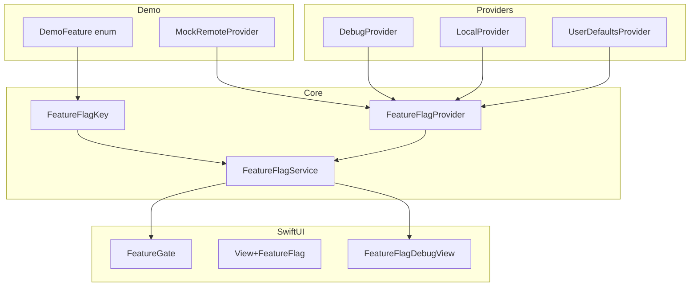
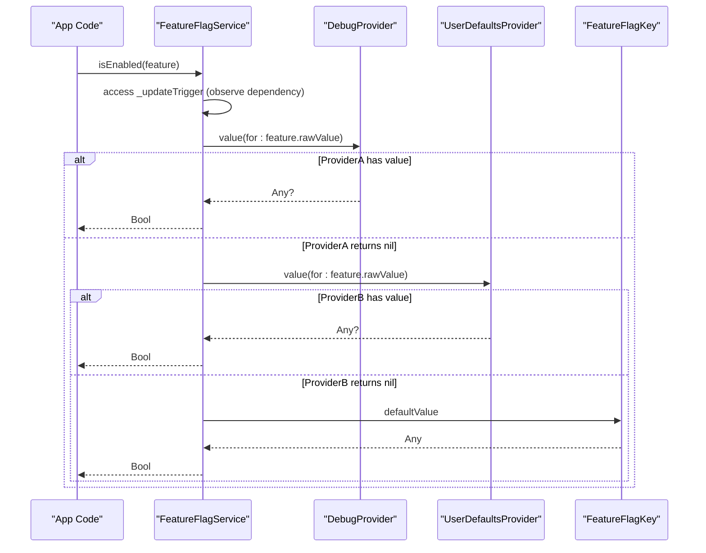
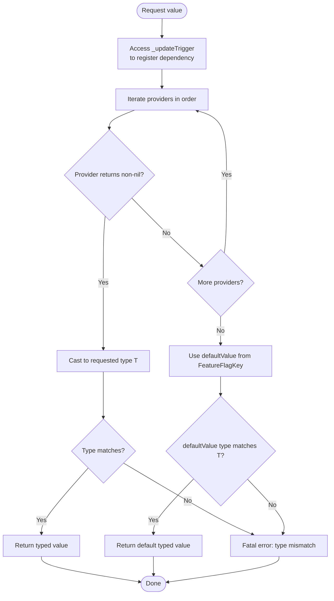
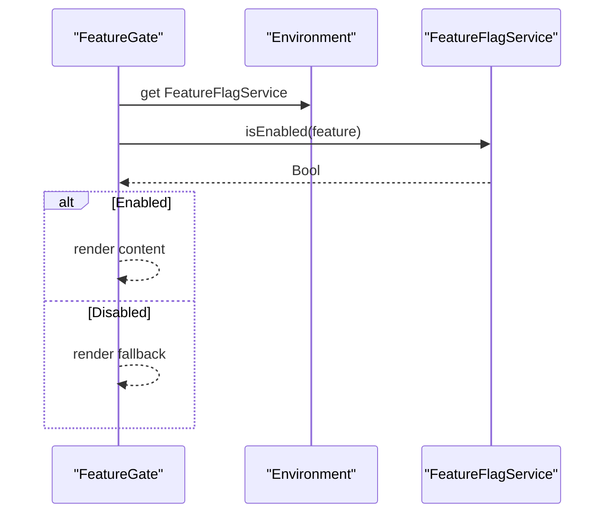
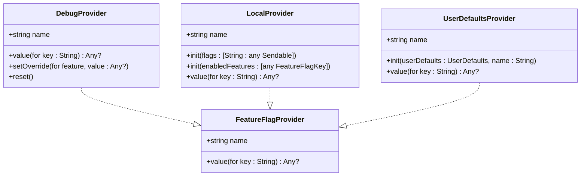
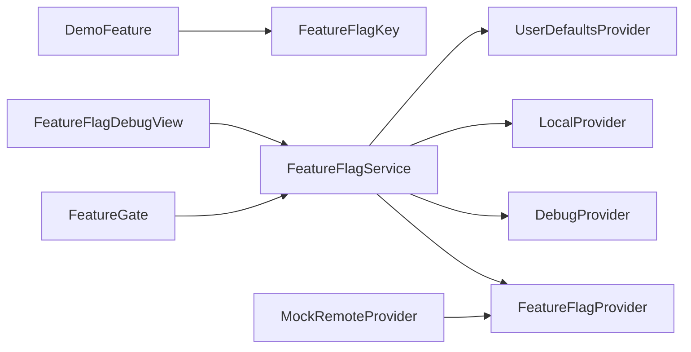

# API Reference

<cite>
**Referenced Files in This Document**
- [FeatureFlagKey.swift](file://Sources/TGFeatureFlag/Core/FeatureFlagKey.swift)
- [FeatureFlagProvider.swift](file://Sources/TGFeatureFlag/Core/FeatureFlagProvider.swift)
- [FeatureFlagService.swift](file://Sources/TGFeatureFlag/Core/FeatureFlagService.swift)
- [DebugProvider.swift](file://Sources/TGFeatureFlag/Providers/DebugProvider.swift)
- [LocalProvider.swift](file://Sources/TGFeatureFlag/Providers/LocalProvider.swift)
- [UserDefaultsProvider.swift](file://Sources/TGFeatureFlag/Providers/UserDefaultsProvider.swift)
- [FeatureGate.swift](file://Sources/TGFeatureFlag/SwiftUI/FeatureGate.swift)
- [View+FeatureFlag.swift](file://Sources/TGFeatureFlag/SwiftUI/View+FeatureFlag.swift)
- [FeatureFlagDebugView.swift](file://Sources/TGFeatureFlag/SwiftUI/FeatureFlagDebugView.swift)
- [TGFeatureFlagDemoApp.swift](file://Example/TGFeatureFlagDemo/TGFeatureFlagDemo/TGFeatureFlagDemoApp.swift)
- [ContentView.swift](file://Example/TGFeatureFlagDemo/TGFeatureFlagDemo/ContentView.swift)
- [MockRemoteProvider.swift](file://Example/TGFeatureFlagDemo/TGFeatureFlagDemo/MockRemoteProvider.swift)
- [README.md](file://README.md)
</cite>

## Table of Contents
1. [Introduction](#introduction)
2. [Project Structure](#project-structure)
3. [Core Components](#core-components)
4. [Architecture Overview](#architecture-overview)
5. [Detailed Component Analysis](#detailed-component-analysis)
6. [Dependency Analysis](#dependency-analysis)
7. [Performance Considerations](#performance-considerations)
8. [Troubleshooting Guide](#troubleshooting-guide)
9. [Conclusion](#conclusion)
10. [Appendices](#appendices)

## Introduction
This document provides comprehensive API documentation for the public interfaces in TGFeatureFlag, focusing on:
- FeatureFlagKey protocol requirements and usage patterns
- FeatureFlagProvider protocol method signatures, parameters, return values, and implementation guidelines
- FeatureFlagService class initialization, provider registration, value retrieval methods, and observation capabilities
- SwiftUI integration helpers (FeatureGate, View extension, Debug view)
- Built-in providers (DebugProvider, LocalProvider, UserDefaultsProvider)
- Example usage patterns from the demo app

The framework is designed to be type-safe, concurrency-safe, and SwiftUI-ready using the Observation framework.

## Project Structure
At a high level, TGFeatureFlag exposes:
- Core protocols and service: FeatureFlagKey, FeatureFlagProvider, FeatureFlagService
- Built-in providers: DebugProvider, LocalProvider, UserDefaultsProvider
- SwiftUI helpers: FeatureGate, View extension, FeatureFlagDebugView
- Demo app showcasing usage patterns

**Diagram sources**
- [FeatureFlagKey.swift:1-37](file://Sources/TGFeatureFlag/Core/FeatureFlagKey.swift#L1-L37)
- [FeatureFlagProvider.swift:1-18](file://Sources/TGFeatureFlag/Core/FeatureFlagProvider.swift#L1-L18)
- [FeatureFlagService.swift:1-91](file://Sources/TGFeatureFlag/Core/FeatureFlagService.swift#L1-L91)
- [DebugProvider.swift:1-38](file://Sources/TGFeatureFlag/Providers/DebugProvider.swift#L1-L38)
- [LocalProvider.swift:1-28](file://Sources/TGFeatureFlag/Providers/LocalProvider.swift#L1-L28)
- [UserDefaultsProvider.swift:1-26](file://Sources/TGFeatureFlag/Providers/UserDefaultsProvider.swift#L1-L26)
- [FeatureGate.swift:1-49](file://Sources/TGFeatureFlag/SwiftUI/FeatureGate.swift#L1-L49)
- [View+FeatureFlag.swift:1-10](file://Sources/TGFeatureFlag/SwiftUI/View+FeatureFlag.swift#L1-L10)
- [FeatureFlagDebugView.swift:1-133](file://Sources/TGFeatureFlag/SwiftUI/FeatureFlagDebugView.swift#L1-L133)
- [TGFeatureFlagDemoApp.swift:1-33](file://Example/TGFeatureFlagDemo/TGFeatureFlagDemo/TGFeatureFlagDemoApp.swift#L1-L33)
- [MockRemoteProvider.swift:1-54](file://Example/TGFeatureFlagDemo/TGFeatureFlagDemo/MockRemoteProvider.swift#L1-L54)

**Section sources**
- [README.md:1-150](file://README.md#L1-L150)

## Core Components
This section documents the core APIs that define the feature flag system.

### FeatureFlagKey Protocol
Purpose:
- Defines the identity and default behavior for a feature flag.
- Typically implemented by an enum with RawRepresentable where RawValue is String.

Requirements:
- Conformance to RawRepresentable, Sendable, Hashable with RawValue == String
- defaultValue: Any — the default value if no provider returns a specific value
- description: String — human-readable description for debug tools (default implementation uses rawValue)

Usage patterns:
- Implement as an enum with cases representing flags
- Provide a switch-based defaultValue mapping each case to a concrete value (Bool, String, Int, Double)
- Optionally override description for more readable labels in debug UIs

Best practices:
- Keep raw values stable and descriptive
- Ensure defaultValue types match expected access types to avoid runtime mismatches
- Use CaseIterable when you need to enumerate all flags for debug views

**Section sources**
- [FeatureFlagKey.swift:1-37](file://Sources/TGFeatureFlag/Core/FeatureFlagKey.swift#L1-L37)
- [TGFeatureFlagDemoApp.swift:1-33](file://Example/TGFeatureFlagDemo/TGFeatureFlagDemo/TGFeatureFlagDemoApp.swift#L1-L33)

### FeatureFlagProvider Protocol
Purpose:
- Abstract source for feature flag values.
- Providers can be chained; the first non-nil value wins.

Public interface:
- name: String — unique provider name
- value(for key: String) -> Any? — returns the value for a given flag key or nil if not provided

Implementation guidelines:
- Thread-safety: ensure concurrent reads are safe (use locks or serial queues)
- Return nil for missing keys so the chain can continue
- Keep name meaningful for debugging and logging
- Support common types (Bool, String, Int, Double) to integrate well with the service’s typed accessors

Examples of built-in providers:
- DebugProvider: mutable overrides for development/debug builds
- LocalProvider: in-memory dictionary-backed configuration
- UserDefaultsProvider: persistent storage via UserDefaults

**Section sources**
- [FeatureFlagProvider.swift:1-18](file://Sources/TGFeatureFlag/Core/FeatureFlagProvider.swift#L1-L18)
- [DebugProvider.swift:1-38](file://Sources/TGFeatureFlag/Providers/DebugProvider.swift#L1-L38)
- [LocalProvider.swift:1-28](file://Sources/TGFeatureFlag/Providers/LocalProvider.swift#L1-L28)
- [UserDefaultsProvider.swift:1-26](file://Sources/TGFeatureFlag/Providers/UserDefaultsProvider.swift#L1-L26)

### FeatureFlagService Class
Purpose:
- Central manager aggregating values from multiple providers.
- Uses Observation framework to automatically update SwiftUI views.

Initialization:
- init() — sets up notification observer for UserDefaults changes to trigger updates

Provider registration:
- register(provider: FeatureFlagProvider, priority: Priority = .lowest)
  - Priority enum: highest, lowest
  - Highest inserts at index 0; lowest appends at end
  - First provider in the list has highest precedence

Value retrieval:
- isEnabled<F: FeatureFlagKey>(_ feature: F) -> Bool
  - Convenience accessor for boolean flags
- value<T, F: FeatureFlagKey>(for feature: F) -> T
  - Retrieves typed value by iterating registered providers in order
  - Falls back to feature.defaultValue if no provider returns a value
  - Type casting performed at runtime; mismatch triggers a fatal error in debug scenarios

Observation capabilities:
- @Observable macro enables automatic SwiftUI reactivity
- _updateTrigger is used to force UI updates when external sources change
- triggerUpdate() increments the trigger counter to notify observers
- UserDefaultsProvider integrates with UserDefaults.didChangeNotification to auto-update

Provider lookup helper:
- provider<T>(ofType type: T.Type) -> T?
  - Finds a registered provider by type

Error handling:
- If requested type T does not match the default value type, a fatal error is thrown indicating the mismatch

Best practices:
- Register providers in desired precedence order (e.g., Debug > Remote > UserDefaults > Local defaults)
- Use triggerUpdate() after asynchronous config fetches to refresh UI
- Avoid requesting types that do not match defaultValue to prevent runtime errors

**Section sources**
- [FeatureFlagService.swift:1-91](file://Sources/TGFeatureFlag/Core/FeatureFlagService.swift#L1-L91)

## Architecture Overview
The system follows a provider-chain resolution pattern:
- FeatureFlagService maintains a list of FeatureFlagProvider instances ordered by priority
- When a value is requested, it iterates through providers until one returns a non-nil value
- If none provide a value, the defaultValue from the FeatureFlagKey is used
- SwiftUI components observe the service to reactively update when values change

**Diagram sources**
- [FeatureFlagService.swift:50-79](file://Sources/TGFeatureFlag/Core/FeatureFlagService.swift#L50-L79)
- [FeatureFlagKey.swift:21-32](file://Sources/TGFeatureFlag/Core/FeatureFlagKey.swift#L21-L32)
- [DebugProvider.swift:14-18](file://Sources/TGFeatureFlag/Providers/DebugProvider.swift#L14-L18)
- [UserDefaultsProvider.swift:20-24](file://Sources/TGFeatureFlag/Providers/UserDefaultsProvider.swift#L20-L24)

## Detailed Component Analysis

### FeatureFlagKey Protocol Deep Dive
- Requirements:
  - RawRepresentable with RawValue == String ensures stable identifiers
  - Sendable and Hashable support concurrency and collection usage
  - defaultValue: Any allows heterogeneous default values across flags
  - description: String aids readability in debug UIs (defaults to rawValue)
- Usage patterns:
  - Enumerated flags with explicit raw values
  - Switch-based defaultValue mapping
  - Optional custom description for user-friendly labels
- Validation rules:
  - Ensure defaultValue type matches the type requested via value<T>()
  - Prefer consistent naming conventions for raw values and descriptions

Code example paths:
- [TGFeatureFlagDemoApp.swift:5-33](file://Example/TGFeatureFlagDemo/TGFeatureFlagDemo/TGFeatureFlagDemoApp.swift#L5-L33)

**Section sources**
- [FeatureFlagKey.swift:1-37](file://Sources/TGFeatureFlag/Core/FeatureFlagKey.swift#L1-L37)
- [TGFeatureFlagDemoApp.swift:1-33](file://Example/TGFeatureFlagDemo/TGFeatureFlagDemo/TGFeatureFlagDemoApp.swift#L1-L33)

### FeatureFlagProvider Protocol Deep Dive
- Method signatures:
  - name: String
  - value(for key: String) -> Any?
- Parameters:
  - key: The raw string identifier of the flag
- Return values:
  - Non-nil value if the provider knows the flag; otherwise nil
- Implementation guidelines:
  - Thread safety: use NSLock or serial dispatch queues
  - Nil semantics: returning nil signals “not provided” to continue the chain
  - Type consistency: store values compatible with supported types (Bool, String, Int, Double)
  - Name clarity: choose names that help identify the source during debugging

Built-in provider examples:
- DebugProvider: setOverride(for:value:) and reset() for runtime toggles
- LocalProvider: init(flags:) and init(enabledFeatures:) for in-memory setup
- UserDefaultsProvider: reads persisted values and integrates with notifications

Code example paths:
- [DebugProvider.swift:14-36](file://Sources/TGFeatureFlag/Providers/DebugProvider.swift#L14-L36)
- [LocalProvider.swift:9-26](file://Sources/TGFeatureFlag/Providers/LocalProvider.swift#L9-L26)
- [UserDefaultsProvider.swift:15-24](file://Sources/TGFeatureFlag/Providers/UserDefaultsProvider.swift#L15-L24)

**Section sources**
- [FeatureFlagProvider.swift:1-18](file://Sources/TGFeatureFlag/Core/FeatureFlagProvider.swift#L1-L18)
- [DebugProvider.swift:1-38](file://Sources/TGFeatureFlag/Providers/DebugProvider.swift#L1-L38)
- [LocalProvider.swift:1-28](file://Sources/TGFeatureFlag/Providers/LocalProvider.swift#L1-L28)
- [UserDefaultsProvider.swift:1-26](file://Sources/TGFeatureFlag/Providers/UserDefaultsProvider.swift#L1-L26)

### FeatureFlagService Class Deep Dive
- Initialization:
  - Registers for UserDefaults changes to trigger updates automatically
- Provider registration:
  - register(provider:priority:) supports highest and lowest priorities
- Value retrieval:
  - isEnabled(_:) convenience for boolean flags
  - value<T>(for:) generic typed accessor with fallback to defaultValue
- Observation:
  - @Observable macro enables reactive UI updates
  - triggerUpdate() forces re-evaluation and UI refresh
- Provider lookup:
  - provider(ofType:) retrieves a specific provider instance by type

Flowchart of value resolution:

**Diagram sources**
- [FeatureFlagService.swift:56-79](file://Sources/TGFeatureFlag/Core/FeatureFlagService.swift#L56-L79)

Code example paths:
- [FeatureFlagService.swift:17-47](file://Sources/TGFeatureFlag/Core/FeatureFlagService.swift#L17-L47)
- [FeatureFlagService.swift:50-84](file://Sources/TGFeatureFlag/Core/FeatureFlagService.swift#L50-L84)

**Section sources**
- [FeatureFlagService.swift:1-91](file://Sources/TGFeatureFlag/Core/FeatureFlagService.swift#L1-L91)

### SwiftUI Integration Components
- FeatureGate:
  - Conditional rendering based on a boolean flag
  - Observes FeatureFlagService via environment
  - Supports optional fallback content
- View+FeatureFlag:
  - Extension to inject FeatureFlagService into the SwiftUI hierarchy
- FeatureFlagDebugView:
  - Lists all flags (requires CaseIterable conformance)
  - Allows runtime toggling via DebugProvider
  - Provides reset functionality and manual update triggering

Sequence diagram for FeatureGate evaluation:

**Diagram sources**
- [FeatureGate.swift:14-37](file://Sources/TGFeatureFlag/SwiftUI/FeatureGate.swift#L14-L37)
- [FeatureFlagService.swift:50-52](file://Sources/TGFeatureFlag/Core/FeatureFlagService.swift#L50-L52)

Code example paths:
- [FeatureGate.swift:16-48](file://Sources/TGFeatureFlag/SwiftUI/FeatureGate.swift#L16-L48)
- [View+FeatureFlag.swift:3-9](file://Sources/TGFeatureFlag/SwiftUI/View+FeatureFlag.swift#L3-L9)
- [FeatureFlagDebugView.swift:13-36](file://Sources/TGFeatureFlag/SwiftUI/FeatureFlagDebugView.swift#L13-L36)

**Section sources**
- [FeatureGate.swift:1-49](file://Sources/TGFeatureFlag/SwiftUI/FeatureGate.swift#L1-L49)
- [View+FeatureFlag.swift:1-10](file://Sources/TGFeatureFlag/SwiftUI/View+FeatureFlag.swift#L1-L10)
- [FeatureFlagDebugView.swift:1-133](file://Sources/TGFeatureFlag/SwiftUI/FeatureFlagDebugView.swift#L1-L133)

### Built-in Providers
- DebugProvider:
  - Mutable overrides for runtime testing
  - setOverride(for:value:) and reset()
  - Thread-safe with NSLock
- LocalProvider:
  - In-memory dictionary-backed configuration
  - Initializers for flags map or enabled features list
- UserDefaultsProvider:
  - Reads from UserDefaults
  - Integrates with didChangeNotification to trigger updates

Class diagram of providers:

**Diagram sources**
- [FeatureFlagProvider.swift:9-17](file://Sources/TGFeatureFlag/Core/FeatureFlagProvider.swift#L9-L17)
- [DebugProvider.swift:5-36](file://Sources/TGFeatureFlag/Providers/DebugProvider.swift#L5-L36)
- [LocalProvider.swift:5-26](file://Sources/TGFeatureFlag/Providers/LocalProvider.swift#L5-L26)
- [UserDefaultsProvider.swift:7-24](file://Sources/TGFeatureFlag/Providers/UserDefaultsProvider.swift#L7-L24)

**Section sources**
- [DebugProvider.swift:1-38](file://Sources/TGFeatureFlag/Providers/DebugProvider.swift#L1-L38)
- [LocalProvider.swift:1-28](file://Sources/TGFeatureFlag/Providers/LocalProvider.swift#L1-L28)
- [UserDefaultsProvider.swift:1-26](file://Sources/TGFeatureFlag/Providers/UserDefaultsProvider.swift#L1-L26)

### Example Usage Patterns
- Defining flags:
  - Enum with RawRepresentable and FeatureFlagKey conformance
  - Provide defaultValue per case
- Setting up service:
  - Initialize FeatureFlagService
  - Register providers with appropriate priorities
- Using in SwiftUI:
  - Inject service via environment
  - Use FeatureGate for conditional rendering
  - Access typed values via value<T>(for:)
- Debugging:
  - Include FeatureFlagDebugView to toggle flags at runtime
  - Use DebugProvider.setOverride and reset

Code example paths:
- [TGFeatureFlagDemoApp.swift:5-33](file://Example/TGFeatureFlagDemo/TGFeatureFlagDemo/TGFeatureFlagDemoApp.swift#L5-L33)
- [ContentView.swift:45-112](file://Example/TGFeatureFlagDemo/TGFeatureFlagDemo/ContentView.swift#L45-L112)
- [MockRemoteProvider.swift:24-52](file://Example/TGFeatureFlagDemo/TGFeatureFlagDemo/MockRemoteProvider.swift#L24-L52)

**Section sources**
- [TGFeatureFlagDemoApp.swift:1-33](file://Example/TGFeatureFlagDemo/TGFeatureFlagDemo/TGFeatureFlagDemoApp.swift#L1-L33)
- [ContentView.swift:1-302](file://Example/TGFeatureFlagDemo/TGFeatureFlagDemo/ContentView.swift#L1-L302)
- [MockRemoteProvider.swift:1-54](file://Example/TGFeatureFlagDemo/TGFeatureFlagDemo/MockRemoteProvider.swift#L1-L54)

## Dependency Analysis
High-level dependencies:
- FeatureFlagService depends on FeatureFlagProvider implementations
- SwiftUI components depend on FeatureFlagService via environment
- Demo app defines DemoFeature enum conforming to FeatureFlagKey
- MockRemoteProvider demonstrates a custom provider pattern

**Diagram sources**
- [FeatureFlagService.swift:1-91](file://Sources/TGFeatureFlag/Core/FeatureFlagService.swift#L1-L91)
- [FeatureFlagProvider.swift:1-18](file://Sources/TGFeatureFlag/Core/FeatureFlagProvider.swift#L1-L18)
- [DebugProvider.swift:1-38](file://Sources/TGFeatureFlag/Providers/DebugProvider.swift#L1-L38)
- [LocalProvider.swift:1-28](file://Sources/TGFeatureFlag/Providers/LocalProvider.swift#L1-L28)
- [UserDefaultsProvider.swift:1-26](file://Sources/TGFeatureFlag/Providers/UserDefaultsProvider.swift#L1-L26)
- [FeatureGate.swift:1-49](file://Sources/TGFeatureFlag/SwiftUI/FeatureGate.swift#L1-L49)
- [FeatureFlagDebugView.swift:1-133](file://Sources/TGFeatureFlag/SwiftUI/FeatureFlagDebugView.swift#L1-L133)
- [TGFeatureFlagDemoApp.swift:1-33](file://Example/TGFeatureFlagDemo/TGFeatureFlagDemo/TGFeatureFlagDemoApp.swift#L1-L33)
- [MockRemoteProvider.swift:1-54](file://Example/TGFeatureFlagDemo/TGFeatureFlagDemo/MockRemoteProvider.swift#L1-L54)

**Section sources**
- [FeatureFlagService.swift:1-91](file://Sources/TGFeatureFlag/Core/FeatureFlagService.swift#L1-L91)
- [FeatureFlagProvider.swift:1-18](file://Sources/TGFeatureFlag/Core/FeatureFlagProvider.swift#L1-L18)

## Performance Considerations
- Provider iteration cost:
  - Each value request iterates providers until a non-nil result is found
  - Keep provider chains short and prioritize frequently accessed providers earlier
- Type casting overhead:
  - value<T>(for:) performs runtime casts; ensure types match defaults to avoid crashes
- Notification-driven updates:
  - UserDefaults changes trigger service updates; batch operations where possible to reduce churn
- SwiftUI reactivity:
  - @Observable ensures efficient updates; avoid excessive triggerUpdate calls

[No sources needed since this section provides general guidance]

## Troubleshooting Guide
Common issues and resolutions:
- Type mismatch fatal error:
  - Occurs when requested type T does not match defaultValue type
  - Fix: align defaultValue with expected access type or adjust generics
- No provider returns a value:
  - Ensure defaultValue is set correctly for the flag
  - Verify provider registration order and that keys match raw values
- UI not updating:
  - Call triggerUpdate() after asynchronous config changes
  - Confirm FeatureFlagService is injected into the environment
- Missing DebugProvider:
  - FeatureFlagDebugView shows a message if no DebugProvider is registered
  - Register DebugProvider with highest priority for overrides

Code example paths:
- [FeatureFlagService.swift:75-79](file://Sources/TGFeatureFlag/Core/FeatureFlagService.swift#L75-L79)
- [FeatureFlagDebugView.swift:21-32](file://Sources/TGFeatureFlag/SwiftUI/FeatureFlagDebugView.swift#L21-L32)

**Section sources**
- [FeatureFlagService.swift:75-84](file://Sources/TGFeatureFlag/Core/FeatureFlagService.swift#L75-L84)
- [FeatureFlagDebugView.swift:21-32](file://Sources/TGFeatureFlag/SwiftUI/FeatureFlagDebugView.swift#L21-L32)

## Conclusion
TGFeatureFlag provides a robust, type-safe, and SwiftUI-ready feature flag system. By defining flags with FeatureFlagKey, implementing FeatureFlagProvider sources, and managing them via FeatureFlagService, applications can decouple feature releases from code deployments safely. The built-in providers and SwiftUI helpers streamline integration, while the observation model ensures responsive UI updates.

[No sources needed since this section summarizes without analyzing specific files]

## Appendices

### API Summary Tables

#### FeatureFlagKey Protocol
- Requirements:
  - RawRepresentable, Sendable, Hashable with RawValue == String
  - defaultValue: Any
  - description: String (default uses rawValue)
- Usage:
  - Implement as enum with cases and switch-based defaultValue
  - Optionally override description for better labels

**Section sources**
- [FeatureFlagKey.swift:21-36](file://Sources/TGFeatureFlag/Core/FeatureFlagKey.swift#L21-L36)

#### FeatureFlagProvider Protocol
- Methods:
  - name: String
  - value(for key: String) -> Any?
- Guidelines:
  - Thread-safe reads
  - Return nil for missing keys
  - Support standard types

**Section sources**
- [FeatureFlagProvider.swift:9-17](file://Sources/TGFeatureFlag/Core/FeatureFlagProvider.swift#L9-L17)

#### FeatureFlagService Class
- Initialization:
  - init()
- Registration:
  - register(provider:priority:)
- Retrieval:
  - isEnabled(_:)
  - value<T>(for:)
- Utilities:
  - triggerUpdate()
  - provider(ofType:)

**Section sources**
- [FeatureFlagService.swift:17-47](file://Sources/TGFeatureFlag/Core/FeatureFlagService.swift#L17-L47)
- [FeatureFlagService.swift:50-84](file://Sources/TGFeatureFlag/Core/FeatureFlagService.swift#L50-L84)

#### SwiftUI Helpers
- FeatureGate:
  - Conditional rendering based on boolean flags
- View+FeatureFlag:
  - Inject service into environment
- FeatureFlagDebugView:
  - Runtime toggling and reset

**Section sources**
- [FeatureGate.swift:16-48](file://Sources/TGFeatureFlag/SwiftUI/FeatureGate.swift#L16-L48)
- [View+FeatureFlag.swift:3-9](file://Sources/TGFeatureFlag/SwiftUI/View+FeatureFlag.swift#L3-L9)
- [FeatureFlagDebugView.swift:13-36](file://Sources/TGFeatureFlag/SwiftUI/FeatureFlagDebugView.swift#L13-L36)