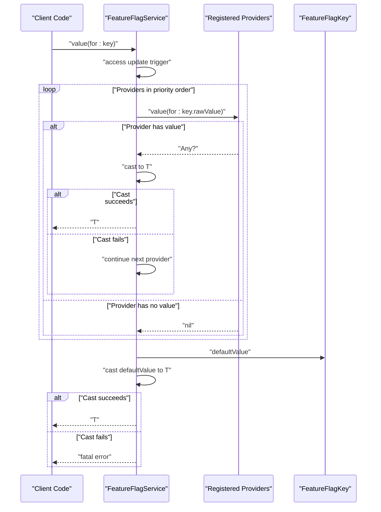
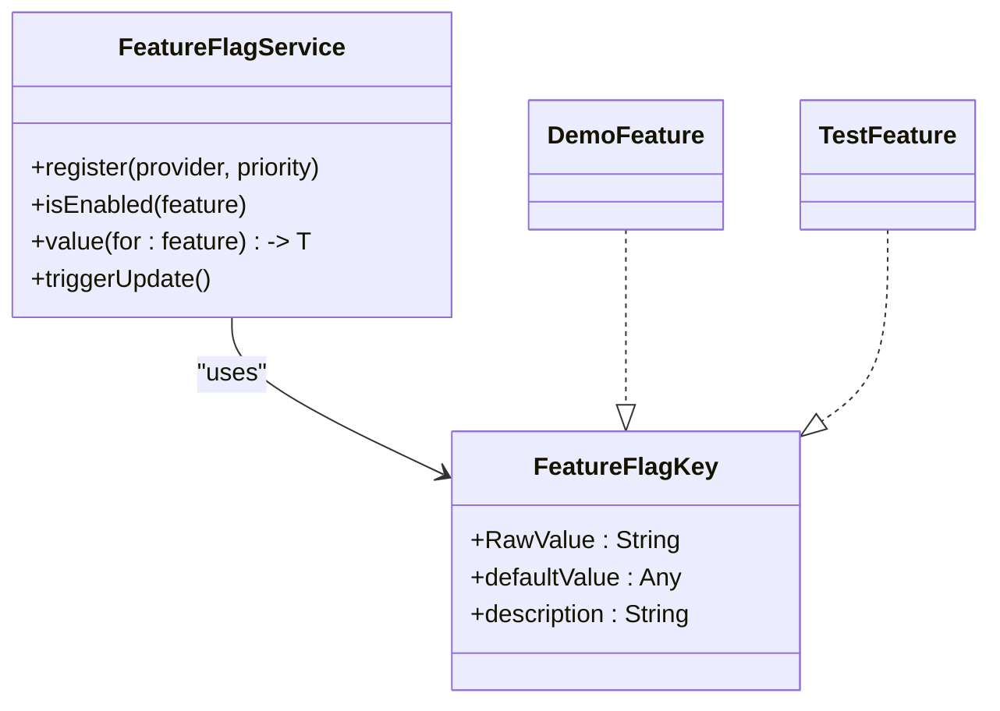

# FeatureFlagKey Protocol

<cite>
**Referenced Files in This Document**
- [FeatureFlagKey.swift](file://Sources/TGFeatureFlag/Core/FeatureFlagKey.swift)
- [FeatureFlagService.swift](file://Sources/TGFeatureFlag/Core/FeatureFlagService.swift)
- [TGFeatureFlagDemoApp.swift](file://Example/TGFeatureFlagDemo/TGFeatureFlagDemo/TGFeatureFlagDemoApp.swift)
- [ContentView.swift](file://Example/TGFeatureFlagDemo/TGFeatureFlagDemo/ContentView.swift)
- [TGFeatureFlagTests.swift](file://Tests/TGFeatureFlagTests/TGFeatureFlagTests.swift)
</cite>

## Table of Contents
1. [Introduction](#introduction)
2. [Project Structure](#project-structure)
3. [Core Components](#core-components)
4. [Architecture Overview](#architecture-overview)
5. [Detailed Component Analysis](#detailed-component-analysis)
6. [Dependency Analysis](#dependency-analysis)
7. [Performance Considerations](#performance-considerations)
8. [Troubleshooting Guide](#troubleshooting-guide)
9. [Conclusion](#conclusion)
10. [Appendices](#appendices)

## Introduction
This document provides detailed API documentation for the FeatureFlagKey protocol, including its requirements and constraints, default implementations, and best practices for implementation using enums. It explains how to define feature flags with type-safe defaults for Bool, String, Int, and Double values, and how the framework resolves values through a priority chain of providers before falling back to the key’s defaultValue.

## Project Structure
The FeatureFlagKey protocol is defined in the core module and used across the service layer and example app. The following diagram shows where the protocol lives and how it relates to the service that consumes it.

```mermaid
graph TB
subgraph "Core"
FFK["FeatureFlagKey.swift"]
FFS["FeatureFlagService.swift"]
end
subgraph "Example App"
DemoApp["TGFeatureFlagDemoApp.swift"]
ContentView["ContentView.swift"]
end
subgraph "Tests"
Tests["TGFeatureFlagTests.swift"]
end
DemoApp --> FFK
ContentView --> FFS
Tests --> FFK
FFS --> FFK
```

**Diagram sources**
- [FeatureFlagKey.swift:1-37](file://Sources/TGFeatureFlag/Core/FeatureFlagKey.swift#L1-L37)
- [FeatureFlagService.swift:1-94](file://Sources/TGFeatureFlag/Core/FeatureFlagService.swift#L1-L94)
- [TGFeatureFlagDemoApp.swift:1-77](file://Example/TGFeatureFlagDemo/TGFeatureFlagDemo/TGFeatureFlagDemoApp.swift#L1-L77)
- [ContentView.swift:1-302](file://Example/TGFeatureFlagDemo/TGFeatureFlagDemo/ContentView.swift#L1-L302)
- [TGFeatureFlagTests.swift:1-123](file://Tests/TGFeatureFlagTests/TGFeatureFlagTests.swift#L1-L123)

**Section sources**
- [FeatureFlagKey.swift:1-37](file://Sources/TGFeatureFlag/Core/FeatureFlagKey.swift#L1-L37)
- [FeatureFlagService.swift:1-94](file://Sources/TGFeatureFlag/Core/FeatureFlagService.swift#L1-L94)
- [TGFeatureFlagDemoApp.swift:1-77](file://Example/TGFeatureFlagDemo/TGFeatureFlagDemo/TGFeatureFlagDemoApp.swift#L1-L77)
- [ContentView.swift:1-302](file://Example/TGFeatureFlagDemo/TGFeatureFlagDemo/ContentView.swift#L1-L302)
- [TGFeatureFlagTests.swift:1-123](file://Tests/TGFeatureFlagTests/TGFeatureFlagTests.swift#L1-L123)

## Core Components
- FeatureFlagKey: A protocol that defines a unique identifier and default behavior for a feature flag. It requires conformance to RawRepresentable (with String raw value), Sendable, and Hashable, and exposes defaultValue and description.
- FeatureFlagService: The central manager that resolves values by iterating registered providers and falling back to the key’s defaultValue if no provider returns a value.

Key responsibilities:
- FeatureFlagKey: Identify flags and provide safe defaults.
- FeatureFlagService: Resolve final values based on provider priority and type-cast to requested types.

**Section sources**
- [FeatureFlagKey.swift:1-37](file://Sources/TGFeatureFlag/Core/FeatureFlagKey.swift#L1-L37)
- [FeatureFlagService.swift:1-94](file://Sources/TGFeatureFlag/Core/FeatureFlagService.swift#L1-L94)

## Architecture Overview
The resolution flow for a feature flag value is as follows:
1. Request a typed value from FeatureFlagService.
2. Iterate through registered providers in priority order.
3. If a provider returns a value matching the requested type, return it.
4. Otherwise, fall back to the FeatureFlagKey.defaultValue cast to the requested type.
5. If the default does not match the requested type, raise a fatal error.



**Diagram sources**
- [FeatureFlagService.swift:53-82](file://Sources/TGFeatureFlag/Core/FeatureFlagService.swift#L53-L82)
- [FeatureFlagKey.swift:21-36](file://Sources/TGFeatureFlag/Core/FeatureFlagKey.swift#L21-L36)

## Detailed Component Analysis

### FeatureFlagKey Protocol Requirements
- Conformance:
  - RawRepresentable with RawValue == String: Ensures each flag has a stable string identifier suitable for storage and serialization.
  - Sendable: Enables thread-safe usage across concurrent contexts.
  - Hashable: Allows use in sets and dictionaries.
- Associated properties:
  - defaultValue: Any: The default value for the flag when no provider supplies one. Must be one of Bool, String, Int, or Double to align with supported typed accessors.
  - description: String: Human-readable label for debug tools. A default implementation returns the rawValue; you can override for more descriptive labels.

Best practices:
- Use an enum with explicit raw values for clarity and stability.
- Implement CaseIterable to enumerate all flags for UIs like debug views.
- Provide meaningful descriptions for better debugging experience.

Examples of defaultValue implementations by data type:
- Bool: Return true/false for toggles.
- String: Return a URL or configuration string.
- Int: Return numeric thresholds or counts.
- Double: Return floating-point parameters.

Type safety patterns:
- Prefer typed accessors provided by the service (e.g., isEnabled for Bool, value<T>(for:) for other types).
- Ensure defaultValue matches the expected type to avoid runtime errors.

**Section sources**
- [FeatureFlagKey.swift:21-36](file://Sources/TGFeatureFlag/Core/FeatureFlagKey.swift#L21-L36)
- [TGFeatureFlagDemoApp.swift:4-33](file://Example/TGFeatureFlagDemo/TGFeatureFlagDemo/TGFeatureFlagDemoApp.swift#L4-L33)
- [TGFeatureFlagTests.swift:6-18](file://Tests/TGFeatureFlagTests/TGFeatureFlagTests.swift#L6-L18)

### DefaultValue Property Requirement and Examples
- Purpose: Provides a fallback value when no provider returns a value.
- Supported types: Bool, String, Int, Double.
- Behavior: The service attempts to cast the stored value or defaultValue to the requested type. If casting fails, a fatal error occurs.

Examples:
- Bool toggle: defaultValue returns true or false.
- String config: defaultValue returns a base URL or endpoint.
- Int threshold: defaultValue returns a retry count or limit.
- Double parameter: defaultValue returns a float-based setting.

Note: While defaultValue is typed as Any, you should ensure it matches the type you will request via the service to maintain type safety.

**Section sources**
- [FeatureFlagKey.swift:21-32](file://Sources/TGFeatureFlag/Core/FeatureFlagKey.swift#L21-L32)
- [FeatureFlagService.swift:59-82](file://Sources/TGFeatureFlag/Core/FeatureFlagService.swift#L59-L82)
- [TGFeatureFlagDemoApp.swift:14-22](file://Example/TGFeatureFlagDemo/TGFeatureFlagDemo/TGFeatureFlagDemoApp.swift#L14-L22)
- [TGFeatureFlagTests.swift:11-17](file://Tests/TGFeatureFlagTests/TGFeatureFlagTests.swift#L11-L17)

### Description Property and Default Implementation
- Default: Returns the rawValue of the key.
- Override: You can override description to provide human-friendly labels for debug UIs.

Example overrides:
- Provide localized or user-facing names for each case.

**Section sources**
- [FeatureFlagKey.swift:34-36](file://Sources/TGFeatureFlag/Core/FeatureFlagKey.swift#L34-L36)
- [TGFeatureFlagDemoApp.swift:24-32](file://Example/TGFeatureFlagDemo/TGFeatureFlagDemo/TGFeatureFlagDemoApp.swift#L24-L32)

### Implementing FeatureFlagKey Using Enums
Recommended pattern:
- Define an enum conforming to FeatureFlagKey and RawRepresentable with String raw values.
- Optionally conform to CaseIterable for enumeration.
- Implement defaultValue with a switch over cases returning appropriate types.
- Optionally override description for readable labels.

Example references:
- DemoFeature enum demonstrates Bool and String defaults and custom descriptions.
- TestFeature enum demonstrates Bool, String, and Int defaults in tests.

**Section sources**
- [TGFeatureFlagDemoApp.swift:4-33](file://Example/TGFeatureFlagDemo/TGFeatureFlagDemo/TGFeatureFlagDemoApp.swift#L4-L33)
- [TGFeatureFlagTests.swift:6-18](file://Tests/TGFeatureFlagTests/TGFeatureFlagTests.swift#L6-L18)

### Usage Patterns and Type Safety
- Boolean checks: Use isEnabled(key) for boolean flags.
- Typed retrieval: Use value<T>(for: key) for non-boolean values.
- Environment integration: Access FeatureFlagService via SwiftUI environment for reactive updates.

References:
- Boolean usage in views.
- Typed value retrieval examples.

**Section sources**
- [ContentView.swift:15-16](file://Example/TGFeatureFlagDemo/TGFeatureFlagDemo/ContentView.swift#L15-L16)
- [ContentView.swift:89-90](file://Example/TGFeatureFlagDemo/TGFeatureFlagDemo/ContentView.swift#L89-L90)
- [FeatureFlagService.swift:53-55](file://Sources/TGFeatureFlag/Core/FeatureFlagService.swift#L53-L55)
- [FeatureFlagService.swift:59-82](file://Sources/TGFeatureFlag/Core/FeatureFlagService.swift#L59-L82)

## Dependency Analysis
FeatureFlagKey is consumed by FeatureFlagService during value resolution. Example apps and tests implement FeatureFlagKey to define concrete flags.



**Diagram sources**
- [FeatureFlagKey.swift:21-36](file://Sources/TGFeatureFlag/Core/FeatureFlagKey.swift#L21-L36)
- [FeatureFlagService.swift:1-94](file://Sources/TGFeatureFlag/Core/FeatureFlagService.swift#L1-L94)
- [TGFeatureFlagDemoApp.swift:4-33](file://Example/TGFeatureFlagDemo/TGFeatureFlagDemo/TGFeatureFlagDemoApp.swift#L4-L33)
- [TGFeatureFlagTests.swift:6-18](file://Tests/TGFeatureFlagTests/TGFeatureFlagTests.swift#L6-L18)

**Section sources**
- [FeatureFlagKey.swift:21-36](file://Sources/TGFeatureFlag/Core/FeatureFlagKey.swift#L21-L36)
- [FeatureFlagService.swift:1-94](file://Sources/TGFeatureFlag/Core/FeatureFlagService.swift#L1-L94)
- [TGFeatureFlagDemoApp.swift:4-33](file://Example/TGFeatureFlagDemo/TGFeatureFlagDemo/TGFeatureFlagDemoApp.swift#L4-L33)
- [TGFeatureFlagTests.swift:6-18](file://Tests/TGFeatureFlagTests/TGFeatureFlagTests.swift#L6-L18)

## Performance Considerations
- Provider iteration: Value resolution iterates providers until a matching value is found. Keep the number of providers reasonable and order them by precedence to minimize lookups.
- Type casting: Casting failures incur overhead and may lead to fatal errors. Ensure defaultValue and provider values match the requested type.
- Observation updates: The service uses an internal trigger to notify observers. Avoid excessive manual triggers; rely on provider notifications where possible.

[No sources needed since this section provides general guidance]

## Troubleshooting Guide
Common issues and resolutions:
- Type mismatch error: Occurs when the requested type does not match the provider or defaultValue type. Ensure defaultValue and provider values are consistent with the requested type.
- Missing provider value: If no provider returns a value, the service falls back to defaultValue. Verify provider registration order and priorities.
- Debugging descriptions: Use description to identify flags in debug UIs. Override description for clearer labels.

Relevant code paths:
- Resolution logic and fallback to defaultValue.
- Fatal error on type mismatch.

**Section sources**
- [FeatureFlagService.swift:59-82](file://Sources/TGFeatureFlag/Core/FeatureFlagService.swift#L59-L82)
- [FeatureFlagKey.swift:34-36](file://Sources/TGFeatureFlag/Core/FeatureFlagKey.swift#L34-L36)

## Conclusion
FeatureFlagKey provides a concise, type-safe way to define feature flags with clear identifiers and defaults. Combined with FeatureFlagService’s priority-based resolution, it enables flexible configuration management while maintaining strong typing and concurrency safety. Follow the recommended enum pattern, ensure defaultValue matches expected types, and leverage description for better debugging experiences.

[No sources needed since this section summarizes without analyzing specific files]

## Appendices

### Quick Reference: Protocol Summary
- Conforms to:
  - RawRepresentable with RawValue == String
  - Sendable
  - Hashable
- Required members:
  - defaultValue: Any (Bool, String, Int, Double)
  - description: String (default returns rawValue)

**Section sources**
- [FeatureFlagKey.swift:21-36](file://Sources/TGFeatureFlag/Core/FeatureFlagKey.swift#L21-L36)