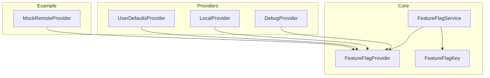
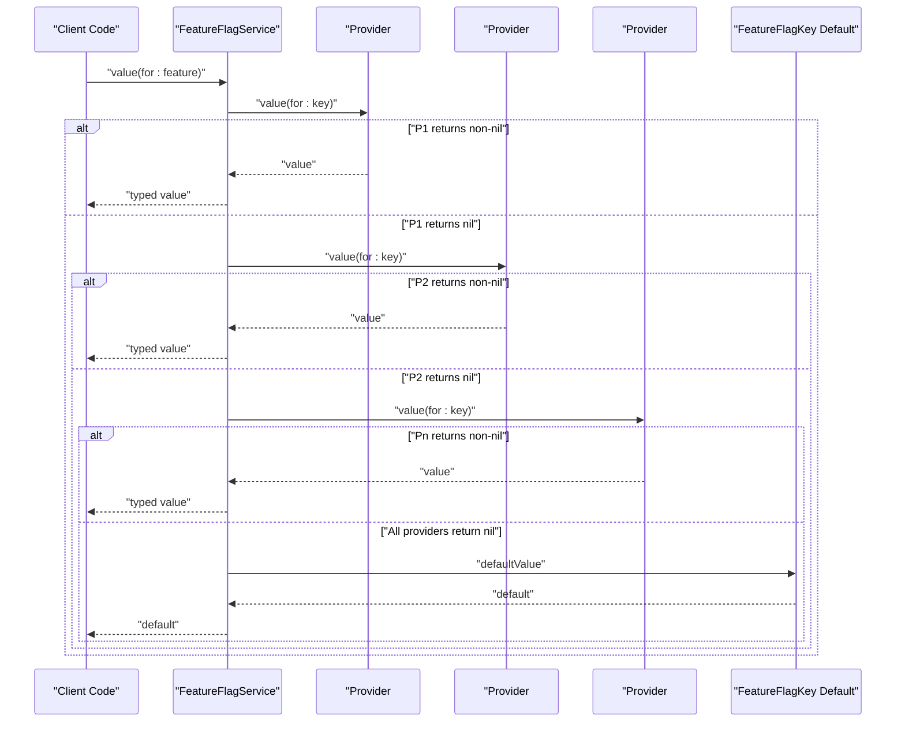
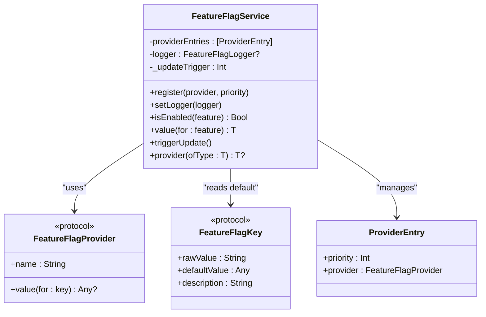
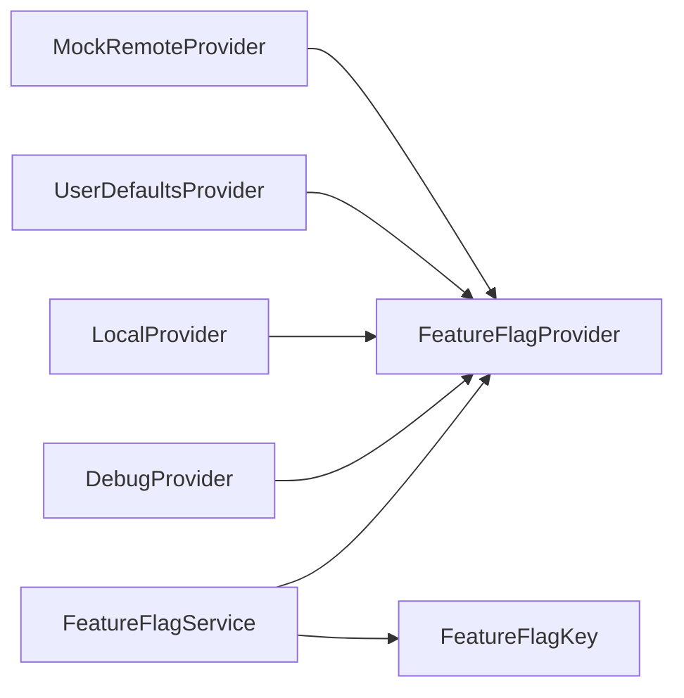

# FeatureFlagProvider Protocol

<cite>
**Referenced Files in This Document**
- [FeatureFlagProvider.swift](file://Sources/TGFeatureFlag/Core/FeatureFlagProvider.swift)
- [FeatureFlagService.swift](file://Sources/TGFeatureFlag/Core/FeatureFlagService.swift)
- [FeatureFlagKey.swift](file://Sources/TGFeatureFlag/Core/FeatureFlagKey.swift)
- [DebugProvider.swift](file://Sources/TGFeatureFlag/Providers/DebugProvider.swift)
- [LocalProvider.swift](file://Sources/TGFeatureFlag/Providers/LocalProvider.swift)
- [UserDefaultsProvider.swift](file://Sources/TGFeatureFlag/Providers/UserDefaultsProvider.swift)
- [MockRemoteProvider.swift](file://Example/TGFeatureFlagDemo/TGFeatureFlagDemo/MockRemoteProvider.swift)
</cite>

## Table of Contents
1. [Introduction](#introduction)
2. [Project Structure](#project-structure)
3. [Core Components](#core-components)
4. [Architecture Overview](#architecture-overview)
5. [Detailed Component Analysis](#detailed-component-analysis)
6. [Dependency Analysis](#dependency-analysis)
7. [Performance Considerations](#performance-considerations)
8. [Troubleshooting Guide](#troubleshooting-guide)
9. [Conclusion](#conclusion)

## Introduction
This document provides comprehensive API documentation for the FeatureFlagProvider protocol and its surrounding resolution system. It explains how providers are chained, how priority determines value resolution, thread safety considerations, error handling strategies, and performance optimization techniques. It also includes practical examples of implementing custom providers and best practices for building reliable data sources.

## Project Structure
The Feature Flag system is organized into core protocols and services, built-in providers, and example implementations:
- Core:
  - FeatureFlagProvider: The provider interface used by the service to resolve flag values.
  - FeatureFlagService: Central manager that orchestrates provider chains, logging, and UI updates.
  - FeatureFlagKey: Defines typed feature flags with default values.
- Providers:
  - DebugProvider: In-memory overrides for debugging.
  - LocalProvider: Static in-memory defaults.
  - UserDefaultsProvider: Reads from UserDefaults.
- Example:
  - MockRemoteProvider: Simulates a remote configuration source.

**Diagram sources**
- [FeatureFlagProvider.swift:1-18](file://Sources/TGFeatureFlag/Core/FeatureFlagProvider.swift#L1-L18)
- [FeatureFlagService.swift:1-168](file://Sources/TGFeatureFlag/Core/FeatureFlagService.swift#L1-L168)
- [FeatureFlagKey.swift:1-37](file://Sources/TGFeatureFlag/Core/FeatureFlagKey.swift#L1-L37)
- [DebugProvider.swift:1-38](file://Sources/TGFeatureFlag/Providers/DebugProvider.swift#L1-L38)
- [LocalProvider.swift:1-28](file://Sources/TGFeatureFlag/Providers/LocalProvider.swift#L1-L28)
- [UserDefaultsProvider.swift:1-28](file://Sources/TGFeatureFlag/Providers/UserDefaultsProvider.swift#L1-L28)
- [MockRemoteProvider.swift:1-54](file://Example/TGFeatureFlagDemo/TGFeatureFlagDemo/MockRemoteProvider.swift#L1-L54)

**Section sources**
- [FeatureFlagProvider.swift:1-18](file://Sources/TGFeatureFlag/Core/FeatureFlagProvider.swift#L1-L18)
- [FeatureFlagService.swift:1-168](file://Sources/TGFeatureFlag/Core/FeatureFlagService.swift#L1-L168)
- [FeatureFlagKey.swift:1-37](file://Sources/TGFeatureFlag/Core/FeatureFlagKey.swift#L1-L37)
- [DebugProvider.swift:1-38](file://Sources/TGFeatureFlag/Providers/DebugProvider.swift#L1-L38)
- [LocalProvider.swift:1-28](file://Sources/TGFeatureFlag/Providers/LocalProvider.swift#L1-L28)
- [UserDefaultsProvider.swift:1-28](file://Sources/TGFeatureFlag/Providers/UserDefaultsProvider.swift#L1-L28)
- [MockRemoteProvider.swift:1-54](file://Example/TGFeatureFlagDemo/TGFeatureFlagDemo/MockRemoteProvider.swift#L1-L54)

## Core Components
- FeatureFlagProvider: Defines the contract for any source of feature flag values. Implementations must provide a name and a method to retrieve a value for a given key.
- FeatureFlagService: Aggregates multiple providers, resolves values based on priority, supports logging, and integrates with SwiftUI via Observation.
- FeatureFlagKey: Declares feature flags with raw string keys and default values.

Key responsibilities:
- Provider chain ordering and resolution logic live in FeatureFlagService.
- Thread safety and concurrency concerns are addressed per-provider; the service itself runs on the main actor.
- Logging is optional through a logger protocol implemented by consumers.

**Section sources**
- [FeatureFlagProvider.swift:1-18](file://Sources/TGFeatureFlag/Core/FeatureFlagProvider.swift#L1-L18)
- [FeatureFlagService.swift:1-168](file://Sources/TGFeatureFlag/Core/FeatureFlagService.swift#L1-L168)
- [FeatureFlagKey.swift:1-37](file://Sources/TGFeatureFlag/Core/FeatureFlagKey.swift#L1-L37)

## Architecture Overview
The resolution pipeline:
- FeatureFlagService maintains a list of providers sorted by priority (highest first).
- When a value is requested, it iterates providers in order until one returns a non-nil value.
- If no provider returns a value, the default from FeatureFlagKey is used.
- A logger can be set to observe which provider resolved each flag.

**Diagram sources**
- [FeatureFlagService.swift:109-151](file://Sources/TGFeatureFlag/Core/FeatureFlagService.swift#L109-L151)
- [FeatureFlagProvider.swift:9-17](file://Sources/TGFeatureFlag/Core/FeatureFlagProvider.swift#L9-L17)
- [FeatureFlagKey.swift:21-32](file://Sources/TGFeatureFlag/Core/FeatureFlagKey.swift#L21-L32)

## Detailed Component Analysis

### FeatureFlagProvider Protocol
- Purpose: Define a uniform interface for all feature flag sources.
- Members:
  - name: A unique identifier for the provider (e.g., "Debug Override", "Local", "UserDefaults", "Remote Config").
  - value(for:): Retrieves a value for a specific key. Returns Any?; nil indicates “no value” so the next provider or default can be tried.
- Thread Safety:
  - The protocol requires Sendable conformance. Each implementation must ensure safe concurrent access if accessed from multiple threads.
  - Built-in providers demonstrate different strategies:
    - DebugProvider uses an NSLock around mutable state.
    - UserDefaultsProvider relies on Apple’s documented thread-safety of UserDefaults.
    - MockRemoteProvider uses a serial DispatchQueue for reads and a barrier queue write for atomic updates.

Implementation guidance:
- Keep value(for:) fast and idempotent. Avoid heavy I/O or blocking calls.
- Return nil when you cannot resolve a key rather than throwing exceptions.
- Ensure your provider is Sendable-safe if it holds mutable state.

**Section sources**
- [FeatureFlagProvider.swift:3-17](file://Sources/TGFeatureFlag/Core/FeatureFlagProvider.swift#L3-L17)
- [DebugProvider.swift:1-38](file://Sources/TGFeatureFlag/Providers/DebugProvider.swift#L1-L38)
- [UserDefaultsProvider.swift:1-28](file://Sources/TGFeatureFlag/Providers/UserDefaultsProvider.swift#L1-L28)
- [MockRemoteProvider.swift:1-54](file://Example/TGFeatureFlagDemo/TGFeatureFlagDemo/MockRemoteProvider.swift#L1-L54)

### FeatureFlagService and Priority System
- Provider registration:
  - register(provider:priority:) inserts providers into a sorted list by descending priority.
  - Priority options:
    - highest: Int.max (front of chain).
    - lowest: Int.min (end of chain).
    - custom(Int): explicit numeric priority.
- Resolution order:
  - Iterates providers from highest to lowest priority.
  - First non-nil value wins.
  - If none found, falls back to FeatureFlagKey.defaultValue.
- Type casting:
  - The returned Any? is cast to the expected generic type T. If mismatched, a fatal error occurs in debug builds.
- Logging:
  - Optional logger receives events indicating which provider resolved a flag and the resulting value.
- Main Actor:
  - The service is annotated to run on the main actor, ensuring UI-safe updates and integration with Observation.

**Diagram sources**
- [FeatureFlagService.swift:25-168](file://Sources/TGFeatureFlag/Core/FeatureFlagService.swift#L25-L168)
- [FeatureFlagProvider.swift:9-17](file://Sources/TGFeatureFlag/Core/FeatureFlagProvider.swift#L9-L17)
- [FeatureFlagKey.swift:21-32](file://Sources/TGFeatureFlag/Core/FeatureFlagKey.swift#L21-L32)

**Section sources**
- [FeatureFlagService.swift:70-101](file://Sources/TGFeatureFlag/Core/FeatureFlagService.swift#L70-L101)
- [FeatureFlagService.swift:109-151](file://Sources/TGFeatureFlag/Core/FeatureFlagService.swift#L109-L151)
- [FeatureFlagService.swift:153-166](file://Sources/TGFeatureFlag/Core/FeatureFlagService.swift#L153-L166)
- [FeatureFlagKey.swift:21-32](file://Sources/TGFeatureFlag/Core/FeatureFlagKey.swift#L21-L32)

### Built-in Providers

#### DebugProvider
- Use case: Runtime toggles during development.
- Behavior:
  - Maintains an in-memory dictionary protected by a lock.
  - Overrides return the latest stored value for a key.
  - Provides methods to set/clear overrides.
- Thread safety:
  - Uses NSLock to guard read/write operations.

**Section sources**
- [DebugProvider.swift:1-38](file://Sources/TGFeatureFlag/Providers/DebugProvider.swift#L1-L38)

#### LocalProvider
- Use case: Static defaults or initial configuration.
- Behavior:
  - Backed by an immutable dictionary at initialization time.
  - Fast lookups without locks.
- Thread safety:
  - Immutable structure ensures safe concurrent reads.

**Section sources**
- [LocalProvider.swift:1-28](file://Sources/TGFeatureFlag/Providers/LocalProvider.swift#L1-L28)

#### UserDefaultsProvider
- Use case: Persisted flags via UserDefaults.
- Behavior:
  - Delegates to UserDefaults.object(forKey:), returning nil if absent.
  - Integrates with FeatureFlagService’s notification observer to refresh UI when UserDefaults changes.
- Thread safety:
  - Relies on Apple’s guarantee that UserDefaults is thread-safe.

**Section sources**
- [UserDefaultsProvider.swift:1-28](file://Sources/TGFeatureFlag/Providers/UserDefaultsProvider.swift#L1-L28)
- [FeatureFlagService.swift:53-68](file://Sources/TGFeatureFlag/Core/FeatureFlagService.swift#L53-L68)

### Example Custom Provider: MockRemoteProvider
- Use case: Simulate a remote configuration service.
- Behavior:
  - Stores fetched flags in memory.
  - fetchRemoteConfig simulates network delay and atomically replaces the entire config using a barrier write.
  - Reads are performed synchronously on a serial queue for consistency.
- Integration:
  - Can be registered with high priority to override local defaults.
  - After fetching, call triggerUpdate to notify the service and refresh UI.

**Section sources**
- [MockRemoteProvider.swift:1-54](file://Example/TGFeatureFlagDemo/TGFeatureFlagDemo/MockRemoteProvider.swift#L1-L54)
- [FeatureFlagService.swift:158-161](file://Sources/TGFeatureFlag/Core/FeatureFlagService.swift#L158-L161)

## Dependency Analysis
- FeatureFlagService depends on:
  - FeatureFlagProvider implementations for value resolution.
  - FeatureFlagKey for default values and keys.
  - Optional FeatureFlagLogger for diagnostics.
- Provider implementations depend only on Foundation and their storage mechanisms.

**Diagram sources**
- [FeatureFlagService.swift:25-168](file://Sources/TGFeatureFlag/Core/FeatureFlagService.swift#L25-L168)
- [FeatureFlagProvider.swift:9-17](file://Sources/TGFeatureFlag/Core/FeatureFlagProvider.swift#L9-L17)
- [FeatureFlagKey.swift:21-32](file://Sources/TGFeatureFlag/Core/FeatureFlagKey.swift#L21-L32)
- [DebugProvider.swift:1-38](file://Sources/TGFeatureFlag/Providers/DebugProvider.swift#L1-L38)
- [LocalProvider.swift:1-28](file://Sources/TGFeatureFlag/Providers/LocalProvider.swift#L1-L28)
- [UserDefaultsProvider.swift:1-28](file://Sources/TGFeatureFlag/Providers/UserDefaultsProvider.swift#L1-L28)
- [MockRemoteProvider.swift:1-54](file://Example/TGFeatureFlagDemo/TGFeatureFlagDemo/MockRemoteProvider.swift#L1-L54)

**Section sources**
- [FeatureFlagService.swift:25-168](file://Sources/TGFeatureFlag/Core/FeatureFlagService.swift#L25-L168)
- [FeatureFlagProvider.swift:9-17](file://Sources/TGFeatureFlag/Core/FeatureFlagProvider.swift#L9-L17)
- [FeatureFlagKey.swift:21-32](file://Sources/TGFeatureFlag/Core/FeatureFlagKey.swift#L21-L32)

## Performance Considerations
- Provider selection cost:
  - Resolution iterates providers in priority order. Keep high-priority providers extremely fast (in-memory lookups).
- Avoid blocking I/O in value(for:):
  - For remote sources, pre-fetch and cache results. Serve cached values synchronously.
- Minimize allocations:
  - Reuse dictionaries and avoid unnecessary boxing/unboxing.
- Concurrency:
  - Prefer immutable structures where possible (e.g., LocalProvider).
  - If mutable, use fine-grained locking or concurrent queues with barriers for atomic updates.
- UI updates:
  - Use triggerUpdate after external changes (like UserDefaults or remote fetches) to propagate changes efficiently.

[No sources needed since this section provides general guidance]

## Troubleshooting Guide
Common issues and resolutions:
- Type mismatch errors:
  - If a provider returns a value whose type does not match the expected generic type T, the service will raise a fatal error. Ensure provider values align with FeatureFlagKey.default types.
- Unexpected nil values:
  - Verify provider priorities. A higher-priority provider may be returning nil while a lower-priority one has the value.
- Stale UI:
  - After changing UserDefaults or updating a remote provider, call triggerUpdate to force observation-driven UI refresh.
- Logging and diagnostics:
  - Set a logger to see which provider resolved each flag and what value was returned.

**Section sources**
- [FeatureFlagService.swift:109-151](file://Sources/TGFeatureFlag/Core/FeatureFlagService.swift#L109-L151)
- [FeatureFlagService.swift:158-161](file://Sources/TGFeatureFlag/Core/FeatureFlagService.swift#L158-L161)
- [FeatureFlagService.swift:103-107](file://Sources/TGFeatureFlag/Core/FeatureFlagService.swift#L103-L107)

## Conclusion
The FeatureFlagProvider protocol offers a flexible, composable way to resolve feature flags across multiple sources. By leveraging priority-based chaining, robust error handling, and clear thread safety guidelines, you can build reliable and performant feature flag systems. Follow best practices such as keeping providers fast, caching remote data, and using the provided logging and update mechanisms to maintain clarity and responsiveness.