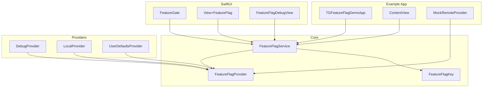
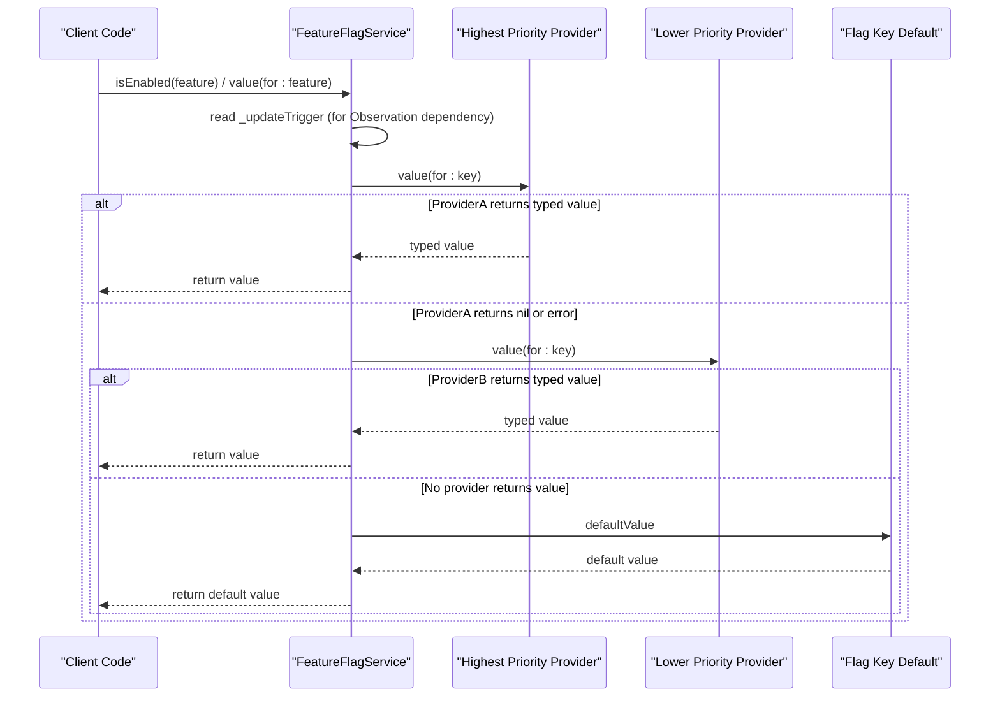
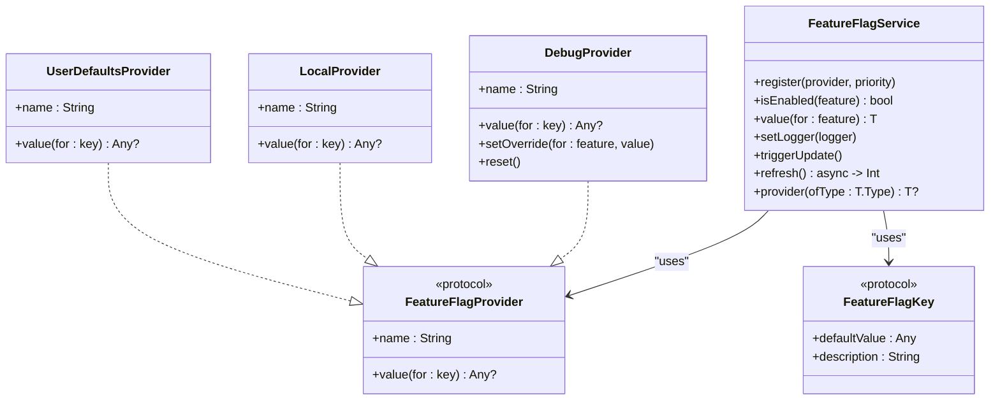
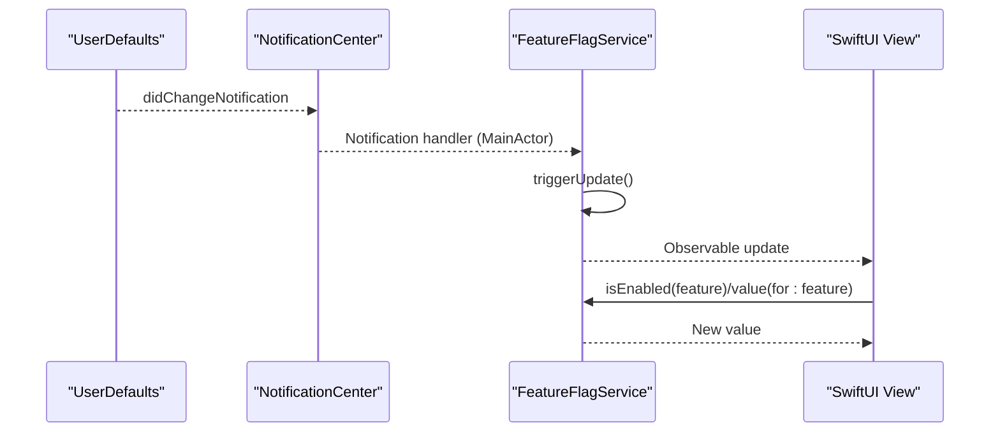
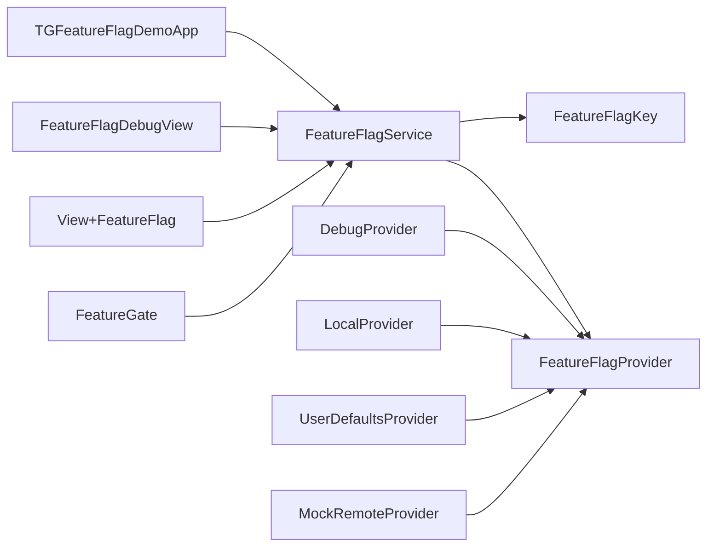

# FeatureFlagService Class

<cite>
**Referenced Files in This Document**
- [FeatureFlagService.swift](file://Sources/TGFeatureFlag/Core/FeatureFlagService.swift)
- [FeatureFlagProvider.swift](file://Sources/TGFeatureFlag/Core/FeatureFlagProvider.swift)
- [FeatureFlagKey.swift](file://Sources/TGFeatureFlag/Core/FeatureFlagKey.swift)
- [DebugProvider.swift](file://Sources/TGFeatureFlag/Providers/DebugProvider.swift)
- [LocalProvider.swift](file://Sources/TGFeatureFlag/Providers/LocalProvider.swift)
- [UserDefaultsProvider.swift](file://Sources/TGFeatureFlag/Providers/UserDefaultsProvider.swift)
- [FeatureGate.swift](file://Sources/TGFeatureFlag/SwiftUI/FeatureGate.swift)
- [View+FeatureFlag.swift](file://Sources/TGFeatureFlag/SwiftUI/View+FeatureFlag.swift)
- [FeatureFlagDebugView.swift](file://Sources/TGFeatureFlag/SwiftUI/FeatureFlagDebugView.swift)
- [TGFeatureFlagDemoApp.swift](file://Example/TGFeatureFlagDemo/TGFeatureFlagDemo/TGFeatureFlagDemoApp.swift)
- [ContentView.swift](file://Example/TGFeatureFlagDemo/TGFeatureFlagDemo/ContentView.swift)
- [MockRemoteProvider.swift](file://Example/TGFeatureFlagDemo/TGFeatureFlagDemo/MockRemoteProvider.swift)
- [README.md](file://README.md)
</cite>

## Table of Contents
1. [Introduction](#introduction)
2. [Project Structure](#project-structure)
3. [Core Components](#core-components)
4. [Architecture Overview](#architecture-overview)
5. [Detailed Component Analysis](#detailed-component-analysis)
6. [Dependency Analysis](#dependency-analysis)
7. [Performance Considerations](#performance-considerations)
8. [Troubleshooting Guide](#troubleshooting-guide)
9. [Conclusion](#conclusion)
10. [Appendices](#appendices)

## Introduction
This document provides detailed API documentation for the FeatureFlagService class, including initialization, provider registration, value retrieval across data types, observation and reactive updates via the @Observable macro, thread safety guarantees, memory management, lifecycle considerations, integration patterns, error handling, debugging capabilities, and performance monitoring features. It is intended for both technical and non-technical readers to understand how to set up, configure, and use the service effectively.

## Project Structure
The project is organized around a core service that orchestrates multiple providers, with SwiftUI helpers for UI integration and built-in debug tools. The key modules are:
- Core: Service, provider protocol, and flag key protocol
- Providers: Built-in implementations (debug, local, UserDefaults)
- SwiftUI: Conditional rendering and environment injection utilities
- Example app: Demonstrates setup and usage patterns

**Diagram sources**
- [FeatureFlagService.swift:25-195](file://Sources/TGFeatureFlag/Core/FeatureFlagService.swift#L25-L195)
- [FeatureFlagProvider.swift:3-17](file://Sources/TGFeatureFlag/Core/FeatureFlagProvider.swift#L3-L17)
- [FeatureFlagKey.swift:3-32](file://Sources/TGFeatureFlag/Core/FeatureFlagKey.swift#L3-L32)
- [DebugProvider.swift:1-38](file://Sources/TGFeatureFlag/Providers/DebugProvider.swift#L1-L38)
- [LocalProvider.swift:1-28](file://Sources/TGFeatureFlag/Providers/LocalProvider.swift#L1-L28)
- [UserDefaultsProvider.swift:1-28](file://Sources/TGFeatureFlag/Providers/UserDefaultsProvider.swift#L1-L28)
- [FeatureGate.swift:1-49](file://Sources/TGFeatureFlag/SwiftUI/FeatureGate.swift#L1-L49)
- [View+FeatureFlag.swift:1-10](file://Sources/TGFeatureFlag/SwiftUI/View+FeatureFlag.swift#L1-L10)
- [FeatureFlagDebugView.swift:1-214](file://Sources/TGFeatureFlag/SwiftUI/FeatureFlagDebugView.swift#L1-L214)
- [TGFeatureFlagDemoApp.swift:1-77](file://Example/TGFeatureFlagDemo/TGFeatureFlagDemo/TGFeatureFlagDemoApp.swift#L1-L77)
- [ContentView.swift:1-302](file://Example/TGFeatureFlagDemo/TGFeatureFlagDemo/ContentView.swift#L1-L302)
- [MockRemoteProvider.swift:1-50](file://Example/TGFeatureFlagDemo/TGFeatureFlagDemo/MockRemoteProvider.swift#L1-L50)

**Section sources**
- [README.md:1-150](file://README.md#L1-L150)

## Core Components
- FeatureFlagService: Central manager that aggregates values from multiple providers, supports priority-based resolution, logging, refresh, and reactive updates.
- FeatureFlagProvider: Protocol defining a source of feature flag values with a name and value lookup.
- FeatureFlagKey: Protocol defining unique identifiers and default values for flags; used to type-safe accessors.

Key responsibilities:
- Provider registration with priority ordering
- Value retrieval with fallback to defaults
- Logging of resolution events
- Triggering reactive updates for SwiftUI
- Refreshing async providers

**Section sources**
- [FeatureFlagService.swift:25-195](file://Sources/TGFeatureFlag/Core/FeatureFlagService.swift#L25-L195)
- [FeatureFlagProvider.swift:3-17](file://Sources/TGFeatureFlag/Core/FeatureFlagProvider.swift#L3-L17)
- [FeatureFlagKey.swift:3-32](file://Sources/TGFeatureFlag/Core/FeatureFlagKey.swift#L3-L32)

## Architecture Overview
The service uses a priority chain to resolve values. When a value is requested, it iterates through registered providers in descending priority order. The first provider returning a non-nil typed value wins; otherwise, the default value from the flag key is used. The service is annotated as @MainActor and @Observable, enabling automatic SwiftUI view updates when values change.

**Diagram sources**
- [FeatureFlagService.swift:110-151](file://Sources/TGFeatureFlag/Core/FeatureFlagService.swift#L110-L151)
- [FeatureFlagKey.swift:21-32](file://Sources/TGFeatureFlag/Core/FeatureFlagKey.swift#L21-L32)

## Detailed Component Analysis

### FeatureFlagService API Reference

Initialization
- init(): Sets up internal state and observes UserDefaults changes to trigger UI updates.
- deinit: Removes observers to prevent leaks.

Provider Registration
- register(provider:priority): Adds a provider into the resolution chain at a specific priority.
- Priority enum: highest, lowest, custom(Int). Higher raw values mean higher priority.

Value Retrieval
- isEnabled<F: FeatureFlagKey>(feature): Boolean-only convenience accessor.
- value<T, F: FeatureFlagKey>(for: feature): Generic typed accessor supporting Bool, String, Int, Double. Returns the first provider’s typed value or falls back to the flag’s default.

Logging
- setLogger(logger): Attaches a logger to observe resolution events.

Reactive Updates
- triggerUpdate(): Increments an internal counter to notify Observers (e.g., SwiftUI views) of changes.

Async Refresh
- refresh(): Iterates over AsyncFeatureFlagProvider instances, calls fetchValues(), logs results, and triggers update. Returns failure count.

Provider Lookup
- provider<T>(ofType: T.Type): Finds a registered provider by type.

Observation and Reactivity
- The service is marked @MainActor and @Observable. Accessing _updateTrigger registers a dependency so that SwiftUI views observing the service will re-render on updates.

Thread Safety
- The service itself runs on the main actor. Provider access is wrapped in safe calls; individual providers must ensure their own thread safety.

Error Handling
- Provider errors during value retrieval are caught and logged; the service continues to the next provider. If no provider returns a value and the default type mismatches the requested type, a fatal error is raised.

Memory Management
- Uses weak self in notification observer closure to avoid retain cycles. Deinitialization removes observers.

Lifecycle Considerations
- Initialize once early in app startup. Register providers in desired priority order. Inject the service into SwiftUI environment. Use triggerUpdate() after external changes (e.g., UserDefaults, remote config).

Examples and Integration Patterns
- See example app for full setup and usage.

**Section sources**
- [FeatureFlagService.swift:25-195](file://Sources/TGFeatureFlag/Core/FeatureFlagService.swift#L25-L195)

#### Class Diagram

**Diagram sources**
- [FeatureFlagService.swift:25-195](file://Sources/TGFeatureFlag/Core/FeatureFlagService.swift#L25-L195)
- [FeatureFlagProvider.swift:3-17](file://Sources/TGFeatureFlag/Core/FeatureFlagProvider.swift#L3-L17)
- [DebugProvider.swift:1-38](file://Sources/TGFeatureFlag/Providers/DebugProvider.swift#L1-L38)
- [LocalProvider.swift:1-28](file://Sources/TGFeatureFlag/Providers/LocalProvider.swift#L1-L28)
- [UserDefaultsProvider.swift:1-28](file://Sources/TGFeatureFlag/Providers/UserDefaultsProvider.swift#L1-L28)
- [FeatureFlagKey.swift:3-32](file://Sources/TGFeatureFlag/Core/FeatureFlagKey.swift#L3-L32)

### Provider Registration APIs

Priority Chain Resolution
- Highest priority providers are checked first.
- Lowest priority providers act as fallbacks.
- Custom priorities allow fine-grained control.

Registration Examples
- Register DebugProvider with .highest for runtime overrides.
- Register UserDefaultsProvider with medium or low priority for persisted settings.
- Register LocalProvider with .lowest for hardcoded defaults.

Integration Patterns
- Typical order: Debug > Remote > UserDefaults > Local Defaults.
- Use provider(ofType:) to retrieve specific providers for targeted operations (e.g., reset overrides).

**Section sources**
- [FeatureFlagService.swift:89-101](file://Sources/TGFeatureFlag/Core/FeatureFlagService.swift#L89-L101)
- [TGFeatureFlagDemoApp.swift:39-68](file://Example/TGFeatureFlagDemo/TGFeatureFlagDemo/TGFeatureFlagDemoApp.swift#L39-L68)

### Value Retrieval Methods

Boolean Accessor
- isEnabled(feature): Convenience method returning Bool.

Typed Accessor
- value<T, F: FeatureFlagKey>(for: feature): Supports Bool, String, Int, Double.
- Behavior:
  - Reads _updateTrigger to register Observation dependency.
  - Iterates providers in priority order.
  - Attempts to cast provider’s Any? result to T.
  - Falls back to feature.defaultValue if no provider returns a matching type.
  - Logs resolution events via attached logger.
  - Raises a fatal error if the default type does not match the requested type.

Usage Examples
- Boolean checks in conditionals and navigation logic.
- Configuration values like URLs and numeric parameters.

**Section sources**
- [FeatureFlagService.swift:109-151](file://Sources/TGFeatureFlag/Core/FeatureFlagService.swift#L109-L151)
- [FeatureFlagKey.swift:21-32](file://Sources/TGFeatureFlag/Core/FeatureFlagKey.swift#L21-L32)

### Observation System and Reactive Updates

@Observable Macro
- The service is annotated with @Observable, enabling automatic property change tracking.
- Accessing _updateTrigger within value retrieval registers a dependency, ensuring SwiftUI views re-render when updates occur.

NotificationCenter Integration
- The service listens to UserDefaults.didChangeNotification on the main queue and triggers updates accordingly.

Manual Triggers
- Call triggerUpdate() after external changes (e.g., setting overrides, updating UserDefaults programmatically).

SwiftUI Integration
- FeatureGate reads isEnabled(feature) and automatically updates when the service changes.
- View+FeatureFlag injects the service into the environment for easy access.

**Section sources**
- [FeatureFlagService.swift:29-68](file://Sources/TGFeatureFlag/Core/FeatureFlagService.swift#L29-L68)
- [FeatureFlagService.swift:116-120](file://Sources/TGFeatureFlag/Core/FeatureFlagService.swift#L116-L120)
- [FeatureGate.swift:1-49](file://Sources/TGFeatureFlag/SwiftUI/FeatureGate.swift#L1-L49)
- [View+FeatureFlag.swift:1-10](file://Sources/TGFeatureFlag/SwiftUI/View+FeatureFlag.swift#L1-L10)

#### Sequence Diagram: Reactive Update Flow

**Diagram sources**
- [FeatureFlagService.swift:53-68](file://Sources/TGFeatureFlag/Core/FeatureFlagService.swift#L53-L68)
- [FeatureFlagService.swift:158-161](file://Sources/TGFeatureFlag/Core/FeatureFlagService.swift#L158-L161)
- [FeatureGate.swift:31-37](file://Sources/TGFeatureFlag/SwiftUI/FeatureGate.swift#L31-L37)

### Thread Safety Guarantees

Service-Level
- The service is @MainActor, ensuring all public methods execute on the main thread.
- Notification handlers schedule updates on MainActor to maintain consistency.

Provider-Level
- Providers implement Sendable and may be accessed concurrently.
- DebugProvider uses NSLock to protect its overrides dictionary.
- UserDefaultsProvider relies on UserDefaults’ documented thread-safety.
- LocalProvider is immutable after creation, avoiding concurrency issues.

Best Practices
- Avoid mutating shared state off the main actor unless the provider explicitly supports it.
- Use triggerUpdate() on the main actor to propagate changes safely.

**Section sources**
- [FeatureFlagService.swift:29-68](file://Sources/TGFeatureFlag/Core/FeatureFlagService.swift#L29-L68)
- [DebugProvider.swift:1-38](file://Sources/TGFeatureFlag/Providers/DebugProvider.swift#L1-L38)
- [UserDefaultsProvider.swift:1-28](file://Sources/TGFeatureFlag/Providers/UserDefaultsProvider.swift#L1-L28)

### Memory Management and Lifecycle

Memory Management
- Weak self in NotificationCenter observer prevents retain cycles.
- Deinit removes observers to release resources.

Lifecycle
- Initialize the service early in app startup.
- Register providers before any UI renders to ensure correct resolution.
- Inject the service into SwiftUI environment using featureFlagService(_:) modifier.
- Use triggerUpdate() after external changes to keep UI in sync.

**Section sources**
- [FeatureFlagService.swift:53-68](file://Sources/TGFeatureFlag/Core/FeatureFlagService.swift#L53-L68)
- [View+FeatureFlag.swift:1-10](file://Sources/TGFeatureFlag/SwiftUI/View+FeatureFlag.swift#L1-L10)

### Error Handling

Provider Errors
- Safe value retrieval wraps provider calls in do-catch; errors are logged and skipped.

Type Mismatch
- If the default value type does not match the requested type, a fatal error is raised to catch configuration mistakes early.

Refresh Failures
- refresh() catches errors per provider, increments failure count, and continues refreshing other providers.

**Section sources**
- [FeatureFlagService.swift:120-151](file://Sources/TGFeatureFlag/Core/FeatureFlagService.swift#L120-L151)
- [FeatureFlagService.swift:169-188](file://Sources/TGFeatureFlag/Core/FeatureFlagService.swift#L169-L188)

### Debugging Capabilities

Logger Interface
- Implement FeatureFlagLogger to capture resolution events, including provider names and resolved values.

Debug View
- FeatureFlagDebugView displays all flags, current values, and allows runtime overrides via DebugProvider.
- Provides reset functionality to clear all overrides and trigger updates.

Provider Lookup
- Use provider(ofType:) to find DebugProvider and manipulate overrides directly.

**Section sources**
- [FeatureFlagService.swift:103-107](file://Sources/TGFeatureFlag/Core/FeatureFlagService.swift#L103-L107)
- [FeatureFlagDebugView.swift:1-214](file://Sources/TGFeatureFlag/SwiftUI/FeatureFlagDebugView.swift#L1-L214)

### Performance Monitoring Features

Resolution Logging
- Attach a logger to track which provider resolves each flag and what value was returned.

Refresh Metrics
- refresh() returns the number of failed providers, enabling metrics collection and alerting.

Observation Efficiency
- Using @Observable ensures only affected views re-render, minimizing unnecessary work.

**Section sources**
- [FeatureFlagService.swift:103-107](file://Sources/TGFeatureFlag/Core/FeatureFlagService.swift#L103-L107)
- [FeatureFlagService.swift:169-188](file://Sources/TGFeatureFlag/Core/FeatureFlagService.swift#L169-L188)

## Dependency Analysis

**Diagram sources**
- [FeatureFlagService.swift:25-195](file://Sources/TGFeatureFlag/Core/FeatureFlagService.swift#L25-L195)
- [FeatureFlagProvider.swift:3-17](file://Sources/TGFeatureFlag/Core/FeatureFlagProvider.swift#L3-L17)
- [FeatureFlagKey.swift:3-32](file://Sources/TGFeatureFlag/Core/FeatureFlagKey.swift#L3-L32)
- [DebugProvider.swift:1-38](file://Sources/TGFeatureFlag/Providers/DebugProvider.swift#L1-L38)
- [LocalProvider.swift:1-28](file://Sources/TGFeatureFlag/Providers/LocalProvider.swift#L1-L28)
- [UserDefaultsProvider.swift:1-28](file://Sources/TGFeatureFlag/Providers/UserDefaultsProvider.swift#L1-L28)
- [FeatureGate.swift:1-49](file://Sources/TGFeatureFlag/SwiftUI/FeatureGate.swift#L1-L49)
- [View+FeatureFlag.swift:1-10](file://Sources/TGFeatureFlag/SwiftUI/View+FeatureFlag.swift#L1-L10)
- [FeatureFlagDebugView.swift:1-214](file://Sources/TGFeatureFlag/SwiftUI/FeatureFlagDebugView.swift#L1-L214)
- [TGFeatureFlagDemoApp.swift:1-77](file://Example/TGFeatureFlagDemo/TGFeatureFlagDemo/TGFeatureFlagDemoApp.swift#L1-L77)
- [MockRemoteProvider.swift:1-50](file://Example/TGFeatureFlagDemo/TGFeatureFlagDemo/MockRemoteProvider.swift#L1-L50)

**Section sources**
- [FeatureFlagService.swift:25-195](file://Sources/TGFeatureFlag/Core/FeatureFlagService.swift#L25-L195)
- [FeatureFlagProvider.swift:3-17](file://Sources/TGFeatureFlag/Core/FeatureFlagProvider.swift#L3-L17)
- [FeatureFlagKey.swift:3-32](file://Sources/TGFeatureFlag/Core/FeatureFlagKey.swift#L3-L32)

## Performance Considerations
- Keep provider chains short and ordered by expected hit frequency to minimize lookups.
- Prefer immutable providers where possible to reduce synchronization overhead.
- Use triggerUpdate() judiciously to avoid excessive UI rebuilds.
- Monitor refresh failures and log resolution events to identify bottlenecks.

[No sources needed since this section provides general guidance]

## Troubleshooting Guide

Common Issues
- Type mismatch errors: Ensure the default value type matches the requested type.
- Missing provider: Verify provider registration order and priority.
- UI not updating: Confirm triggerUpdate() is called after changes and that the service is injected into the environment.

Diagnostic Steps
- Enable logging via setLogger to see which provider resolves each flag.
- Use FeatureFlagDebugView to inspect current values and override flags.
- Check refresh() failure counts to identify problematic providers.

**Section sources**
- [FeatureFlagService.swift:103-107](file://Sources/TGFeatureFlag/Core/FeatureFlagService.swift#L103-L107)
- [FeatureFlagService.swift:169-188](file://Sources/TGFeatureFlag/Core/FeatureFlagService.swift#L169-L188)
- [FeatureFlagDebugView.swift:1-214](file://Sources/TGFeatureFlag/SwiftUI/FeatureFlagDebugView.swift#L1-L214)

## Conclusion
FeatureFlagService offers a robust, type-safe, and reactive feature flag system with flexible provider chaining, comprehensive debugging, and strong SwiftUI integration. By following the recommended setup and best practices, teams can manage feature releases safely, perform A/B testing, and dynamically configure applications with confidence.

[No sources needed since this section summarizes without analyzing specific files]

## Appendices

### Setup and Integration Examples

App Initialization
- Create FeatureFlagService instance.
- Register providers in priority order: Debug > Remote > UserDefaults > Local.
- Inject service into SwiftUI environment using featureFlagService(_:) modifier.

Using Flags in Views
- Use FeatureGate for conditional rendering.
- Access boolean flags via isEnabled(feature).
- Retrieve typed configuration values via value(for: feature).

Runtime Overrides
- Use DebugProvider.setOverride(for:value:) to toggle flags.
- Call service.triggerUpdate() to propagate changes.

Remote Config Simulation
- Implement AsyncFeatureFlagProvider with fetchValues().
- Call service.refresh() to update values asynchronously.

**Section sources**
- [TGFeatureFlagDemoApp.swift:39-77](file://Example/TGFeatureFlagDemo/TGFeatureFlagDemo/TGFeatureFlagDemoApp.swift#L39-L77)
- [ContentView.swift:1-302](file://Example/TGFeatureFlagDemo/TGFeatureFlagDemo/ContentView.swift#L1-L302)
- [MockRemoteProvider.swift:1-50](file://Example/TGFeatureFlagDemo/TGFeatureFlagDemo/MockRemoteProvider.swift#L1-L50)
- [FeatureGate.swift:1-49](file://Sources/TGFeatureFlag/SwiftUI/FeatureGate.swift#L1-L49)
- [View+FeatureFlag.swift:1-10](file://Sources/TGFeatureFlag/SwiftUI/View+FeatureFlag.swift#L1-L10)