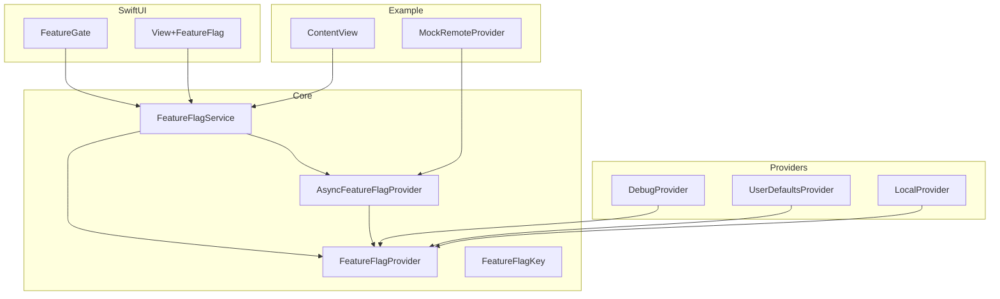
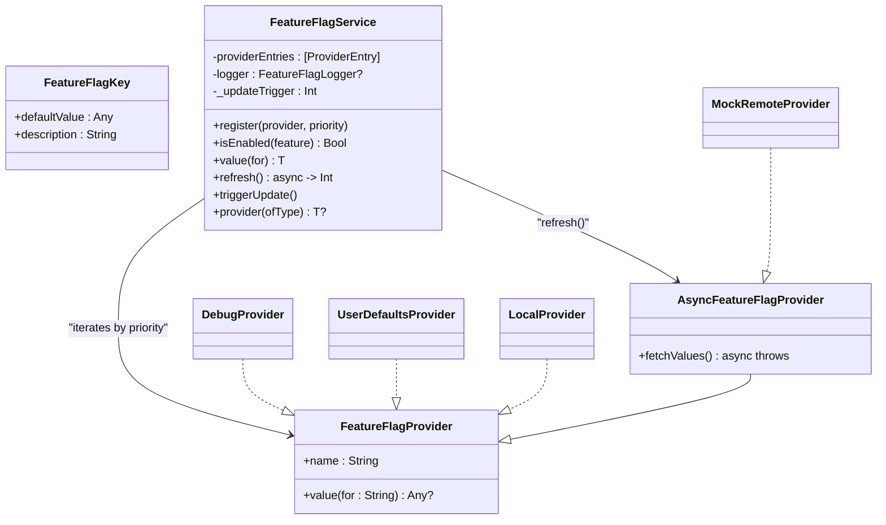
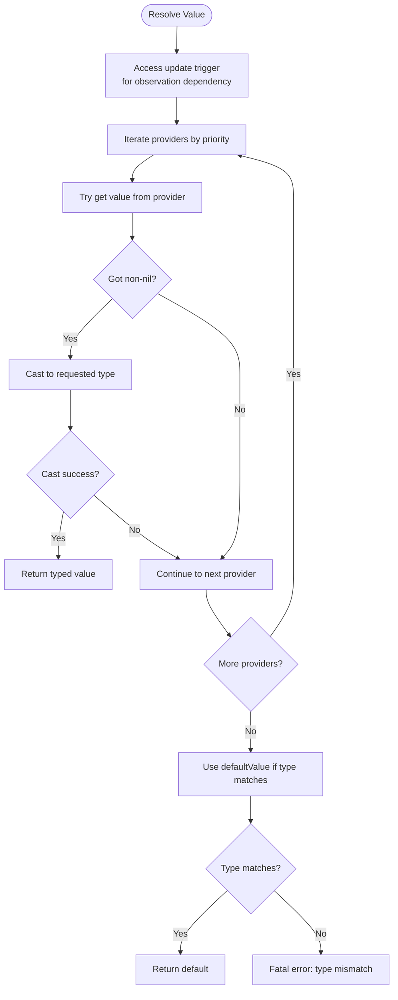
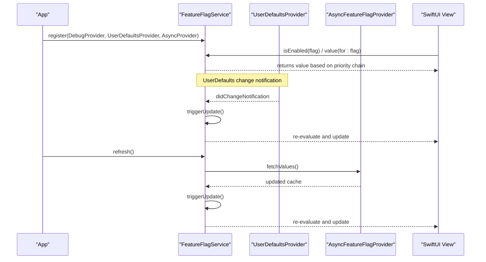
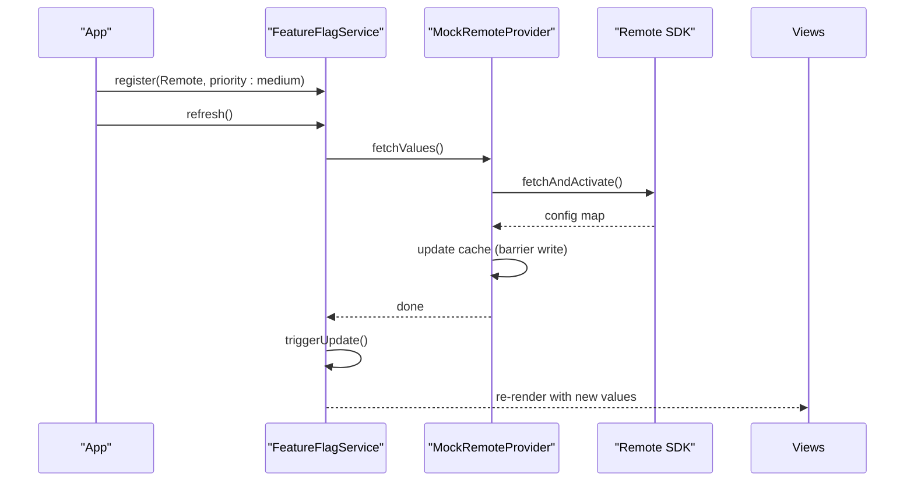
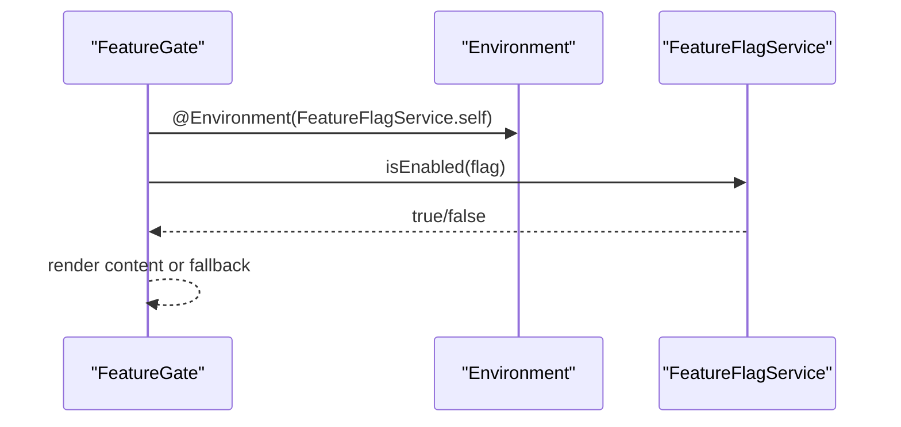
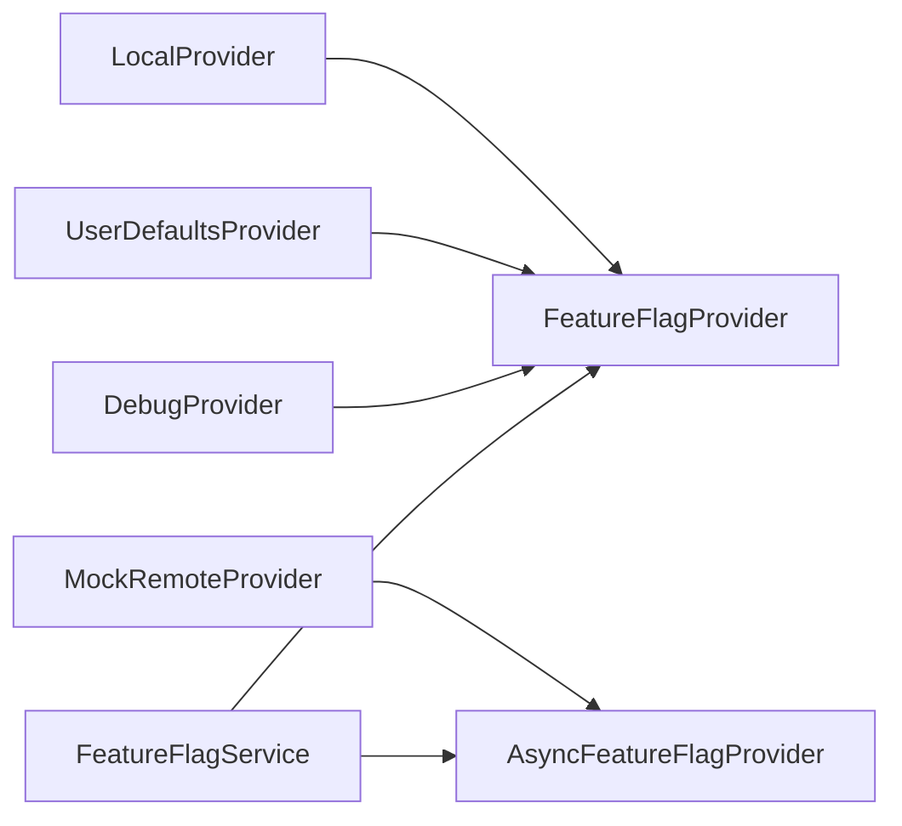

# Advanced Configuration Patterns

<cite>
**Referenced Files in This Document**
- [FeatureFlagService.swift](file://Sources/TGFeatureFlag/Core/FeatureFlagService.swift)
- [AsyncFeatureFlagProvider.swift](file://Sources/TGFeatureFlag/Core/AsyncFeatureFlagProvider.swift)
- [FeatureFlagProvider.swift](file://Sources/TGFeatureFlag/Core/FeatureFlagProvider.swift)
- [FeatureFlagKey.swift](file://Sources/TGFeatureFlag/Core/FeatureFlagKey.swift)
- [DebugProvider.swift](file://Sources/TGFeatureFlag/Providers/DebugProvider.swift)
- [LocalProvider.swift](file://Sources/TGFeatureFlag/Providers/LocalProvider.swift)
- [UserDefaultsProvider.swift](file://Sources/TGFeatureFlag/Providers/UserDefaultsProvider.swift)
- [FeatureGate.swift](file://Sources/TGFeatureFlag/SwiftUI/FeatureGate.swift)
- [View+FeatureFlag.swift](file://Sources/TGFeatureFlag/SwiftUI/View+FeatureFlag.swift)
- [MockRemoteProvider.swift](file://Example/TGFeatureFlagDemo/TGFeatureFlagDemo/MockRemoteProvider.swift)
- [ContentView.swift](file://Example/TGFeatureFlagDemo/TGFeatureFlagDemo/ContentView.swift)
- [README.md](file://README.md)
</cite>

## Table of Contents
1. [Introduction](#introduction)
2. [Project Structure](#project-structure)
3. [Core Components](#core-components)
4. [Architecture Overview](#architecture-overview)
5. [Detailed Component Analysis](#detailed-component-analysis)
6. [Dependency Analysis](#dependency-analysis)
7. [Performance Considerations](#performance-considerations)
8. [Troubleshooting Guide](#troubleshooting-guide)
9. [Conclusion](#conclusion)
10. [Appendices](#appendices)

## Introduction
This document provides advanced guidance for complex configuration scenarios using the TGFeatureFlag framework. It focuses on dynamic provider registration, conditional activation, multi-environment setups, priority chain management, fallback strategies, and hot-reloading patterns. It also includes integration examples with third-party services (e.g., Firebase Remote Config or LaunchDarkly), A/B testing frameworks, feature flag rollouts, performance optimization techniques, memory management considerations, and debugging strategies for complex provider chains.

## Project Structure
The project is organized into core abstractions, built-in providers, SwiftUI helpers, and an example app demonstrating usage patterns. The core service orchestrates a priority-based chain of providers to resolve feature flags and values.

**Diagram sources**
- [FeatureFlagService.swift:25-194](file://Sources/TGFeatureFlag/Core/FeatureFlagService.swift#L25-L194)
- [AsyncFeatureFlagProvider.swift:1-31](file://Sources/TGFeatureFlag/Core/AsyncFeatureFlagProvider.swift#L1-L31)
- [FeatureFlagProvider.swift:1-18](file://Sources/TGFeatureFlag/Core/FeatureFlagProvider.swift#L1-L18)
- [FeatureFlagKey.swift:1-37](file://Sources/TGFeatureFlag/Core/FeatureFlagKey.swift#L1-L37)
- [DebugProvider.swift:1-38](file://Sources/TGFeatureFlag/Providers/DebugProvider.swift#L1-L38)
- [UserDefaultsProvider.swift:1-28](file://Sources/TGFeatureFlag/Providers/UserDefaultsProvider.swift#L1-L28)
- [LocalProvider.swift:1-28](file://Sources/TGFeatureFlag/Providers/LocalProvider.swift#L1-L28)
- [FeatureGate.swift:1-49](file://Sources/TGFeatureFlag/SwiftUI/FeatureGate.swift#L1-L49)
- [View+FeatureFlag.swift:1-10](file://Sources/TGFeatureFlag/SwiftUI/View+FeatureFlag.swift#L1-L10)
- [MockRemoteProvider.swift:1-50](file://Example/TGFeatureFlagDemo/TGFeatureFlagDemo/MockRemoteProvider.swift#L1-L50)
- [ContentView.swift:1-310](file://Example/TGFeatureFlagDemo/TGFeatureFlagDemo/ContentView.swift#L1-L310)

**Section sources**
- [README.md:1-150](file://README.md#L1-L150)

## Core Components
- FeatureFlagKey: Defines typed feature flags with default values and descriptions.
- FeatureFlagProvider: Protocol for value sources; supports name and key-based retrieval.
- AsyncFeatureFlagProvider: Extends provider with async fetch capability for remote sources.
- FeatureFlagService: Central manager that maintains a priority-ordered provider chain, resolves values, triggers UI updates, and refreshes async providers.
- Built-in Providers: DebugProvider (runtime overrides), UserDefaultsProvider (persistent settings), LocalProvider (in-memory defaults).
- SwiftUI Helpers: FeatureGate view and environment injection helper.

Key responsibilities:
- Priority chain resolution with highest-to-lowest precedence.
- Type-safe value retrieval with fallback to default values.
- Hot-reload via NotificationCenter for UserDefaults and explicit refresh for async providers.
- Logging hook for observability across the chain.

**Section sources**
- [FeatureFlagKey.swift:1-37](file://Sources/TGFeatureFlag/Core/FeatureFlagKey.swift#L1-L37)
- [FeatureFlagProvider.swift:1-18](file://Sources/TGFeatureFlag/Core/FeatureFlagProvider.swift#L1-L18)
- [AsyncFeatureFlagProvider.swift:1-31](file://Sources/TGFeatureFlag/Core/AsyncFeatureFlagProvider.swift#L1-L31)
- [FeatureFlagService.swift:25-194](file://Sources/TGFeatureFlag/Core/FeatureFlagService.swift#L25-L194)
- [DebugProvider.swift:1-38](file://Sources/TGFeatureFlag/Providers/DebugProvider.swift#L1-L38)
- [UserDefaultsProvider.swift:1-28](file://Sources/TGFeatureFlag/Providers/UserDefaultsProvider.swift#L1-L28)
- [LocalProvider.swift:1-28](file://Sources/TGFeatureFlag/Providers/LocalProvider.swift#L1-L28)
- [FeatureGate.swift:1-49](file://Sources/TGFeatureFlag/SwiftUI/FeatureGate.swift#L1-L49)
- [View+FeatureFlag.swift:1-10](file://Sources/TGFeatureFlag/SwiftUI/View+FeatureFlag.swift#L1-L10)

## Architecture Overview
The system uses a composable provider chain where each provider can override values from lower-priority sources. The service coordinates resolution, logging, and updates.

**Diagram sources**
- [FeatureFlagService.swift:25-194](file://Sources/TGFeatureFlag/Core/FeatureFlagService.swift#L25-L194)
- [AsyncFeatureFlagProvider.swift:1-31](file://Sources/TGFeatureFlag/Core/AsyncFeatureFlagProvider.swift#L1-L31)
- [FeatureFlagProvider.swift:1-18](file://Sources/TGFeatureFlag/Core/FeatureFlagProvider.swift#L1-L18)
- [DebugProvider.swift:1-38](file://Sources/TGFeatureFlag/Providers/DebugProvider.swift#L1-L38)
- [UserDefaultsProvider.swift:1-28](file://Sources/TGFeatureFlag/Providers/UserDefaultsProvider.swift#L1-L28)
- [LocalProvider.swift:1-28](file://Sources/TGFeatureFlag/Providers/LocalProvider.swift#L1-L28)
- [MockRemoteProvider.swift:1-50](file://Example/TGFeatureFlagDemo/TGFeatureFlagDemo/MockRemoteProvider.swift#L1-L50)

## Detailed Component Analysis

### Dynamic Provider Registration and Conditional Activation
- Dynamic registration: Use the service’s register method to add providers at runtime with explicit priorities.
- Conditional activation: Register providers only when certain conditions are met (e.g., environment, build configuration, user preferences).
- Multi-environment setups: Compose different provider sets per environment (development, staging, production) by registering them conditionally during app initialization.

Recommended patterns:
- Highest priority: DebugProvider for developer overrides.
- Medium priority: UserDefaultsProvider for user-configurable toggles.
- Lower priority: AsyncFeatureFlagProvider implementations for remote configurations.
- Lowest priority: Defaults via FeatureFlagKey.defaultValue.

Integration points:
- Initialize the service early in app lifecycle.
- Inject the service into SwiftUI via environment.

**Section sources**
- [FeatureFlagService.swift:89-101](file://Sources/TGFeatureFlag/Core/FeatureFlagService.swift#L89-L101)
- [README.md:52-87](file://README.md#L52-L87)
- [View+FeatureFlag.swift:1-10](file://Sources/TGFeatureFlag/SwiftUI/View+FeatureFlag.swift#L1-L10)

### Advanced Priority Chain Management and Fallback Strategies
- Priority semantics: Higher numeric values win; .highest inserts at front, .lowest at end, custom(Int) allows fine-grained control.
- Resolution flow: Iterate providers in descending priority order; first non-nil wins; otherwise fall back to defaultValue.
- Fault tolerance: Errors from individual providers are caught and skipped; logging records failures without breaking the chain.
- Type safety: Typed retrieval casts resolved values; type mismatches trigger a fatal error in debug builds.

**Diagram sources**
- [FeatureFlagService.swift:116-151](file://Sources/TGFeatureFlag/Core/FeatureFlagService.swift#L116-L151)

**Section sources**
- [FeatureFlagService.swift:70-87](file://Sources/TGFeatureFlag/Core/FeatureFlagService.swift#L70-L87)
- [FeatureFlagService.swift:116-151](file://Sources/TGFeatureFlag/Core/FeatureFlagService.swift#L116-L151)

### Hot-Reloading Patterns
- UserDefaults hot reload: Service observes UserDefaults changes and triggers UI updates automatically.
- Manual refresh: Call refresh to asynchronously fetch values from all registered AsyncFeatureFlagProvider instances; errors are counted and logged but do not block other providers.
- SwiftUI reactivity: Views observe the service via Observation; manual triggerUpdate ensures UI reflects new state after overrides or fetches.

**Diagram sources**
- [FeatureFlagService.swift:53-68](file://Sources/TGFeatureFlag/Core/FeatureFlagService.swift#L53-L68)
- [FeatureFlagService.swift:158-188](file://Sources/TGFeatureFlag/Core/FeatureFlagService.swift#L158-L188)
- [UserDefaultsProvider.swift:1-28](file://Sources/TGFeatureFlag/Providers/UserDefaultsProvider.swift#L1-L28)
- [ContentView.swift:272-304](file://Example/TGFeatureFlagDemo/TGFeatureFlagDemo/ContentView.swift#L272-L304)

**Section sources**
- [FeatureFlagService.swift:53-68](file://Sources/TGFeatureFlag/Core/FeatureFlagService.swift#L53-L68)
- [FeatureFlagService.swift:158-188](file://Sources/TGFeatureFlag/Core/FeatureFlagService.swift#L158-L188)
- [ContentView.swift:272-304](file://Example/TGFeatureFlagDemo/TGFeatureFlagDemo/ContentView.swift#L272-L304)

### Integrating Third-Party Services (Firebase Remote Config, LaunchDarkly)
Implement AsyncFeatureFlagProvider to wrap external SDKs:
- Implement fetchValues to call the remote SDK and populate an internal cache.
- Implement value(for:) to return cached values for keys.
- Register the provider with appropriate priority (typically below local overrides but above defaults).

Example reference implementation:
- MockRemoteProvider demonstrates async fetch simulation and barrier writes for thread safety.

**Diagram sources**
- [MockRemoteProvider.swift:1-50](file://Example/TGFeatureFlagDemo/TGFeatureFlagDemo/MockRemoteProvider.swift#L1-L50)
- [FeatureFlagService.swift:162-188](file://Sources/TGFeatureFlag/Core/FeatureFlagService.swift#L162-L188)

**Section sources**
- [AsyncFeatureFlagProvider.swift:1-31](file://Sources/TGFeatureFlag/Core/AsyncFeatureFlagProvider.swift#L1-L31)
- [MockRemoteProvider.swift:1-50](file://Example/TGFeatureFlagDemo/TGFeatureFlagDemo/MockRemoteProvider.swift#L1-L50)

### A/B Testing Frameworks and Rollout Management
- Cohort-based flags: Define flags representing experiment variants and use higher-priority providers to assign users to cohorts.
- Progressive rollout: Gradually increase the proportion of users receiving a variant by adjusting remote configuration values.
- Guardrails: Combine multiple flags (e.g., enablement, variant assignment, kill switch) to ensure safe rollouts.
- Observability: Use the logger to record which provider resolved each flag and track outcomes.

Practical tips:
- Keep variant assignments deterministic (e.g., hash-based) within your provider.
- Cache remote results aggressively to avoid frequent network calls.
- Provide a quick kill switch via DebugProvider for immediate rollback.

[No sources needed since this section provides general guidance]

### SwiftUI Integration Patterns
- FeatureGate: Conditionally render content based on boolean flags while observing service changes.
- Environment injection: Use the helper to inject the service at the root of the view hierarchy.
- Direct access: For complex logic, read values directly from the service.

**Diagram sources**
- [FeatureGate.swift:1-49](file://Sources/TGFeatureFlag/SwiftUI/FeatureGate.swift#L1-L49)
- [View+FeatureFlag.swift:1-10](file://Sources/TGFeatureFlag/SwiftUI/View+FeatureFlag.swift#L1-L10)

**Section sources**
- [FeatureGate.swift:1-49](file://Sources/TGFeatureFlag/SwiftUI/FeatureGate.swift#L1-L49)
- [View+FeatureFlag.swift:1-10](file://Sources/TGFeatureFlag/SwiftUI/View+FeatureFlag.swift#L1-L10)

## Dependency Analysis
The service depends on providers through protocol interfaces, enabling loose coupling and testability. Async providers extend the base provider interface to support background fetching.

**Diagram sources**
- [FeatureFlagService.swift:25-194](file://Sources/TGFeatureFlag/Core/FeatureFlagService.swift#L25-L194)
- [FeatureFlagProvider.swift:1-18](file://Sources/TGFeatureFlag/Core/FeatureFlagProvider.swift#L1-L18)
- [AsyncFeatureFlagProvider.swift:1-31](file://Sources/TGFeatureFlag/Core/AsyncFeatureFlagProvider.swift#L1-L31)
- [DebugProvider.swift:1-38](file://Sources/TGFeatureFlag/Providers/DebugProvider.swift#L1-L38)
- [UserDefaultsProvider.swift:1-28](file://Sources/TGFeatureFlag/Providers/UserDefaultsProvider.swift#L1-L28)
- [LocalProvider.swift:1-28](file://Sources/TGFeatureFlag/Providers/LocalProvider.swift#L1-L28)
- [MockRemoteProvider.swift:1-50](file://Example/TGFeatureFlagDemo/TGFeatureFlagDemo/MockRemoteProvider.swift#L1-L50)

**Section sources**
- [FeatureFlagService.swift:25-194](file://Sources/TGFeatureFlag/Core/FeatureFlagService.swift#L25-L194)

## Performance Considerations
- Minimize provider count: Only register necessary providers to reduce iteration overhead.
- Prefer caching: Async providers should cache fetched values and serve them synchronously.
- Avoid heavy work in value(for:): Keep synchronous reads fast; perform I/O in fetchValues().
- Batch updates: Trigger updates once after multiple changes to reduce UI churn.
- Observe selectively: Use FeatureGate for targeted views rather than reading the service everywhere.

[No sources needed since this section provides general guidance]

## Troubleshooting Guide
Common issues and resolutions:
- Type mismatch: Ensure defaultValue type matches requested type; otherwise, a fatal error occurs.
- No value returned: Verify provider registration order and that higher-priority providers return nil when they should defer to lower ones.
- Stale values: Call refresh() for async providers; ensure UserDefaults changes propagate via notifications.
- Missing overrides: Confirm DebugProvider is registered and setOverride is called before resolution.

Operational hooks:
- Logger: Set a logger to capture resolution events and identify which provider resolved each flag.
- Manual triggers: Use triggerUpdate() after programmatic changes to force UI refresh.

**Section sources**
- [FeatureFlagService.swift:103-107](file://Sources/TGFeatureFlag/Core/FeatureFlagService.swift#L103-L107)
- [FeatureFlagService.swift:158-161](file://Sources/TGFeatureFlag/Core/FeatureFlagService.swift#L158-L161)
- [FeatureFlagService.swift:116-151](file://Sources/TGFeatureFlag/Core/FeatureFlagService.swift#L116-L151)

## Conclusion
TGFeatureFlag provides a flexible, type-safe, and observable foundation for advanced configuration scenarios. By composing providers with clear priorities, leveraging async refresh for remote sources, and integrating SwiftUI seamlessly, teams can implement robust A/B testing, progressive rollouts, and multi-environment setups. With careful attention to performance and observability, the framework scales to complex production needs.

[No sources needed since this section summarizes without analyzing specific files]

## Appendices

### Example Usage References
- Setup and registration patterns: see README usage sections.
- Demo app shows tab visibility toggling, conditional navigation, configuration display, and remote config simulation.

**Section sources**
- [README.md:28-137](file://README.md#L28-L137)
- [ContentView.swift:1-310](file://Example/TGFeatureFlagDemo/TGFeatureFlagDemo/ContentView.swift#L1-L310)