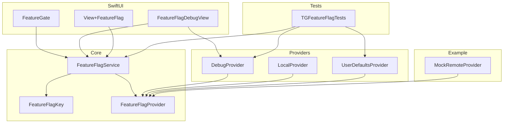
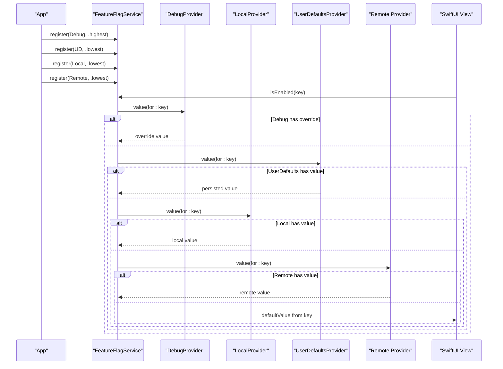
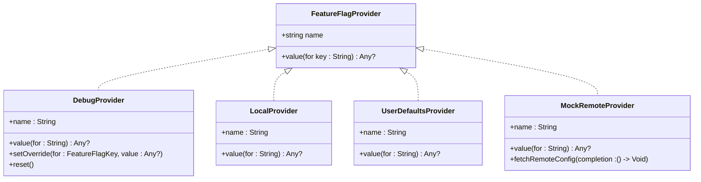
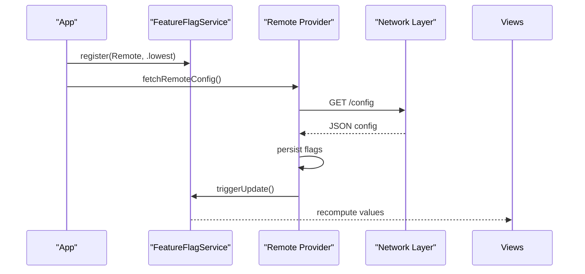
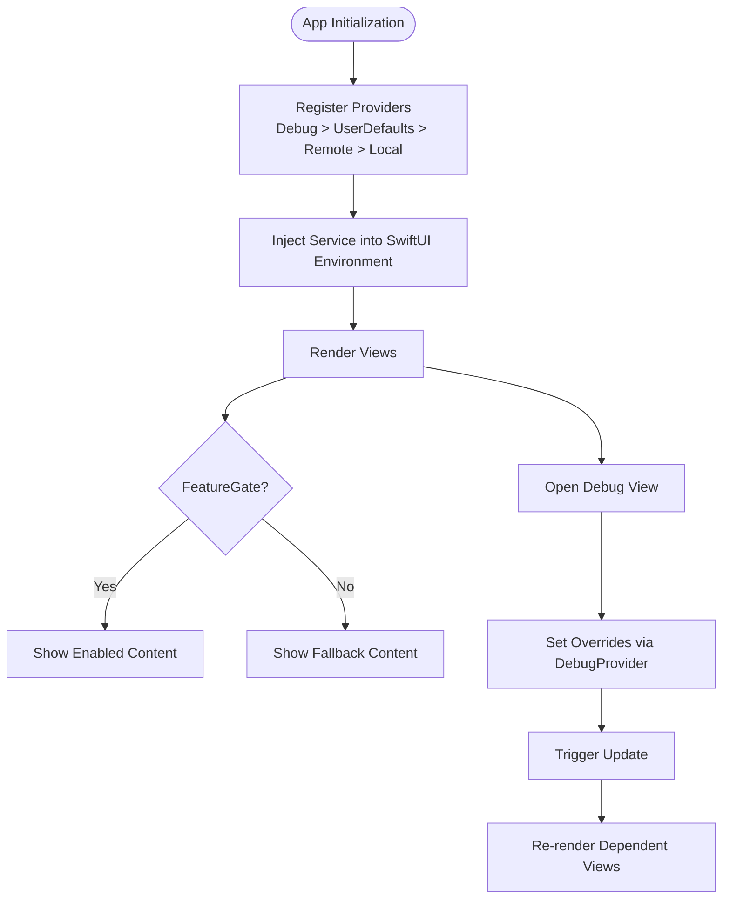
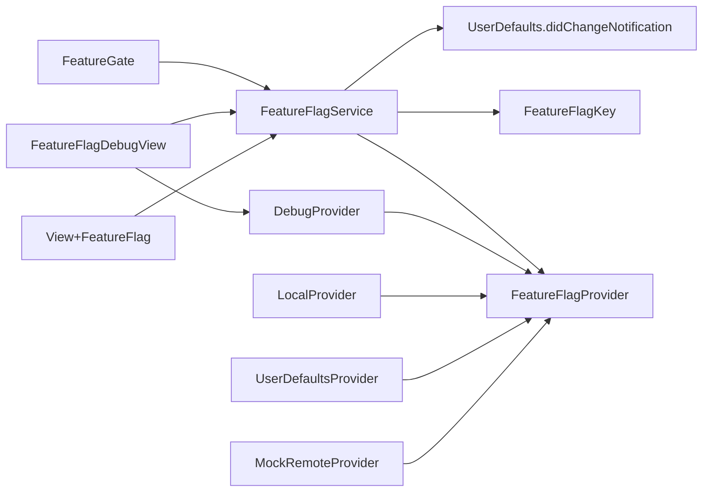

# Advanced Usage & Customization

<cite>
**Referenced Files in This Document**
- [README.md](file://README.md)
- [Package.swift](file://Package.swift)
- [FeatureFlagKey.swift](file://Sources/TGFeatureFlag/Core/FeatureFlagKey.swift)
- [FeatureFlagProvider.swift](file://Sources/TGFeatureFlag/Core/FeatureFlagProvider.swift)
- [FeatureFlagService.swift](file://Sources/TGFeatureFlag/Core/FeatureFlagService.swift)
- [DebugProvider.swift](file://Sources/TGFeatureFlag/Providers/DebugProvider.swift)
- [LocalProvider.swift](file://Sources/TGFeatureFlag/Providers/LocalProvider.swift)
- [UserDefaultsProvider.swift](file://Sources/TGFeatureFlag/Providers/UserDefaultsProvider.swift)
- [FeatureGate.swift](file://Sources/TGFeatureFlag/SwiftUI/FeatureGate.swift)
- [View+FeatureFlag.swift](file://Sources/TGFeatureFlag/SwiftUI/View+FeatureFlag.swift)
- [FeatureFlagDebugView.swift](file://Sources/TGFeatureFlag/SwiftUI/FeatureFlagDebugView.swift)
- [MockRemoteProvider.swift](file://Example/TGFeatureFlagDemo/TGFeatureFlagDemo/MockRemoteProvider.swift)
- [TGFeatureFlagTests.swift](file://Tests/TGFeatureFlagTests/TGFeatureFlagTests.swift)
</cite>

## Table of Contents
1. [Introduction](#introduction)
2. [Project Structure](#project-structure)
3. [Core Components](#core-components)
4. [Architecture Overview](#architecture-overview)
5. [Detailed Component Analysis](#detailed-component-analysis)
6. [Dependency Analysis](#dependency-analysis)
7. [Performance Considerations](#performance-considerations)
8. [Troubleshooting Guide](#troubleshooting-guide)
9. [Migration and Compatibility](#migration-and-compatibility)
10. [Integration with Third-Party Services](#integration-with-third-party-services)
11. [Testing Strategies](#testing-strategies)
12. [Conclusion](#conclusion)

## Introduction
This document provides advanced guidance for customizing and extending TGFeatureFlag. It focuses on implementing custom providers by conforming to the FeatureFlagProvider protocol, integrating remote configuration sources (such as Firebase Remote Config or LaunchDarkly), advanced configuration patterns, testing strategies using mock providers, performance optimization techniques, troubleshooting common issues, and migration considerations across versions.

## Project Structure
The framework is organized into core abstractions, built-in providers, SwiftUI helpers, an example app demonstrating a mock remote provider, and tests that validate behavior.

**Diagram sources**
- [FeatureFlagKey.swift:1-37](file://Sources/TGFeatureFlag/Core/FeatureFlagKey.swift#L1-L37)
- [FeatureFlagProvider.swift:1-18](file://Sources/TGFeatureFlag/Core/FeatureFlagProvider.swift#L1-L18)
- [FeatureFlagService.swift:1-94](file://Sources/TGFeatureFlag/Core/FeatureFlagService.swift#L1-L94)
- [DebugProvider.swift:1-38](file://Sources/TGFeatureFlag/Providers/DebugProvider.swift#L1-L38)
- [LocalProvider.swift:1-28](file://Sources/TGFeatureFlag/Providers/LocalProvider.swift#L1-L28)
- [UserDefaultsProvider.swift:1-26](file://Sources/TGFeatureFlag/Providers/UserDefaultsProvider.swift#L1-L26)
- [FeatureGate.swift:1-49](file://Sources/TGFeatureFlag/SwiftUI/FeatureGate.swift#L1-L49)
- [View+FeatureFlag.swift:1-10](file://Sources/TGFeatureFlag/SwiftUI/View+FeatureFlag.swift#L1-L10)
- [FeatureFlagDebugView.swift:1-214](file://Sources/TGFeatureFlag/SwiftUI/FeatureFlagDebugView.swift#L1-L214)
- [MockRemoteProvider.swift:1-54](file://Example/TGFeatureFlagDemo/TGFeatureFlagDemo/MockRemoteProvider.swift#L1-L54)
- [TGFeatureFlagTests.swift:1-123](file://Tests/TGFeatureFlagTests/TGFeatureFlagTests.swift#L1-L123)

**Section sources**
- [README.md:1-150](file://README.md#L1-L150)
- [Package.swift:1-31](file://Package.swift#L1-L31)

## Core Components
- FeatureFlagKey: Defines each flag’s identity and default value. Implementations typically use enums with raw string keys and provide typed defaults.
- FeatureFlagProvider: Protocol abstraction for any source of flag values. Providers are queried in priority order until one returns a non-nil value.
- FeatureFlagService: Central manager that aggregates providers, resolves values, integrates with Observation for UI updates, and exposes convenience methods like isEnabled and typed value retrieval.

Key behaviors:
- Provider chain resolution: The service iterates registered providers from highest to lowest priority; the first non-nil result wins. If none return a value, the key’s defaultValue is used.
- Type safety: Typed accessors cast resolved values to the requested type; mismatches trigger a fatal error at runtime.
- UI integration: The service uses Observation to notify views when values change, including via UserDefaults notifications.

**Section sources**
- [FeatureFlagKey.swift:1-37](file://Sources/TGFeatureFlag/Core/FeatureFlagKey.swift#L1-L37)
- [FeatureFlagProvider.swift:1-18](file://Sources/TGFeatureFlag/Core/FeatureFlagProvider.swift#L1-L18)
- [FeatureFlagService.swift:1-94](file://Sources/TGFeatureFlag/Core/FeatureFlagService.swift#L1-L94)

## Architecture Overview
At runtime, FeatureFlagService coordinates multiple providers and SwiftUI components. Debug tools can override values at runtime, while UserDefaults and local providers supply persistent or initial values. A remote provider can be integrated to fetch configuration from backend services.

**Diagram sources**
- [FeatureFlagService.swift:35-82](file://Sources/TGFeatureFlag/Core/FeatureFlagService.swift#L35-L82)
- [DebugProvider.swift:14-29](file://Sources/TGFeatureFlag/Providers/DebugProvider.swift#L14-L29)
- [LocalProvider.swift:24-26](file://Sources/TGFeatureFlag/Providers/LocalProvider.swift#L24-L26)
- [UserDefaultsProvider.swift:20-24](file://Sources/TGFeatureFlag/Providers/UserDefaultsProvider.swift#L20-L24)
- [MockRemoteProvider.swift:15-19](file://Example/TGFeatureFlagDemo/TGFeatureFlagDemo/MockRemoteProvider.swift#L15-L19)

## Detailed Component Analysis

### Implementing Custom Providers
To create a custom provider:
- Conform to FeatureFlagProvider and implement name and value(for:)
- Ensure thread-safety if your implementation maintains mutable state
- Integrate with the service by registering it with appropriate priority

Common patterns:
- Highest priority: Debug overrides for development and QA
- Medium priority: UserDefaults for user-configurable settings
- Lower priority: Local defaults for initial values
- Lowest priority: Remote configuration fetched from backend services

**Diagram sources**
- [FeatureFlagProvider.swift:1-18](file://Sources/TGFeatureFlag/Core/FeatureFlagProvider.swift#L1-L18)
- [DebugProvider.swift:1-38](file://Sources/TGFeatureFlag/Providers/DebugProvider.swift#L1-L38)
- [LocalProvider.swift:1-28](file://Sources/TGFeatureFlag/Providers/LocalProvider.swift#L1-L28)
- [UserDefaultsProvider.swift:1-26](file://Sources/TGFeatureFlag/Providers/UserDefaultsProvider.swift#L1-L26)
- [MockRemoteProvider.swift:1-54](file://Example/TGFeatureFlagDemo/TGFeatureFlagDemo/MockRemoteProvider.swift#L1-L54)

**Section sources**
- [FeatureFlagProvider.swift:1-18](file://Sources/TGFeatureFlag/Core/FeatureFlagProvider.swift#L1-L18)
- [DebugProvider.swift:1-38](file://Sources/TGFeatureFlag/Providers/DebugProvider.swift#L1-L38)
- [LocalProvider.swift:1-28](file://Sources/TGFeatureFlag/Providers/LocalProvider.swift#L1-L28)
- [UserDefaultsProvider.swift:1-26](file://Sources/TGFeatureFlag/Providers/UserDefaultsProvider.swift#L1-L26)
- [MockRemoteProvider.swift:1-54](file://Example/TGFeatureFlagDemo/TGFeatureFlagDemo/MockRemoteProvider.swift#L1-L54)

### Remote Configuration Integration
A remote provider should:
- Fetch configuration asynchronously (e.g., network call)
- Store results in a thread-safe structure
- Expose value(for:) to return stored values
- Notify the service when new values arrive so UI updates propagate

The example demonstrates a mock remote provider that simulates fetching and updating flags after a delay. In production, replace the mock with a real client (e.g., Firebase Remote Config or LaunchDarkly). After receiving updated values, call service.triggerUpdate() to refresh dependent views.

**Diagram sources**
- [MockRemoteProvider.swift:24-52](file://Example/TGFeatureFlagDemo/TGFeatureFlagDemo/MockRemoteProvider.swift#L24-L52)
- [FeatureFlagService.swift:84-87](file://Sources/TGFeatureFlag/Core/FeatureFlagService.swift#L84-L87)

**Section sources**
- [MockRemoteProvider.swift:1-54](file://Example/TGFeatureFlagDemo/TGFeatureFlagDemo/MockRemoteProvider.swift#L1-L54)
- [FeatureFlagService.swift:84-87](file://Sources/TGFeatureFlag/Core/FeatureFlagService.swift#L84-L87)

### Advanced Configuration Patterns
- Priority chaining: Register providers in order of precedence. For example, Debug > UserDefaults > Remote > Local defaults.
- Environment injection: Use the provided extension to inject FeatureFlagService into SwiftUI hierarchies.
- Conditional rendering: Use FeatureGate to declaratively show/hide UI based on boolean flags.
- Runtime debugging: Use FeatureFlagDebugView to inspect and override flags during development.

**Diagram sources**
- [View+FeatureFlag.swift:6-8](file://Sources/TGFeatureFlag/SwiftUI/View+FeatureFlag.swift#L6-L8)
- [FeatureGate.swift:31-37](file://Sources/TGFeatureFlag/SwiftUI/FeatureGate.swift#L31-L37)
- [FeatureFlagDebugView.swift:21-33](file://Sources/TGFeatureFlag/SwiftUI/FeatureFlagDebugView.swift#L21-L33)
- [FeatureFlagService.swift:84-87](file://Sources/TGFeatureFlag/Core/FeatureFlagService.swift#L84-L87)

**Section sources**
- [View+FeatureFlag.swift:1-10](file://Sources/TGFeatureFlag/SwiftUI/View+FeatureFlag.swift#L1-L10)
- [FeatureGate.swift:1-49](file://Sources/TGFeatureFlag/SwiftUI/FeatureGate.swift#L1-L49)
- [FeatureFlagDebugView.swift:1-214](file://Sources/TGFeatureFlag/SwiftUI/FeatureFlagDebugView.swift#L1-L214)
- [FeatureFlagService.swift:1-94](file://Sources/TGFeatureFlag/Core/FeatureFlagService.swift#L1-L94)

## Dependency Analysis
The service depends on the provider protocol and observes UserDefaults changes. Providers depend only on Foundation and their own storage mechanisms. SwiftUI components depend on the service and debug provider for runtime control.

**Diagram sources**
- [FeatureFlagService.swift:18-33](file://Sources/TGFeatureFlag/Core/FeatureFlagService.swift#L18-L33)
- [FeatureFlagService.swift:43-50](file://Sources/TGFeatureFlag/Core/FeatureFlagService.swift#L43-L50)
- [FeatureFlagService.swift:53-82](file://Sources/TGFeatureFlag/Core/FeatureFlagService.swift#L53-L82)
- [FeatureFlagProvider.swift:1-18](file://Sources/TGFeatureFlag/Core/FeatureFlagProvider.swift#L1-L18)
- [FeatureFlagKey.swift:1-37](file://Sources/TGFeatureFlag/Core/FeatureFlagKey.swift#L1-L37)
- [DebugProvider.swift:1-38](file://Sources/TGFeatureFlag/Providers/DebugProvider.swift#L1-L38)
- [LocalProvider.swift:1-28](file://Sources/TGFeatureFlag/Providers/LocalProvider.swift#L1-L28)
- [UserDefaultsProvider.swift:1-26](file://Sources/TGFeatureFlag/Providers/UserDefaultsProvider.swift#L1-L26)
- [MockRemoteProvider.swift:1-54](file://Example/TGFeatureFlagDemo/TGFeatureFlagDemo/MockRemoteProvider.swift#L1-L54)
- [FeatureGate.swift:1-49](file://Sources/TGFeatureFlag/SwiftUI/FeatureGate.swift#L1-L49)
- [FeatureFlagDebugView.swift:1-214](file://Sources/TGFeatureFlag/SwiftUI/FeatureFlagDebugView.swift#L1-L214)
- [View+FeatureFlag.swift:1-10](file://Sources/TGFeatureFlag/SwiftUI/View+FeatureFlag.swift#L1-L10)

**Section sources**
- [FeatureFlagService.swift:1-94](file://Sources/TGFeatureFlag/Core/FeatureFlagService.swift#L1-L94)
- [FeatureFlagProvider.swift:1-18](file://Sources/TGFeatureFlag/Core/FeatureFlagProvider.swift#L1-L18)
- [FeatureFlagKey.swift:1-37](file://Sources/TGFeatureFlag/Core/FeatureFlagKey.swift#L1-L37)

## Performance Considerations
- Minimize provider lookups: Cache computed values in your view layer if necessary, but rely on Observation-driven updates for correctness.
- Avoid heavy work in value(for:): Keep provider implementations lightweight; perform network calls asynchronously and store results.
- Reduce update frequency: Batch remote configuration updates and call triggerUpdate once after applying all changes.
- Prefer higher-priority providers for frequently accessed flags to reduce iteration cost.
- Use dedicated UserDefaults suites for feature flags to avoid contention with other app data.

[No sources needed since this section provides general guidance]

## Troubleshooting Guide
Common issues and resolutions:
- Type mismatch errors: Ensure the default value type matches the requested type. The service will crash if types do not align. Validate enum defaultValue implementations.
- No updates observed: When using UserDefaults, ensure the service is observing didChangeNotification and that you write to the same suite instance used by the provider.
- Remote values not applied: Confirm that the remote provider persists values before calling triggerUpdate and that its registration priority allows it to be consulted.
- Debug overrides not taking effect: Verify DebugProvider is registered with highest priority and that overrides are set correctly.

Operational checks:
- Inspect current overrides via FeatureFlagDebugView.
- Use provider(ofType:) to locate specific providers and verify their state.
- Review test cases for expected behaviors around priority chains and typed values.

**Section sources**
- [FeatureFlagService.swift:74-82](file://Sources/TGFeatureFlag/Core/FeatureFlagService.swift#L74-L82)
- [FeatureFlagService.swift:18-33](file://Sources/TGFeatureFlag/Core/FeatureFlagService.swift#L18-L33)
- [FeatureFlagDebugView.swift:21-33](file://Sources/TGFeatureFlag/SwiftUI/FeatureFlagDebugView.swift#L21-L33)
- [FeatureFlagService.swift:89-92](file://Sources/TGFeatureFlag/Core/FeatureFlagService.swift#L89-L92)
- [TGFeatureFlagTests.swift:31-53](file://Tests/TGFeatureFlagTests/TGFeatureFlagTests.swift#L31-L53)

## Migration and Compatibility
- Swift and platform requirements: The package targets iOS 17 and macOS 14, requiring Swift 6 toolchain.
- Observation-based UI updates: Ensure your app supports the Observation framework and @Observable usage.
- Breaking changes: Adding new providers or changing provider priorities may affect existing behavior; review registration order carefully.
- Default value contracts: Changing defaultValue types for existing keys can cause runtime crashes due to type mismatches; prefer additive changes and deprecation strategies.

**Section sources**
- [Package.swift:1-31](file://Package.swift#L1-L31)
- [FeatureFlagService.swift:1-10](file://Sources/TGFeatureFlag/Core/FeatureFlagService.swift#L1-L10)
- [FeatureFlagKey.swift:1-37](file://Sources/TGFeatureFlag/Core/FeatureFlagKey.swift#L1-L37)

## Integration with Third-Party Services
Integrating Firebase Remote Config or LaunchDarkly follows the same pattern:
- Create a provider conforming to FeatureFlagProvider
- Implement asynchronous fetch logic to retrieve configuration
- Persist results in a thread-safe structure
- Expose value(for:) to return stored values
- Call service.triggerUpdate() after applying new values

Considerations:
- Error handling: Provide sensible fallbacks when network requests fail; rely on lower-priority providers or defaults.
- Caching strategy: Cache responses locally to minimize network overhead and improve startup time.
- Security: Secure sensitive configuration endpoints and respect environment-specific configurations (dev/staging/prod).
- Observability: Log fetch events and outcomes for diagnostics without exposing secrets.

[No sources needed since this section provides general guidance]

## Testing Strategies
Use mock providers to simulate remote behavior and assert correct resolution order and typed value handling.

Recommended approaches:
- Priority chain tests: Assert that higher-priority providers override lower ones.
- Typed value tests: Validate string, int, double, and bool retrieval paths.
- UserDefaults integration tests: Use isolated suites to avoid polluting standard storage.
- Remote provider simulation: Replace remote provider with a mock that returns deterministic values and triggers updates.

Reference examples:
- Priority chain verification and override behavior
- String and int value handling
- UserDefaults integration with suite isolation

**Section sources**
- [TGFeatureFlagTests.swift:31-53](file://Tests/TGFeatureFlagTests/TGFeatureFlagTests.swift#L31-L53)
- [TGFeatureFlagTests.swift:57-91](file://Tests/TGFeatureFlagTests/TGFeatureFlagTests.swift#L57-L91)
- [TGFeatureFlagTests.swift:95-121](file://Tests/TGFeatureFlagTests/TGFeatureFlagTests.swift#L95-L121)
- [MockRemoteProvider.swift:1-54](file://Example/TGFeatureFlagDemo/TGFeatureFlagDemo/MockRemoteProvider.swift#L1-L54)

## Conclusion
By conforming to FeatureFlagProvider, you can integrate diverse configuration sources into a unified, type-safe system. Combine high-priority debug overrides, persistent UserDefaults, local defaults, and remote configuration to achieve flexible, observable feature gating. Follow the testing patterns and performance guidelines outlined here to maintain reliability and responsiveness across your application.