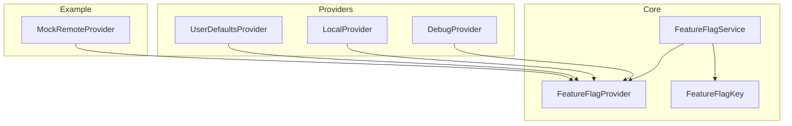
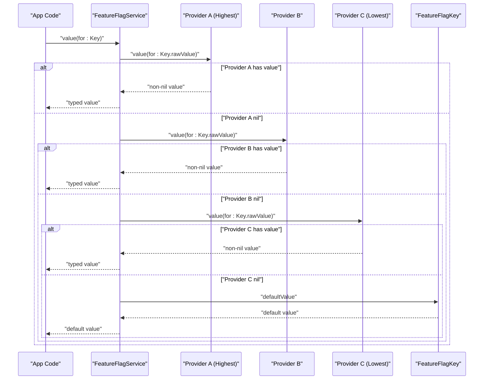
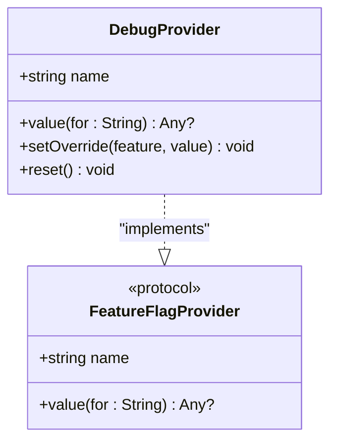
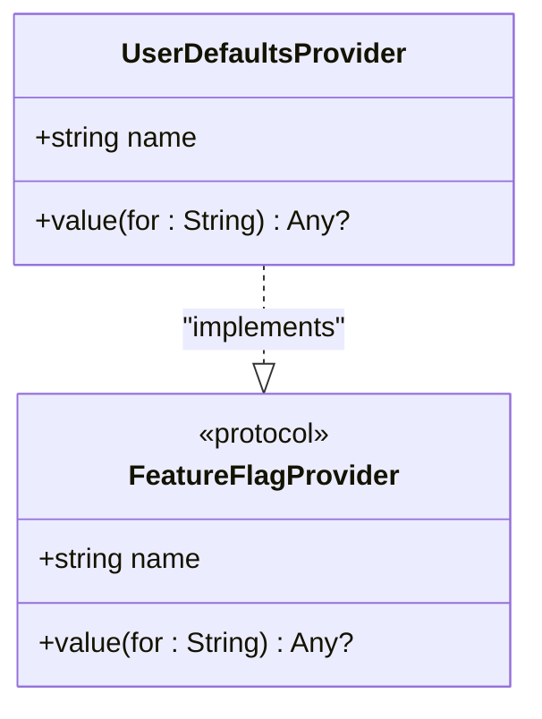
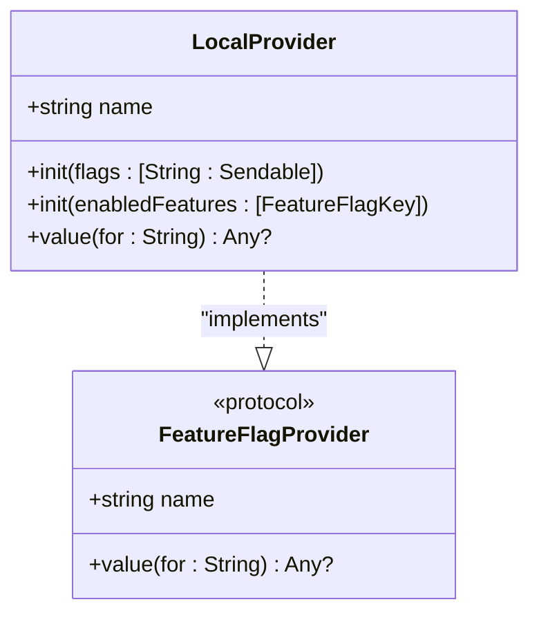
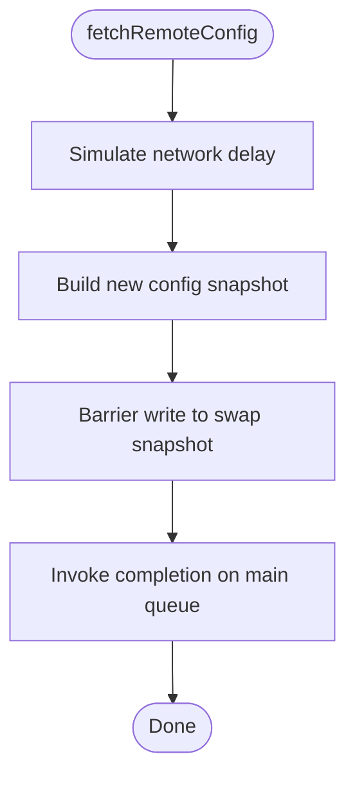
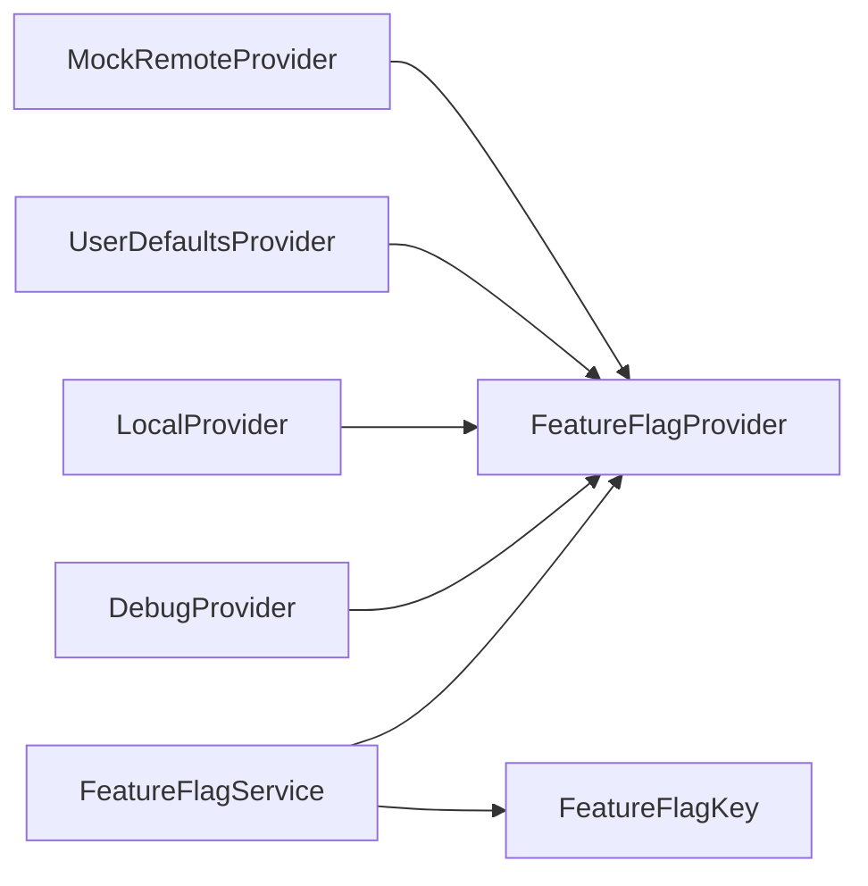

# Custom Provider Implementation

<cite>
**Referenced Files in This Document**
- [FeatureFlagProvider.swift](file://Sources/TGFeatureFlag/Core/FeatureFlagProvider.swift)
- [FeatureFlagService.swift](file://Sources/TGFeatureFlag/Core/FeatureFlagService.swift)
- [FeatureFlagKey.swift](file://Sources/TGFeatureFlag/Core/FeatureFlagKey.swift)
- [DebugProvider.swift](file://Sources/TGFeatureFlag/Providers/DebugProvider.swift)
- [LocalProvider.swift](file://Sources/TGFeatureFlag/Providers/LocalProvider.swift)
- [UserDefaultsProvider.swift](file://Sources/TGFeatureFlag/Providers/UserDefaultsProvider.swift)
- [MockRemoteProvider.swift](file://Example/TGFeatureFlagDemo/TGFeatureFlagDemo/MockRemoteProvider.swift)
- [README.md](file://README.md)
</cite>

## Table of Contents
1. [Introduction](#introduction)
2. [Project Structure](#project-structure)
3. [Core Components](#core-components)
4. [Architecture Overview](#architecture-overview)
5. [Detailed Component Analysis](#detailed-component-analysis)
6. [Dependency Analysis](#dependency-analysis)
7. [Performance Considerations](#performance-considerations)
8. [Troubleshooting Guide](#troubleshooting-guide)
9. [Conclusion](#conclusion)
10. [Appendices](#appendices)

## Introduction
This document explains how to implement custom providers by conforming to the FeatureFlagProvider protocol. It covers interface requirements, thread safety considerations, best practices for data sources, asynchronous fetching patterns, synchronization strategies, error handling, provider lifecycle and initialization, and integration with the feature flag service chain. The goal is to help you build robust, concurrent-safe providers that integrate seamlessly with the existing resolution pipeline.

## Project Structure
The framework centers around a small set of core types:
- A provider protocol defining the contract for value sources
- A central service orchestrating provider resolution and UI updates
- Built-in providers for debugging, defaults, and user settings
- An example mock remote provider demonstrating async fetch and barrier-based updates

**Diagram sources**
- [FeatureFlagProvider.swift:1-18](file://Sources/TGFeatureFlag/Core/FeatureFlagProvider.swift#L1-L18)
- [FeatureFlagService.swift:25-168](file://Sources/TGFeatureFlag/Core/FeatureFlagService.swift#L25-L168)
- [FeatureFlagKey.swift:1-37](file://Sources/TGFeatureFlag/Core/FeatureFlagKey.swift#L1-L37)
- [DebugProvider.swift:1-38](file://Sources/TGFeatureFlag/Providers/DebugProvider.swift#L1-L38)
- [LocalProvider.swift:1-28](file://Sources/TGFeatureFlag/Providers/LocalProvider.swift#L1-L28)
- [UserDefaultsProvider.swift:1-28](file://Sources/TGFeatureFlag/Providers/UserDefaultsProvider.swift#L1-L28)
- [MockRemoteProvider.swift:1-54](file://Example/TGFeatureFlagDemo/TGFeatureFlagDemo/MockRemoteProvider.swift#L1-L54)

**Section sources**
- [README.md:140-150](file://README.md#L140-L150)

## Core Components
- FeatureFlagProvider: Defines the minimal contract for any source of feature flag values. Implementations must be concurrency-safe (Sendable).
- FeatureFlagService: Central manager that resolves flags by iterating through registered providers in priority order and falling back to default values. It also integrates with SwiftUI via Observation.
- FeatureFlagKey: Declares the identity and default value for each flag.

Key responsibilities:
- Providers expose name and value(for:) to return optional typed values.
- Service manages registration, ordering, logging, and safe access to providers.
- Keys define defaults and descriptions used by the service and debug tools.

**Section sources**
- [FeatureFlagProvider.swift:3-17](file://Sources/TGFeatureFlag/Core/FeatureFlagProvider.swift#L3-L17)
- [FeatureFlagService.swift:25-168](file://Sources/TGFeatureFlag/Core/FeatureFlagService.swift#L25-L168)
- [FeatureFlagKey.swift:1-37](file://Sources/TGFeatureFlag/Core/FeatureFlagKey.swift#L1-L37)

## Architecture Overview
The resolution pipeline follows a simple priority chain:
- Register multiple providers with priorities (highest to lowest).
- On each request, the service iterates providers in order and returns the first non-nil value.
- If no provider returns a value, the key’s default is used.
- The service can log which provider resolved each flag.

**Diagram sources**
- [FeatureFlagService.swift:110-151](file://Sources/TGFeatureFlag/Core/FeatureFlagService.swift#L110-L151)
- [FeatureFlagKey.swift:21-32](file://Sources/TGFeatureFlag/Core/FeatureFlagKey.swift#L21-L32)

## Detailed Component Analysis

### FeatureFlagProvider Protocol Requirements
Implementations must provide:
- A stable, human-readable name for logging and debugging.
- A value(for:) method returning an optional Any value for a given key.
- Conformance to Sendable to ensure thread safety across the service.

Best practices:
- Keep value(for:) fast and side-effect free; avoid heavy I/O on the hot path.
- Return nil when a key is not present rather than throwing or returning placeholders.
- Ensure internal state is protected from concurrent access using queues, locks, or immutable snapshots.

**Section sources**
- [FeatureFlagProvider.swift:3-17](file://Sources/TGFeatureFlag/Core/FeatureFlagProvider.swift#L3-L17)

### Thread Safety and Concurrency
- All providers must be Sendable. Use one of these proven strategies:
  - DispatchQueue with .barrier writes and sync reads (see MockRemoteProvider).
  - NSLock or os_unfair_lock around mutable state (see DebugProvider).
  - Immutable snapshots updated atomically (e.g., replace dictionary reference under lock).
- Avoid long-running work inside value(for:); offload network or disk I/O to background tasks and publish updates asynchronously.
- Prefer fine-grained locking or actor-like isolation to reduce contention.

Examples in codebase:
- Barrier-based concurrent queue for atomic replacement of configuration snapshot.
- Lock-guarded overrides map for runtime toggles.
- UserDefaults-backed read-only provider leveraging documented thread-safety.

**Section sources**
- [MockRemoteProvider.swift:9-52](file://Example/TGFeatureFlagDemo/TGFeatureFlagDemo/MockRemoteProvider.swift#L9-L52)
- [DebugProvider.swift:8-36](file://Sources/TGFeatureFlag/Providers/DebugProvider.swift#L8-L36)
- [UserDefaultsProvider.swift:9-26](file://Sources/TGFeatureFlag/Providers/UserDefaultsProvider.swift#L9-L26)

### Asynchronous Data Fetching Patterns
For remote configuration:
- Provide a separate fetch method that runs on a background queue and updates internal state safely.
- After updating, notify observers or trigger service updates if needed.
- Expose a way to refresh configuration at app launch or after login.

Reference pattern:
- Background delay simulation followed by barrier write to swap configuration snapshot.
- Completion callback invoked on main thread for UI-friendly notifications.

**Section sources**
- [MockRemoteProvider.swift:21-52](file://Example/TGFeatureFlagDemo/TGFeatureFlagDemo/MockRemoteProvider.swift#L21-L52)

### Error Handling Strategies
- Do not throw from value(for:). Instead, catch errors internally and return nil so the chain continues to the next provider or default.
- Log failures via the service logger if available.
- For transient network errors, retry with backoff in your fetch routine; do not block the resolution path.

Service-side safeguards:
- The service wraps provider calls in a safe helper and logs when a provider fails to resolve.

**Section sources**
- [FeatureFlagService.swift:120-139](file://Sources/TGFeatureFlag/Core/FeatureFlagService.swift#L120-L139)
- [FeatureFlagService.swift:153-156](file://Sources/TGFeatureFlag/Core/FeatureFlagService.swift#L153-L156)

### Provider Lifecycle and Initialization
Typical lifecycle:
- Initialize providers with their data sources (e.g., UserDefaults instance, API client).
- Register providers with the service at app startup, setting appropriate priorities.
- Trigger initial fetch for remote providers before first use.
- Optionally observe system events (e.g., UserDefaults changes) to refresh UI.

Integration points:
- Service constructor observes UserDefaults changes and triggers updates.
- You can call triggerUpdate() manually when external sources change.

**Section sources**
- [FeatureFlagService.swift:53-68](file://Sources/TGFeatureFlag/Core/FeatureFlagService.swift#L53-L68)
- [FeatureFlagService.swift:158-161](file://Sources/TGFeatureFlag/Core/FeatureFlagService.swift#L158-L161)
- [README.md:52-87](file://README.md#L52-L87)

### Integration With the Service Chain
- Register providers with explicit priorities to control override behavior (e.g., Debug > Settings > Remote > Local).
- Use the service’s provider lookup helper to interact with specific providers (e.g., to clear overrides).
- Use the logger to understand which provider resolved each flag during development and production diagnostics.

**Section sources**
- [FeatureFlagService.swift:89-107](file://Sources/TGFeatureFlag/Core/FeatureFlagService.swift#L89-L107)
- [FeatureFlagService.swift:163-166](file://Sources/TGFeatureFlag/Core/FeatureFlagService.swift#L163-L166)

### Example Implementations

#### DebugProvider (Runtime Overrides)
- Mutable overrides protected by a lock.
- Methods to set/remove/clear overrides.
- Highest priority typical usage for developer testing.

**Diagram sources**
- [DebugProvider.swift:1-38](file://Sources/TGFeatureFlag/Providers/DebugProvider.swift#L1-L38)
- [FeatureFlagProvider.swift:3-17](file://Sources/TGFeatureFlag/Core/FeatureFlagProvider.swift#L3-L17)

**Section sources**
- [DebugProvider.swift:1-38](file://Sources/TGFeatureFlag/Providers/DebugProvider.swift#L1-L38)

#### UserDefaultsProvider (Settings Bundle / User Defaults)
- Reads values directly from UserDefaults.
- Notifies the service automatically via notification observation.
- Suitable for low-priority overrides or user-configurable flags.

**Diagram sources**
- [UserDefaultsProvider.swift:1-28](file://Sources/TGFeatureFlag/Providers/UserDefaultsProvider.swift#L1-L28)
- [FeatureFlagProvider.swift:3-17](file://Sources/TGFeatureFlag/Core/FeatureFlagProvider.swift#L3-L17)

**Section sources**
- [UserDefaultsProvider.swift:1-28](file://Sources/TGFeatureFlag/Providers/UserDefaultsProvider.swift#L1-L28)

#### LocalProvider (In-Memory Defaults)
- Simple dictionary-backed provider for initial values or tests.
- Useful when you want to supply a static set of flags without relying solely on enum defaults.

**Diagram sources**
- [LocalProvider.swift:1-28](file://Sources/TGFeatureFlag/Providers/LocalProvider.swift#L1-L28)
- [FeatureFlagProvider.swift:3-17](file://Sources/TGFeatureFlag/Core/FeatureFlagProvider.swift#L3-L17)

**Section sources**
- [LocalProvider.swift:1-28](file://Sources/TGFeatureFlag/Providers/LocalProvider.swift#L1-L28)

#### MockRemoteProvider (Asynchronous Remote Config)
- Simulates network fetch and updates configuration atomically.
- Demonstrates barrier writes and main-thread completion callbacks.
- Ideal template for building a real remote configuration provider.

**Diagram sources**
- [MockRemoteProvider.swift:21-52](file://Example/TGFeatureFlagDemo/TGFeatureFlagDemo/MockRemoteProvider.swift#L21-L52)

**Section sources**
- [MockRemoteProvider.swift:1-54](file://Example/TGFeatureFlagDemo/TGFeatureFlagDemo/MockRemoteProvider.swift#L1-L54)

## Dependency Analysis
The following diagram shows how components depend on each other and where the provider protocol fits into the architecture.

**Diagram sources**
- [FeatureFlagService.swift:25-168](file://Sources/TGFeatureFlag/Core/FeatureFlagService.swift#L25-L168)
- [FeatureFlagProvider.swift:3-17](file://Sources/TGFeatureFlag/Core/FeatureFlagProvider.swift#L3-L17)
- [FeatureFlagKey.swift:1-37](file://Sources/TGFeatureFlag/Core/FeatureFlagKey.swift#L1-L37)
- [DebugProvider.swift:1-38](file://Sources/TGFeatureFlag/Providers/DebugProvider.swift#L1-L38)
- [LocalProvider.swift:1-28](file://Sources/TGFeatureFlag/Providers/LocalProvider.swift#L1-L28)
- [UserDefaultsProvider.swift:1-28](file://Sources/TGFeatureFlag/Providers/UserDefaultsProvider.swift#L1-L28)
- [MockRemoteProvider.swift:1-54](file://Example/TGFeatureFlagDemo/TGFeatureFlagDemo/MockRemoteProvider.swift#L1-L54)

**Section sources**
- [README.md:140-150](file://README.md#L140-L150)

## Performance Considerations
- Keep value(for:) synchronous and lightweight; perform I/O asynchronously and cache results.
- Use barrier writes to minimize contention when swapping snapshots.
- Prefer immutable snapshots over frequent mutations to reduce lock scope.
- Avoid excessive logging in hot paths; enable logging selectively.
- Batch updates and coalesce notifications to prevent UI thrashing.

[No sources needed since this section provides general guidance]

## Troubleshooting Guide
Common issues and resolutions:
- Type mismatch between provider value and expected type:
  - Ensure provider returns the correct type for the key.
  - Rely on the service’s type casting and default fallbacks.
- No value resolved:
  - Verify provider registration order and priorities.
  - Check that keys match exactly across providers and keys.
- UI not updating:
  - Confirm that external changes trigger service updates (e.g., UserDefaults notifications or manual triggerUpdate()).
- Concurrency crashes:
  - Validate Sendable conformance and proper synchronization in custom providers.

Operational hooks:
- Use the service logger to see which provider resolved each flag.
- Use provider lookup to inspect or reset provider state during debugging.

**Section sources**
- [FeatureFlagService.swift:103-107](file://Sources/TGFeatureFlag/Core/FeatureFlagService.swift#L103-L107)
- [FeatureFlagService.swift:158-166](file://Sources/TGFeatureFlag/Core/FeatureFlagService.swift#L158-L166)

## Conclusion
By implementing FeatureFlagProvider with careful attention to thread safety, asynchronous updates, and error handling, you can integrate diverse data sources into a single, predictable resolution chain. Follow the provided examples—especially the mock remote provider—to model your own implementations. Use priorities to control override semantics, leverage the service’s logging and update mechanisms, and keep the hot path fast and reliable.

[No sources needed since this section summarizes without analyzing specific files]

## Appendices

### Best Practices Checklist
- Implement Sendable and protect all mutable state.
- Return nil for missing keys; never throw from value(for:).
- Perform network/disk I/O off the main thread; update snapshots atomically.
- Register providers with clear priorities (Debug > Settings > Remote > Defaults).
- Enable logging during development to validate resolution order.
- Trigger updates when external sources change.

[No sources needed since this section provides general guidance]