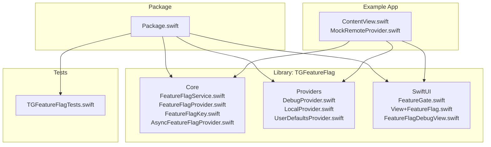
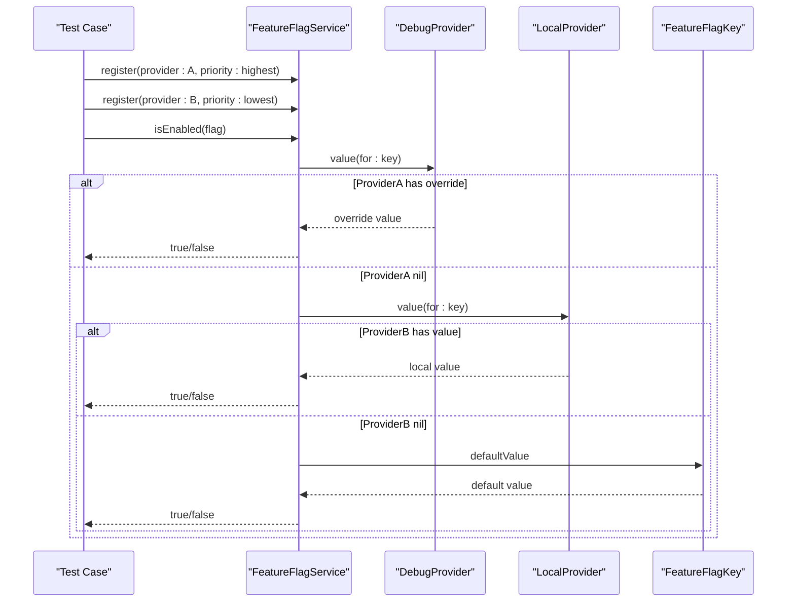
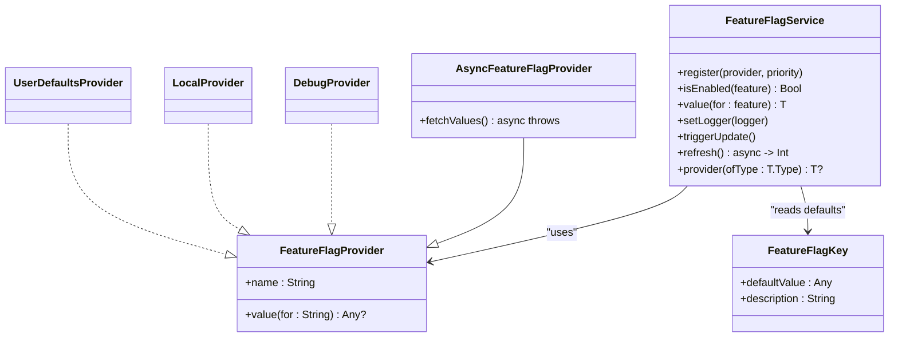

# Testing Strategies

<cite>
**Referenced Files in This Document**
- [Package.swift](file://Package.swift)
- [README.md](file://README.md)
- [FeatureFlagService.swift](file://Sources/TGFeatureFlag/Core/FeatureFlagService.swift)
- [FeatureFlagProvider.swift](file://Sources/TGFeatureFlag/Core/FeatureFlagProvider.swift)
- [FeatureFlagKey.swift](file://Sources/TGFeatureFlag/Core/FeatureFlagKey.swift)
- [AsyncFeatureFlagProvider.swift](file://Sources/TGFeatureFlag/Core/AsyncFeatureFlagProvider.swift)
- [DebugProvider.swift](file://Sources/TGFeatureFlag/Providers/DebugProvider.swift)
- [LocalProvider.swift](file://Sources/TGFeatureFlag/Providers/LocalProvider.swift)
- [UserDefaultsProvider.swift](file://Sources/TGFeatureFlag/Providers/UserDefaultsProvider.swift)
- [FeatureGate.swift](file://Sources/TGFeatureFlag/SwiftUI/FeatureGate.swift)
- [View+FeatureFlag.swift](file://Sources/TGFeatureFlag/SwiftUI/View+FeatureFlag.swift)
- [FeatureFlagDebugView.swift](file://Sources/TGFeatureFlag/SwiftUI/FeatureFlagDebugView.swift)
- [TGFeatureFlagTests.swift](file://Tests/TGFeatureFlagTests/TGFeatureFlagTests.swift)
- [MockRemoteProvider.swift](file://Example/TGFeatureFlagDemo/TGFeatureFlagDemo/MockRemoteProvider.swift)
- [ContentView.swift](file://Example/TGFeatureFlagDemo/TGFeatureFlagDemo/ContentView.swift)
</cite>

## Table of Contents
1. Introduction
2. Project Structure
3. Core Components
4. Architecture Overview
5. Detailed Component Analysis
6. Dependency Analysis
7. Performance Considerations
8. Troubleshooting Guide
9. Conclusion
10. Appendices

## Introduction
This document provides comprehensive testing strategies for TGFeatureFlag, focusing on unit testing, mock provider implementation, test environment setup, and integration patterns. It explains how to create test-specific providers, simulate different flag states, validate provider chains, verify reactive updates, and test SwiftUI components with feature flags. It also covers mocking remote configurations, ensuring thread-safe test execution, performance considerations, and continuous integration setup for feature flag validation.

## Project Structure
The project is a Swift Package with a library target and a test target. The core logic resides under Sources/TGFeatureFlag, with providers and SwiftUI helpers. Tests are located under Tests/TGFeatureFlagTests, and the Example app demonstrates usage and includes a mock remote provider.

**Diagram sources**
- [Package.swift:1-31](file://Package.swift#L1-L31)
- [FeatureFlagService.swift:1-195](file://Sources/TGFeatureFlag/Core/FeatureFlagService.swift#L1-L195)
- [FeatureFlagProvider.swift:1-18](file://Sources/TGFeatureFlag/Core/FeatureFlagProvider.swift#L1-L18)
- [FeatureFlagKey.swift:1-37](file://Sources/TGFeatureFlag/Core/FeatureFlagKey.swift#L1-L37)
- [AsyncFeatureFlagProvider.swift:1-31](file://Sources/TGFeatureFlag/Core/AsyncFeatureFlagProvider.swift#L1-L31)
- [DebugProvider.swift:1-38](file://Sources/TGFeatureFlag/Providers/DebugProvider.swift#L1-L38)
- [LocalProvider.swift:1-28](file://Sources/TGFeatureFlag/Providers/LocalProvider.swift#L1-L28)
- [UserDefaultsProvider.swift:1-28](file://Sources/TGFeatureFlag/Providers/UserDefaultsProvider.swift#L1-L28)
- [FeatureGate.swift:1-49](file://Sources/TGFeatureFlag/SwiftUI/FeatureGate.swift#L1-L49)
- [View+FeatureFlag.swift:1-10](file://Sources/TGFeatureFlag/SwiftUI/View+FeatureFlag.swift#L1-L10)
- [FeatureFlagDebugView.swift:1-214](file://Sources/TGFeatureFlag/SwiftUI/FeatureFlagDebugView.swift#L1-L214)
- [TGFeatureFlagTests.swift:1-270](file://Tests/TGFeatureFlagTests/TGFeatureFlagTests.swift#L1-L270)
- [MockRemoteProvider.swift:1-54](file://Example/TGFeatureFlagDemo/TGFeatureFlagDemo/MockRemoteProvider.swift#L1-L54)
- [ContentView.swift:1-302](file://Example/TGFeatureFlagDemo/TGFeatureFlagDemo/ContentView.swift#L1-L302)

**Section sources**
- [Package.swift:1-31](file://Package.swift#L1-L31)
- [README.md:1-150](file://README.md#L1-L150)

## Core Components
- FeatureFlagKey: Defines typed feature flags with default values and raw keys.
- FeatureFlagProvider: Protocol for value sources; implementations include DebugProvider, LocalProvider, UserDefaultsProvider.
- AsyncFeatureFlagProvider: Extends FeatureFlagProvider with fetchValues() for asynchronous refresh.
- FeatureFlagService: Central manager that resolves values across a priority chain, supports logging, triggers UI updates, and refreshes async providers.
- SwiftUI Helpers: FeatureGate and View extension to inject service into the view hierarchy; debug view for runtime overrides.

Testing implications:
- Use FeatureFlagKey enums to define deterministic test scenarios.
- Compose providers to simulate precedence and fallback behavior.
- Leverage FeatureFlagLogger to assert resolution paths.
- Use triggerUpdate() or UserDefaults notifications to drive reactive updates in tests.

**Section sources**
- [FeatureFlagKey.swift:1-37](file://Sources/TGFeatureFlag/Core/FeatureFlagKey.swift#L1-L37)
- [FeatureFlagProvider.swift:1-18](file://Sources/TGFeatureFlag/Core/FeatureFlagProvider.swift#L1-L18)
- [AsyncFeatureFlagProvider.swift:1-31](file://Sources/TGFeatureFlag/Core/AsyncFeatureFlagProvider.swift#L1-L31)
- [FeatureFlagService.swift:1-195](file://Sources/TGFeatureFlag/Core/FeatureFlagService.swift#L1-L195)
- [FeatureGate.swift:1-49](file://Sources/TGFeatureFlag/SwiftUI/FeatureGate.swift#L1-L49)
- [View+FeatureFlag.swift:1-10](file://Sources/TGFeatureFlag/SwiftUI/View+FeatureFlag.swift#L1-L10)
- [FeatureFlagDebugView.swift:1-214](file://Sources/TGFeatureFlag/SwiftUI/FeatureFlagDebugView.swift#L1-L214)

## Architecture Overview
The service resolves values by iterating through registered providers in descending priority order. If no provider returns a value, it falls back to the key’s defaultValue. Logging records which provider resolved each flag.

**Diagram sources**
- [FeatureFlagService.swift:116-151](file://Sources/TGFeatureFlag/Core/FeatureFlagService.swift#L116-L151)
- [FeatureFlagProvider.swift:1-18](file://Sources/TGFeatureFlag/Core/FeatureFlagProvider.swift#L1-L18)
- [FeatureFlagKey.swift:1-37](file://Sources/TGFeatureFlag/Core/FeatureFlagKey.swift#L1-L37)
- [DebugProvider.swift:1-38](file://Sources/TGFeatureFlag/Providers/DebugProvider.swift#L1-L38)
- [LocalProvider.swift:1-28](file://Sources/TGFeatureFlag/Providers/LocalProvider.swift#L1-L28)

## Detailed Component Analysis

### Unit Testing Strategies
- Define test-specific FeatureFlagKey enums with explicit defaults to ensure deterministic outcomes.
- Register providers with explicit priorities to validate precedence and fallback behavior.
- Use DebugProvider.setOverride to toggle boolean flags and set typed values for non-boolean flags.
- Assert both positive and negative cases (override present vs absent).
- Validate logger entries to confirm which provider resolved a flag and whether defaults were used.

Recommended assertions:
- Priority ordering correctness
- Typed value retrieval (Bool, String, Int, Double)
- Default fallback when no providers supply values
- Resetting DebugProvider clears overrides and restores defaults

**Section sources**
- [TGFeatureFlagTests.swift:1-270](file://Tests/TGFeatureFlagTests/TGFeatureFlagTests.swift#L1-L270)
- [FeatureFlagService.swift:116-151](file://Sources/TGFeatureFlag/Core/FeatureFlagService.swift#L116-L151)
- [DebugProvider.swift:1-38](file://Sources/TGFeatureFlag/Providers/DebugProvider.swift#L1-L38)
- [LocalProvider.swift:1-28](file://Sources/TGFeatureFlag/Providers/LocalProvider.swift#L1-L28)

### Mock Provider Implementation
Create lightweight mocks to simulate external sources:
- In-memory dictionary-backed provider for static configurations.
- Asynchronous provider with simulated network delay and barrier writes for thread safety.
- Optional integration with UserDefaults via a dedicated suite to avoid polluting global state.

Patterns:
- Provide methods to seed values before tests.
- Expose reset/clear operations to isolate tests.
- For async providers, expose fetchValues() and ensure subsequent synchronous reads return updated cache.

**Section sources**
- [MockRemoteProvider.swift:1-54](file://Example/TGFeatureFlagDemo/TGFeatureFlagDemo/MockRemoteProvider.swift#L1-L54)
- [AsyncFeatureFlagProvider.swift:1-31](file://Sources/TGFeatureFlag/Core/AsyncFeatureFlagProvider.swift#L1-L31)
- [LocalProvider.swift:1-28](file://Sources/TGFeatureFlag/Providers/LocalProvider.swift#L1-L28)

### Test Environment Setup
- Create a fresh FeatureFlagService per test suite or test case to avoid cross-test contamination.
- Register only the providers required for the specific scenario.
- Use UserDefaults suites scoped to tests to prevent side effects.
- Inject the service into SwiftUI views using the provided environment helper.

Best practices:
- Clean up UserDefaults after tests.
- Avoid shared mutable state between tests.
- Keep provider registration minimal and explicit.

**Section sources**
- [View+FeatureFlag.swift:1-10](file://Sources/TGFeatureFlag/SwiftUI/View+FeatureFlag.swift#L1-L10)
- [UserDefaultsProvider.swift:1-28](file://Sources/TGFeatureFlag/Providers/UserDefaultsProvider.swift#L1-L28)
- [TGFeatureFlagTests.swift:114-141](file://Tests/TGFeatureFlagTests/TGFeatureFlagTests.swift#L114-L141)

### Simulating Different Flag States
- Use DebugProvider.setOverride to flip boolean flags and set typed values.
- Combine multiple providers to represent layered configuration (debug > settings > defaults).
- Remove overrides to validate fallback to lower-priority providers or defaults.

Verification:
- Read values immediately after setting overrides.
- Confirm that toggling an override changes the resolved value accordingly.

**Section sources**
- [DebugProvider.swift:20-36](file://Sources/TGFeatureFlag/Providers/DebugProvider.swift#L20-L36)
- [FeatureFlagService.swift:116-151](file://Sources/TGFeatureFlag/Core/FeatureFlagService.swift#L116-L151)
- [TGFeatureFlagTests.swift:50-72](file://Tests/TGFeatureFlagTests/TGFeatureFlagTests.swift#L50-L72)

### Testing Provider Chains
- Register providers out of order and assert final resolution based on priority.
- Mix built-in priorities (.highest, .lowest) with custom numeric priorities.
- Ensure the first provider returning a non-nil value wins.

Validation approach:
- Set conflicting values across providers.
- Assert the expected winner based on priority.

**Section sources**
- [FeatureFlagService.swift:89-101](file://Sources/TGFeatureFlag/Core/FeatureFlagService.swift#L89-L101)
- [TGFeatureFlagTests.swift:155-182](file://Tests/TGFeatureFlagTests/TGFeatureFlagTests.swift#L155-L182)

### Verifying Reactive Updates
- For UserDefaults-based providers, rely on didChangeNotification to trigger updates.
- For manual updates (e.g., after async fetch), call triggerUpdate() to notify observers.
- In SwiftUI, use FeatureGate to observe changes automatically.

Testing pattern:
- Change underlying storage or call triggerUpdate().
- Re-read values and assert they reflect the new state.

**Section sources**
- [FeatureFlagService.swift:53-68](file://Sources/TGFeatureFlag/Core/FeatureFlagService.swift#L53-L68)
- [FeatureFlagService.swift:158-161](file://Sources/TGFeatureFlag/Core/FeatureFlagService.swift#L158-L161)
- [FeatureGate.swift:31-37](file://Sources/TGFeatureFlag/SwiftUI/FeatureGate.swift#L31-L37)

### Testing SwiftUI Components with Feature Flags
- Inject FeatureFlagService into the view hierarchy using the environment helper.
- Use FeatureGate to conditionally render content based on flags.
- Toggle flags via DebugProvider and assert UI branches.

Integration tips:
- Wrap root views with the environment injection helper.
- Use the debug view to interactively change flags during development and tests.

**Section sources**
- [View+FeatureFlag.swift:1-10](file://Sources/TGFeatureFlag/SwiftUI/View+FeatureFlag.swift#L1-L10)
- [FeatureGate.swift:1-49](file://Sources/TGFeatureFlag/SwiftUI/FeatureGate.swift#L1-L49)
- [FeatureFlagDebugView.swift:1-214](file://Sources/TGFeatureFlag/SwiftUI/FeatureFlagDebugView.swift#L1-L214)
- [ContentView.swift:1-302](file://Example/TGFeatureFlagDemo/TGFeatureFlagDemo/ContentView.swift#L1-L302)

### Mocking Remote Configurations
- Implement a mock provider that simulates network latency and updates internal caches.
- After fetching, update the cache and optionally call triggerUpdate() to propagate changes.
- Verify that subsequent reads reflect the mocked remote values.

**Section sources**
- [MockRemoteProvider.swift:1-54](file://Example/TGFeatureFlagDemo/TGFeatureFlagDemo/MockRemoteProvider.swift#L1-L54)
- [FeatureFlagService.swift:163-188](file://Sources/TGFeatureFlag/Core/FeatureFlagService.swift#L163-L188)
- [ContentView.swift:269-294](file://Example/TGFeatureFlagDemo/TGFeatureFlagDemo/ContentView.swift#L269-L294)

### Ensuring Thread-Safe Test Execution
- Prefer @MainActor services where applicable and keep UI-related assertions on the main actor.
- Use isolated UserDefaults suites per test to avoid contention.
- For custom providers, protect shared state with locks or concurrent queues.

Guidelines:
- Avoid long-running work in tests; simulate delays deterministically.
- Reset providers and clear state between tests.

**Section sources**
- [FeatureFlagService.swift:29-31](file://Sources/TGFeatureFlag/Core/FeatureFlagService.swift#L29-L31)
- [DebugProvider.swift:1-38](file://Sources/TGFeatureFlag/Providers/DebugProvider.swift#L1-L38)
- [UserDefaultsProvider.swift:1-28](file://Sources/TGFeatureFlag/Providers/UserDefaultsProvider.swift#L1-L28)

### Integration Testing Patterns
- End-to-end flow: register providers, set initial values, perform actions, assert UI and state.
- Validate that async refresh propagates updates to the UI.
- Use the debug view to exercise runtime overrides and confirm reactivity.

**Section sources**
- [FeatureFlagService.swift:163-188](file://Sources/TGFeatureFlag/Core/FeatureFlagService.swift#L163-L188)
- [FeatureFlagDebugView.swift:1-214](file://Sources/TGFeatureFlag/SwiftUI/FeatureFlagDebugView.swift#L1-L214)
- [ContentView.swift:1-302](file://Example/TGFeatureFlagDemo/TGFeatureFlagDemo/ContentView.swift#L1-L302)

### Performance Testing Considerations
- Measure overhead of frequent value reads in tight loops or hot paths.
- Minimize unnecessary provider registrations and heavy computations inside providers.
- Batch updates via triggerUpdate() rather than many small updates.
- Profile UI rebuilds caused by flag changes; prefer coarse-grained updates.

[No sources needed since this section provides general guidance]

### Continuous Integration Setup for Feature Flag Validation
- Run unit tests on macOS targets using Swift Package Manager.
- Include tests that cover all supported types and provider combinations.
- Add a step to run example app tests if available.
- Fail the pipeline if any assertion related to provider precedence or defaults fails.

**Section sources**
- [Package.swift:1-31](file://Package.swift#L1-L31)
- [TGFeatureFlagTests.swift:1-270](file://Tests/TGFeatureFlagTests/TGFeatureFlagTests.swift#L1-L270)

## Dependency Analysis
The following diagram shows how the service depends on providers and keys, and how SwiftUI components consume the service.

**Diagram sources**
- [FeatureFlagService.swift:1-195](file://Sources/TGFeatureFlag/Core/FeatureFlagService.swift#L1-L195)
- [FeatureFlagProvider.swift:1-18](file://Sources/TGFeatureFlag/Core/FeatureFlagProvider.swift#L1-L18)
- [FeatureFlagKey.swift:1-37](file://Sources/TGFeatureFlag/Core/FeatureFlagKey.swift#L1-L37)
- [AsyncFeatureFlagProvider.swift:1-31](file://Sources/TGFeatureFlag/Core/AsyncFeatureFlagProvider.swift#L1-L31)
- [DebugProvider.swift:1-38](file://Sources/TGFeatureFlag/Providers/DebugProvider.swift#L1-L38)
- [LocalProvider.swift:1-28](file://Sources/TGFeatureFlag/Providers/LocalProvider.swift#L1-L28)
- [UserDefaultsProvider.swift:1-28](file://Sources/TGFeatureFlag/Providers/UserDefaultsProvider.swift#L1-L28)

**Section sources**
- [FeatureFlagService.swift:1-195](file://Sources/TGFeatureFlag/Core/FeatureFlagService.swift#L1-L195)
- [FeatureFlagProvider.swift:1-18](file://Sources/TGFeatureFlag/Core/FeatureFlagProvider.swift#L1-L18)
- [FeatureFlagKey.swift:1-37](file://Sources/TGFeatureFlag/Core/FeatureFlagKey.swift#L1-L37)
- [AsyncFeatureFlagProvider.swift:1-31](file://Sources/TGFeatureFlag/Core/AsyncFeatureFlagProvider.swift#L1-L31)
- [DebugProvider.swift:1-38](file://Sources/TGFeatureFlag/Providers/DebugProvider.swift#L1-L38)
- [LocalProvider.swift:1-28](file://Sources/TGFeatureFlag/Providers/LocalProvider.swift#L1-L28)
- [UserDefaultsProvider.swift:1-28](file://Sources/TGFeatureFlag/Providers/UserDefaultsProvider.swift#L1-L28)

## Performance Considerations
- Keep provider.value(for:) fast and free of blocking I/O.
- Use caching in async providers and batch updates via refresh().
- Avoid excessive triggerUpdate() calls; coalesce updates when possible.
- Profile SwiftUI rebuilds when toggling flags frequently.

[No sources needed since this section provides general guidance]

## Troubleshooting Guide
Common issues and resolutions:
- Type mismatch errors: Ensure defaultValue type matches requested type.
- No updates observed: Call triggerUpdate() after changing provider state or rely on UserDefaults notifications.
- Provider not found: Use provider(ofType:) to locate registered providers.
- Stale values in tests: Reset providers and clean UserDefaults suites between tests.

**Section sources**
- [FeatureFlagService.swift:147-151](file://Sources/TGFeatureFlag/Core/FeatureFlagService.swift#L147-L151)
- [FeatureFlagService.swift:158-161](file://Sources/TGFeatureFlag/Core/FeatureFlagService.swift#L158-L161)
- [FeatureFlagService.swift:190-193](file://Sources/TGFeatureFlag/Core/FeatureFlagService.swift#L190-L193)
- [TGFeatureFlagTests.swift:198-209](file://Tests/TGFeatureFlagTests/TGFeatureFlagTests.swift#L198-L209)

## Conclusion
By composing providers with explicit priorities, leveraging the logger, and using targeted mocks, you can thoroughly validate feature flag behavior across unit and integration tests. Combine these strategies with careful SwiftUI integration and CI automation to ensure reliable, observable, and maintainable feature flag management.

[No sources needed since this section summarizes without analyzing specific files]

## Appendices

### Quick Reference: Testing Checklist
- Define FeatureFlagKey enums with explicit defaults.
- Register providers with clear priorities.
- Assert precedence and fallback behavior.
- Use logger to verify resolution path.
- Trigger updates after state changes.
- Isolate UserDefaults with dedicated suites.
- Mock remote providers with deterministic behavior.
- Validate SwiftUI reactivity via FeatureGate.

[No sources needed since this section provides general guidance]