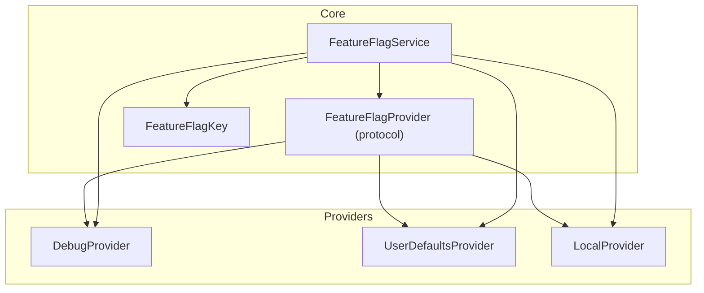
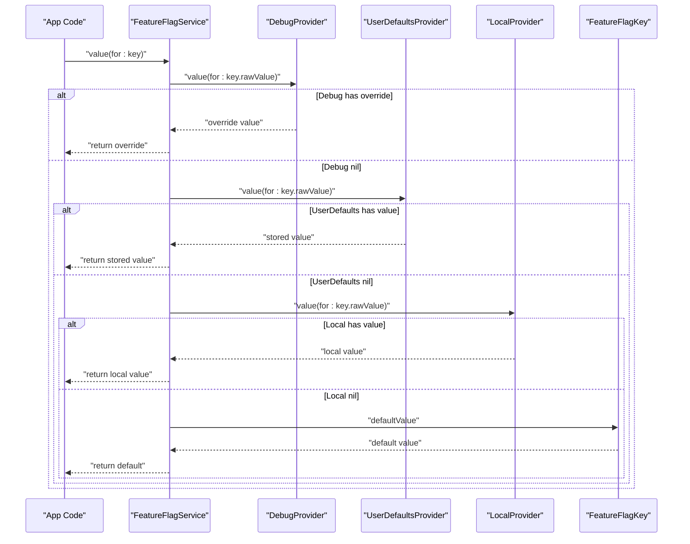
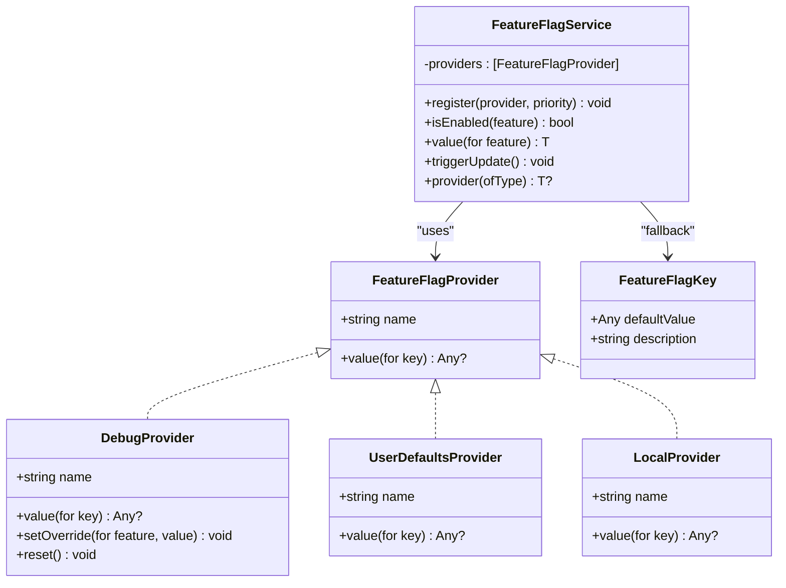

# Built-in Providers

<cite>
**Referenced Files in This Document**
- [DebugProvider.swift](file://Sources/TGFeatureFlag/Providers/DebugProvider.swift)
- [UserDefaultsProvider.swift](file://Sources/TGFeatureFlag/Providers/UserDefaultsProvider.swift)
- [LocalProvider.swift](file://Sources/TGFeatureFlag/Providers/LocalProvider.swift)
- [FeatureFlagProvider.swift](file://Sources/TGFeatureFlag/Core/FeatureFlagProvider.swift)
- [FeatureFlagService.swift](file://Sources/TGFeatureFlag/Core/FeatureFlagService.swift)
- [FeatureFlagKey.swift](file://Sources/TGFeatureFlag/Core/FeatureFlagKey.swift)
- [README.md](file://README.md)
</cite>

## Table of Contents
1. [Introduction](#introduction)
2. [Project Structure](#project-structure)
3. [Core Components](#core-components)
4. [Architecture Overview](#architecture-overview)
5. [Detailed Component Analysis](#detailed-component-analysis)
6. [Dependency Analysis](#dependency-analysis)
7. [Performance Considerations](#performance-considerations)
8. [Troubleshooting Guide](#troubleshooting-guide)
9. [Conclusion](#conclusion)

## Introduction
This document explains the built-in provider implementations for TGFeatureFlag: DebugProvider, UserDefaultsProvider, and LocalProvider. It covers configuration options, thread safety guarantees, performance characteristics, appropriate use cases, setup examples, common patterns, and troubleshooting guidance. It also clarifies how providers participate in the priority chain managed by FeatureFlagService and when to choose each provider.

## Project Structure
The provider implementations live under Sources/TGFeatureFlag/Providers and are consumed via the core service and protocol definitions under Sources/TGFeatureFlag/Core. The README provides usage examples and high-level architecture context.

**Diagram sources**
- [FeatureFlagProvider.swift:1-18](file://Sources/TGFeatureFlag/Core/FeatureFlagProvider.swift#L1-L18)
- [FeatureFlagService.swift:1-94](file://Sources/TGFeatureFlag/Core/FeatureFlagService.swift#L1-L94)
- [FeatureFlagKey.swift:1-37](file://Sources/TGFeatureFlag/Core/FeatureFlagKey.swift#L1-L37)
- [DebugProvider.swift:1-38](file://Sources/TGFeatureFlag/Providers/DebugProvider.swift#L1-L38)
- [UserDefaultsProvider.swift:1-26](file://Sources/TGFeatureFlag/Providers/UserDefaultsProvider.swift#L1-L26)
- [LocalProvider.swift:1-28](file://Sources/TGFeatureFlag/Providers/LocalProvider.swift#L1-L28)

**Section sources**
- [README.md:1-150](file://README.md#L1-L150)

## Core Components
- FeatureFlagProvider defines a minimal interface with a name and value(for:) method. Implementations can be chained and queried by FeatureFlagService.
- FeatureFlagService maintains an ordered list of providers and resolves values by iterating through them in priority order. If no provider returns a value, it falls back to the default value defined on the FeatureFlagKey.
- FeatureFlagKey defines the identity and default value for each flag.

Key behaviors:
- Priority resolution: First provider returning a non-nil value wins.
- Type casting: The requested type must match the stored value; otherwise, a runtime error occurs.
- Observation integration: UI updates automatically when flags change (e.g., via UserDefaults notifications).

**Section sources**
- [FeatureFlagProvider.swift:1-18](file://Sources/TGFeatureFlag/Core/FeatureFlagProvider.swift#L1-L18)
- [FeatureFlagService.swift:1-94](file://Sources/TGFeatureFlag/Core/FeatureFlagService.swift#L1-L94)
- [FeatureFlagKey.swift:1-37](file://Sources/TGFeatureFlag/Core/FeatureFlagKey.swift#L1-L37)

## Architecture Overview
The priority chain is central to how providers work together. When you request a feature flag value, FeatureFlagService checks providers in registration order (highest priority first). The first provider that returns a non-nil value determines the result. If none provide a value, the default from FeatureFlagKey is used.

**Diagram sources**
- [FeatureFlagService.swift:52-82](file://Sources/TGFeatureFlag/Core/FeatureFlagService.swift#L52-L82)
- [FeatureFlagKey.swift:21-32](file://Sources/TGFeatureFlag/Core/FeatureFlagKey.swift#L21-L32)
- [DebugProvider.swift:14-29](file://Sources/TGFeatureFlag/Providers/DebugProvider.swift#L14-L29)
- [UserDefaultsProvider.swift:20-24](file://Sources/TGFeatureFlag/Providers/UserDefaultsProvider.swift#L20-L24)
- [LocalProvider.swift:24-26](file://Sources/TGFeatureFlag/Providers/LocalProvider.swift#L24-L26)

## Detailed Component Analysis

### DebugProvider
Purpose:
- Provides mutable, runtime overrides intended for development and testing.
- Allows toggling feature flags without rebuilding or redeploying.

Configuration options:
- No constructor parameters required.
- Use setOverride(for:value:) to add or remove overrides per FeatureFlagKey.
- Use reset() to clear all overrides.

Thread safety:
- Uses a lock around reads and writes to ensure safe concurrent access.
- Marked Sendable for cross-thread usage.

Performance characteristics:
- O(1) dictionary lookup and mutation.
- Minimal overhead; suitable for frequent reads/writes during development.

Use cases:
- Rapid iteration while developing features.
- QA and manual testing scenarios where quick toggles are needed.
- Temporary overrides that should not persist across app launches.

Setup example:
- Register with highest priority so it always takes precedence over other providers.
- Integrate with a debug UI to toggle flags at runtime.

Common configuration patterns:
- Initialize once at app startup and register with .highest priority.
- Provide a developer menu entry to open a debug view that manipulates this provider.

Troubleshooting:
- If overrides do not appear, verify registration order and that the same FeatureFlagKey raw value is used consistently.
- Ensure reset() is not called inadvertently after setting overrides.

**Section sources**
- [DebugProvider.swift:1-38](file://Sources/TGFeatureFlag/Providers/DebugProvider.swift#L1-L38)
- [FeatureFlagService.swift:43-50](file://Sources/TGFeatureFlag/Core/FeatureFlagService.swift#L43-L50)
- [README.md:66-77](file://README.md#L66-L77)

### UserDefaultsProvider
Purpose:
- Reads feature flags from UserDefaults, enabling persistence across app launches.
- Integrates naturally with Settings.bundle or user defaults-based settings screens.

Configuration options:
- Accepts a custom UserDefaults instance (e.g., shared group defaults).
- Optional display name for debugging and logging.

Thread safety:
- UserDefaults is thread-safe for basic operations; this provider delegates storage to UserDefaults.
- Marked Sendable for cross-thread usage.

Performance characteristics:
- O(1) read from UserDefaults.
- Very low overhead; ideal for frequently accessed configuration.

Use cases:
- Persisting user preferences for feature flags.
- Exposing flags via system Settings or in-app settings UI.
- Lightweight configuration that does not require network calls.

Setup example:
- Register with higher priority than local defaults but lower than DebugProvider.
- Optionally pass a shared group UserDefaults for multi-app or extension sharing.

Common configuration patterns:
- Store boolean flags for feature visibility and string/int/double for configuration values.
- Keep keys aligned with FeatureFlagKey raw values.

Integration notes:
- FeatureFlagService observes UserDefaults changes and triggers UI updates automatically.

Troubleshooting:
- If values do not update in UI, ensure the UserDefaults instance matches what is being observed and that the notification is delivered on the main queue.
- Verify that the stored types match the expected types requested by FeatureFlagService.

**Section sources**
- [UserDefaultsProvider.swift:1-26](file://Sources/TGFeatureFlag/Providers/UserDefaultsProvider.swift#L1-L26)
- [FeatureFlagService.swift:18-33](file://Sources/TGFeatureFlag/Core/FeatureFlagService.swift#L18-L33)
- [README.md:69-72](file://README.md#L69-L72)

### LocalProvider
Purpose:
- In-memory fallback values backed by a dictionary.
- Useful for initial configuration or environment-specific defaults.

Configuration options:
- Initialize with a dictionary mapping keys to values.
- Convenience initializer to enable a set of FeatureFlagKey instances (sets their values to true).

Thread safety:
- Immutable after initialization; reads are inherently safe.
- Not marked Sendable; intended for single-threaded or immutable usage patterns.

Performance characteristics:
- O(1) dictionary lookup.
- Extremely fast with no I/O overhead.

Use cases:
- Providing baseline values for development or test environments.
- Supplying static configuration that rarely changes.
- Acting as a last-resort fallback before relying on FeatureFlagKey defaults.

Setup example:
- Register with lowest priority if you want it to act as a fallback behind UserDefaults and DebugProvider.
- Often unnecessary if you rely solely on FeatureFlagKey.defaultValue.

Common configuration patterns:
- Use enabledFeatures initializer to quickly enable a subset of flags for a specific build or environment.
- Combine with environment-specific launch arguments to select different LocalProvider configurations.

Troubleshooting:
- If values are missing, confirm that keys match FeatureFlagKey raw values exactly.
- Remember that LocalProvider only applies if no higher-priority provider returned a value.

**Section sources**
- [LocalProvider.swift:1-28](file://Sources/TGFeatureFlag/Providers/LocalProvider.swift#L1-L28)
- [FeatureFlagService.swift:63-82](file://Sources/TGFeatureFlag/Core/FeatureFlagService.swift#L63-L82)

## Dependency Analysis
Providers implement the FeatureFlagProvider protocol and are consumed by FeatureFlagService. The service orchestrates resolution order and integrates with SwiftUI observation.

**Diagram sources**
- [FeatureFlagProvider.swift:1-18](file://Sources/TGFeatureFlag/Core/FeatureFlagProvider.swift#L1-L18)
- [DebugProvider.swift:1-38](file://Sources/TGFeatureFlag/Providers/DebugProvider.swift#L1-L38)
- [UserDefaultsProvider.swift:1-26](file://Sources/TGFeatureFlag/Providers/UserDefaultsProvider.swift#L1-L26)
- [LocalProvider.swift:1-28](file://Sources/TGFeatureFlag/Providers/LocalProvider.swift#L1-L28)
- [FeatureFlagService.swift:1-94](file://Sources/TGFeatureFlag/Core/FeatureFlagService.swift#L1-L94)
- [FeatureFlagKey.swift:1-37](file://Sources/TGFeatureFlag/Core/FeatureFlagKey.swift#L1-L37)

**Section sources**
- [FeatureFlagService.swift:1-94](file://Sources/TGFeatureFlag/Core/FeatureFlagService.swift#L1-L94)
- [FeatureFlagProvider.swift:1-18](file://Sources/TGFeatureFlag/Core/FeatureFlagProvider.swift#L1-L18)

## Performance Considerations
- DebugProvider: Fastest due to in-memory dictionary and lock-based synchronization. Best for frequent reads/writes during development.
- UserDefaultsProvider: Low overhead with persistent storage. Suitable for most production configuration needs.
- LocalProvider: Zero I/O, extremely fast. Ideal for static or environment-specific defaults.
- Resolution cost: Linear scan over registered providers until a non-nil value is found. Keep the number of providers small and order meaningful to minimize lookups.

[No sources needed since this section provides general guidance]

## Troubleshooting Guide
- Type mismatch errors:
  - Symptom: Runtime error indicating expected type differs from default value type.
  - Cause: Requested type does not match the actual stored/default value type.
  - Fix: Ensure FeatureFlagKey.defaultValue and stored values match the requested type.

- Values not updating in UI:
  - Symptom: UI does not reflect new UserDefaults values.
  - Cause: Notification not observed or wrong UserDefaults instance.
  - Fix: Confirm FeatureFlagService observes UserDefaults.didChangeNotification and uses the same instance.

- Overrides not taking effect:
  - Symptom: DebugProvider overrides ignored.
  - Cause: Provider registered with lower priority than another provider that returns a value.
  - Fix: Register DebugProvider with .highest priority.

- Missing keys:
  - Symptom: Flags resolve to unexpected defaults.
  - Cause: Keys do not match FeatureFlagKey raw values.
  - Fix: Align keys across providers and FeatureFlagKey definitions.

**Section sources**
- [FeatureFlagService.swift:73-82](file://Sources/TGFeatureFlag/Core/FeatureFlagService.swift#L73-L82)
- [FeatureFlagService.swift:18-33](file://Sources/TGFeatureFlag/Core/FeatureFlagService.swift#L18-L33)
- [FeatureFlagService.swift:43-50](file://Sources/TGFeatureFlag/Core/FeatureFlagService.swift#L43-L50)

## Conclusion
Choose DebugProvider for rapid, temporary overrides during development and testing. Use UserDefaultsProvider for persistent, user-configurable settings. Prefer LocalProvider for static, in-memory defaults or environment-specific baselines. Register them in priority order—Debug > UserDefaults > Local—and rely on FeatureFlagKey.defaultValue as the final fallback. This combination yields a flexible, type-safe, and observable feature flag system suited for both development and production workflows.