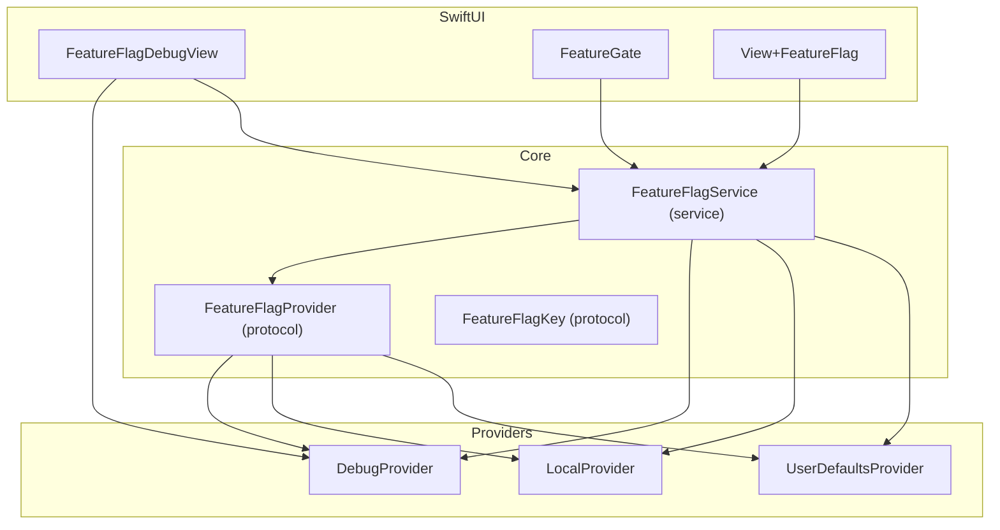
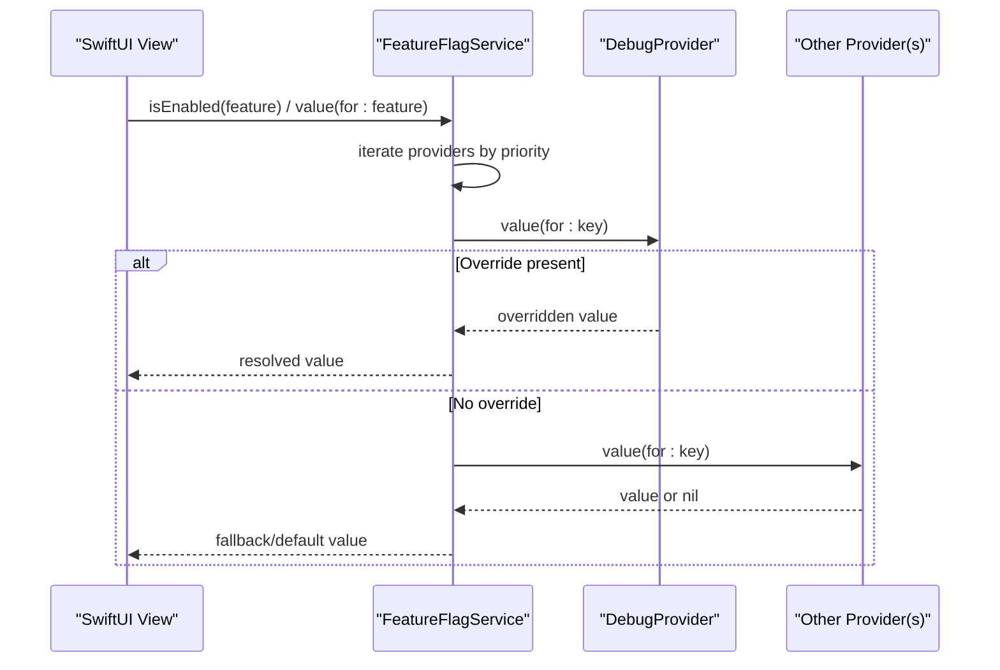
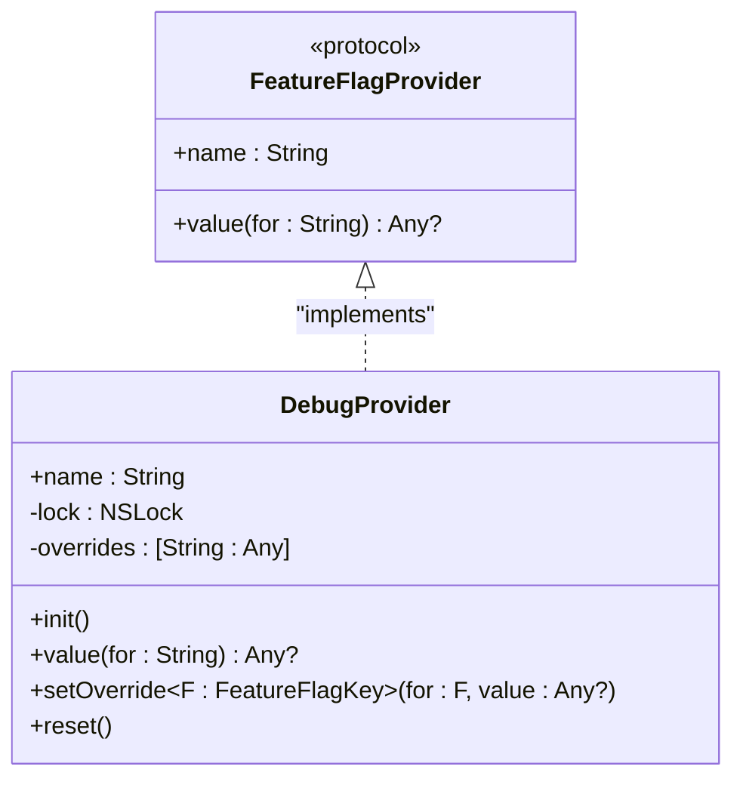
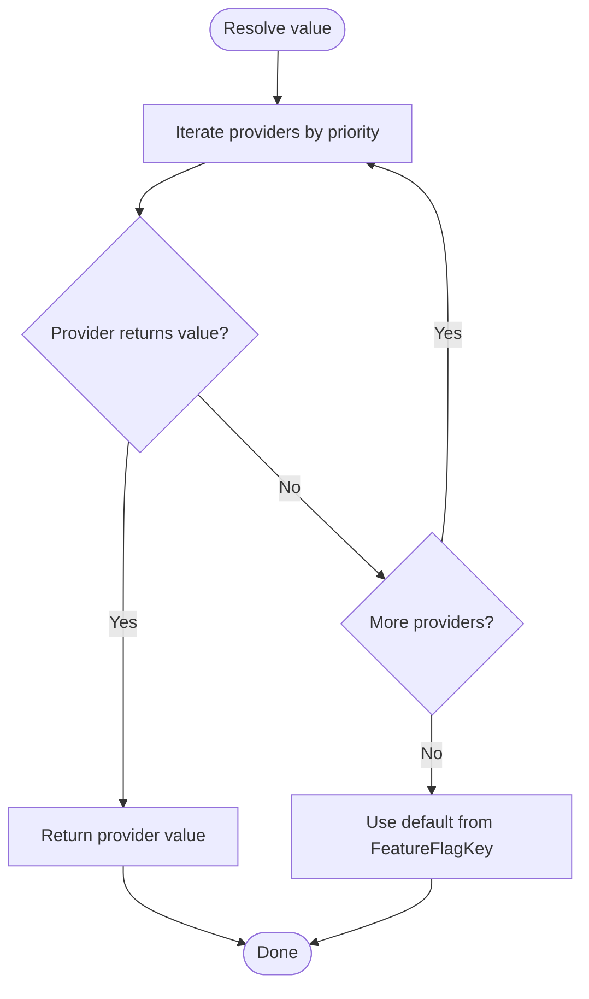
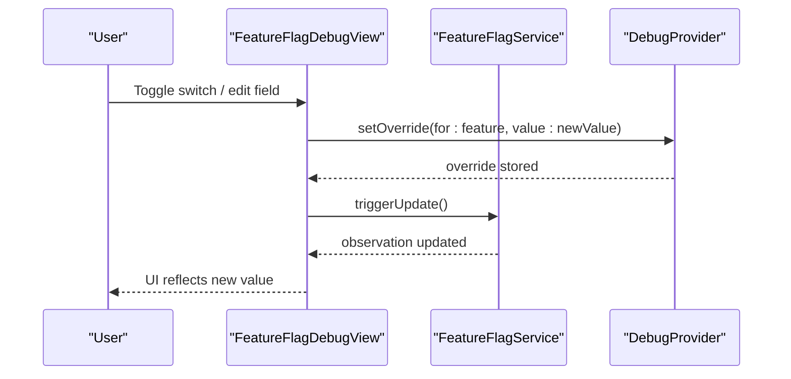
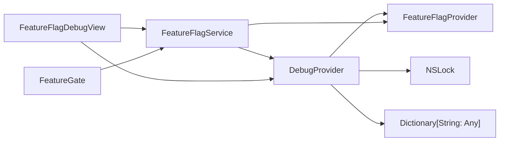

# DebugProvider

<cite>
**Referenced Files in This Document**
- [DebugProvider.swift](file://Sources/TGFeatureFlag/Providers/DebugProvider.swift)
- [FeatureFlagProvider.swift](file://Sources/TGFeatureFlag/Core/FeatureFlagProvider.swift)
- [FeatureFlagService.swift](file://Sources/TGFeatureFlag/Core/FeatureFlagService.swift)
- [FeatureFlagKey.swift](file://Sources/TGFeatureFlag/Core/FeatureFlagKey.swift)
- [FeatureFlagDebugView.swift](file://Sources/TGFeatureFlag/SwiftUI/FeatureFlagDebugView.swift)
- [FeatureGate.swift](file://Sources/TGFeatureFlag/SwiftUI/FeatureGate.swift)
- [View+FeatureFlag.swift](file://Sources/TGFeatureFlag/SwiftUI/View+FeatureFlag.swift)
- [TGFeatureFlagTests.swift](file://Tests/TGFeatureFlagTests/TGFeatureFlagTests.swift)
</cite>

## Table of Contents
1. [Introduction](#introduction)
2. [Project Structure](#project-structure)
3. [Core Components](#core-components)
4. [Architecture Overview](#architecture-overview)
5. [Detailed Component Analysis](#detailed-component-analysis)
6. [Dependency Analysis](#dependency-analysis)
7. [Performance Considerations](#performance-considerations)
8. [Troubleshooting Guide](#troubleshooting-guide)
9. [Conclusion](#conclusion)
10. [Appendices](#appendices)

## Introduction
This document explains the DebugProvider implementation and how it enables runtime toggling of feature flags during development and testing. It covers:
- The thread-safe override mechanism using NSLock
- Dynamic flag modification via setOverride
- Reset functionality to clear all overrides
- Practical examples for programmatic setup and UI integration
- Best practices for development workflows
- Thread safety guarantees, performance implications, and where DebugProvider fits in the provider priority chain

## Project Structure
The DebugProvider is part of a modular feature flag system with a pluggable provider architecture. Key modules include:
- Core protocol and service that orchestrate providers
- Providers including DebugProvider for runtime overrides
- SwiftUI helpers for conditional rendering and a debug UI

**Diagram sources**
- [FeatureFlagProvider.swift:1-18](file://Sources/TGFeatureFlag/Core/FeatureFlagProvider.swift#L1-L18)
- [FeatureFlagService.swift:1-94](file://Sources/TGFeatureFlag/Core/FeatureFlagService.swift#L1-L94)
- [FeatureFlagKey.swift:1-37](file://Sources/TGFeatureFlag/Core/FeatureFlagKey.swift#L1-L37)
- [DebugProvider.swift:1-38](file://Sources/TGFeatureFlag/Providers/DebugProvider.swift#L1-L38)
- [FeatureFlagDebugView.swift:1-214](file://Sources/TGFeatureFlag/SwiftUI/FeatureFlagDebugView.swift#L1-L214)
- [FeatureGate.swift:1-49](file://Sources/TGFeatureFlag/SwiftUI/FeatureGate.swift#L1-L49)
- [View+FeatureFlag.swift:1-10](file://Sources/TGFeatureFlag/SwiftUI/View+FeatureFlag.swift#L1-L10)

**Section sources**
- [FeatureFlagProvider.swift:1-18](file://Sources/TGFeatureFlag/Core/FeatureFlagProvider.swift#L1-L18)
- [FeatureFlagService.swift:1-94](file://Sources/TGFeatureFlag/Core/FeatureFlagService.swift#L1-L94)
- [FeatureFlagKey.swift:1-37](file://Sources/TGFeatureFlag/Core/FeatureFlagKey.swift#L1-L37)
- [DebugProvider.swift:1-38](file://Sources/TGFeatureFlag/Providers/DebugProvider.swift#L1-L38)
- [FeatureFlagDebugView.swift:1-214](file://Sources/TGFeatureFlag/SwiftUI/FeatureFlagDebugView.swift#L1-L214)
- [FeatureGate.swift:1-49](file://Sources/TGFeatureFlag/SwiftUI/FeatureGate.swift#L1-L49)
- [View+FeatureFlag.swift:1-10](file://Sources/TGFeatureFlag/SwiftUI/View+FeatureFlag.swift#L1-L10)

## Core Components
- FeatureFlagProvider: Defines the contract for any source of feature flag values. Implementations include DebugProvider, LocalProvider, UserDefaultsProvider, etc.
- FeatureFlagService: Central manager that aggregates multiple providers by priority, resolves typed values, and integrates with SwiftUI’s Observation framework to update views when values change.
- FeatureFlagKey: Protocol for defining feature flags with raw keys and default values.
- DebugProvider: Mutable provider for debug builds that allows runtime overrides with thread-safe storage.
- SwiftUI helpers: FeatureGate for conditional rendering and FeatureFlagDebugView for live editing of flags.

**Section sources**
- [FeatureFlagProvider.swift:1-18](file://Sources/TGFeatureFlag/Core/FeatureFlagProvider.swift#L1-L18)
- [FeatureFlagService.swift:1-94](file://Sources/TGFeatureFlag/Core/FeatureFlagService.swift#L1-L94)
- [FeatureFlagKey.swift:1-37](file://Sources/TGFeatureFlag/Core/FeatureFlagKey.swift#L1-L37)
- [DebugProvider.swift:1-38](file://Sources/TGFeatureFlag/Providers/DebugProvider.swift#L1-L38)
- [FeatureGate.swift:1-49](file://Sources/TGFeatureFlag/SwiftUI/FeatureGate.swift#L1-L49)
- [FeatureFlagDebugView.swift:1-214](file://Sources/TGFeatureFlag/SwiftUI/FeatureFlagDebugView.swift#L1-L214)

## Architecture Overview
DebugProvider plugs into the provider chain managed by FeatureFlagService. When a value is requested, the service iterates through registered providers in priority order until one returns a non-nil value. DebugProvider has highest priority when registered as such, allowing developers to override any downstream provider (e.g., Local or Remote).

**Diagram sources**
- [FeatureFlagService.swift:52-82](file://Sources/TGFeatureFlag/Core/FeatureFlagService.swift#L52-L82)
- [DebugProvider.swift:14-29](file://Sources/TGFeatureFlag/Providers/DebugProvider.swift#L14-L29)

## Detailed Component Analysis

### DebugProvider
DebugProvider provides a mutable store for feature flag overrides intended for debug builds. It implements the FeatureFlagProvider protocol and exposes:
- name: A human-readable identifier used by the service and UI.
- value(for:): Returns an override if present, otherwise nil.
- setOverride(for:value:): Adds or removes an override for a given feature flag key. Passing nil removes the override.
- reset(): Clears all overrides.

Thread safety:
- All read and write operations are guarded by an NSLock instance to ensure safe concurrent access from multiple threads.
- Each method locks before accessing the internal dictionary and unlocks afterward using defer.

Data model:
- Internal storage is a dictionary keyed by feature flag string identifiers mapping to Any values.

Lifecycle:
- Initialize with init() and register with FeatureFlagService at app startup.
- Use setOverride to toggle flags at runtime; use reset to clear all overrides.

**Diagram sources**
- [FeatureFlagProvider.swift:1-18](file://Sources/TGFeatureFlag/Core/FeatureFlagProvider.swift#L1-L18)
- [DebugProvider.swift:1-38](file://Sources/TGFeatureFlag/Providers/DebugProvider.swift#L1-L38)

**Section sources**
- [DebugProvider.swift:1-38](file://Sources/TGFeatureFlag/Providers/DebugProvider.swift#L1-L38)

### Integration with FeatureFlagService
FeatureFlagService maintains a list of providers ordered by priority. When resolving a value:
- It reads each provider in order and returns the first non-nil result.
- If no provider returns a value, it falls back to the default defined on the FeatureFlagKey.
- It uses Observation to notify SwiftUI views when values change.

Priority behavior:
- Register DebugProvider with .highest to ensure its overrides take precedence over other providers.
- Register other providers (e.g., LocalProvider, UserDefaultsProvider) with lower priorities.

**Diagram sources**
- [FeatureFlagService.swift:52-82](file://Sources/TGFeatureFlag/Core/FeatureFlagService.swift#L52-L82)

**Section sources**
- [FeatureFlagService.swift:1-94](file://Sources/TGFeatureFlag/Core/FeatureFlagService.swift#L1-L94)

### SwiftUI Integration and Live Testing
FeatureFlagDebugView provides a user interface to inspect and modify feature flags at runtime. It:
- Reads current values via FeatureFlagService
- Uses DebugProvider to apply overrides
- Triggers UI updates after changes

Editors support Bool, Int, Double, and String types based on the default value type. An indicator shows when an override is active, and a reset button clears all overrides.

**Diagram sources**
- [FeatureFlagDebugView.swift:1-214](file://Sources/TGFeatureFlag/SwiftUI/FeatureFlagDebugView.swift#L1-L214)
- [FeatureFlagService.swift:84-87](file://Sources/TGFeatureFlag/Core/FeatureFlagService.swift#L84-L87)

**Section sources**
- [FeatureFlagDebugView.swift:1-214](file://Sources/TGFeatureFlag/SwiftUI/FeatureFlagDebugView.swift#L1-L214)

### Conditional Rendering with FeatureGate
FeatureGate renders different content depending on whether a feature flag is enabled. It observes FeatureFlagService so changes made via DebugProvider automatically re-render the view.

**Section sources**
- [FeatureGate.swift:1-49](file://Sources/TGFeatureFlag/SwiftUI/FeatureGate.swift#L1-L49)

### Programmatic Setup Examples
Examples below reference concrete usage patterns found in tests and demo code. They demonstrate:
- Creating a DebugProvider
- Registering it with highest priority
- Setting and removing overrides
- Verifying resolution order

See:
- Priority chain verification and override removal
- String and Int value handling
- UserDefaults integration alongside DebugProvider

**Section sources**
- [TGFeatureFlagTests.swift:32-54](file://Tests/TGFeatureFlagTests/TGFeatureFlagTests.swift#L32-L54)
- [TGFeatureFlagTests.swift:58-92](file://Tests/TGFeatureFlagTests/TGFeatureFlagTests.swift#L58-L92)
- [TGFeatureFlagTests.swift:96-122](file://Tests/TGFeatureFlagTests/TGFeatureFlagTests.swift#L96-L122)

## Dependency Analysis
DebugProvider depends on Foundation for NSLock and Dictionary. It conforms to FeatureFlagProvider and is consumed by FeatureFlagService and SwiftUI components.

**Diagram sources**
- [DebugProvider.swift:1-38](file://Sources/TGFeatureFlag/Providers/DebugProvider.swift#L1-L38)
- [FeatureFlagProvider.swift:1-18](file://Sources/TGFeatureFlag/Core/FeatureFlagProvider.swift#L1-L18)
- [FeatureFlagService.swift:1-94](file://Sources/TGFeatureFlag/Core/FeatureFlagService.swift#L1-L94)
- [FeatureFlagDebugView.swift:1-214](file://Sources/TGFeatureFlag/SwiftUI/FeatureFlagDebugView.swift#L1-L214)
- [FeatureGate.swift:1-49](file://Sources/TGFeatureFlag/SwiftUI/FeatureGate.swift#L1-L49)

**Section sources**
- [DebugProvider.swift:1-38](file://Sources/TGFeatureFlag/Providers/DebugProvider.swift#L1-L38)
- [FeatureFlagService.swift:1-94](file://Sources/TGFeatureFlag/Core/FeatureFlagService.swift#L1-L94)

## Performance Considerations
- Lock overhead: Each access to DebugProvider acquires and releases an NSLock. For typical development usage, this overhead is negligible. Avoid excessive hot-path calls in tight loops if possible.
- Value resolution cost: FeatureFlagService iterates providers in order. With DebugProvider at highest priority, most lookups will short-circuit quickly when overrides exist.
- UI updates: Changes via DebugProvider require triggering updates. The debug UI calls triggerUpdate to propagate changes to SwiftUI views. Ensure you call triggerUpdate after modifying overrides programmatically outside the debug UI.

[No sources needed since this section provides general guidance]

## Troubleshooting Guide
Common issues and resolutions:
- Overrides not taking effect:
  - Ensure DebugProvider is registered with highest priority.
  - Verify setOverride was called with the correct feature key and value.
  - Call service.triggerUpdate() after programmatic changes to refresh UI.
- Type mismatches:
  - The service expects values to match the requested type. Defaults are provided by FeatureFlagKey. Mismatches can cause fatal errors in debug builds.
- Thread safety:
  - All public methods are thread-safe due to NSLock. Do not bypass these APIs to mutate internal state directly.
- Resetting state:
  - Use reset() to clear all overrides. The debug UI includes a reset button for convenience.

**Section sources**
- [FeatureFlagService.swift:52-82](file://Sources/TGFeatureFlag/Core/FeatureFlagService.swift#L52-L82)
- [FeatureFlagService.swift:84-87](file://Sources/TGFeatureFlag/Core/FeatureFlagService.swift#L84-L87)
- [DebugProvider.swift:20-36](file://Sources/TGFeatureFlag/Providers/DebugProvider.swift#L20-L36)

## Conclusion
DebugProvider offers a simple, thread-safe way to override feature flags at runtime during development and testing. By registering it with the highest priority, developers can confidently test alternate behaviors without changing production code. Combined with SwiftUI helpers like FeatureGate and FeatureFlagDebugView, it enables rapid iteration and live testing. Follow best practices around priority registration, explicit triggerUpdate calls, and careful type management to maintain reliability and performance.

[No sources needed since this section summarizes without analyzing specific files]

## Appendices

### Best Practices for Development Workflows
- Register DebugProvider with highest priority at app startup.
- Use FeatureFlagDebugView for interactive testing; rely on its built-in reset functionality.
- When setting overrides programmatically, always call service.triggerUpdate() to refresh UI.
- Keep overrides minimal and scoped to specific features under test.
- Remove or reset overrides before shipping to avoid unintended behavior.

[No sources needed since this section provides general guidance]