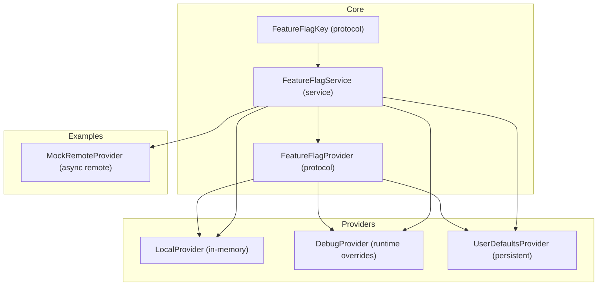
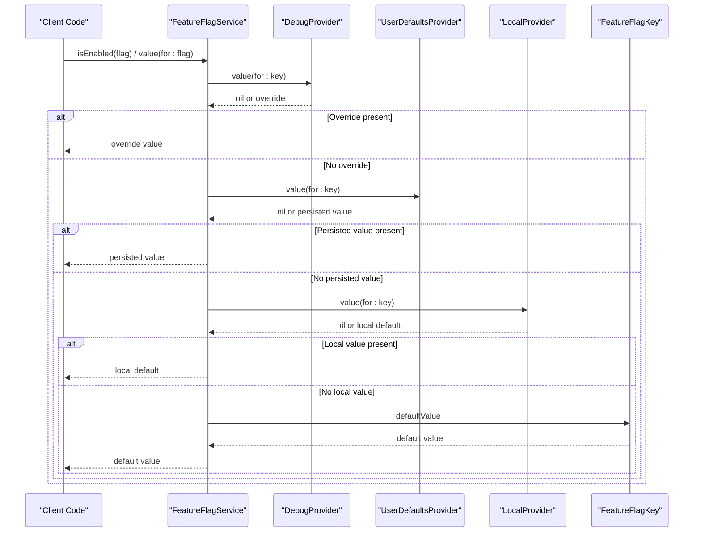
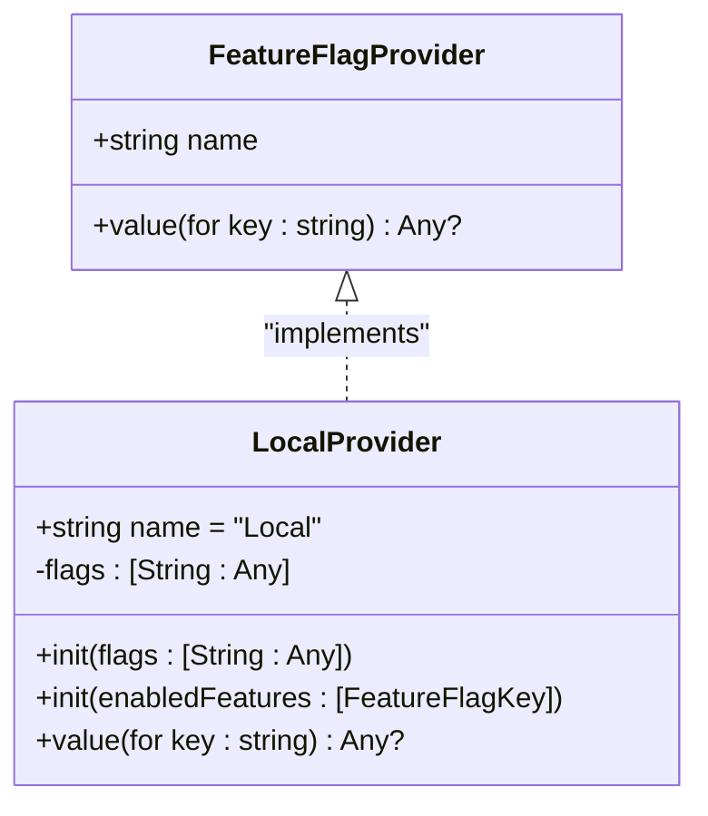
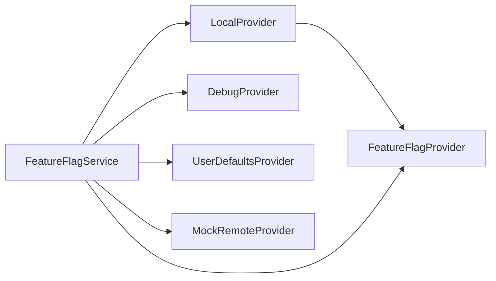

# LocalProvider

<cite>
**Referenced Files in This Document**
- [LocalProvider.swift](file://Sources/TGFeatureFlag/Providers/LocalProvider.swift)
- [FeatureFlagProvider.swift](file://Sources/TGFeatureFlag/Core/FeatureFlagProvider.swift)
- [FeatureFlagService.swift](file://Sources/TGFeatureFlag/Core/FeatureFlagService.swift)
- [FeatureFlagKey.swift](file://Sources/TGFeatureFlag/Core/FeatureFlagKey.swift)
- [DebugProvider.swift](file://Sources/TGFeatureFlag/Providers/DebugProvider.swift)
- [UserDefaultsProvider.swift](file://Sources/TGFeatureFlag/Providers/UserDefaultsProvider.swift)
- [TGFeatureFlagTests.swift](file://Tests/TGFeatureFlagTests/TGFeatureFlagTests.swift)
- [MockRemoteProvider.swift](file://Example/TGFeatureFlagDemo/TGFeatureFlagDemo/MockRemoteProvider.swift)
- [README.md](file://README.md)
</cite>

## Table of Contents
1. [Introduction](#introduction)
2. [Project Structure](#project-structure)
3. [Core Components](#core-components)
4. [Architecture Overview](#architecture-overview)
5. [Detailed Component Analysis](#detailed-component-analysis)
6. [Dependency Analysis](#dependency-analysis)
7. [Performance Considerations](#performance-considerations)
8. [Troubleshooting Guide](#troubleshooting-guide)
9. [Conclusion](#conclusion)
10. [Appendices](#appendices)

## Introduction
This document explains the LocalProvider implementation and how it serves as an in-memory fallback provider for default values and testing scenarios within the TGFeatureFlag framework. It covers initialization patterns, memory characteristics, lifecycle considerations, environment configuration strategies, unit testing usage, combining with other providers, performance benefits, and appropriate scenarios for local-only configurations.

## Project Structure
The LocalProvider is part of a provider-based feature flag system:
- Providers implement a common protocol to supply flag values.
- The service orchestrates resolution across multiple providers by priority.
- Keys define identity and defaults.

**Diagram sources**
- [FeatureFlagProvider.swift:1-18](file://Sources/TGFeatureFlag/Core/FeatureFlagProvider.swift#L1-L18)
- [LocalProvider.swift:1-28](file://Sources/TGFeatureFlag/Providers/LocalProvider.swift#L1-L28)
- [FeatureFlagService.swift:1-195](file://Sources/TGFeatureFlag/Core/FeatureFlagService.swift#L1-L195)
- [FeatureFlagKey.swift:1-37](file://Sources/TGFeatureFlag/Core/FeatureFlagKey.swift#L1-L37)
- [DebugProvider.swift:1-38](file://Sources/TGFeatureFlag/Providers/DebugProvider.swift#L1-L38)
- [UserDefaultsProvider.swift:1-28](file://Sources/TGFeatureFlag/Providers/UserDefaultsProvider.swift#L1-L28)
- [MockRemoteProvider.swift:1-50](file://Example/TGFeatureFlagDemo/TGFeatureFlagDemo/MockRemoteProvider.swift#L1-L50)

**Section sources**
- [FeatureFlagProvider.swift:1-18](file://Sources/TGFeatureFlag/Core/FeatureFlagProvider.swift#L1-L18)
- [FeatureFlagService.swift:1-195](file://Sources/TGFeatureFlag/Core/FeatureFlagService.swift#L1-L195)
- [FeatureFlagKey.swift:1-37](file://Sources/TGFeatureFlag/Core/FeatureFlagKey.swift#L1-L37)
- [LocalProvider.swift:1-28](file://Sources/TGFeatureFlag/Providers/LocalProvider.swift#L1-L28)

## Core Components
- FeatureFlagProvider: Defines the interface for all providers, including name and value retrieval.
- FeatureFlagService: Central manager that resolves flags by iterating through registered providers in priority order and falling back to key-defined defaults.
- FeatureFlagKey: Declares each flag’s identity and default value.
- LocalProvider: In-memory dictionary-backed provider used for initial or test-time values.

Key responsibilities:
- LocalProvider provides immediate access to preconfigured values without I/O.
- FeatureFlagService coordinates resolution and logging, supports refresh for async providers, and triggers UI updates.
- FeatureFlagKey supplies safe defaults when no provider returns a value.

**Section sources**
- [FeatureFlagProvider.swift:1-18](file://Sources/TGFeatureFlag/Core/FeatureFlagProvider.swift#L1-L18)
- [FeatureFlagService.swift:1-195](file://Sources/TGFeatureFlag/Core/FeatureFlagService.swift#L1-L195)
- [FeatureFlagKey.swift:1-37](file://Sources/TGFeatureFlag/Core/FeatureFlagKey.swift#L1-L37)
- [LocalProvider.swift:1-28](file://Sources/TGFeatureFlag/Providers/LocalProvider.swift#L1-L28)

## Architecture Overview
LocalProvider integrates into the provider chain managed by FeatureFlagService. Resolution order is determined by registration priority; LocalProvider typically sits at low priority so higher-priority providers (e.g., DebugProvider, UserDefaultsProvider, RemoteConfig) can override its values. If no provider returns a value, the service falls back to the default defined on the FeatureFlagKey.

**Diagram sources**
- [FeatureFlagService.swift:109-151](file://Sources/TGFeatureFlag/Core/FeatureFlagService.swift#L109-L151)
- [LocalProvider.swift:24-26](file://Sources/TGFeatureFlag/Providers/LocalProvider.swift#L24-L26)
- [FeatureFlagKey.swift:21-32](file://Sources/TGFeatureFlag/Core/FeatureFlagKey.swift#L21-L32)

## Detailed Component Analysis

### LocalProvider Implementation
LocalProvider is a lightweight, thread-safe struct backed by an in-memory dictionary. It implements the provider protocol and exposes two convenient initializers:
- Dictionary-based initialization for explicit key-value pairs.
- Enabled features initializer that sets specific keys to true and leaves others absent.

Memory and concurrency:
- Backed by a Swift dictionary of String to Any.
- Struct type ensures value semantics; instances are immutable after creation.
- Concurrency-safe due to Sendable conformance via the underlying protocol and immutable storage.

Lifecycle:
- No external resources; created and destroyed like any Swift value.
- Ideal for embedding default configurations or test fixtures.

Resolution behavior:
- Returns the stored value if present; otherwise returns nil, allowing the service to continue up the chain or fall back to key defaults.

**Diagram sources**
- [FeatureFlagProvider.swift:3-17](file://Sources/TGFeatureFlag/Core/FeatureFlagProvider.swift#L3-L17)
- [LocalProvider.swift:5-27](file://Sources/TGFeatureFlag/Providers/LocalProvider.swift#L5-L27)

**Section sources**
- [LocalProvider.swift:1-28](file://Sources/TGFeatureFlag/Providers/LocalProvider.swift#L1-L28)

### Initialization Patterns for Embedding Defaults
Common patterns:
- Explicit dictionary mapping for full control over types and values.
- Enabled features list to quickly enable a subset of flags (others remain absent).

Use cases:
- App startup to seed baseline configuration.
- Test suites to provide predictable values.

Examples (paths only):
- Dictionary-based setup: [TGFeatureFlagTests.swift:54-56](file://Tests/TGFeatureFlagTests/TGFeatureFlagTests.swift#L54-L56)
- Enabled features setup: [TGFeatureFlagTests.swift:259-268](file://Tests/TGFeatureFlagTests/TGFeatureFlagTests.swift#L259-L268)

**Section sources**
- [LocalProvider.swift:9-22](file://Sources/TGFeatureFlag/Providers/LocalProvider.swift#L9-L22)
- [TGFeatureFlagTests.swift:54-56](file://Tests/TGFeatureFlagTests/TGFeatureFlagTests.swift#L54-L56)
- [TGFeatureFlagTests.swift:259-268](file://Tests/TGFeatureFlagTests/TGFeatureFlagTests.swift#L259-L268)

### Memory Management Characteristics
- In-memory storage avoids disk I/O and network calls.
- Minimal overhead: a single dictionary per instance.
- No background observers or timers.
- Suitable for short-lived contexts (tests) and long-lived app contexts (defaults).

Considerations:
- Keep dictionaries small to minimize memory footprint.
- Avoid storing large payloads in flags; prefer configuration endpoints for heavy data.

[No sources needed since this section provides general guidance grounded in the implementation]

### Lifecycle Considerations
- Creation: Initialize once during app bootstrap or test setup.
- Registration: Register with FeatureFlagService using desired priority.
- Destruction: As a struct, it is deallocated when no longer referenced.
- Updates: To change values, create a new instance and re-register or use higher-priority mutable providers (e.g., DebugProvider) for runtime overrides.

**Section sources**
- [FeatureFlagService.swift:89-101](file://Sources/TGFeatureFlag/Core/FeatureFlagService.swift#L89-L101)
- [LocalProvider.swift:5-12](file://Sources/TGFeatureFlag/Providers/LocalProvider.swift#L5-L12)

### Environment Configuration Examples
Strategy:
- Development: Use LocalProvider with many flags enabled for rapid iteration; optionally pair with DebugProvider for live toggles.
- Staging: Use LocalProvider with conservative defaults; rely on UserDefaultsProvider for user-driven overrides; keep RemoteConfig disabled or minimal.
- Production: Use LocalProvider with production-safe defaults; register UserDefaultsProvider for admin overrides; integrate RemoteConfig for dynamic rollout.

Registration examples (paths only):
- Highest priority debug overrides: [README.md:66-67](file://README.md#L66-L67)
- UserDefaults integration: [README.md:69-72](file://README.md#L69-L72)
- Local defaults note: [README.md:74-76](file://README.md#L74-L76)

Combining with other providers:
- Chain DebugProvider > UserDefaultsProvider > LocalProvider to allow progressive overrides.
- Add AsyncRemoteProvider (e.g., MockRemoteProvider) with highest priority to fetch and cache remote values.

**Section sources**
- [README.md:66-76](file://README.md#L66-L76)
- [MockRemoteProvider.swift:1-50](file://Example/TGFeatureFlagDemo/TGFeatureFlagDemo/MockRemoteProvider.swift#L1-L50)

### Unit Testing with Predictable Values
Benefits:
- Deterministic outcomes without external dependencies.
- Fast execution due to in-memory access.
- Easy isolation per test case.

Patterns:
- Create a LocalProvider with known values per test.
- Optionally combine with DebugProvider to assert override behavior.
- Verify logger entries to confirm which provider resolved a flag.

Test references (paths only):
- Priority chain with LocalProvider: [TGFeatureFlagTests.swift:50-72](file://Tests/TGFeatureFlagTests/TGFeatureFlagTests.swift#L50-L72)
- Custom and mixed priorities using LocalProvider: [TGFeatureFlagTests.swift:155-182](file://Tests/TGFeatureFlagTests/TGFeatureFlagTests.swift#L155-L182)
- Logger verification showing Local provider resolution: [TGFeatureFlagTests.swift:229-242](file://Tests/TGFeatureFlagTests/TGFeatureFlagTests.swift#L229-L242)
- Enabled features initializer: [TGFeatureFlagTests.swift:259-268](file://Tests/TGFeatureFlagTests/TGFeatureFlagTests.swift#L259-L268)

**Section sources**
- [TGFeatureFlagTests.swift:50-72](file://Tests/TGFeatureFlagTests/TGFeatureFlagTests.swift#L50-L72)
- [TGFeatureFlagTests.swift:155-182](file://Tests/TGFeatureFlagTests/TGFeatureFlagTests.swift#L155-L182)
- [TGFeatureFlagTests.swift:229-242](file://Tests/TGFeatureFlagTests/TGFeatureFlagTests.swift#L229-L242)
- [TGFeatureFlagTests.swift:259-268](file://Tests/TGFeatureFlagTests/TGFeatureFlagTests.swift#L259-L268)

### Combining LocalProvider with Other Providers
Typical ordering:
- Highest: DebugProvider (developer overrides)
- High: UserDefaultsProvider (user/admin settings)
- Low: LocalProvider (hardcoded defaults)
- Optional: AsyncRemoteProvider (network-fetched config)

Behavior:
- First provider returning a non-nil value wins.
- If none return a value, FeatureFlagKey.defaultValue is used.

References:
- Provider registration and priority: [FeatureFlagService.swift:89-101](file://Sources/TGFeatureFlag/Core/FeatureFlagService.swift#L89-L101)
- Resolution loop and fallback: [FeatureFlagService.swift:116-151](file://Sources/TGFeatureFlag/Core/FeatureFlagService.swift#L116-L151)

**Section sources**
- [FeatureFlagService.swift:89-101](file://Sources/TGFeatureFlag/Core/FeatureFlagService.swift#L89-L101)
- [FeatureFlagService.swift:116-151](file://Sources/TGFeatureFlag/Core/FeatureFlagService.swift#L116-L151)

## Dependency Analysis
LocalProvider depends only on Foundation and the shared provider protocol. It has no side effects and does not observe notifications or perform I/O.

**Diagram sources**
- [LocalProvider.swift:1-28](file://Sources/TGFeatureFlag/Providers/LocalProvider.swift#L1-L28)
- [FeatureFlagProvider.swift:1-18](file://Sources/TGFeatureFlag/Core/FeatureFlagProvider.swift#L1-L18)
- [FeatureFlagService.swift:1-195](file://Sources/TGFeatureFlag/Core/FeatureFlagService.swift#L1-L195)
- [DebugProvider.swift:1-38](file://Sources/TGFeatureFlag/Providers/DebugProvider.swift#L1-L38)
- [UserDefaultsProvider.swift:1-28](file://Sources/TGFeatureFlag/Providers/UserDefaultsProvider.swift#L1-L28)
- [MockRemoteProvider.swift:1-50](file://Example/TGFeatureFlagDemo/TGFeatureFlagDemo/MockRemoteProvider.swift#L1-L50)

**Section sources**
- [LocalProvider.swift:1-28](file://Sources/TGFeatureFlag/Providers/LocalProvider.swift#L1-L28)
- [FeatureFlagService.swift:1-195](file://Sources/TGFeatureFlag/Core/FeatureFlagService.swift#L1-L195)

## Performance Considerations
- In-memory access is O(1) average time complexity for dictionary lookups.
- No disk or network latency; ideal for hot paths and frequent reads.
- Minimal allocations: one dictionary per provider instance.
- Prefer LocalProvider for static defaults and tests; avoid storing large objects in flags.

[No sources needed since this section provides general guidance]

## Troubleshooting Guide
Common issues and resolutions:
- Unexpected value source: Check provider registration order and priorities. Ensure higher-priority providers do not unintentionally override expected defaults.
- Type mismatch errors: When requesting a typed value, ensure the default value type matches the requested type; mismatches trigger a fatal error path in the service.
- Missing values: If LocalProvider does not contain a key, the service will fall back to key defaults; verify key presence and spelling.
- Logging and diagnostics: Enable a logger to see which provider resolved each flag and whether defaults were used.

Relevant code paths:
- Resolution loop and logging: [FeatureFlagService.swift:116-151](file://Sources/TGFeatureFlag/Core/FeatureFlagService.swift#L116-L151)
- Safe provider access wrapper: [FeatureFlagService.swift:154-156](file://Sources/TGFeatureFlag/Core/FeatureFlagService.swift#L154-L156)
- Triggering updates (for providers that rely on notifications): [FeatureFlagService.swift:159-161](file://Sources/TGFeatureFlag/Core/FeatureFlagService.swift#L159-L161)

**Section sources**
- [FeatureFlagService.swift:116-151](file://Sources/TGFeatureFlag/Core/FeatureFlagService.swift#L116-L151)
- [FeatureFlagService.swift:154-161](file://Sources/TGFeatureFlag/Core/FeatureFlagService.swift#L154-L161)

## Conclusion
LocalProvider offers a fast, simple, and reliable way to supply in-memory defaults and deterministic test values. Combined with higher-priority providers and key-defined defaults, it enables flexible configuration strategies across environments while maintaining strong performance and predictability.

[No sources needed since this section summarizes without analyzing specific files]

## Appendices

### API Reference Summary
- LocalProvider(name: "Local"): Immutable provider backed by a dictionary.
- LocalProvider(flags: [String: Any]): Explicit key-value mapping.
- LocalProvider(enabledFeatures: [FeatureFlagKey]): Enables selected flags with true.
- value(for: String): Returns stored value or nil.

**Section sources**
- [LocalProvider.swift:5-27](file://Sources/TGFeatureFlag/Providers/LocalProvider.swift#L5-L27)

### Example References
- Priority chain and LocalProvider usage: [TGFeatureFlagTests.swift:50-72](file://Tests/TGFeatureFlagTests/TGFeatureFlagTests.swift#L50-L72)
- Mixed and custom priorities with LocalProvider: [TGFeatureFlagTests.swift:155-182](file://Tests/TGFeatureFlagTests/TGFeatureFlagTests.swift#L155-L182)
- Logger verification for Local provider: [TGFeatureFlagTests.swift:229-242](file://Tests/TGFeatureFlagTests/TGFeatureFlagTests.swift#L229-L242)
- Enabled features initializer: [TGFeatureFlagTests.swift:259-268](file://Tests/TGFeatureFlagTests/TGFeatureFlagTests.swift#L259-L268)

**Section sources**
- [TGFeatureFlagTests.swift:50-72](file://Tests/TGFeatureFlagTests/TGFeatureFlagTests.swift#L50-L72)
- [TGFeatureFlagTests.swift:155-182](file://Tests/TGFeatureFlagTests/TGFeatureFlagTests.swift#L155-L182)
- [TGFeatureFlagTests.swift:229-242](file://Tests/TGFeatureFlagTests/TGFeatureFlagTests.swift#L229-L242)
- [TGFeatureFlagTests.swift:259-268](file://Tests/TGFeatureFlagTests/TGFeatureFlagTests.swift#L259-L268)