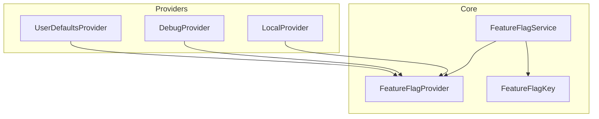
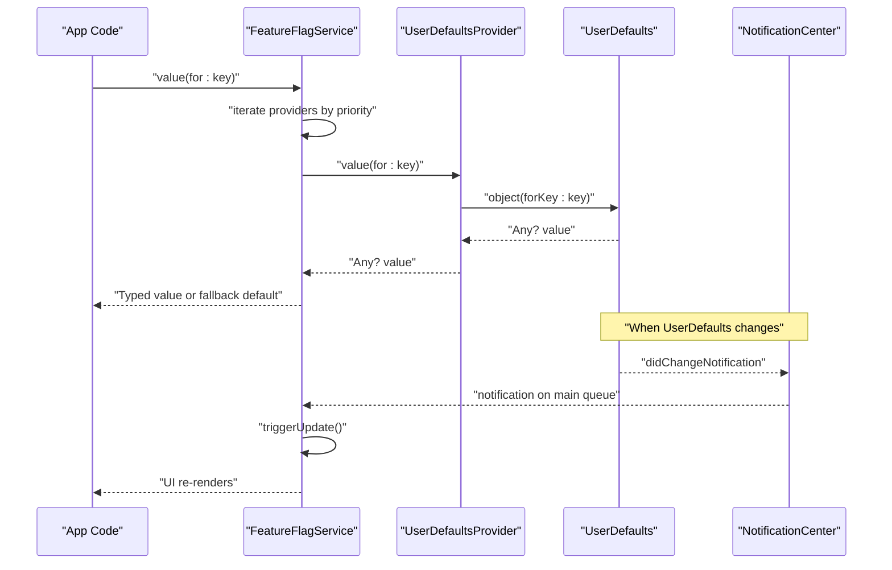
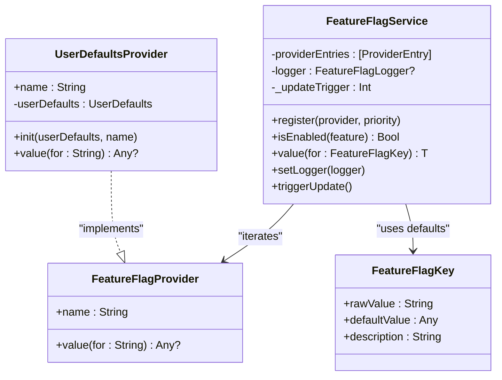

# UserDefaultsProvider

<cite>
**Referenced Files in This Document**
- [UserDefaultsProvider.swift](file://Sources/TGFeatureFlag/Providers/UserDefaultsProvider.swift)
- [FeatureFlagService.swift](file://Sources/TGFeatureFlag/Core/FeatureFlagService.swift)
- [FeatureFlagKey.swift](file://Sources/TGFeatureFlag/Core/FeatureFlagKey.swift)
- [FeatureFlagProvider.swift](file://Sources/TGFeatureFlag/Core/FeatureFlagProvider.swift)
- [README.md](file://README.md)
- [TGFeatureFlagTests.swift](file://Tests/TGFeatureFlagTests/TGFeatureFlagTests.swift)
</cite>

## Table of Contents
1. [Introduction](#introduction)
2. [Project Structure](#project-structure)
3. [Core Components](#core-components)
4. [Architecture Overview](#architecture-overview)
5. [Detailed Component Analysis](#detailed-component-analysis)
6. [Dependency Analysis](#dependency-analysis)
7. [Performance Considerations](#performance-considerations)
8. [Troubleshooting Guide](#troubleshooting-guide)
9. [Conclusion](#conclusion)
10. [Appendices](#appendices)

## Introduction
This document explains the UserDefaultsProvider implementation and how it provides persistent configuration storage using iOS/macOS UserDefaults within the TGFeatureFlag framework. It covers:
- How UserDefaultsProvider integrates with the provider chain to resolve feature flags
- The observation mechanism that automatically updates UI when values change
- Key naming conventions and data type handling
- Setup examples for different UserDefaults suites (shared and app-specific)
- Migration strategies for existing configurations
- Troubleshooting common persistence issues
- Performance considerations, threading behavior, and appropriate use cases for persistent flag storage

## Project Structure
The UserDefaultsProvider is part of a small, protocol-oriented feature flag system:
- Providers implement FeatureFlagProvider to supply values
- FeatureFlagService orchestrates resolution across providers and drives SwiftUI updates via Observation
- FeatureFlagKey defines typed keys and default values
- Tests validate integration with UserDefaults and other providers

**Diagram sources**
- [FeatureFlagProvider.swift:1-18](file://Sources/TGFeatureFlag/Core/FeatureFlagProvider.swift#L1-L18)
- [FeatureFlagKey.swift:1-37](file://Sources/TGFeatureFlag/Core/FeatureFlagKey.swift#L1-L37)
- [FeatureFlagService.swift:1-168](file://Sources/TGFeatureFlag/Core/FeatureFlagService.swift#L1-L168)
- [UserDefaultsProvider.swift:1-28](file://Sources/TGFeatureFlag/Providers/UserDefaultsProvider.swift#L1-L28)

**Section sources**
- [README.md:1-150](file://README.md#L1-L150)

## Core Components
- FeatureFlagProvider: Defines the interface for value sources. Each provider returns an optional Any value for a given key string.
- FeatureFlagKey: Declares a unique raw string identifier and a default value per flag.
- FeatureFlagService: Central manager that resolves values by iterating registered providers in priority order, falling back to defaults, and driving UI updates through Observation.
- UserDefaultsProvider: A read-only provider backed by a specific UserDefaults instance.

Key behaviors relevant to UserDefaultsProvider:
- Reads values from UserDefaults using object(forKey:)
- Integrates with the service’s observation mechanism via NotificationCenter for automatic UI updates
- Supports standard Swift types persisted by UserDefaults (Bool, String, Int, Double)

**Section sources**
- [FeatureFlagProvider.swift:1-18](file://Sources/TGFeatureFlag/Core/FeatureFlagProvider.swift#L1-L18)
- [FeatureFlagKey.swift:1-37](file://Sources/TGFeatureFlag/Core/FeatureFlagKey.swift#L1-L37)
- [FeatureFlagService.swift:1-168](file://Sources/TGFeatureFlag/Core/FeatureFlagService.swift#L1-L168)
- [UserDefaultsProvider.swift:1-28](file://Sources/TGFeatureFlag/Providers/UserDefaultsProvider.swift#L1-L28)

## Architecture Overview
The resolution flow for a flag uses a priority chain. When a value is requested:
1. FeatureFlagService iterates providers from highest to lowest priority
2. The first provider returning a non-nil value wins
3. If none provide a value, the default from FeatureFlagKey is used
4. For UserDefaults-backed flags, changes are observed via didChangeNotification, which triggers UI updates

**Diagram sources**
- [FeatureFlagService.swift:53-68](file://Sources/TGFeatureFlag/Core/FeatureFlagService.swift#L53-L68)
- [FeatureFlagService.swift:116-151](file://Sources/TGFeatureFlag/Core/FeatureFlagService.swift#L116-L151)
- [UserDefaultsProvider.swift:22-26](file://Sources/TGFeatureFlag/Providers/UserDefaultsProvider.swift#L22-L26)

## Detailed Component Analysis

### UserDefaultsProvider
Responsibilities:
- Provide a name and delegate all reads to a configured UserDefaults instance
- Return nil if a key is absent, allowing the service to fall back to lower-priority providers or defaults

Initialization options:
- Accepts a custom UserDefaults instance (e.g., shared suite) and a display name
- Defaults to .standard and a default provider name

Observation behavior:
- The provider itself does not observe changes; instead, FeatureFlagService observes UserDefaults.didChangeNotification and triggers updates

Threading and concurrency:
- Marked @unchecked Sendable based on Apple’s documentation that UserDefaults is thread-safe

Data type handling:
- Uses object(forKey:) which supports Bool, String, Int, Double, Data, Date, Array, Dictionary
- The service casts the returned Any to the expected generic type T at call sites

Key naming:
- Keys are plain strings provided by FeatureFlagKey.rawValue; there is no special prefixing enforced by the provider

Setup examples:
- App-specific UserDefaults: Use .standard (default)
- Shared group UserDefaults: Create a UserDefaults(suiteName:) and pass it to the provider

Migration strategy:
- Existing keys can be migrated by writing them into the target UserDefaults suite before registering the provider
- For shared groups, ensure the suite exists and remove any stale domains during tests or setup

Common pitfalls:
- Ensure the correct suite is used (standard vs. group)
- Avoid storing unsupported types without conversion
- Remember that UserDefaults writes may be asynchronous; rely on didChangeNotification for UI updates

**Section sources**
- [UserDefaultsProvider.swift:1-28](file://Sources/TGFeatureFlag/Providers/UserDefaultsProvider.swift#L1-L28)
- [FeatureFlagService.swift:53-68](file://Sources/TGFeatureFlag/Core/FeatureFlagService.swift#L53-L68)
- [FeatureFlagService.swift:116-151](file://Sources/TGFeatureFlag/Core/FeatureFlagService.swift#L116-L151)
- [README.md:69-77](file://README.md#L69-L77)
- [TGFeatureFlagTests.swift:114-141](file://Tests/TGFeatureFlagTests/TGFeatureFlagTests.swift#L114-L141)

### FeatureFlagService (Observation and Resolution)
Responsibilities:
- Maintain a priority-ordered list of providers
- Resolve values by iterating providers and casting to the requested type
- Observe UserDefaults changes and trigger UI updates via a version counter
- Provide logging hooks for debugging resolution paths

Resolution algorithm:
- Accesses an internal update trigger to register dependencies for Observation
- Iterates providers in descending priority
- Attempts to cast provider values to the requested type
- Falls back to the default value from FeatureFlagKey
- Logs resolution events when a logger is set

Observation mechanism:
- Registers for UserDefaults.didChangeNotification on the main queue
- On notification, increments an internal counter to force dependent views to recompute

Error handling:
- Catches provider errors during resolution and continues to next provider
- Type mismatches between requested type and default value result in a fatal error in debug builds

**Section sources**
- [FeatureFlagService.swift:25-68](file://Sources/TGFeatureFlag/Core/FeatureFlagService.swift#L25-L68)
- [FeatureFlagService.swift:89-101](file://Sources/TGFeatureFlag/Core/FeatureFlagService.swift#L89-L101)
- [FeatureFlagService.swift:116-151](file://Sources/TGFeatureFlag/Core/FeatureFlagService.swift#L116-L151)
- [FeatureFlagService.swift:158-161](file://Sources/TGFeatureFlag/Core/FeatureFlagService.swift#L158-L161)

### FeatureFlagKey and FeatureFlagProvider
- FeatureFlagKey: Provides a stable raw string identifier and a default value per flag
- FeatureFlagProvider: Abstracts value sources; implementations include DebugProvider, LocalProvider, and UserDefaultsProvider

These abstractions enable flexible composition and testing while keeping UserDefaultsProvider focused on persistence.

**Section sources**
- [FeatureFlagKey.swift:1-37](file://Sources/TGFeatureFlag/Core/FeatureFlagKey.swift#L1-L37)
- [FeatureFlagProvider.swift:1-18](file://Sources/TGFeatureFlag/Core/FeatureFlagProvider.swift#L1-L18)

## Dependency Analysis
The following diagram shows how components depend on each other and where UserDefaults fits in the architecture.

**Diagram sources**
- [FeatureFlagProvider.swift:1-18](file://Sources/TGFeatureFlag/Core/FeatureFlagProvider.swift#L1-L18)
- [UserDefaultsProvider.swift:1-28](file://Sources/TGFeatureFlag/Providers/UserDefaultsProvider.swift#L1-L28)
- [FeatureFlagService.swift:25-168](file://Sources/TGFeatureFlag/Core/FeatureFlagService.swift#L25-L168)
- [FeatureFlagKey.swift:1-37](file://Sources/TGFeatureFlag/Core/FeatureFlagKey.swift#L1-L37)

**Section sources**
- [FeatureFlagService.swift:25-168](file://Sources/TGFeatureFlag/Core/FeatureFlagService.swift#L25-L168)
- [UserDefaultsProvider.swift:1-28](file://Sources/TGFeatureFlag/Providers/UserDefaultsProvider.swift#L1-L28)

## Performance Considerations
- UserDefaults access is lightweight but still involves disk I/O on some platforms. Prefer caching frequently accessed values at higher layers if needed.
- The observation mechanism batches UI updates via Notification Center; avoid excessive writes to UserDefaults in tight loops.
- Using a shared group suite introduces additional overhead compared to .standard; only use shared suites when cross-app-group persistence is required.
- Keep provider chains short and ordered by relevance to minimize iteration cost.

[No sources needed since this section provides general guidance]

## Troubleshooting Guide
Common issues and resolutions:
- Values not updating in UI:
  - Ensure you are using the same UserDefaults instance that was written to.
  - Confirm that didChangeNotification is being received; the service registers for it on init and removes observers on deinit.
- Wrong suite or missing suite:
  - Verify suiteName is correct and accessible. If creating a new suite, ensure the app group entitlements are configured.
- Type mismatch:
  - The service expects the stored type to match the requested generic type. Store Bool for boolean flags, String for text, etc.
- Persistence not visible immediately:
  - UserDefaults writes can be asynchronous. Rely on notifications rather than synchronous reads for UI updates.
- Testing interference:
  - Remove the persistent domain for the test suite before and after tests to avoid state leakage.

Relevant references:
- Observation registration and cleanup
- Test usage of a dedicated suite and cleanup

**Section sources**
- [FeatureFlagService.swift:53-68](file://Sources/TGFeatureFlag/Core/FeatureFlagService.swift#L53-L68)
- [TGFeatureFlagTests.swift:114-141](file://Tests/TGFeatureFlagTests/TGFeatureFlagTests.swift#L114-L141)

## Conclusion
UserDefaultsProvider offers a simple, reliable way to persist feature flags and configuration values using platform-native storage. Combined with FeatureFlagService’s priority-based resolution and Observation-driven UI updates, it enables dynamic, user-configurable features with minimal boilerplate. Use shared suites for cross-app-group settings, keep keys consistent, and rely on didChangeNotification for responsive UI updates.

[No sources needed since this section summarizes without analyzing specific files]

## Appendices

### Setup Examples
- App-specific UserDefaults (standard):
  - Register UserDefaultsProvider with .standard (default)
- Shared group UserDefaults:
  - Create UserDefaults(suiteName:) and pass it to UserDefaultsProvider
  - Register with desired priority (e.g., highest to override remote/local defaults)

References:
- README example showing shared suite registration
- Tests demonstrating suite creation and usage

**Section sources**
- [README.md:69-77](file://README.md#L69-L77)
- [TGFeatureFlagTests.swift:114-141](file://Tests/TGFeatureFlagTests/TGFeatureFlagTests.swift#L114-L141)

### Key Naming Conventions
- Keys are plain strings defined by FeatureFlagKey.rawValue
- No enforced prefixes; choose descriptive names (e.g., feature_new_profile, config_api_base_url)
- Keep keys stable across versions to avoid migration complexity

**Section sources**
- [FeatureFlagKey.swift:1-37](file://Sources/TGFeatureFlag/Core/FeatureFlagKey.swift#L1-L37)
- [README.md:37-49](file://README.md#L37-L49)

### Data Type Handling
- Supported types: Bool, String, Int, Double (and others supported by UserDefaults)
- The service casts provider values to the requested generic type
- Ensure stored types match expected types to avoid runtime failures

**Section sources**
- [FeatureFlagService.swift:116-151](file://Sources/TGFeatureFlag/Core/FeatureFlagService.swift#L116-L151)
- [UserDefaultsProvider.swift:22-26](file://Sources/TGFeatureFlag/Providers/UserDefaultsProvider.swift#L22-L26)

### Migration Strategies
- Migrate existing keys to a new suite:
  - Read from old location, write to new UserDefaults(suiteName:)
  - Optionally remove old keys after successful migration
- Clean up test suites:
  - Remove persistent domains before and after tests to prevent cross-test contamination

**Section sources**
- [TGFeatureFlagTests.swift:114-141](file://Tests/TGFeatureFlagTests/TGFeatureFlagTests.swift#L114-L141)

### Threading Behavior
- UserDefaults is documented as thread-safe; UserDefaultsProvider is marked @unchecked Sendable accordingly
- FeatureFlagService runs on MainActor and handles notifications on the main queue for safe UI updates

**Section sources**
- [UserDefaultsProvider.swift:8-9](file://Sources/TGFeatureFlag/Providers/UserDefaultsProvider.swift#L8-L9)
- [FeatureFlagService.swift:29-31](file://Sources/TGFeatureFlag/Core/FeatureFlagService.swift#L29-L31)
- [FeatureFlagService.swift:53-68](file://Sources/TGFeatureFlag/Core/FeatureFlagService.swift#L53-L68)

### Appropriate Use Cases
- Persist user toggles for features enabled via Settings.bundle or in-app preferences
- Store environment-specific configuration (e.g., API base URL, retry counts)
- Combine with higher-priority providers (debug overrides, remote config) for layered control

**Section sources**
- [README.md:69-77](file://README.md#L69-L77)
- [FeatureFlagService.swift:89-101](file://Sources/TGFeatureFlag/Core/FeatureFlagService.swift#L89-L101)