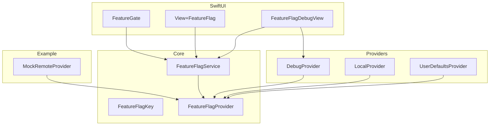
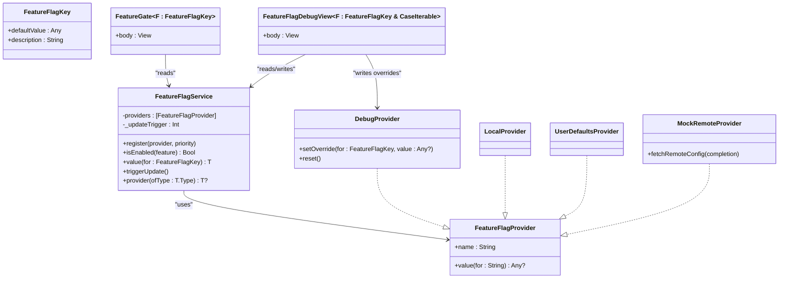
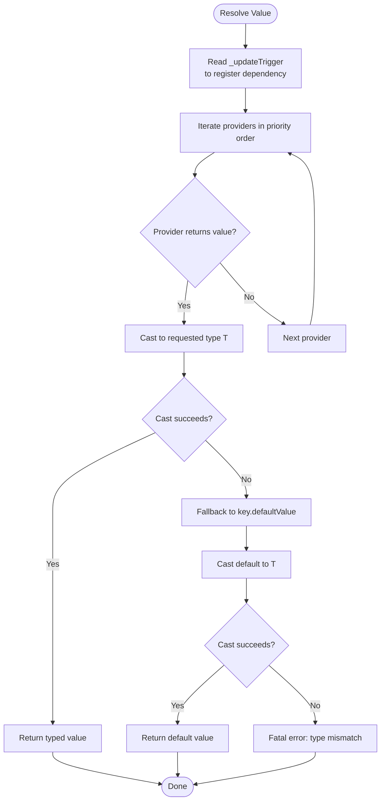
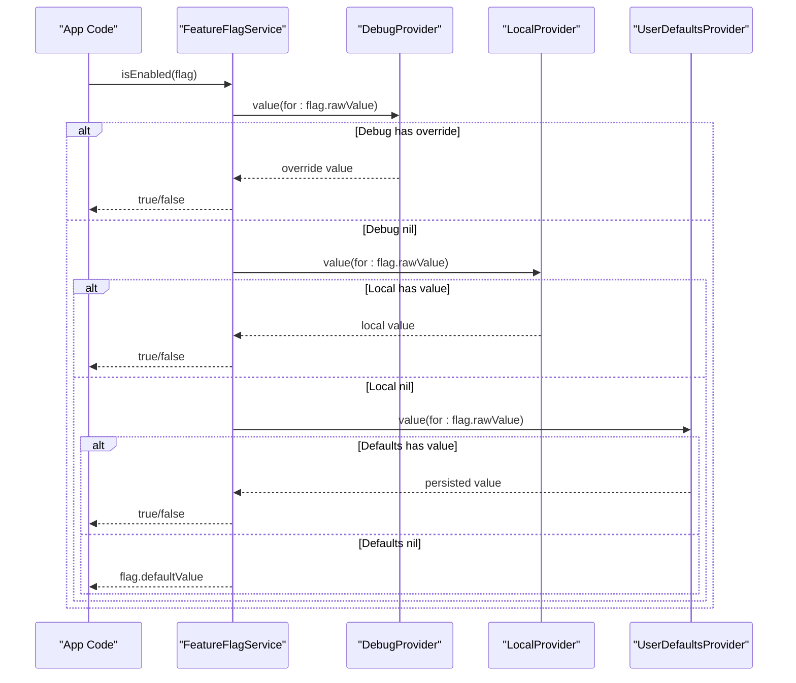
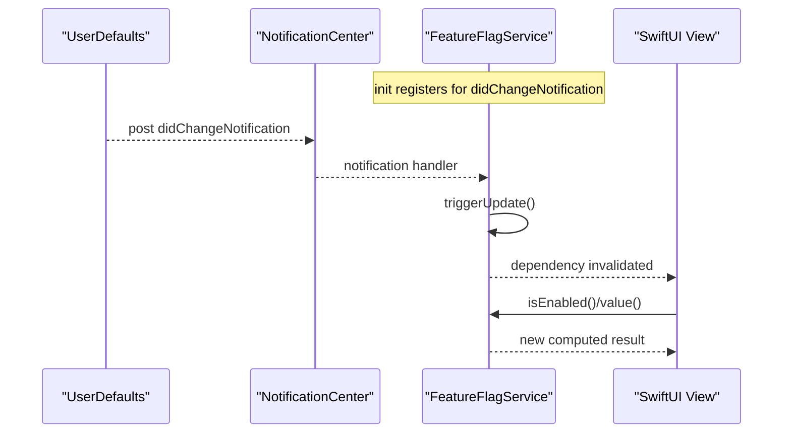
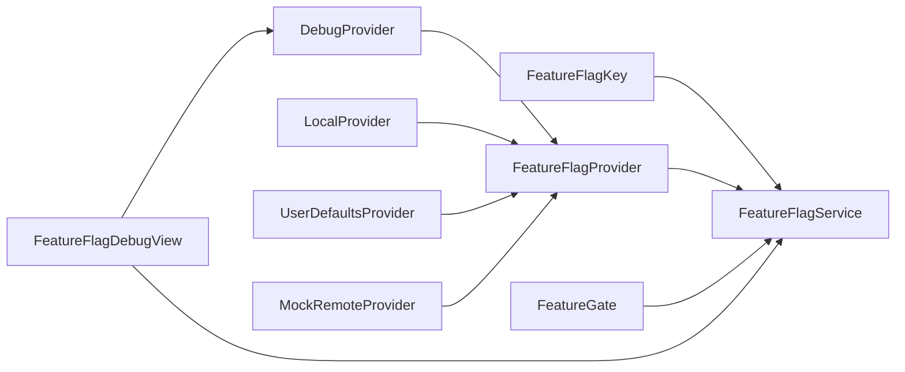
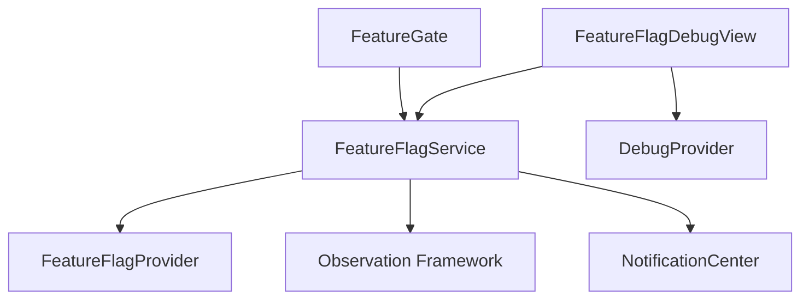

# Core Concepts & Architecture

<cite>
**Referenced Files in This Document**
- [FeatureFlagKey.swift](file://Sources/TGFeatureFlag/Core/FeatureFlagKey.swift)
- [FeatureFlagProvider.swift](file://Sources/TGFeatureFlag/Core/FeatureFlagProvider.swift)
- [FeatureFlagService.swift](file://Sources/TGFeatureFlag/Core/FeatureFlagService.swift)
- [DebugProvider.swift](file://Sources/TGFeatureFlag/Providers/DebugProvider.swift)
- [LocalProvider.swift](file://Sources/TGFeatureFlag/Providers/LocalProvider.swift)
- [UserDefaultsProvider.swift](file://Sources/TGFeatureFlag/Providers/UserDefaultsProvider.swift)
- [FeatureGate.swift](file://Sources/TGFeatureFlag/SwiftUI/FeatureGate.swift)
- [View+FeatureFlag.swift](file://Sources/TGFeatureFlag/SwiftUI/View+FeatureFlag.swift)
- [FeatureFlagDebugView.swift](file://Sources/TGFeatureFlag/SwiftUI/FeatureFlagDebugView.swift)
- [MockRemoteProvider.swift](file://Example/TGFeatureFlagDemo/TGFeatureFlagDemo/MockRemoteProvider.swift)
- [README.md](file://README.md)
</cite>

## Table of Contents
1. [Introduction](#introduction)
2. [Project Structure](#project-structure)
3. [Core Components](#core-components)
4. [Architecture Overview](#architecture-overview)
5. [Detailed Component Analysis](#detailed-component-analysis)
6. [Dependency Analysis](#dependency-analysis)
7. [Performance Considerations](#performance-considerations)
8. [Troubleshooting Guide](#troubleshooting-guide)
9. [Conclusion](#conclusion)

## Introduction
This document explains the architectural design of TGFeatureFlag’s core components and how they collaborate to provide a flexible, type-safe feature flag system for iOS and macOS. It focuses on:
- Protocol-oriented design with three primary abstractions: FeatureFlagKey, FeatureFlagProvider, and FeatureFlagService
- The priority chain resolution system that determines which provider wins when multiple sources define a value
- How the provider pattern enables pluggable data sources (debug overrides, user defaults, local defaults, remote config)
- The observer pattern implementation using the Observation framework (@Observable) to keep SwiftUI views reactive
- Thread safety considerations and performance implications

## Project Structure
The library is organized by responsibility:
- Core: protocol definitions and central service
- Providers: built-in implementations for common data sources
- SwiftUI: integration helpers and debug UI
- Example: demo app illustrating usage patterns

**Diagram sources**
- [FeatureFlagKey.swift:1-37](file://Sources/TGFeatureFlag/Core/FeatureFlagKey.swift#L1-L37)
- [FeatureFlagProvider.swift:1-18](file://Sources/TGFeatureFlag/Core/FeatureFlagProvider.swift#L1-L18)
- [FeatureFlagService.swift:1-91](file://Sources/TGFeatureFlag/Core/FeatureFlagService.swift#L1-L91)
- [DebugProvider.swift:1-38](file://Sources/TGFeatureFlag/Providers/DebugProvider.swift#L1-L38)
- [LocalProvider.swift:1-28](file://Sources/TGFeatureFlag/Providers/LocalProvider.swift#L1-L28)
- [UserDefaultsProvider.swift:1-26](file://Sources/TGFeatureFlag/Providers/UserDefaultsProvider.swift#L1-L26)
- [FeatureGate.swift:1-49](file://Sources/TGFeatureFlag/SwiftUI/FeatureGate.swift#L1-L49)
- [View+FeatureFlag.swift:1-10](file://Sources/TGFeatureFlag/SwiftUI/View+FeatureFlag.swift#L1-L10)
- [FeatureFlagDebugView.swift:1-133](file://Sources/TGFeatureFlag/SwiftUI/FeatureFlagDebugView.swift#L1-L133)
- [MockRemoteProvider.swift:1-54](file://Example/TGFeatureFlagDemo/TGFeatureFlagDemo/MockRemoteProvider.swift#L1-L54)

**Section sources**
- [README.md:1-150](file://README.md#L1-L150)

## Core Components
TGFeatureFlag is built around three core abstractions:

- FeatureFlagKey
  - Defines each feature flag’s identity and default behavior.
  - Conforms to RawRepresentable and Hashable; provides a human-readable description and a default value used as fallback.

- FeatureFlagProvider
  - Abstracts any source of flag values.
  - Each provider has a name and returns an optional typed value for a given key string.

- FeatureFlagService
  - Central manager that aggregates providers in a priority-ordered chain.
  - Uses @Observable to notify SwiftUI when values change.
  - Resolves values by iterating providers from highest to lowest priority and falling back to the key’s default if none provide a value.

These components implement a clean separation of concerns: keys describe flags, providers supply values, and the service orchestrates resolution and observation.

**Section sources**
- [FeatureFlagKey.swift:1-37](file://Sources/TGFeatureFlag/Core/FeatureFlagKey.swift#L1-L37)
- [FeatureFlagProvider.swift:1-18](file://Sources/TGFeatureFlag/Core/FeatureFlagProvider.swift#L1-L18)
- [FeatureFlagService.swift:1-91](file://Sources/TGFeatureFlag/Core/FeatureFlagService.swift#L1-L91)

## Architecture Overview
The architecture follows a protocol-oriented design with a pluggable provider chain and reactive updates via Observation.

**Diagram sources**
- [FeatureFlagKey.swift:1-37](file://Sources/TGFeatureFlag/Core/FeatureFlagKey.swift#L1-L37)
- [FeatureFlagProvider.swift:1-18](file://Sources/TGFeatureFlag/Core/FeatureFlagProvider.swift#L1-L18)
- [FeatureFlagService.swift:1-91](file://Sources/TGFeatureFlag/Core/FeatureFlagService.swift#L1-L91)
- [DebugProvider.swift:1-38](file://Sources/TGFeatureFlag/Providers/DebugProvider.swift#L1-L38)
- [LocalProvider.swift:1-28](file://Sources/TGFeatureFlag/Providers/LocalProvider.swift#L1-L28)
- [UserDefaultsProvider.swift:1-26](file://Sources/TGFeatureFlag/Providers/UserDefaultsProvider.swift#L1-L26)
- [MockRemoteProvider.swift:1-54](file://Example/TGFeatureFlagDemo/TGFeatureFlagDemo/MockRemoteProvider.swift#L1-L54)
- [FeatureGate.swift:1-49](file://Sources/TGFeatureFlag/SwiftUI/FeatureGate.swift#L1-L49)
- [FeatureFlagDebugView.swift:1-133](file://Sources/TGFeatureFlag/SwiftUI/FeatureFlagDebugView.swift#L1-L133)

## Detailed Component Analysis

### Protocol-Oriented Design Pattern
- FeatureFlagKey defines the contract for flag identity and defaults. By requiring RawRepresentable and Hashable, it integrates naturally with enums and collections.
- FeatureFlagProvider abstracts heterogeneous data sources behind a uniform interface, enabling easy extension with custom providers (e.g., network-backed configuration).
- FeatureFlagService composes these protocols to implement the priority chain and observation semantics.

Benefits:
- Decoupling: UI and business logic depend only on protocols, not concrete storage.
- Extensibility: New providers can be added without changing existing code.
- Type-safety: Keys carry default types; service casts at runtime with explicit error handling for mismatches.

**Section sources**
- [FeatureFlagKey.swift:1-37](file://Sources/TGFeatureFlag/Core/FeatureFlagKey.swift#L1-L37)
- [FeatureFlagProvider.swift:1-18](file://Sources/TGFeatureFlag/Core/FeatureFlagProvider.swift#L1-L18)
- [FeatureFlagService.swift:1-91](file://Sources/TGFeatureFlag/Core/FeatureFlagService.swift#L1-L91)

### Priority Chain Resolution System
When resolving a flag value:
1. The service iterates registered providers in order (highest priority first).
2. The first provider returning a non-nil value wins.
3. If no provider returns a value, the key’s defaultValue is used.
4. If the requested generic type does not match the resolved or default value type, the service triggers a fatal error to surface misconfiguration early.

**Diagram sources**
- [FeatureFlagService.swift:56-79](file://Sources/TGFeatureFlag/Core/FeatureFlagService.swift#L56-L79)

**Section sources**
- [FeatureFlagService.swift:40-79](file://Sources/TGFeatureFlag/Core/FeatureFlagService.swift#L40-L79)

### Provider Pattern and Data Sources
Built-in providers demonstrate different strategies:
- DebugProvider: In-memory overrides protected by a lock; intended for development/debug builds.
- LocalProvider: Static dictionary-based values for initial configuration.
- UserDefaultsProvider: Reads from UserDefaults; integrates with Settings.bundle or simple persistence.
- Custom providers (example): MockRemoteProvider simulates network fetches and updates internal state safely.

**Diagram sources**
- [FeatureFlagService.swift:56-79](file://Sources/TGFeatureFlag/Core/FeatureFlagService.swift#L56-L79)
- [DebugProvider.swift:14-18](file://Sources/TGFeatureFlag/Providers/DebugProvider.swift#L14-L18)
- [LocalProvider.swift:24-26](file://Sources/TGFeatureFlag/Providers/LocalProvider.swift#L24-L26)
- [UserDefaultsProvider.swift:20-24](file://Sources/TGFeatureFlag/Providers/UserDefaultsProvider.swift#L20-L24)

**Section sources**
- [DebugProvider.swift:1-38](file://Sources/TGFeatureFlag/Providers/DebugProvider.swift#L1-L38)
- [LocalProvider.swift:1-28](file://Sources/TGFeatureFlag/Providers/LocalProvider.swift#L1-L28)
- [UserDefaultsProvider.swift:1-26](file://Sources/TGFeatureFlag/Providers/UserDefaultsProvider.swift#L1-L26)
- [MockRemoteProvider.swift:1-54](file://Example/TGFeatureFlagDemo/TGFeatureFlagDemo/MockRemoteProvider.swift#L1-L54)

### Observer Pattern with @Observable
FeatureFlagService is annotated with @Observable, making its properties observable to SwiftUI. The service:
- Exposes an internal update trigger (_updateTrigger) that is read during value resolution to establish a dependency.
- Increments this trigger when external changes occur (e.g., UserDefaults notifications or manual calls), causing dependent views to recompute.

**Diagram sources**
- [FeatureFlagService.swift:17-30](file://Sources/TGFeatureFlag/Core/FeatureFlagService.swift#L17-L30)
- [FeatureFlagService.swift:56-58](file://Sources/TGFeatureFlag/Core/FeatureFlagService.swift#L56-L58)
- [FeatureFlagService.swift:82-84](file://Sources/TGFeatureFlag/Core/FeatureFlagService.swift#L82-L84)

**Section sources**
- [FeatureFlagService.swift:1-91](file://Sources/TGFeatureFlag/Core/FeatureFlagService.swift#L1-L91)

### Relationship Between Components
- FeatureFlagKey identifies flags and supplies defaults.
- FeatureFlagProvider implementations supply values from various sources.
- FeatureFlagService coordinates providers and observation.
- SwiftUI components (FeatureGate, FeatureFlagDebugView) consume the service and may write to specific providers (e.g., DebugProvider) to drive runtime changes.

**Diagram sources**
- [FeatureFlagKey.swift:1-37](file://Sources/TGFeatureFlag/Core/FeatureFlagKey.swift#L1-L37)
- [FeatureFlagProvider.swift:1-18](file://Sources/TGFeatureFlag/Core/FeatureFlagProvider.swift#L1-L18)
- [FeatureFlagService.swift:1-91](file://Sources/TGFeatureFlag/Core/FeatureFlagService.swift#L1-L91)
- [DebugProvider.swift:1-38](file://Sources/TGFeatureFlag/Providers/DebugProvider.swift#L1-L38)
- [LocalProvider.swift:1-28](file://Sources/TGFeatureFlag/Providers/LocalProvider.swift#L1-L28)
- [UserDefaultsProvider.swift:1-26](file://Sources/TGFeatureFlag/Providers/UserDefaultsProvider.swift#L1-L26)
- [MockRemoteProvider.swift:1-54](file://Example/TGFeatureFlagDemo/TGFeatureFlagDemo/MockRemoteProvider.swift#L1-L54)
- [FeatureGate.swift:1-49](file://Sources/TGFeatureFlag/SwiftUI/FeatureGate.swift#L1-L49)
- [FeatureFlagDebugView.swift:1-133](file://Sources/TGFeatureFlag/SwiftUI/FeatureFlagDebugView.swift#L1-L133)

## Dependency Analysis
- Coupling:
  - FeatureFlagService depends on FeatureFlagProvider abstraction, not concrete implementations.
  - SwiftUI components depend on FeatureFlagService via environment injection.
  - Debug UI depends on DebugProvider to mutate overrides.
- Cohesion:
  - Each provider encapsulates a single data source strategy.
  - Service encapsulates resolution logic and observation coordination.
- External integrations:
  - UserDefaults notifications are observed to propagate changes.
  - Observation framework drives reactive UI updates.

**Diagram sources**
- [FeatureFlagService.swift:1-91](file://Sources/TGFeatureFlag/Core/FeatureFlagService.swift#L1-L91)
- [FeatureGate.swift:1-49](file://Sources/TGFeatureFlag/SwiftUI/FeatureGate.swift#L1-L49)
- [FeatureFlagDebugView.swift:1-133](file://Sources/TGFeatureFlag/SwiftUI/FeatureFlagDebugView.swift#L1-L133)
- [DebugProvider.swift:1-38](file://Sources/TGFeatureFlag/Providers/DebugProvider.swift#L1-L38)

**Section sources**
- [FeatureFlagService.swift:1-91](file://Sources/TGFeatureFlag/Core/FeatureFlagService.swift#L1-L91)
- [FeatureGate.swift:1-49](file://Sources/TGFeatureFlag/SwiftUI/FeatureGate.swift#L1-L49)
- [FeatureFlagDebugView.swift:1-133](file://Sources/TGFeatureFlag/SwiftUI/FeatureFlagDebugView.swift#L1-L133)

## Performance Considerations
- Provider iteration cost:
  - Resolution scans providers in order until a value is found. Keep the number of providers small and place high-probability providers earlier to minimize lookups.
- Type casting overhead:
  - The service performs runtime casting to the requested generic type. Ensure your providers return values matching the expected type to avoid unnecessary failures and crashes.
- Observation updates:
  - Reading _updateTrigger establishes dependencies; excessive reads in hot paths may cause frequent recomputations. Prefer batching updates where possible.
- Threading:
  - DebugProvider uses a lock to protect mutable state. UserDefaultsProvider reads from UserDefaults synchronously; ensure writes occur off the main thread if needed.
- Notification handling:
  - UserDefaults.didChangeNotification is observed on the main queue; heavy work should be avoided in the notification handler.

[No sources needed since this section provides general guidance]

## Troubleshooting Guide
Common issues and resolutions:
- Type mismatch errors:
  - Symptom: Fatal error indicating expected type differs from default value type.
  - Cause: Requested generic type does not match the provider’s or default value’s type.
  - Fix: Align provider/default value types with the requested type or adjust the key’s defaultValue.
- No UI updates after changing UserDefaults:
  - Ensure UserDefaultsProvider is registered and that UserDefaults changes actually post didChangeNotification.
  - For custom providers, call service.triggerUpdate() after updating values to force view refresh.
- Debug overrides not taking effect:
  - Verify DebugProvider is registered with highest priority and that setOverride is called with the correct key/rawValue.
- Missing provider instance:
  - Use service.provider(ofType:) to retrieve a specific provider before writing to it.

**Section sources**
- [FeatureFlagService.swift:56-79](file://Sources/TGFeatureFlag/Core/FeatureFlagService.swift#L56-L79)
- [FeatureFlagService.swift:82-84](file://Sources/TGFeatureFlag/Core/FeatureFlagService.swift#L82-L84)
- [FeatureFlagDebugView.swift:1-133](file://Sources/TGFeatureFlag/SwiftUI/FeatureFlagDebugView.swift#L1-L133)
- [DebugProvider.swift:20-36](file://Sources/TGFeatureFlag/Providers/DebugProvider.swift#L20-L36)

## Conclusion
TGFeatureFlag’s architecture leverages protocol orientation to decouple flag identity, data sources, and orchestration. The priority chain allows flexible precedence among providers, while @Observable ensures SwiftUI remains reactive to underlying changes. With clear separation of concerns, strong typing, and thoughtful observation and threading strategies, the system scales well across applications and supports both development-time debugging and production-grade configuration management.