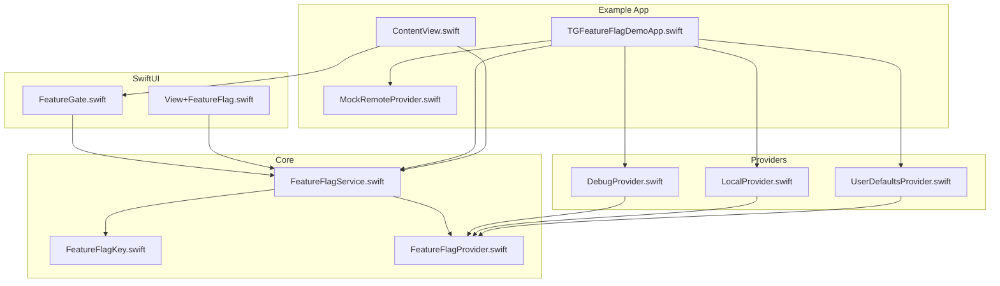
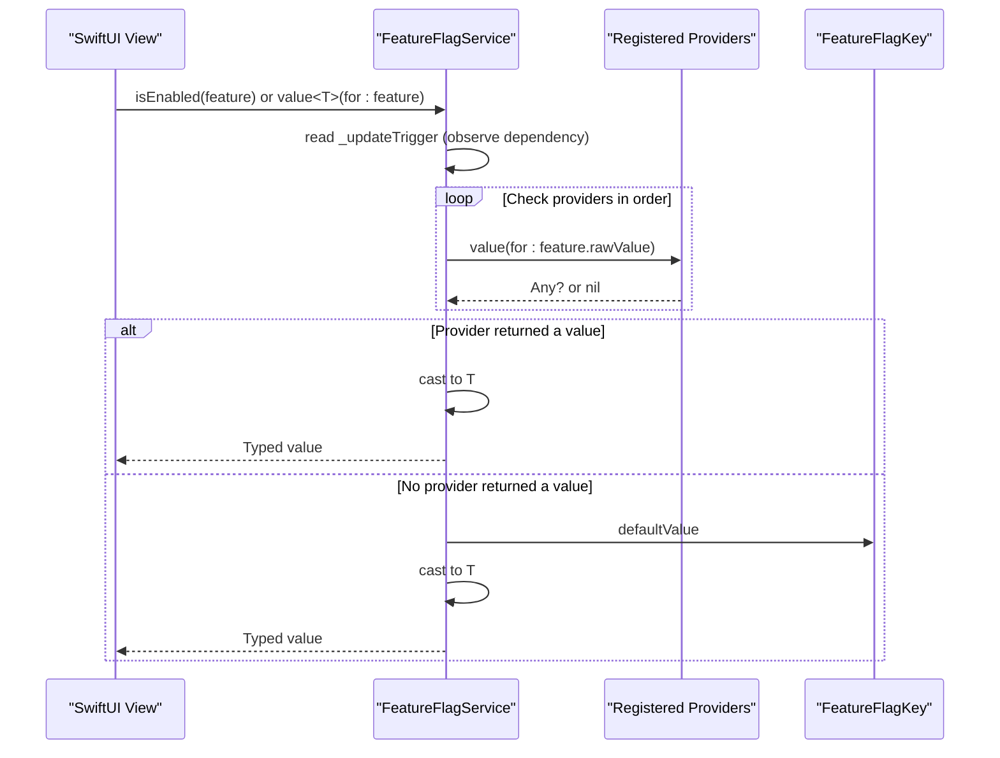
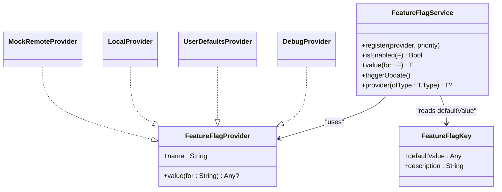

# Feature Flag Definition System

<cite>
**Referenced Files in This Document**
- [FeatureFlagKey.swift](file://Sources/TGFeatureFlag/Core/FeatureFlagKey.swift)
- [FeatureFlagProvider.swift](file://Sources/TGFeatureFlag/Core/FeatureFlagProvider.swift)
- [FeatureFlagService.swift](file://Sources/TGFeatureFlag/Core/FeatureFlagService.swift)
- [DebugProvider.swift](file://Sources/TGFeatureFlag/Providers/DebugProvider.swift)
- [LocalProvider.swift](file://Sources/TGFeatureFlag/Providers/LocalProvider.swift)
- [UserDefaultsProvider.swift](file://Sources/TGFeatureFlag/Providers/UserDefaultsProvider.swift)
- [FeatureGate.swift](file://Sources/TGFeatureFlag/SwiftUI/FeatureGate.swift)
- [View+FeatureFlag.swift](file://Sources/TGFeatureFlag/SwiftUI/View+FeatureFlag.swift)
- [TGFeatureFlagDemoApp.swift](file://Example/TGFeatureFlagDemo/TGFeatureFlagDemo/TGFeatureFlagDemoApp.swift)
- [ContentView.swift](file://Example/TGFeatureFlagDemo/TGFeatureFlagDemo/ContentView.swift)
- [MockRemoteProvider.swift](file://Example/TGFeatureFlagDemo/TGFeatureFlagDemo/MockRemoteProvider.swift)
- [README.md](file://README.md)
</cite>

## Table of Contents
1. [Introduction](#introduction)
2. [Project Structure](#project-structure)
3. [Core Components](#core-components)
4. [Architecture Overview](#architecture-overview)
5. [Detailed Component Analysis](#detailed-component-analysis)
6. [Dependency Analysis](#dependency-analysis)
7. [Performance Considerations](#performance-considerations)
8. [Troubleshooting Guide](#troubleshooting-guide)
9. [Conclusion](#conclusion)
10. [Appendices](#appendices)

## Introduction
This document explains the Feature Flag Definition System with a focus on how to define feature flags using the FeatureFlagKey protocol, the enum-based approach for type-safe flag definitions, and the required properties defaultValue and description. It also covers practical examples across data types (Bool, String, Int, Double), the benefits of RawRepresentable conformance, compile-time safety advantages, naming conventions, and best practices for organizing flags in large applications.

## Project Structure
The system is organized into core protocols and services, provider implementations, SwiftUI helpers, and an example app demonstrating usage.

**Diagram sources**
- [FeatureFlagKey.swift:1-37](file://Sources/TGFeatureFlag/Core/FeatureFlagKey.swift#L1-L37)
- [FeatureFlagProvider.swift:1-18](file://Sources/TGFeatureFlag/Core/FeatureFlagProvider.swift#L1-L18)
- [FeatureFlagService.swift:1-94](file://Sources/TGFeatureFlag/Core/FeatureFlagService.swift#L1-L94)
- [DebugProvider.swift:1-38](file://Sources/TGFeatureFlag/Providers/DebugProvider.swift#L1-L38)
- [LocalProvider.swift:1-28](file://Sources/TGFeatureFlag/Providers/LocalProvider.swift#L1-L28)
- [UserDefaultsProvider.swift:1-28](file://Sources/TGFeatureFlag/Providers/UserDefaultsProvider.swift#L1-L28)
- [FeatureGate.swift:1-49](file://Sources/TGFeatureFlag/SwiftUI/FeatureGate.swift#L1-L49)
- [View+FeatureFlag.swift:1-10](file://Sources/TGFeatureFlag/SwiftUI/View+FeatureFlag.swift#L1-L10)
- [TGFeatureFlagDemoApp.swift:1-77](file://Example/TGFeatureFlagDemo/TGFeatureFlagDemo/TGFeatureFlagDemoApp.swift#L1-L77)
- [ContentView.swift:1-302](file://Example/TGFeatureFlagDemo/TGFeatureFlagDemo/ContentView.swift#L1-L302)
- [MockRemoteProvider.swift:1-54](file://Example/TGFeatureFlagDemo/TGFeatureFlagDemo/MockRemoteProvider.swift#L1-L54)

**Section sources**
- [FeatureFlagKey.swift:1-37](file://Sources/TGFeatureFlag/Core/FeatureFlagKey.swift#L1-L37)
- [FeatureFlagProvider.swift:1-18](file://Sources/TGFeatureFlag/Core/FeatureFlagProvider.swift#L1-L18)
- [FeatureFlagService.swift:1-94](file://Sources/TGFeatureFlag/Core/FeatureFlagService.swift#L1-L94)
- [FeatureGate.swift:1-49](file://Sources/TGFeatureFlag/SwiftUI/FeatureGate.swift#L1-L49)
- [View+FeatureFlag.swift:1-10](file://Sources/TGFeatureFlag/SwiftUI/View+FeatureFlag.swift#L1-L10)
- [TGFeatureFlagDemoApp.swift:1-77](file://Example/TGFeatureFlagDemo/TGFeatureFlagDemo/TGFeatureFlagDemoApp.swift#L1-L77)
- [ContentView.swift:1-302](file://Example/TGFeatureFlagDemo/TGFeatureFlagDemo/ContentView.swift#L1-L302)
- [MockRemoteProvider.swift:1-54](file://Example/TGFeatureFlagDemo/TGFeatureFlagDemo/MockRemoteProvider.swift#L1-L54)

## Core Components
- FeatureFlagKey: The protocol that defines each feature flag’s identity and default behavior. It requires defaultValue and description and enforces RawRepresentable with String raw values.
- FeatureFlagProvider: A pluggable source of flag values. Implementations include DebugProvider, UserDefaultsProvider, LocalProvider, and custom providers like MockRemoteProvider.
- FeatureFlagService: Central manager that resolves values by iterating through registered providers in priority order and falling back to the key’s defaultValue. It integrates with SwiftUI via Observation for reactive updates.

Key responsibilities:
- Define flags as enums conforming to FeatureFlagKey.
- Provide typed accessors via FeatureFlagService.value<T>(for:) and isEnabled(_).
- Support multiple providers with a clear precedence chain.
- Trigger UI updates when underlying storage changes.

**Section sources**
- [FeatureFlagKey.swift:1-37](file://Sources/TGFeatureFlag/Core/FeatureFlagKey.swift#L1-L37)
- [FeatureFlagProvider.swift:1-18](file://Sources/TGFeatureFlag/Core/FeatureFlagProvider.swift#L1-L18)
- [FeatureFlagService.swift:1-94](file://Sources/TGFeatureFlag/Core/FeatureFlagService.swift#L1-L94)

## Architecture Overview
The resolution flow follows a strict priority chain:
- Highest priority providers are checked first.
- If no value is found, the next provider is consulted.
- If none provide a value, the defaultValue from the FeatureFlagKey is used.
- For boolean checks, isEnabled returns a Bool; for other types, value(for:) returns the requested generic type.

**Diagram sources**
- [FeatureFlagService.swift:53-82](file://Sources/TGFeatureFlag/Core/FeatureFlagService.swift#L53-L82)
- [FeatureFlagKey.swift:21-36](file://Sources/TGFeatureFlag/Core/FeatureFlagKey.swift#L21-L36)

## Detailed Component Analysis

### FeatureFlagKey Protocol and Enum-Based Definitions
- Purpose: Uniquely identify a flag and specify its default value and human-readable description.
- Required properties:
  - defaultValue: Any — the fallback value if no provider supplies one.
  - description: String — a readable label for debug tools; defaults to rawValue if not overridden.
- Conformance requirements:
  - RawRepresentable with RawValue == String ensures stable identifiers suitable for persistence and remote configs.
  - Sendable and Hashable enable safe concurrent use and collection usage.

Benefits of RawRepresentable:
- Stable string keys for UserDefaults, Settings.bundle, and remote configuration systems.
- Easy mapping between Swift cases and external configuration formats.
- Compile-time guarantees that every case has a unique rawValue.

Compile-time safety advantages:
- Using enums prevents typos in flag names.
- CaseIterable enables iteration over all flags for debug views and tests.
- Type constraints ensure only valid flags can be passed to service methods.

Naming conventions and organization:
- Use descriptive, domain-scoped enum names (e.g., DemoFeature, BillingFeature).
- Prefer kebab-case rawValues for consistency with external systems (e.g., "feature_new_home").
- Group related flags under a single enum per module or feature area.
- Keep descriptions concise and user-facing for debug UIs.

Practical examples across data types:
- Bool flags for toggles (e.g., enabling/disabling features).
- String flags for URLs, labels, or localized strings.
- Int flags for counts, thresholds, or limits.
- Double flags for percentages or floating-point parameters.

See the demo enum for concrete usage patterns and descriptions.

**Section sources**
- [FeatureFlagKey.swift:1-37](file://Sources/TGFeatureFlag/Core/FeatureFlagKey.swift#L1-L37)
- [TGFeatureFlagDemoApp.swift:4-33](file://Example/TGFeatureFlagDemo/TGFeatureFlagDemo/TGFeatureFlagDemoApp.swift#L4-L33)

### FeatureFlagService Resolution Logic
- Provider registration supports explicit priority ordering.
- Resolution algorithm:
  - Iterate providers in order; return the first non-nil value cast to the requested type.
  - If none provided a value, fall back to the key’s defaultValue cast to the requested type.
  - On type mismatch, trigger a fatal error to surface misconfiguration early.
- SwiftUI integration:
  - Uses Observation to observe internal triggers and recompute values automatically.
  - Observes UserDefaults change notifications to refresh values when persisted settings change.

Typed accessors:
- isEnabled(_: Bool) for boolean flags.
- value<T, F: FeatureFlagKey>(for:) for any supported type.

**Section sources**
- [FeatureFlagService.swift:1-94](file://Sources/TGFeatureFlag/Core/FeatureFlagService.swift#L1-L94)

### Providers: Debug, UserDefaults, Local, and Custom
- DebugProvider: In-memory overrides with thread-safe access; ideal for runtime toggling during development.
- UserDefaultsProvider: Reads from UserDefaults; integrates with Settings.bundle and persists user preferences.
- LocalProvider: In-memory dictionary or enabled-feature list; useful for initial configuration or testing.
- Custom providers (e.g., MockRemoteProvider): Simulate remote configuration fetching and dynamic updates.

Concurrency considerations:
- Providers implement thread-safe access where needed.
- UserDefaultsProvider relies on UserDefaults’ documented thread-safety.

**Section sources**
- [DebugProvider.swift:1-38](file://Sources/TGFeatureFlag/Providers/DebugProvider.swift#L1-L38)
- [UserDefaultsProvider.swift:1-28](file://Sources/TGFeatureFlag/Providers/UserDefaultsProvider.swift#L1-L28)
- [LocalProvider.swift:1-28](file://Sources/TGFeatureFlag/Providers/LocalProvider.swift#L1-L28)
- [MockRemoteProvider.swift:1-54](file://Example/TGFeatureFlagDemo/TGFeatureFlagDemo/MockRemoteProvider.swift#L1-L54)

### SwiftUI Integration Helpers
- FeatureGate: A view that conditionally renders content based on a boolean flag, observing the environment service for automatic updates.
- View extension: Injects the FeatureFlagService into the SwiftUI environment at the app root.

Usage patterns:
- Wrap conditional UI blocks with FeatureGate for declarative branching.
- Access the service directly for complex logic or non-boolean flags.

**Section sources**
- [FeatureGate.swift:1-49](file://Sources/TGFeatureFlag/SwiftUI/FeatureGate.swift#L1-L49)
- [View+FeatureFlag.swift:1-10](file://Sources/TGFeatureFlag/SwiftUI/View+FeatureFlag.swift#L1-L10)

### Example App Usage Patterns
- Defines a DemoFeature enum with both feature toggles and configuration flags.
- Registers providers in a specific order to establish precedence: Debug > Remote > UserDefaults > Local.
- Demonstrates:
  - Conditional tab visibility based on a boolean flag.
  - FeatureGate for alternative UI rendering.
  - Reading configuration values (String) for API endpoints.
  - Simulating remote config fetch and triggering UI updates.

**Section sources**
- [TGFeatureFlagDemoApp.swift:1-77](file://Example/TGFeatureFlagDemo/TGFeatureFlagDemo/TGFeatureFlagDemoApp.swift#L1-L77)
- [ContentView.swift:1-302](file://Example/TGFeatureFlagDemo/TGFeatureFlagDemo/ContentView.swift#L1-L302)
- [MockRemoteProvider.swift:1-54](file://Example/TGFeatureFlagDemo/TGFeatureFlagDemo/MockRemoteProvider.swift#L1-L54)

## Dependency Analysis
The following diagram shows how components depend on each other and how the resolution pipeline connects them.

**Diagram sources**
- [FeatureFlagKey.swift:1-37](file://Sources/TGFeatureFlag/Core/FeatureFlagKey.swift#L1-L37)
- [FeatureFlagProvider.swift:1-18](file://Sources/TGFeatureFlag/Core/FeatureFlagProvider.swift#L1-L18)
- [FeatureFlagService.swift:1-94](file://Sources/TGFeatureFlag/Core/FeatureFlagService.swift#L1-L94)
- [DebugProvider.swift:1-38](file://Sources/TGFeatureFlag/Providers/DebugProvider.swift#L1-L38)
- [UserDefaultsProvider.swift:1-28](file://Sources/TGFeatureFlag/Providers/UserDefaultsProvider.swift#L1-L28)
- [LocalProvider.swift:1-28](file://Sources/TGFeatureFlag/Providers/LocalProvider.swift#L1-L28)
- [MockRemoteProvider.swift:1-54](file://Example/TGFeatureFlagDemo/TGFeatureFlagDemo/MockRemoteProvider.swift#L1-L54)

**Section sources**
- [FeatureFlagService.swift:1-94](file://Sources/TGFeatureFlag/Core/FeatureFlagService.swift#L1-L94)
- [FeatureFlagProvider.swift:1-18](file://Sources/TGFeatureFlag/Core/FeatureFlagProvider.swift#L1-L18)
- [FeatureFlagKey.swift:1-37](file://Sources/TGFeatureFlag/Core/FeatureFlagKey.swift#L1-L37)

## Performance Considerations
- Provider chain length: Keep the number of providers reasonable to minimize lookup overhead.
- Caching strategy: Providers may cache results internally (e.g., remote config) to avoid repeated network calls.
- Notification-driven updates: UserDefaultsProvider leverages didChangeNotification to update the service efficiently without polling.
- Avoid heavy work in value(for:) implementations; delegate expensive operations to background queues and cache results.

[No sources needed since this section provides general guidance]

## Troubleshooting Guide
Common issues and resolutions:
- Type mismatch errors:
  - Symptom: Fatal error indicating expected type differs from default value type.
  - Cause: Requested generic type does not match the defaultValue type defined in the key.
  - Fix: Ensure defaultValue matches the intended type or adjust accessor usage accordingly.
- Unexpected values:
  - Symptom: Flags do not reflect expected state.
  - Cause: Provider precedence or missing registration.
  - Fix: Verify provider registration order and ensure the correct provider is returning values for the given keys.
- UI not updating:
  - Symptom: Views do not reflect changed flags.
  - Cause: Missing observation trigger or incorrect environment injection.
  - Fix: Confirm the service is injected via .environment and that triggerUpdate is called after remote config fetches.

Operational tips:
- Use DebugProvider to override values temporarily and validate behavior.
- Inspect provider.name and logs to confirm which provider supplied a value.
- Use CaseIterable to enumerate all flags in debug views and tests.

**Section sources**
- [FeatureFlagService.swift:73-82](file://Sources/TGFeatureFlag/Core/FeatureFlagService.swift#L73-L82)
- [TGFeatureFlagDemoApp.swift:39-68](file://Example/TGFeatureFlagDemo/TGFeatureFlagDemo/TGFeatureFlagDemoApp.swift#L39-L68)
- [ContentView.swift:269-294](file://Example/TGFeatureFlagDemo/TGFeatureFlagDemo/ContentView.swift#L269-L294)

## Conclusion
The Feature Flag Definition System centers on a simple, type-safe protocol and an extensible provider architecture. By defining flags as enums conforming to FeatureFlagKey, you gain compile-time safety, stable identifiers, and clear documentation via descriptions. The service orchestrates a priority-based resolution chain and integrates seamlessly with SwiftUI for reactive updates. Following the naming conventions and organizational strategies outlined here will help maintain clarity and scalability in large applications.

[No sources needed since this section summarizes without analyzing specific files]

## Appendices

### Practical Examples Across Data Types
- Bool: Toggle UI or behavior branches.
- String: Configuration endpoints, labels, or feature-specific strings.
- Int: Limits, retry counts, thresholds.
- Double: Percentages, scaling factors.

These patterns are demonstrated in the example app’s enum and usage throughout the UI.

**Section sources**
- [TGFeatureFlagDemoApp.swift:14-32](file://Example/TGFeatureFlagDemo/TGFeatureFlagDemo/TGFeatureFlagDemoApp.swift#L14-L32)
- [ContentView.swift:80-95](file://Example/TGFeatureFlagDemo/TGFeatureFlagDemo/ContentView.swift#L80-L95)

### Best Practices for Large Applications
- Organize flags by domain or feature area using separate enums.
- Standardize rawValue naming (kebab-case) for consistency across platforms and services.
- Provide meaningful descriptions for each flag to aid debugging and QA.
- Keep provider chains minimal and well-documented.
- Use tests to assert expected defaults and provider behaviors.

[No sources needed since this section provides general guidance]