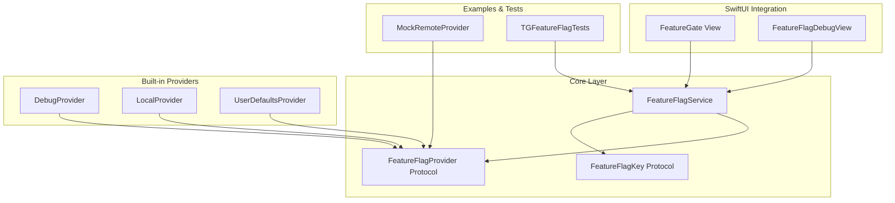
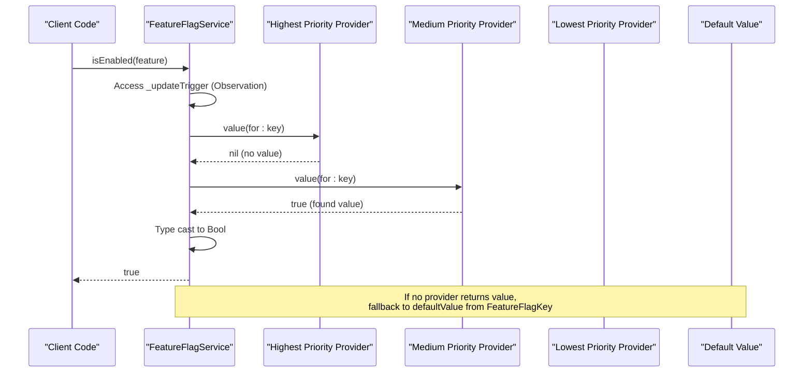
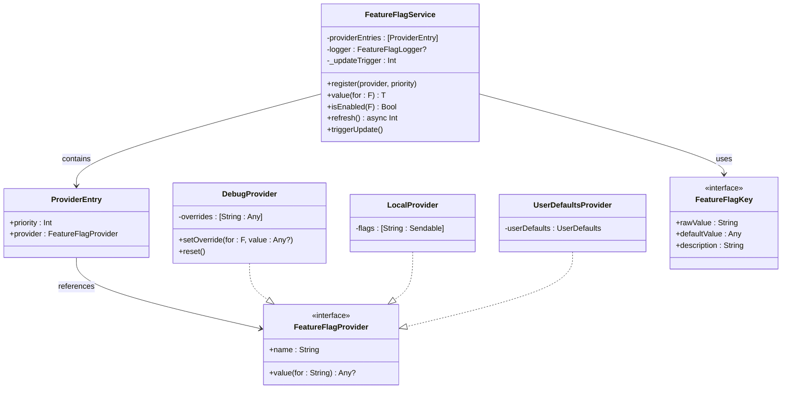
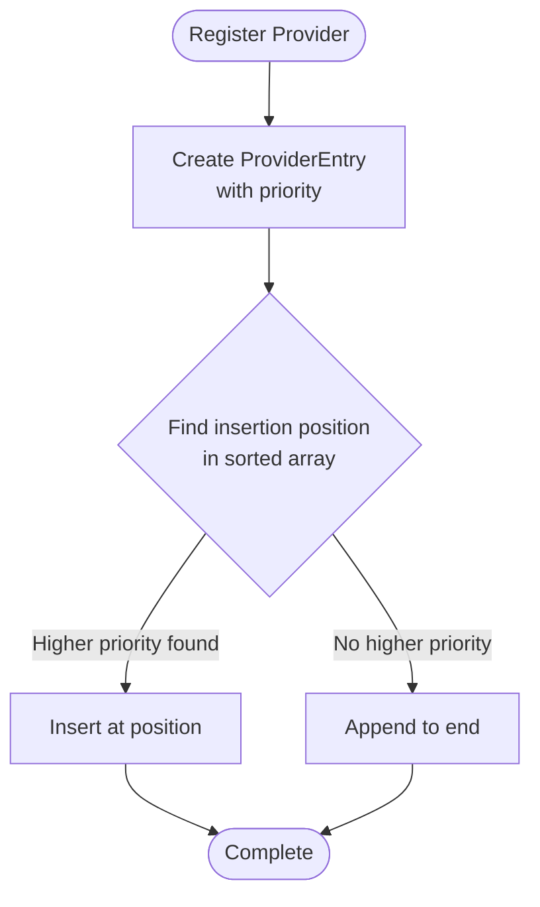
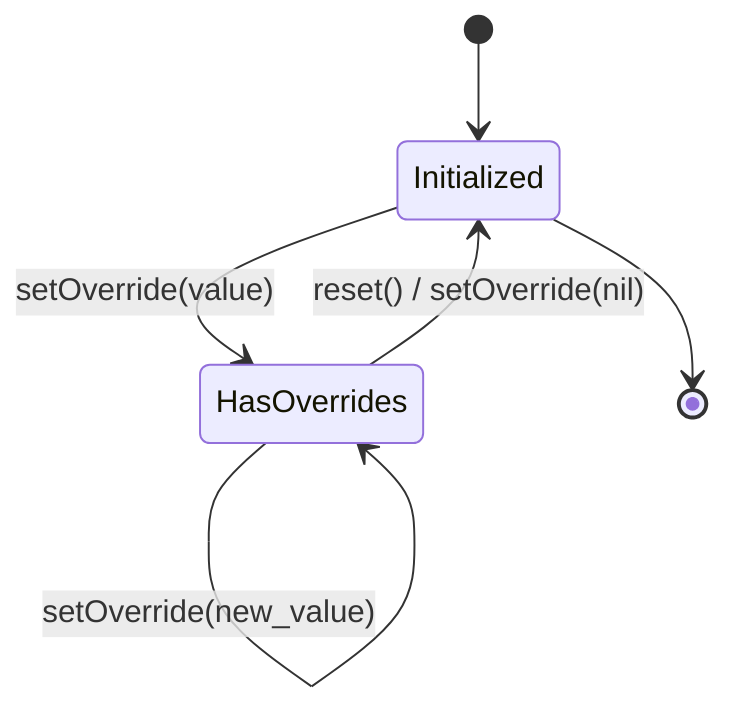
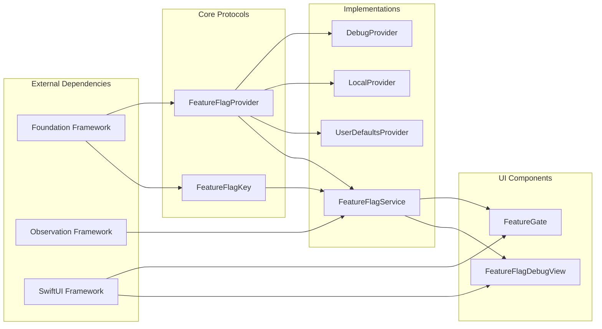

# Priority Chain Resolution

<cite>
**Referenced Files in This Document**
- [FeatureFlagService.swift](file://Sources/TGFeatureFlag/Core/FeatureFlagService.swift)
- [FeatureFlagProvider.swift](file://Sources/TGFeatureFlag/Core/FeatureFlagProvider.swift)
- [FeatureFlagKey.swift](file://Sources/TGFeatureFlag/Core/FeatureFlagKey.swift)
- [DebugProvider.swift](file://Sources/TGFeatureFlag/Providers/DebugProvider.swift)
- [LocalProvider.swift](file://Sources/TGFeatureFlag/Providers/LocalProvider.swift)
- [UserDefaultsProvider.swift](file://Sources/TGFeatureFlag/Providers/UserDefaultsProvider.swift)
- [FeatureGate.swift](file://Sources/TGFeatureFlag/SwiftUI/FeatureGate.swift)
- [FeatureFlagDebugView.swift](file://Sources/TGFeatureFlag/SwiftUI/FeatureFlagDebugView.swift)
- [MockRemoteProvider.swift](file://Example/TGFeatureFlagDemo/TGFeatureFlagDemo/MockRemoteProvider.swift)
- [TGFeatureFlagTests.swift](file://Tests/TGFeatureFlagTests/TGFeatureFlagTests.swift)
</cite>

## Table of Contents
1. [Introduction](#introduction)
2. [Project Structure](#project-structure)
3. [Core Components](#core-components)
4. [Architecture Overview](#architecture-overview)
5. [Detailed Component Analysis](#detailed-component-analysis)
6. [Dependency Analysis](#dependency-analysis)
7. [Performance Considerations](#performance-considerations)
8. [Troubleshooting Guide](#troubleshooting-guide)
9. [Conclusion](#conclusion)

## Introduction

The Priority Chain Resolution system is a sophisticated feature flag management framework that implements the Chain of Responsibility design pattern to provide flexible, type-safe configuration resolution across multiple providers. This system enables applications to manage feature flags through a hierarchical chain of providers, where each provider can contribute values based on its priority level, with automatic fallback mechanisms ensuring robust operation.

The framework supports dynamic configuration updates, thread-safe operations, SwiftUI integration, and comprehensive debugging capabilities. It's designed to handle complex scenarios such as A/B testing, gradual feature rollouts, environment-specific configurations, and runtime overrides while maintaining type safety and performance optimization.

## Project Structure

The Priority Chain Resolution system follows a modular architecture organized into core components, built-in providers, and SwiftUI integrations:



**Diagram sources**
- [FeatureFlagService.swift:25-195](file://Sources/TGFeatureFlag/Core/FeatureFlagService.swift#L25-L195)
- [FeatureFlagProvider.swift:3-18](file://Sources/TGFeatureFlag/Core/FeatureFlagProvider.swift#L3-L18)
- [FeatureFlagKey.swift:3-37](file://Sources/TGFeatureFlag/Core/FeatureFlagKey.swift#L3-L37)

**Section sources**
- [FeatureFlagService.swift:1-195](file://Sources/TGFeatureFlag/Core/FeatureFlagService.swift#L1-L195)
- [README.md:1-150](file://README.md#L1-L150)

## Core Components

The Priority Chain Resolution system is built around three fundamental protocols and classes that work together to provide a flexible and type-safe feature flag management solution.

### FeatureFlagKey Protocol

The `FeatureFlagKey` protocol defines the contract for feature flag identifiers and their default behaviors. Each feature flag must implement this protocol to specify its unique identifier (as a string), default value, and optional human-readable description.

### FeatureFlagProvider Protocol

The `FeatureFlagProvider` protocol establishes the interface for all data sources that can provide feature flag values. Providers are responsible for returning values for specific keys or nil if they don't have a value for that key.

### FeatureFlagService Class

The `FeatureFlagService` class serves as the central coordinator that manages the provider chain, handles priority ordering, and orchestrates the resolution process. It implements the main logic for iterating through providers and applying fallback mechanisms.

**Section sources**
- [FeatureFlagKey.swift:1-37](file://Sources/TGFeatureFlag/Core/FeatureFlagKey.swift#L1-L37)
- [FeatureFlagProvider.swift:1-18](file://Sources/TGFeatureFlag/Core/FeatureFlagProvider.swift#L1-L18)
- [FeatureFlagService.swift:25-195](file://Sources/TGFeatureFlag/Core/FeatureFlagService.swift#L25-L195)

## Architecture Overview

The Priority Chain Resolution system implements a sophisticated Chain of Responsibility pattern with additional features for priority management, caching, and reactive updates. The architecture ensures that feature flag resolution is both flexible and performant.



**Diagram sources**
- [FeatureFlagService.swift:116-151](file://Sources/TGFeatureFlag/Core/FeatureFlagService.swift#L116-L151)
- [FeatureFlagKey.swift:21-32](file://Sources/TGFeatureFlag/Core/FeatureFlagKey.swift#L21-L32)

The system supports multiple provider types working together in a coordinated manner:



**Diagram sources**
- [FeatureFlagService.swift:31-195](file://Sources/TGFeatureFlag/Core/FeatureFlagService.swift#L31-L195)
- [DebugProvider.swift:5-38](file://Sources/TGFeatureFlag/Providers/DebugProvider.swift#L5-L38)
- [LocalProvider.swift:5-28](file://Sources/TGFeatureFlag/Providers/LocalProvider.swift#L5-L28)
- [UserDefaultsProvider.swift:9-28](file://Sources/TGFeatureFlag/Providers/UserDefaultsProvider.swift#L9-L28)

## Detailed Component Analysis

### FeatureFlagService: The Central Coordinator

The `FeatureFlagService` class is the heart of the Priority Chain Resolution system, implementing the main orchestration logic for provider coordination and value resolution.

#### Provider Registration and Priority Management

The service maintains an internal list of `ProviderEntry` objects, each containing a provider instance and its priority level. Providers are automatically sorted by priority during registration, with higher priority providers appearing earlier in the chain.



**Diagram sources**
- [FeatureFlagService.swift:93-101](file://Sources/TGFeatureFlag/Core/FeatureFlagService.swift#L93-L101)

#### Thread-Safe Resolution Process

The resolution process implements several safety mechanisms to ensure reliable operation:

1. **Exception Handling**: Each provider call is wrapped in try-catch blocks to prevent individual provider failures from breaking the entire chain
2. **Type Safety**: Runtime type casting with proper error handling for type mismatches
3. **Observation Integration**: Automatic UI updates through the Observation framework

#### Caching and Performance Optimization

While the current implementation doesn't use explicit caching, it leverages Swift's Observation framework for efficient UI updates. The `_updateTrigger` mechanism provides a way to force refresh when external state changes occur.

**Section sources**
- [FeatureFlagService.swift:33-101](file://Sources/TGFeatureFlag/Core/FeatureFlagService.swift#L33-L101)
- [FeatureFlagService.swift:116-151](file://Sources/TGFeatureFlag/Core/FeatureFlagService.swift#L116-L151)

### Built-in Providers

#### DebugProvider: Runtime Overrides

The `DebugProvider` enables runtime toggling of feature flags through a thread-safe dictionary storage. It's particularly useful for development and testing scenarios where quick experimentation is needed.



**Diagram sources**
- [DebugProvider.swift:5-38](file://Sources/TGFeatureFlag/Providers/DebugProvider.swift#L5-L38)

#### LocalProvider: In-Memory Configuration

The `LocalProvider` offers simple in-memory storage for initial configuration values. It supports two initialization patterns: dictionary-based configuration and enabled-features lists.

#### UserDefaultsProvider: Persistent Storage

The `UserDefaultsProvider` integrates with iOS/macOS persistent storage, commonly used for Settings.bundle integration or simple configuration persistence.

**Section sources**
- [DebugProvider.swift:1-38](file://Sources/TGFeatureFlag/Providers/DebugProvider.swift#L1-L38)
- [LocalProvider.swift:1-28](file://Sources/TGFeatureFlag/Providers/LocalProvider.swift#L1-L28)
- [UserDefaultsProvider.swift:1-28](file://Sources/TGFeatureFlag/Providers/UserDefaultsProvider.swift#L1-L28)

### SwiftUI Integration

#### FeatureGate View

The `FeatureGate` view provides a declarative way to conditionally render content based on feature flag values. It automatically observes changes through the Observation framework.

#### FeatureFlagDebugView

The debug view offers a user interface for inspecting and modifying feature flag values at runtime, with support for different data types and visual indicators for overridden values.

**Section sources**
- [FeatureGate.swift:1-49](file://Sources/TGFeatureFlag/SwiftUI/FeatureGate.swift#L1-L49)
- [FeatureFlagDebugView.swift:1-214](file://Sources/TGFeatureFlag/SwiftUI/FeatureFlagDebugView.swift#L1-L214)

## Dependency Analysis

The system exhibits low coupling between components through well-defined protocols, enabling easy extension and testing. The dependency relationships follow a clear hierarchy:



**Diagram sources**
- [FeatureFlagService.swift:1-2](file://Sources/TGFeatureFlag/Core/FeatureFlagService.swift#L1-L2)
- [FeatureFlagProvider.swift:1-2](file://Sources/TGFeatureFlag/Core/FeatureFlagProvider.swift#L1-L2)
- [FeatureGate.swift:1-2](file://Sources/TGFeatureFlag/SwiftUI/FeatureGate.swift#L1-L2)

### Provider Chain Examples

Common provider combinations demonstrate the flexibility of the system:

1. **Development Setup**: DebugProvider (highest) → UserDefaultsProvider → LocalProvider (lowest)
2. **Production Setup**: UserDefaultsProvider → RemoteConfigProvider → LocalProvider
3. **Testing Setup**: TestProvider → DebugProvider → LocalProvider

**Section sources**
- [TGFeatureFlagTests.swift:48-72](file://Tests/TGFeatureFlagTests/TGFeatureFlagTests.swift#L48-L72)
- [README.md:66-77](file://README.md#L66-L77)

## Performance Considerations

### Resolution Performance

The priority chain resolution operates with O(n) time complexity where n is the number of registered providers. However, typical usage patterns involve a small number of providers (usually 2-4), making this negligible in practice.

### Memory Management

- Provider entries are stored in arrays with minimal overhead
- No explicit caching is implemented, but the Observation framework provides efficient change detection
- Thread synchronization primitives add minimal memory footprint

### Concurrency Safety

The system implements thread safety through:
- NSLock usage in DebugProvider for override storage
- DispatchQueue usage in MockRemoteProvider for concurrent access
- MainActor annotation on FeatureFlagService for UI thread safety

### Optimization Opportunities

1. **Caching Strategy**: Implement LRU cache for frequently accessed flags
2. **Lazy Loading**: Load provider values on-demand rather than eagerly
3. **Batch Updates**: Group multiple flag updates to reduce UI refreshes
4. **Provider Filtering**: Skip providers that don't contain relevant keys

## Troubleshooting Guide

### Common Issues and Solutions

#### Provider Not Being Used

**Problem**: A registered provider isn't providing values as expected.

**Solution**: Check the provider's priority level and ensure it's positioned correctly in the chain. Verify that the provider returns non-nil values for the requested keys.

#### Type Mismatch Errors

**Problem**: Runtime crashes due to type casting failures.

**Solution**: Ensure that the default value type in your `FeatureFlagKey` implementation matches the expected type when calling `value(for:)`. The system will crash with a descriptive error message if there's a mismatch.

#### UI Not Updating

**Problem**: Changes to feature flags don't trigger UI updates.

**Solution**: Ensure you're using the Observation framework correctly. For custom providers, call `service.triggerUpdate()` after making changes.

#### Thread Safety Issues

**Problem**: Crashes or inconsistent behavior in multi-threaded environments.

**Solution**: Use the provided thread-safe providers or implement proper synchronization in custom providers. Avoid direct access to provider internals from multiple threads.

### Debugging Techniques

#### Using the Logger

Enable logging to track which provider resolves each flag:

```swift
service.setLogger(DebugLogger())
```

#### Inspecting Provider Chain

Use the `provider(ofType:)` method to verify provider registration and access specific providers for debugging.

#### Testing Provider Combinations

The test suite demonstrates various provider combination scenarios that can serve as templates for your own tests.

**Section sources**
- [FeatureFlagService.swift:103-107](file://Sources/TGFeatureFlag/Core/FeatureFlagService.swift#L103-L107)
- [FeatureFlagService.swift:190-193](file://Sources/TGFeatureFlag/Core/FeatureFlagService.swift#L190-L193)
- [TGFeatureFlagTests.swift:229-255](file://Tests/TGFeatureFlagTests/TGFeatureFlagTests.swift#L229-L255)

## Conclusion

The Priority Chain Resolution system provides a robust, flexible, and type-safe solution for feature flag management in iOS and macOS applications. Its Chain of Responsibility implementation allows for sophisticated provider hierarchies while maintaining simplicity and performance.

Key strengths include:
- **Flexibility**: Easy addition of custom providers for any data source
- **Type Safety**: Compile-time guarantees for flag definitions with runtime type checking
- **Thread Safety**: Proper synchronization for concurrent access patterns
- **Integration**: Seamless SwiftUI integration with automatic UI updates
- **Debugging**: Comprehensive logging and debugging tools

The system's design enables applications to evolve from simple boolean flags to complex configuration management scenarios without architectural changes. The modular architecture ensures that new providers can be added easily, and the priority system allows for fine-grained control over resolution order.

For optimal results, follow these best practices:
1. Define clear provider responsibilities and priorities
2. Use appropriate provider types for different environments
3. Implement comprehensive logging for production monitoring
4. Write thorough tests covering provider combinations
5. Monitor performance metrics in production deployments

This framework represents a mature solution for feature flag management that balances flexibility, safety, and performance while providing excellent developer experience through intuitive APIs and comprehensive tooling.