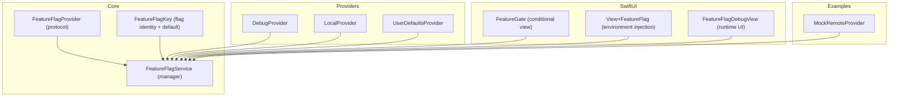
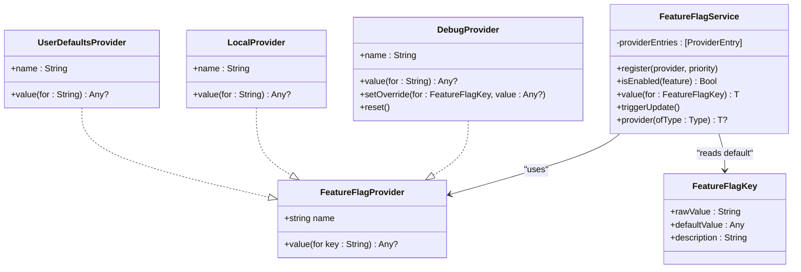
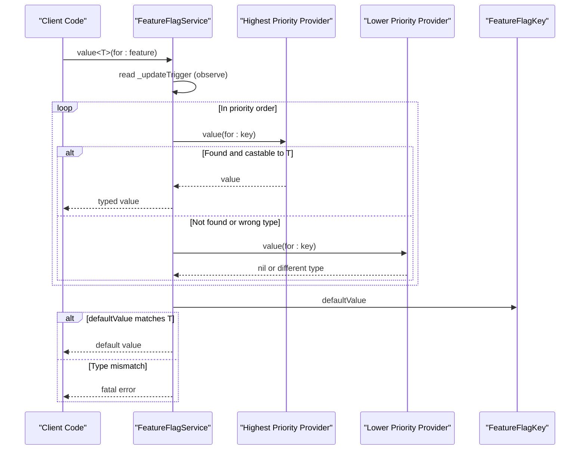
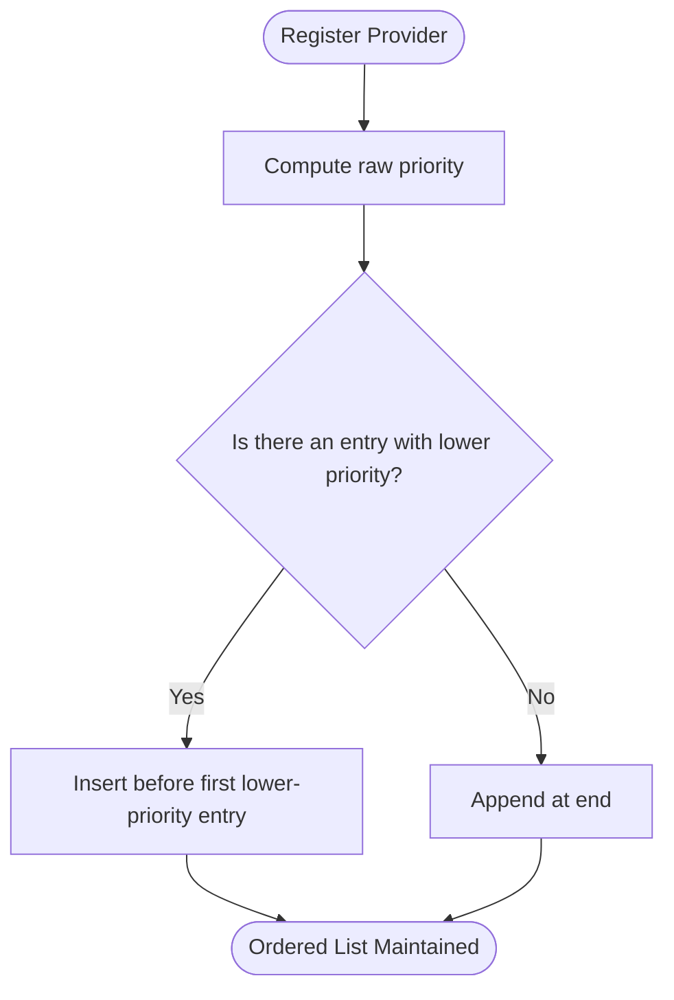
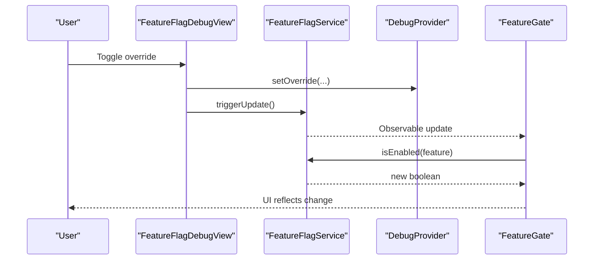
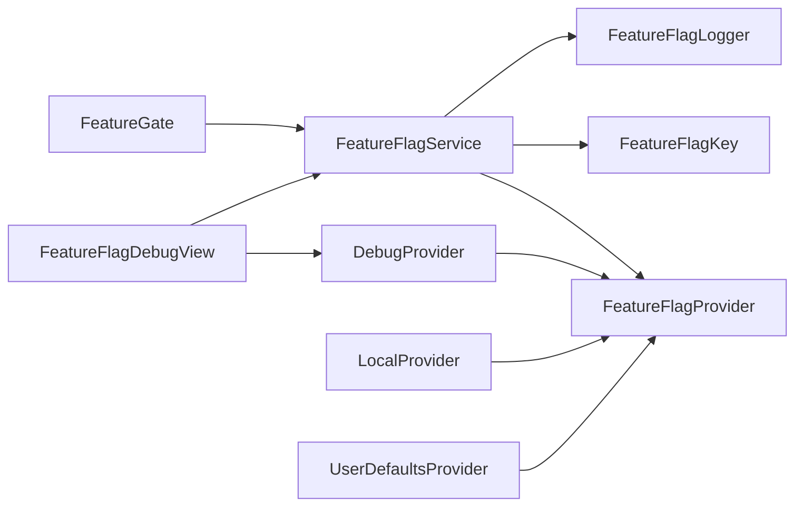

# Provider Pattern Architecture

<cite>
**Referenced Files in This Document**
- [FeatureFlagProvider.swift](file://Sources/TGFeatureFlag/Core/FeatureFlagProvider.swift)
- [FeatureFlagService.swift](file://Sources/TGFeatureFlag/Core/FeatureFlagService.swift)
- [FeatureFlagKey.swift](file://Sources/TGFeatureFlag/Core/FeatureFlagKey.swift)
- [DebugProvider.swift](file://Sources/TGFeatureFlag/Providers/DebugProvider.swift)
- [LocalProvider.swift](file://Sources/TGFeatureFlag/Providers/LocalProvider.swift)
- [UserDefaultsProvider.swift](file://Sources/TGFeatureFlag/Providers/UserDefaultsProvider.swift)
- [FeatureGate.swift](file://Sources/TGFeatureFlag/SwiftUI/FeatureGate.swift)
- [View+FeatureFlag.swift](file://Sources/TGFeatureFlag/SwiftUI/View+FeatureFlag.swift)
- [FeatureFlagDebugView.swift](file://Sources/TGFeatureFlag/SwiftUI/FeatureFlagDebugView.swift)
- [MockRemoteProvider.swift](file://Example/TGFeatureFlagDemo/TGFeatureFlagDemo/MockRemoteProvider.swift)
- [TGFeatureFlagTests.swift](file://Tests/TGFeatureFlagTests/TGFeatureFlagTests.swift)
</cite>

## Table of Contents
1. [Introduction](#introduction)
2. [Project Structure](#project-structure)
3. [Core Components](#core-components)
4. [Architecture Overview](#architecture-overview)
5. [Detailed Component Analysis](#detailed-component-analysis)
6. [Dependency Analysis](#dependency-analysis)
7. [Performance Considerations](#performance-considerations)
8. [Troubleshooting Guide](#troubleshooting-guide)
9. [Conclusion](#conclusion)

## Introduction
This document explains the Provider Pattern Architecture used to implement feature flags with a flexible, priority-based resolution chain. It focuses on the strategy pattern via the FeatureFlagProvider protocol, the value retrieval semantics, thread safety, performance implications, and SwiftUI integration using the Observation framework for reactive updates. It also includes examples of custom providers and guidance for extending the system.

## Project Structure
The project is organized by capability:
- Core abstractions and service orchestration
- Built-in provider implementations
- SwiftUI integration helpers
- Example mock provider
- Tests validating behavior

**Diagram sources**
- [FeatureFlagProvider.swift:1-18](file://Sources/TGFeatureFlag/Core/FeatureFlagProvider.swift#L1-L18)
- [FeatureFlagService.swift:1-168](file://Sources/TGFeatureFlag/Core/FeatureFlagService.swift#L1-L168)
- [FeatureFlagKey.swift:1-37](file://Sources/TGFeatureFlag/Core/FeatureFlagKey.swift#L1-L37)
- [DebugProvider.swift:1-38](file://Sources/TGFeatureFlag/Providers/DebugProvider.swift#L1-L38)
- [LocalProvider.swift:1-28](file://Sources/TGFeatureFlag/Providers/LocalProvider.swift#L1-L28)
- [UserDefaultsProvider.swift:1-28](file://Sources/TGFeatureFlag/Providers/UserDefaultsProvider.swift#L1-L28)
- [FeatureGate.swift:1-49](file://Sources/TGFeatureFlag/SwiftUI/FeatureGate.swift#L1-L49)
- [View+FeatureFlag.swift:1-10](file://Sources/TGFeatureFlag/SwiftUI/View+FeatureFlag.swift#L1-L10)
- [FeatureFlagDebugView.swift:1-214](file://Sources/TGFeatureFlag/SwiftUI/FeatureFlagDebugView.swift#L1-L214)
- [MockRemoteProvider.swift:1-54](file://Example/TGFeatureFlagDemo/TGFeatureFlagDemo/MockRemoteProvider.swift#L1-L54)

**Section sources**
- [FeatureFlagProvider.swift:1-18](file://Sources/TGFeatureFlag/Core/FeatureFlagProvider.swift#L1-L18)
- [FeatureFlagService.swift:1-168](file://Sources/TGFeatureFlag/Core/FeatureFlagService.swift#L1-L168)
- [FeatureFlagKey.swift:1-37](file://Sources/TGFeatureFlag/Core/FeatureFlagKey.swift#L1-L37)
- [DebugProvider.swift:1-38](file://Sources/TGFeatureFlag/Providers/DebugProvider.swift#L1-L38)
- [LocalProvider.swift:1-28](file://Sources/TGFeatureFlag/Providers/LocalProvider.swift#L1-L28)
- [UserDefaultsProvider.swift:1-28](file://Sources/TGFeatureFlag/Providers/UserDefaultsProvider.swift#L1-L28)
- [FeatureGate.swift:1-49](file://Sources/TGFeatureFlag/SwiftUI/FeatureGate.swift#L1-L49)
- [View+FeatureFlag.swift:1-10](file://Sources/TGFeatureFlag/SwiftUI/View+FeatureFlag.swift#L1-L10)
- [FeatureFlagDebugView.swift:1-214](file://Sources/TGFeatureFlag/SwiftUI/FeatureFlagDebugView.swift#L1-L214)
- [MockRemoteProvider.swift:1-54](file://Example/TGFeatureFlagDemo/TGFeatureFlagDemo/MockRemoteProvider.swift#L1-L54)

## Core Components
- Strategy interface: FeatureFlagProvider defines a uniform way to retrieve values for string keys. Implementations can be swapped at runtime to change data sources without changing consumers.
- Flag identity: FeatureFlagKey associates a raw key with a default value and optional description.
- Orchestration: FeatureFlagService maintains an ordered list of providers, resolves values by priority, logs resolution events, and integrates with SwiftUI via @Observable.

Key responsibilities:
- FeatureFlagProvider: Provide name and value(for:) lookup.
- FeatureFlagKey: Define raw key and defaultValue.
- FeatureFlagService: Register providers with priorities, resolve values, trigger reactive updates, and expose typed accessors.

**Section sources**
- [FeatureFlagProvider.swift:1-18](file://Sources/TGFeatureFlag/Core/FeatureFlagProvider.swift#L1-L18)
- [FeatureFlagKey.swift:1-37](file://Sources/TGFeatureFlag/Core/FeatureFlagKey.swift#L1-L37)
- [FeatureFlagService.swift:1-168](file://Sources/TGFeatureFlag/Core/FeatureFlagService.swift#L1-L168)

## Architecture Overview
The architecture follows the Strategy Pattern:
- Providers are interchangeable strategies that supply flag values.
- The service composes multiple strategies into a priority chain.
- Consumers request values through a type-safe API; the service returns the first non-nil result from higher-priority providers or falls back to defaults.

**Diagram sources**
- [FeatureFlagProvider.swift:1-18](file://Sources/TGFeatureFlag/Core/FeatureFlagProvider.swift#L1-L18)
- [DebugProvider.swift:1-38](file://Sources/TGFeatureFlag/Providers/DebugProvider.swift#L1-L38)
- [LocalProvider.swift:1-28](file://Sources/TGFeatureFlag/Providers/LocalProvider.swift#L1-L28)
- [UserDefaultsProvider.swift:1-28](file://Sources/TGFeatureFlag/Providers/UserDefaultsProvider.swift#L1-L28)
- [FeatureFlagKey.swift:1-37](file://Sources/TGFeatureFlag/Core/FeatureFlagKey.swift#L1-L37)
- [FeatureFlagService.swift:1-168](file://Sources/TGFeatureFlag/Core/FeatureFlagService.swift#L1-L168)

## Detailed Component Analysis

### Strategy Interface: FeatureFlagProvider
- Purpose: Abstracts any source of feature flag values behind a simple interface.
- Methods:
  - name: Identifies the provider for logging and debugging.
  - value(for:): Returns the value for a given key or nil if not provided.
- Semantics:
  - Returning nil means “no opinion”; the service continues down the chain.
  - Returning a concrete value short-circuits resolution.
- Thread safety:
  - The protocol requires Sendable conformance. Implementations must ensure safe concurrent access.

**Section sources**
- [FeatureFlagProvider.swift:1-18](file://Sources/TGFeatureFlag/Core/FeatureFlagProvider.swift#L1-L18)

### Value Resolution: FeatureFlagService
- Registration:
  - register(provider:priority:) inserts providers into a sorted list by priority. Higher numeric values win.
- Resolution algorithm:
  - Iterate providers in descending priority order.
  - For each provider, call value(for:) safely; if it returns a value, attempt to cast to the requested generic type T.
  - If no provider returns a matching type, fall back to defaultValue from FeatureFlagKey.
  - If types mismatch between requested T and default, a fatal error occurs to catch configuration mistakes early.
- Logging:
  - Optional logger records which provider resolved the value or if default was used.
- Reactivity:
  - Accessing _updateTrigger registers a dependency for Observation.
  - triggerUpdate() increments the counter to force UI refresh when external sources change.
- Convenience:
  - isEnabled(feature) returns a boolean for convenience.
  - provider(ofType:) finds a registered provider instance by type.

**Diagram sources**
- [FeatureFlagService.swift:116-151](file://Sources/TGFeatureFlag/Core/FeatureFlagService.swift#L116-L151)
- [FeatureFlagKey.swift:21-32](file://Sources/TGFeatureFlag/Core/FeatureFlagKey.swift#L21-L32)

**Section sources**
- [FeatureFlagService.swift:33-101](file://Sources/TGFeatureFlag/Core/FeatureFlagService.swift#L33-L101)
- [FeatureFlagService.swift:116-151](file://Sources/TGFeatureFlag/Core/FeatureFlagService.swift#L116-L151)
- [FeatureFlagService.swift:158-166](file://Sources/TGFeatureFlag/Core/FeatureFlagService.swift#L158-L166)

### Priority-Based Resolution Mechanism
- Priority enum:
  - highest: Int.max
  - lowest: Int.min
  - custom(Int): user-defined precedence
- Insertion logic:
  - New entries are inserted before existing ones with lower priority, maintaining descending order.
- Behavior:
  - First provider returning a non-nil value of the correct type wins.
  - If all providers return nil or incompatible types, defaultValue is used.

**Diagram sources**
- [FeatureFlagService.swift:75-101](file://Sources/TGFeatureFlag/Core/FeatureFlagService.swift#L75-L101)

**Section sources**
- [FeatureFlagService.swift:75-101](file://Sources/TGFeatureFlag/Core/FeatureFlagService.swift#L75-L101)

### Thread Safety Considerations
- MainActor:
  - FeatureFlagService is annotated as @MainActor, ensuring its public methods run on the main actor.
- Sendable:
  - FeatureFlagProvider requires Sendable. Built-in providers use either struct immutability or explicit synchronization.
- Synchronization patterns:
  - DebugProvider uses NSLock around mutable overrides.
  - MockRemoteProvider uses a serial queue with barrier writes for safe concurrent reads/writes.
  - UserDefaultsProvider relies on Apple’s documented thread-safety of UserDefaults.
- Notification handling:
  - FeatureFlagService observes UserDefaults changes on the main queue and triggers updates safely.

**Section sources**
- [FeatureFlagService.swift:29-68](file://Sources/TGFeatureFlag/Core/FeatureFlagService.swift#L29-L68)
- [DebugProvider.swift:1-38](file://Sources/TGFeatureFlag/Providers/DebugProvider.swift#L1-L38)
- [MockRemoteProvider.swift:1-54](file://Example/TGFeatureFlagDemo/TGFeatureFlagDemo/MockRemoteProvider.swift#L1-L54)
- [UserDefaultsProvider.swift:1-28](file://Sources/TGFeatureFlag/Providers/UserDefaultsProvider.swift#L1-L28)

### Performance Implications
- Resolution cost:
  - Linear scan over providers until a match is found. Keep the number of providers small and order high-priority providers first.
- Type casting:
  - Casting to T happens per provider; avoid expensive conversions inside providers.
- Observability overhead:
  - Reading _updateTrigger registers a dependency; this is lightweight but still part of every read path.
- External notifications:
  - UserDefaults changes trigger updates via NotificationCenter; batch heavy work off the main thread.

[No sources needed since this section provides general guidance]

### SwiftUI Integration and Reactive Updates
- Environment injection:
  - View+FeatureFlag exposes a helper to inject FeatureFlagService into the environment.
- Conditional rendering:
  - FeatureGate reads isEnabled(feature) and re-renders automatically when the service updates.
- Debug UI:
  - FeatureFlagDebugView lists all flags, shows current values, and allows toggling overrides via DebugProvider. It calls triggerUpdate() after changes to propagate updates.

**Diagram sources**
- [FeatureFlagDebugView.swift:21-35](file://Sources/TGFeatureFlag/SwiftUI/FeatureFlagDebugView.swift#L21-L35)
- [FeatureGate.swift:31-37](file://Sources/TGFeatureFlag/SwiftUI/FeatureGate.swift#L31-L37)
- [FeatureFlagService.swift:158-161](file://Sources/TGFeatureFlag/Core/FeatureFlagService.swift#L158-L161)

**Section sources**
- [View+FeatureFlag.swift:1-10](file://Sources/TGFeatureFlag/SwiftUI/View+FeatureFlag.swift#L1-L10)
- [FeatureGate.swift:1-49](file://Sources/TGFeatureFlag/SwiftUI/FeatureGate.swift#L1-L49)
- [FeatureFlagDebugView.swift:1-214](file://Sources/TGFeatureFlag/SwiftUI/FeatureFlagDebugView.swift#L1-L214)

### Examples of Custom Provider Implementations
- LocalProvider:
  - Immutable dictionary-backed provider initialized with key-value pairs or a list of enabled features.
- UserDefaultsProvider:
  - Reads from UserDefaults; suitable for Settings.bundle or simple persistence.
- MockRemoteProvider:
  - Demonstrates asynchronous fetch simulation and thread-safe storage with a concurrent queue and barrier writes.

Guidelines for building your own provider:
- Conform to FeatureFlagProvider and provide a stable name.
- Ensure thread safety (use locks, queues, or immutable structures).
- Return nil for keys you do not manage so the chain can continue.
- Prefer fast lookups; defer heavy work to background threads and cache results.

**Section sources**
- [LocalProvider.swift:1-28](file://Sources/TGFeatureFlag/Providers/LocalProvider.swift#L1-L28)
- [UserDefaultsProvider.swift:1-28](file://Sources/TGFeatureFlag/Providers/UserDefaultsProvider.swift#L1-L28)
- [MockRemoteProvider.swift:1-54](file://Example/TGFeatureFlagDemo/TGFeatureFlagDemo/MockRemoteProvider.swift#L1-L54)

## Dependency Analysis
High-level dependencies among core components:

**Diagram sources**
- [FeatureFlagService.swift:1-168](file://Sources/TGFeatureFlag/Core/FeatureFlagService.swift#L1-L168)
- [FeatureFlagProvider.swift:1-18](file://Sources/TGFeatureFlag/Core/FeatureFlagProvider.swift#L1-L18)
- [FeatureFlagKey.swift:1-37](file://Sources/TGFeatureFlag/Core/FeatureFlagKey.swift#L1-L37)
- [DebugProvider.swift:1-38](file://Sources/TGFeatureFlag/Providers/DebugProvider.swift#L1-L38)
- [LocalProvider.swift:1-28](file://Sources/TGFeatureFlag/Providers/LocalProvider.swift#L1-L28)
- [UserDefaultsProvider.swift:1-28](file://Sources/TGFeatureFlag/Providers/UserDefaultsProvider.swift#L1-L28)
- [FeatureGate.swift:1-49](file://Sources/TGFeatureFlag/SwiftUI/FeatureGate.swift#L1-L49)
- [FeatureFlagDebugView.swift:1-214](file://Sources/TGFeatureFlag/SwiftUI/FeatureFlagDebugView.swift#L1-L214)

**Section sources**
- [FeatureFlagService.swift:1-168](file://Sources/TGFeatureFlag/Core/FeatureFlagService.swift#L1-L168)
- [FeatureFlagProvider.swift:1-18](file://Sources/TGFeatureFlag/Core/FeatureFlagProvider.swift#L1-L18)
- [FeatureFlagKey.swift:1-37](file://Sources/TGFeatureFlag/Core/FeatureFlagKey.swift#L1-L37)
- [DebugProvider.swift:1-38](file://Sources/TGFeatureFlag/Providers/DebugProvider.swift#L1-L38)
- [LocalProvider.swift:1-28](file://Sources/TGFeatureFlag/Providers/LocalProvider.swift#L1-L28)
- [UserDefaultsProvider.swift:1-28](file://Sources/TGFeatureFlag/Providers/UserDefaultsProvider.swift#L1-L28)
- [FeatureGate.swift:1-49](file://Sources/TGFeatureFlag/SwiftUI/FeatureGate.swift#L1-L49)
- [FeatureFlagDebugView.swift:1-214](file://Sources/TGFeatureFlag/SwiftUI/FeatureFlagDebugView.swift#L1-L214)

## Performance Considerations
- Keep provider chains short and ordered by expected hit frequency.
- Avoid blocking operations in value(for:); precompute or cache where possible.
- Use appropriate concurrency primitives in custom providers.
- Minimize excessive triggerUpdate() calls; coalesce updates when batching changes.

[No sources needed since this section provides general guidance]

## Troubleshooting Guide
Common issues and resolutions:
- Type mismatch errors:
  - Occur when the requested generic type does not match the default value type. Ensure defaultValue aligns with the accessor type.
- No updates observed:
  - Ensure triggerUpdate() is called after mutating state in providers or external sources like UserDefaults.
- Missing provider:
  - Verify registration order and priority; confirm the provider is added before reading values.
- Logging not firing:
  - Set a logger via setLogger(_:) to inspect which provider resolved each flag.

Validation references:
- Priority ordering and fallback behavior are validated in tests.
- Logger integration is verified by test cases.

**Section sources**
- [FeatureFlagService.swift:142-151](file://Sources/TGFeatureFlag/Core/FeatureFlagService.swift#L142-L151)
- [FeatureFlagService.swift:103-107](file://Sources/TGFeatureFlag/Core/FeatureFlagService.swift#L103-L107)
- [TGFeatureFlagTests.swift:48-72](file://Tests/TGFeatureFlagTests/TGFeatureFlagTests.swift#L48-L72)
- [TGFeatureFlagTests.swift:229-255](file://Tests/TGFeatureFlagTests/TGFeatureFlagTests.swift#L229-L255)

## Conclusion
The Provider Pattern Architecture delivers a clean, extensible strategy-based system for feature flags. By composing multiple providers with explicit priorities, applications gain fine-grained control over configuration sources while keeping consumers decoupled. The design emphasizes type safety, thread safety, and seamless SwiftUI reactivity through the Observation framework. With built-in debug tools and comprehensive tests, teams can confidently evolve their feature flag strategy across environments and releases.