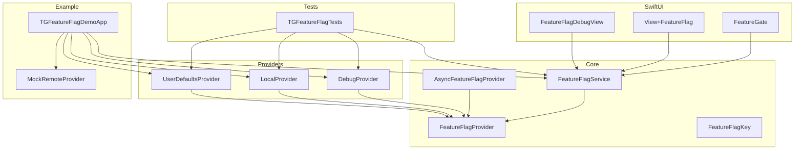
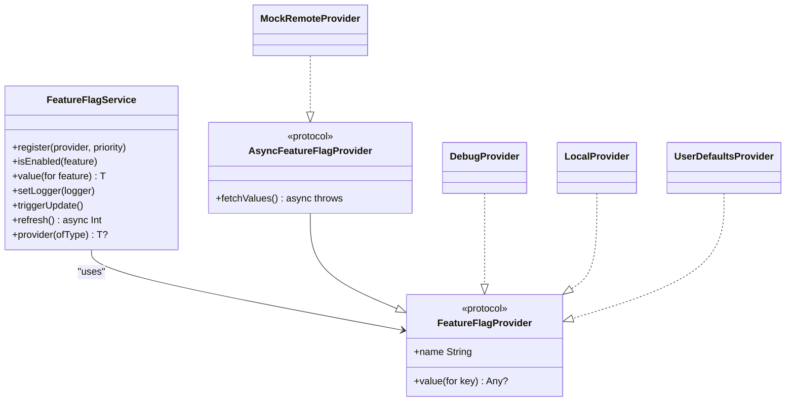
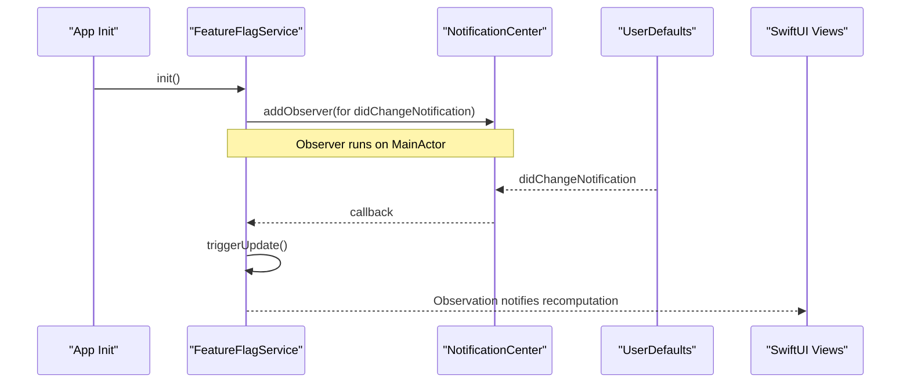
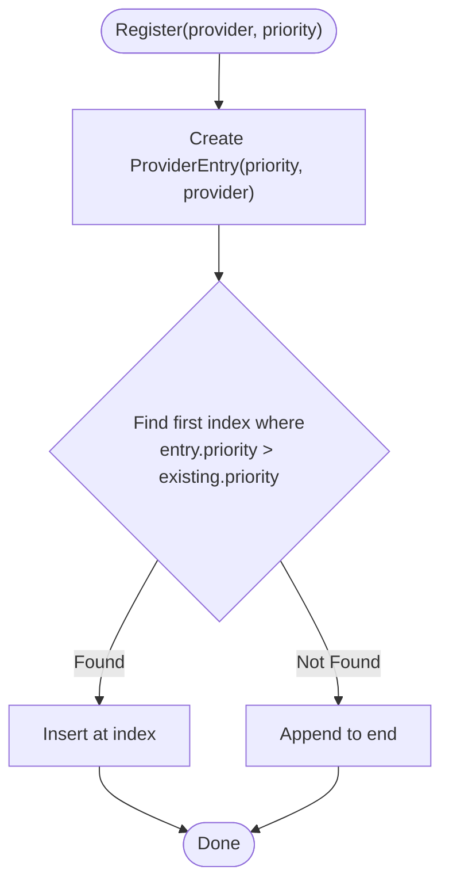
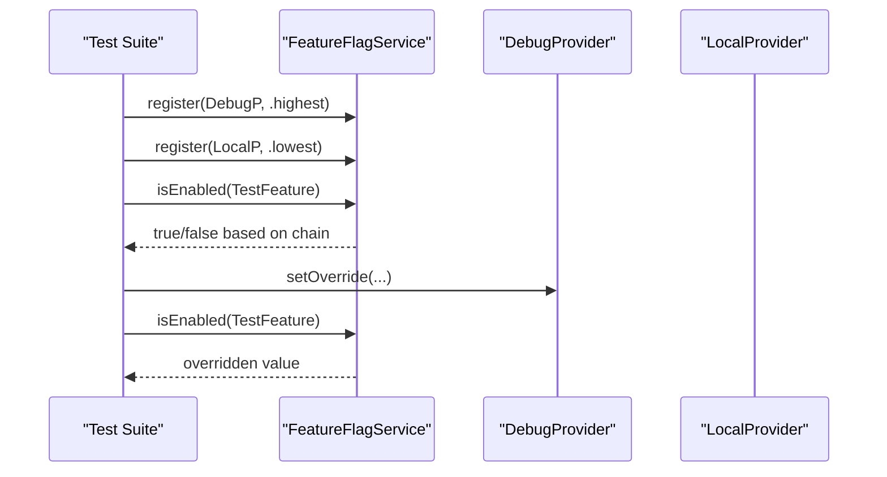
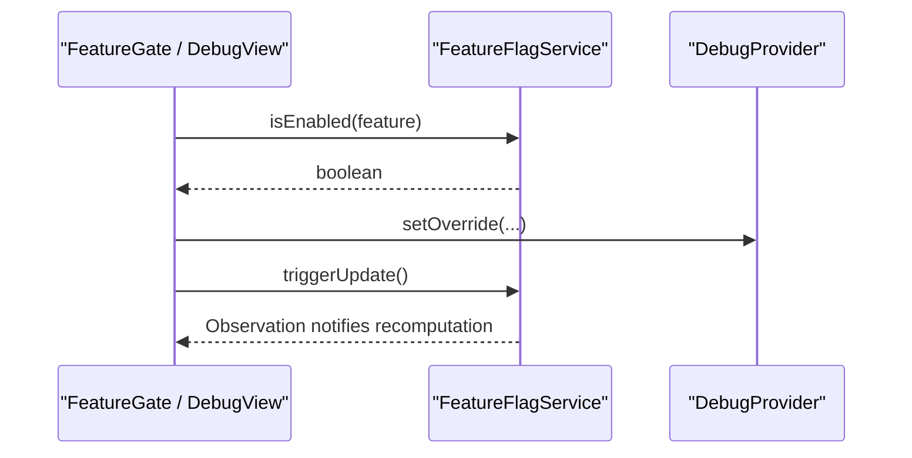
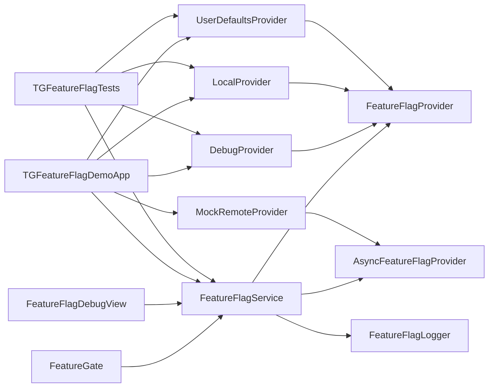

# Service Management & Lifecycle

<cite>
**Referenced Files in This Document**
- [FeatureFlagService.swift](file://Sources/TGFeatureFlag/Core/FeatureFlagService.swift)
- [FeatureFlagProvider.swift](file://Sources/TGFeatureFlag/Core/FeatureFlagProvider.swift)
- [AsyncFeatureFlagProvider.swift](file://Sources/TGFeatureFlag/Core/AsyncFeatureFlagProvider.swift)
- [FeatureFlagKey.swift](file://Sources/TGFeatureFlag/Core/FeatureFlagKey.swift)
- [DebugProvider.swift](file://Sources/TGFeatureFlag/Providers/DebugProvider.swift)
- [LocalProvider.swift](file://Sources/TGFeatureFlag/Providers/LocalProvider.swift)
- [UserDefaultsProvider.swift](file://Sources/TGFeatureFlag/Providers/UserDefaultsProvider.swift)
- [FeatureGate.swift](file://Sources/TGFeatureFlag/SwiftUI/FeatureGate.swift)
- [View+FeatureFlag.swift](file://Sources/TGFeatureFlag/SwiftUI/View+FeatureFlag.swift)
- [FeatureFlagDebugView.swift](file://Sources/TGFeatureFlag/SwiftUI/FeatureFlagDebugView.swift)
- [TGFeatureFlagDemoApp.swift](file://Example/TGFeatureFlagDemo/TGFeatureFlagDemo/TGFeatureFlagDemoApp.swift)
- [MockRemoteProvider.swift](file://Example/TGFeatureFlagDemo/TGFeatureFlagDemo/MockRemoteProvider.swift)
- [TGFeatureFlagTests.swift](file://Tests/TGFeatureFlagTests/TGFeatureFlagTests.swift)
</cite>

## Table of Contents
1. Introduction
2. Project Structure
3. Core Components
4. Architecture Overview
5. Detailed Component Analysis
6. Dependency Analysis
7. Performance Considerations
8. Troubleshooting Guide
9. Conclusion
10. Appendices

## Introduction
This document explains the service management and lifecycle of the Feature Flag system, focusing on initialization, provider registration, memory management, singleton usage, dependency injection, testing strategies, observation integration with SwiftUI’s @Observable macro, change propagation, cleanup procedures, configuration best practices across app architectures, and troubleshooting common lifecycle issues.

## Project Structure
The library is organized into core protocols and services, built-in providers, SwiftUI integration helpers, an example app demonstrating setup, and comprehensive tests.

**Diagram sources**
- [FeatureFlagService.swift:1-195](file://Sources/TGFeatureFlag/Core/FeatureFlagService.swift#L1-L195)
- [FeatureFlagProvider.swift:1-18](file://Sources/TGFeatureFlag/Core/FeatureFlagProvider.swift#L1-L18)
- [AsyncFeatureFlagProvider.swift:1-32](file://Sources/TGFeatureFlag/Core/AsyncFeatureFlagProvider.swift#L1-L32)
- [FeatureFlagKey.swift:1-37](file://Sources/TGFeatureFlag/Core/FeatureFlagKey.swift#L1-L37)
- [DebugProvider.swift:1-38](file://Sources/TGFeatureFlag/Providers/DebugProvider.swift#L1-L38)
- [LocalProvider.swift:1-28](file://Sources/TGFeatureFlag/Providers/LocalProvider.swift#L1-L28)
- [UserDefaultsProvider.swift:1-28](file://Sources/TGFeatureFlag/Providers/UserDefaultsProvider.swift#L1-L28)
- [FeatureGate.swift:1-49](file://Sources/TGFeatureFlag/SwiftUI/FeatureGate.swift#L1-L49)
- [View+FeatureFlag.swift:1-10](file://Sources/TGFeatureFlag/SwiftUI/View+FeatureFlag.swift#L1-L10)
- [FeatureFlagDebugView.swift:1-214](file://Sources/TGFeatureFlag/SwiftUI/FeatureFlagDebugView.swift#L1-L214)
- [TGFeatureFlagDemoApp.swift:1-77](file://Example/TGFeatureFlagDemo/TGFeatureFlagDemo/TGFeatureFlagDemoApp.swift#L1-L77)
- [MockRemoteProvider.swift:1-50](file://Example/TGFeatureFlagDemo/TGFeatureFlagDemo/MockRemoteProvider.swift#L1-L50)
- [TGFeatureFlagTests.swift:1-370](file://Tests/TGFeatureFlagTests/TGFeatureFlagTests.swift#L1-L370)

**Section sources**
- [FeatureFlagService.swift:1-195](file://Sources/TGFeatureFlag/Core/FeatureFlagService.swift#L1-L195)
- [FeatureFlagProvider.swift:1-18](file://Sources/TGFeatureFlag/Core/FeatureFlagProvider.swift#L1-L18)
- [AsyncFeatureFlagProvider.swift:1-32](file://Sources/TGFeatureFlag/Core/AsyncFeatureFlagProvider.swift#L1-L32)
- [FeatureFlagKey.swift:1-37](file://Sources/TGFeatureFlag/Core/FeatureFlagKey.swift#L1-L37)
- [DebugProvider.swift:1-38](file://Sources/TGFeatureFlag/Providers/DebugProvider.swift#L1-L38)
- [LocalProvider.swift:1-28](file://Sources/TGFeatureFlag/Providers/LocalProvider.swift#L1-L28)
- [UserDefaultsProvider.swift:1-28](file://Sources/TGFeatureFlag/Providers/UserDefaultsProvider.swift#L1-L28)
- [FeatureGate.swift:1-49](file://Sources/TGFeatureFlag/SwiftUI/FeatureGate.swift#L1-L49)
- [View+FeatureFlag.swift:1-10](file://Sources/TGFeatureFlag/SwiftUI/View+FeatureFlag.swift#L1-L10)
- [FeatureFlagDebugView.swift:1-214](file://Sources/TGFeatureFlag/SwiftUI/FeatureFlagDebugView.swift#L1-L214)
- [TGFeatureFlagDemoApp.swift:1-77](file://Example/TGFeatureFlagDemo/TGFeatureFlagDemo/TGFeatureFlagDemoApp.swift#L1-L77)
- [MockRemoteProvider.swift:1-50](file://Example/TGFeatureFlagDemo/TGFeatureFlagDemo/MockRemoteProvider.swift#L1-L50)
- [TGFeatureFlagTests.swift:1-370](file://Tests/TGFeatureFlagTests/TGFeatureFlagTests.swift#L1-L370)

## Core Components
- FeatureFlagService: Central manager that aggregates values from multiple providers, supports priority-based resolution, logging, async refresh, and UI observation via Observation framework.
- FeatureFlagProvider: Protocol for synchronous value sources.
- AsyncFeatureFlagProvider: Extends FeatureFlagProvider to support asynchronous fetching and caching.
- FeatureFlagKey: Typed keys with default values and descriptions.
- Built-in Providers: DebugProvider (mutable overrides), LocalProvider (in-memory defaults), UserDefaultsProvider (persistent settings).
- SwiftUI Integration: FeatureGate view, View extension for environment injection, and a debug UI.

Key responsibilities:
- Provider registration and ordering by priority.
- Value resolution with fallback to defaults.
- Logging of resolution events.
- Triggering UI updates when external sources change.
- Refreshing async providers and notifying observers.

**Section sources**
- [FeatureFlagService.swift:25-194](file://Sources/TGFeatureFlag/Core/FeatureFlagService.swift#L25-L194)
- [FeatureFlagProvider.swift:3-17](file://Sources/TGFeatureFlag/Core/FeatureFlagProvider.swift#L3-L17)
- [AsyncFeatureFlagProvider.swift:3-31](file://Sources/TGFeatureFlag/Core/AsyncFeatureFlagProvider.swift#L3-L31)
- [FeatureFlagKey.swift:3-32](file://Sources/TGFeatureFlag/Core/FeatureFlagKey.swift#L3-L32)
- [DebugProvider.swift:3-37](file://Sources/TGFeatureFlag/Providers/DebugProvider.swift#L3-L37)
- [LocalProvider.swift:3-27](file://Sources/TGFeatureFlag/Providers/LocalProvider.swift#L3-L27)
- [UserDefaultsProvider.swift:3-27](file://Sources/TGFeatureFlag/Providers/UserDefaultsProvider.swift#L3-L27)
- [FeatureGate.swift:3-48](file://Sources/TGFeatureFlag/SwiftUI/FeatureGate.swift#L3-L48)
- [View+FeatureFlag.swift:3-9](file://Sources/TGFeatureFlag/SwiftUI/View+FeatureFlag.swift#L3-L9)
- [FeatureFlagDebugView.swift:3-36](file://Sources/TGFeatureFlag/SwiftUI/FeatureFlagDebugView.swift#L3-L36)

## Architecture Overview
The service orchestrates a chain of providers ordered by priority. It integrates with SwiftUI through Observation and provides hooks for logging and async refresh.

**Diagram sources**
- [FeatureFlagService.swift:25-194](file://Sources/TGFeatureFlag/Core/FeatureFlagService.swift#L25-L194)
- [FeatureFlagProvider.swift:3-17](file://Sources/TGFeatureFlag/Core/FeatureFlagProvider.swift#L3-L17)
- [AsyncFeatureFlagProvider.swift:24-31](file://Sources/TGFeatureFlag/Core/AsyncFeatureFlagProvider.swift#L24-L31)
- [DebugProvider.swift:5-37](file://Sources/TGFeatureFlag/Providers/DebugProvider.swift#L5-L37)
- [LocalProvider.swift:5-27](file://Sources/TGFeatureFlag/Providers/LocalProvider.swift#L5-L27)
- [UserDefaultsProvider.swift:9-27](file://Sources/TGFeatureFlag/Providers/UserDefaultsProvider.swift#L9-L27)
- [MockRemoteProvider.swift:8-49](file://Example/TGFeatureFlagDemo/TGFeatureFlagDemo/MockRemoteProvider.swift#L8-L49)

## Detailed Component Analysis

### FeatureFlagService Initialization and Lifecycle
- Initialization:
  - Registers a notification observer for UserDefaults changes on the main queue.
  - Maintains an internal update trigger to force UI recomputation when external state changes.
- Deinitialization:
  - Removes the notification observer to prevent leaks.
- Provider Registration:
  - Inserts providers into a sorted list based on priority; higher priority resolves first.
- Value Resolution:
  - Iterates providers in order, attempts typed cast, logs resolution, and falls back to default if none provided.
- Logging:
  - Optional logger receives events for each resolution attempt and final result.
- UI Updates:
  - Accessing the update trigger registers it as an Observation dependency so views recompute when incremented.
- Async Refresh:
  - Calls fetchValues on all async providers, logs outcomes, increments failure count, then triggers UI update.

**Diagram sources**
- [FeatureFlagService.swift:53-68](file://Sources/TGFeatureFlag/Core/FeatureFlagService.swift#L53-L68)
- [FeatureFlagService.swift:158-161](file://Sources/TGFeatureFlag/Core/FeatureFlagService.swift#L158-L161)

**Section sources**
- [FeatureFlagService.swift:53-68](file://Sources/TGFeatureFlag/Core/FeatureFlagService.swift#L53-L68)
- [FeatureFlagService.swift:89-101](file://Sources/TGFeatureFlag/Core/FeatureFlagService.swift#L89-L101)
- [FeatureFlagService.swift:116-151](file://Sources/TGFeatureFlag/Core/FeatureFlagService.swift#L116-L151)
- [FeatureFlagService.swift:158-161](file://Sources/TGFeatureFlag/Core/FeatureFlagService.swift#L158-L161)
- [FeatureFlagService.swift:169-188](file://Sources/TGFeatureFlag/Core/FeatureFlagService.swift#L169-L188)

### Provider Registration Lifecycle
- Priority model:
  - highest inserts at front, lowest appends at end, custom allows explicit numeric ordering.
- Insertion algorithm:
  - Finds first entry with lower priority than new entry and inserts before it; otherwise appends.
- Lookup:
  - Helper to retrieve a specific provider type by runtime type.

**Diagram sources**
- [FeatureFlagService.swift:89-101](file://Sources/TGFeatureFlag/Core/FeatureFlagService.swift#L89-L101)

**Section sources**
- [FeatureFlagService.swift:75-87](file://Sources/TGFeatureFlag/Core/FeatureFlagService.swift#L75-L87)
- [FeatureFlagService.swift:89-101](file://Sources/TGFeatureFlag/Core/FeatureFlagService.swift#L89-L101)
- [FeatureFlagService.swift:190-193](file://Sources/TGFeatureFlag/Core/FeatureFlagService.swift#L190-L193)

### Memory Management Considerations
- Notification observer:
  - Added during init and removed in deinit to avoid retain cycles or dangling references.
- Weak self in callbacks:
  - Uses weak self inside notification handler to prevent strong reference cycles.
- Thread safety:
  - Providers use locks or concurrent queues to protect mutable state.
- Observation dependencies:
  - Incrementing the update trigger ensures UI recomputes without holding long-lived references beyond necessary.

Best practices:
- Always register providers once during app startup.
- Avoid retaining the service in global singletons unless you intend to keep it alive for the app lifetime.
- Use dedicated UserDefaults suites in tests to isolate data.

**Section sources**
- [FeatureFlagService.swift:53-68](file://Sources/TGFeatureFlag/Core/FeatureFlagService.swift#L53-L68)
- [DebugProvider.swift:8-18](file://Sources/TGFeatureFlag/Providers/DebugProvider.swift#L8-L18)
- [MockRemoteProvider.swift:11-21](file://Example/TGFeatureFlagDemo/TGFeatureFlagDemo/MockRemoteProvider.swift#L11-L21)

### Singleton Pattern Usage and Dependency Injection
- Singleton pattern:
  - The service can be held as a global or app-scoped instance to act as a central registry.
- Dependency injection:
  - Injected into SwiftUI via environment using a View modifier; views access it through @Environment.
- Example app:
  - Creates one service instance, registers providers, and injects it into the root window group.

Recommendations:
- Prefer app-scoped DI (e.g., EnvironmentObject-like approach via environment) for testability.
- For MVVM or VIPER, pass the service explicitly to presenters/controllers rather than relying on globals.

**Section sources**
- [View+FeatureFlag.swift:3-9](file://Sources/TGFeatureFlag/SwiftUI/View+FeatureFlag.swift#L3-L9)
- [FeatureGate.swift:13-14](file://Sources/TGFeatureFlag/SwiftUI/FeatureGate.swift#L13-L14)
- [TGFeatureFlagDemoApp.swift:39-76](file://Example/TGFeatureFlagDemo/TGFeatureFlagDemo/TGFeatureFlagDemoApp.swift#L39-L76)

### Testing Strategies
- Unit tests:
  - Create isolated FeatureFlagService instances per suite.
  - Register mock providers and assert resolution order and fallback behavior.
- Logger verification:
  - Implement a test logger to capture resolution events and verify provider names and values.
- UserDefaults isolation:
  - Use a dedicated suite name and clean up after tests.
- Async provider testing:
  - Mock fetchValues to simulate network delays and failures; assert refresh counts and resulting values.

**Diagram sources**
- [TGFeatureFlagTests.swift:50-72](file://Tests/TGFeatureFlagTests/TGFeatureFlagTests.swift#L50-L72)
- [DebugProvider.swift:20-29](file://Sources/TGFeatureFlag/Providers/DebugProvider.swift#L20-L29)
- [LocalProvider.swift:14-22](file://Sources/TGFeatureFlag/Providers/LocalProvider.swift#L14-L22)

**Section sources**
- [TGFeatureFlagTests.swift:44-72](file://Tests/TGFeatureFlagTests/TGFeatureFlagTests.swift#L44-L72)
- [TGFeatureFlagTests.swift:114-141](file://Tests/TGFeatureFlagTests/TGFeatureFlagTests.swift#L114-L141)
- [TGFeatureFlagTests.swift:155-182](file://Tests/TGFeatureFlagTests/TGFeatureFlagTests.swift#L155-L182)
- [TGFeatureFlagTests.swift:229-255](file://Tests/TGFeatureFlagTests/TGFeatureFlagTests.swift#L229-L255)
- [TGFeatureFlagTests.swift:316-346](file://Tests/TGFeatureFlagTests/TGFeatureFlagTests.swift#L316-L346)

### Observation System Integration with SwiftUI
- @Observable macro:
  - The service is marked observable, enabling automatic dependency tracking.
- Change propagation:
  - Reading the update trigger registers it as a dependency; incrementing it causes dependent views to recompute.
- UserDefaults integration:
  - Observes UserDefaults changes and triggers updates accordingly.
- Debug UI:
  - Reads current values and writes overrides via DebugProvider, calling triggerUpdate to propagate changes.

**Diagram sources**
- [FeatureFlagService.swift:29-31](file://Sources/TGFeatureFlag/Core/FeatureFlagService.swift#L29-L31)
- [FeatureFlagService.swift:116-118](file://Sources/TGFeatureFlag/Core/FeatureFlagService.swift#L116-L118)
- [FeatureFlagService.swift:158-161](file://Sources/TGFeatureFlag/Core/FeatureFlagService.swift#L158-L161)
- [FeatureFlagDebugView.swift:21-33](file://Sources/TGFeatureFlag/SwiftUI/FeatureFlagDebugView.swift#L21-33)
- [FeatureGate.swift:31-37](file://Sources/TGFeatureFlag/SwiftUI/FeatureGate.swift#L31-L37)

**Section sources**
- [FeatureFlagService.swift:29-31](file://Sources/TGFeatureFlag/Core/FeatureFlagService.swift#L29-L31)
- [FeatureFlagService.swift:116-118](file://Sources/TGFeatureFlag/Core/FeatureFlagService.swift#L116-L118)
- [FeatureFlagService.swift:158-161](file://Sources/TGFeatureFlag/Core/FeatureFlagService.swift#L158-L161)
- [FeatureFlagDebugView.swift:21-33](file://Sources/TGFeatureFlag/SwiftUI/FeatureFlagDebugView.swift#L21-33)
- [FeatureGate.swift:31-37](file://Sources/TGFeatureFlag/SwiftUI/FeatureGate.swift#L31-L37)

### Cleanup Procedures
- Remove notification observers in deinit.
- Reset debug overrides when appropriate (e.g., session teardown).
- Clear UserDefaults suites after tests.

**Section sources**
- [FeatureFlagService.swift:66-68](file://Sources/TGFeatureFlag/Core/FeatureFlagService.swift#L66-L68)
- [DebugProvider.swift:31-36](file://Sources/TGFeatureFlag/Providers/DebugProvider.swift#L31-L36)
- [TGFeatureFlagTests.swift:124-127](file://Tests/TGFeatureFlagTests/TGFeatureFlagTests.swift#L124-L127)

## Dependency Analysis
The service depends on provider protocols and optional logging. SwiftUI components depend on the service via environment. Tests depend on concrete providers and mocks.

**Diagram sources**
- [FeatureFlagService.swift:25-194](file://Sources/TGFeatureFlag/Core/FeatureFlagService.swift#L25-L194)
- [FeatureFlagProvider.swift:3-17](file://Sources/TGFeatureFlag/Core/FeatureFlagProvider.swift#L3-L17)
- [AsyncFeatureFlagProvider.swift:24-31](file://Sources/TGFeatureFlag/Core/AsyncFeatureFlagProvider.swift#L24-L31)
- [DebugProvider.swift:5-37](file://Sources/TGFeatureFlag/Providers/DebugProvider.swift#L5-L37)
- [LocalProvider.swift:5-27](file://Sources/TGFeatureFlag/Providers/LocalProvider.swift#L5-L27)
- [UserDefaultsProvider.swift:9-27](file://Sources/TGFeatureFlag/Providers/UserDefaultsProvider.swift#L9-L27)
- [MockRemoteProvider.swift:8-49](file://Example/TGFeatureFlagDemo/TGFeatureFlagDemo/MockRemoteProvider.swift#L8-L49)
- [FeatureGate.swift:13-14](file://Sources/TGFeatureFlag/SwiftUI/FeatureGate.swift#L13-L14)
- [FeatureFlagDebugView.swift:5-9](file://Sources/TGFeatureFlag/SwiftUI/FeatureFlagDebugView.swift#L5-L9)
- [TGFeatureFlagDemoApp.swift:39-76](file://Example/TGFeatureFlagDemo/TGFeatureFlagDemo/TGFeatureFlagDemoApp.swift#L39-L76)
- [TGFeatureFlagTests.swift:44-72](file://Tests/TGFeatureFlagTests/TGFeatureFlagTests.swift#L44-L72)

**Section sources**
- [FeatureFlagService.swift:25-194](file://Sources/TGFeatureFlag/Core/FeatureFlagService.swift#L25-L194)
- [FeatureFlagProvider.swift:3-17](file://Sources/TGFeatureFlag/Core/FeatureFlagProvider.swift#L3-L17)
- [AsyncFeatureFlagProvider.swift:24-31](file://Sources/TGFeatureFlag/Core/AsyncFeatureFlagProvider.swift#L24-L31)
- [DebugProvider.swift:5-37](file://Sources/TGFeatureFlag/Providers/DebugProvider.swift#L5-L37)
- [LocalProvider.swift:5-27](file://Sources/TGFeatureFlag/Providers/LocalProvider.swift#L5-L27)
- [UserDefaultsProvider.swift:9-27](file://Sources/TGFeatureFlag/Providers/UserDefaultsProvider.swift#L9-L27)
- [MockRemoteProvider.swift:8-49](file://Example/TGFeatureFlagDemo/TGFeatureFlagDemo/MockRemoteProvider.swift#L8-L49)
- [FeatureGate.swift:13-14](file://Sources/TGFeatureFlag/SwiftUI/FeatureGate.swift#L13-L14)
- [FeatureFlagDebugView.swift:5-9](file://Sources/TGFeatureFlag/SwiftUI/FeatureFlagDebugView.swift#L5-L9)
- [TGFeatureFlagDemoApp.swift:39-76](file://Example/TGFeatureFlagDemo/TGFeatureFlagDemo/TGFeatureFlagDemoApp.swift#L39-L76)
- [TGFeatureFlagTests.swift:44-72](file://Tests/TGFeatureFlagTests/TGFeatureFlagTests.swift#L44-L72)

## Performance Considerations
- Provider iteration cost:
  - Resolution iterates providers in priority order; keep the chain short and efficient.
- Type casting overhead:
  - Casting resolved values to requested types occurs per call; ensure consistent types between providers and defaults.
- Async refresh:
  - Batch refresh calls and handle errors gracefully; consider debouncing frequent refreshes.
- UserDefaults notifications:
  - Notifications are coalesced by the OS; still avoid excessive writes.

[No sources needed since this section provides general guidance]

## Troubleshooting Guide
Common issues and resolutions:
- Values not updating in UI:
  - Ensure triggerUpdate is called after changing provider state or UserDefaults.
  - Verify that views read service values within body to register Observation dependencies.
- Wrong provider precedence:
  - Confirm registration order and priorities; highest should resolve first.
- Type mismatch crashes:
  - Defaults must match expected types; mismatches cause fatal errors during resolution.
- Missing logger output:
  - Set a logger via setLogger to inspect which provider resolved each flag.
- UserDefaults not reflected:
  - Ensure changes occur on the same UserDefaults instance used by the provider and that notifications are delivered on the main queue.

**Section sources**
- [FeatureFlagService.swift:116-151](file://Sources/TGFeatureFlag/Core/FeatureFlagService.swift#L116-L151)
- [FeatureFlagService.swift:158-161](file://Sources/TGFeatureFlag/Core/FeatureFlagService.swift#L158-L161)
- [FeatureFlagService.swift:103-107](file://Sources/TGFeatureFlag/Core/FeatureFlagService.swift#L103-L107)
- [FeatureFlagService.swift:53-68](file://Sources/TGFeatureFlag/Core/FeatureFlagService.swift#L53-L68)

## Conclusion
The Feature Flag service provides a robust, observable, and extensible mechanism for managing feature flags across Swift apps. By leveraging priority-based provider chains, Observation-driven UI updates, and clear lifecycle management, teams can configure feature flags flexibly while maintaining performance and testability. Following the recommended patterns for initialization, DI, and cleanup ensures reliable behavior across different app architectures.

[No sources needed since this section summarizes without analyzing specific files]

## Appendices

### Best Practices for Service Configuration Across Architectures
- SwiftUI:
  - Create a single service instance at app launch, register providers, and inject via environment using the provided View modifier.
- MVVM:
  - Pass the service to view models via initializer; avoid global singletons to improve testability.
- VIPER/Clean Architecture:
  - Provide the service through a module-level factory or DI container; register providers in the composition root.
- Testing:
  - Use isolated UserDefaults suites and mock providers; assert both resolution results and logger entries.

**Section sources**
- [View+FeatureFlag.swift:3-9](file://Sources/TGFeatureFlag/SwiftUI/View+FeatureFlag.swift#L3-L9)
- [TGFeatureFlagDemoApp.swift:39-76](file://Example/TGFeatureFlagDemo/TGFeatureFlagDemo/TGFeatureFlagDemoApp.swift#L39-L76)
- [TGFeatureFlagTests.swift:114-141](file://Tests/TGFeatureFlagTests/TGFeatureFlagTests.swift#L114-L141)