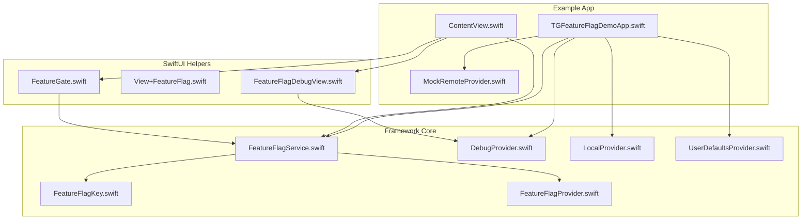
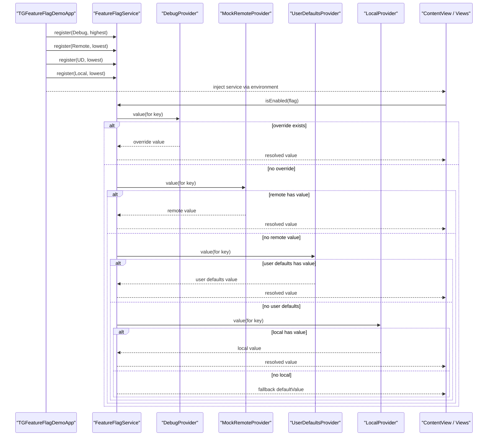
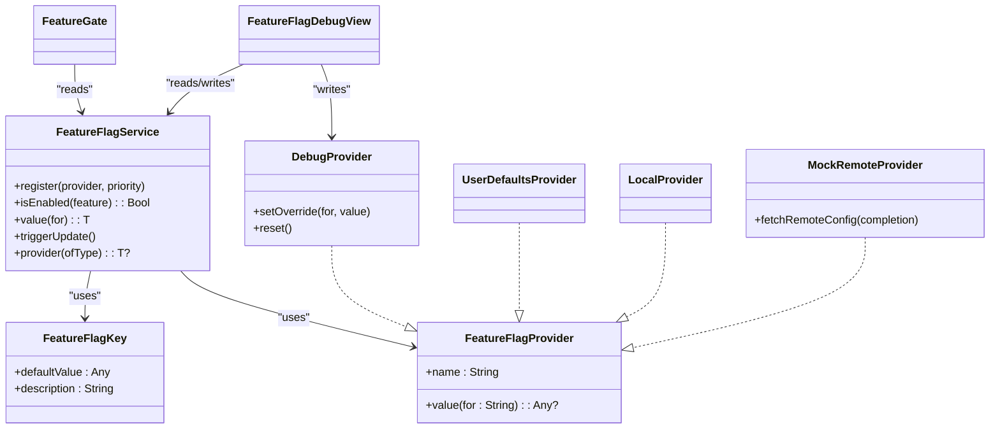

# Examples & Tutorials

<cite>
**Referenced Files in This Document**
- [README.md](file://README.md)
- [TGFeatureFlagDemoApp.swift](file://Example/TGFeatureFlagDemo/TGFeatureFlagDemo/TGFeatureFlagDemoApp.swift)
- [ContentView.swift](file://Example/TGFeatureFlagDemo/TGFeatureFlagDemo/ContentView.swift)
- [MockRemoteProvider.swift](file://Example/TGFeatureFlagDemo/TGFeatureFlagDemo/MockRemoteProvider.swift)
- [FeatureFlagService.swift](file://Sources/TGFeatureFlag/Core/FeatureFlagService.swift)
- [FeatureFlagKey.swift](file://Sources/TGFeatureFlag/Core/FeatureFlagKey.swift)
- [FeatureFlagProvider.swift](file://Sources/TGFeatureFlag/Core/FeatureFlagProvider.swift)
- [DebugProvider.swift](file://Sources/TGFeatureFlag/Providers/DebugProvider.swift)
- [LocalProvider.swift](file://Sources/TGFeatureFlag/Providers/LocalProvider.swift)
- [UserDefaultsProvider.swift](file://Sources/TGFeatureFlag/Providers/UserDefaultsProvider.swift)
- [FeatureGate.swift](file://Sources/TGFeatureFlag/SwiftUI/FeatureGate.swift)
- [View+FeatureFlag.swift](file://Sources/TGFeatureFlag/SwiftUI/View+FeatureFlag.swift)
- [FeatureFlagDebugView.swift](file://Sources/TGFeatureFlag/SwiftUI/FeatureFlagDebugView.swift)
- [TGFeatureFlagTests.swift](file://Tests/TGFeatureFlagTests/TGFeatureFlagTests.swift)
</cite>

## Table of Contents
1. [Introduction](#introduction)
2. [Project Structure](#project-structure)
3. [Core Components](#core-components)
4. [Architecture Overview](#architecture-overview)
5. [Detailed Component Analysis](#detailed-component-analysis)
6. [Dependency Analysis](#dependency-analysis)
7. [Performance Considerations](#performance-considerations)
8. [Troubleshooting Guide](#troubleshooting-guide)
9. [Conclusion](#conclusion)
10. [Appendices](#appendices)

## Introduction
This document provides comprehensive examples and tutorials based on the demo application for TGFeatureFlag, a type-safe feature flag framework for iOS and macOS. You will learn how to:
- Walk through the complete demo app structure
- Implement A/B testing and gradual rollout strategies
- Integrate feature flags into existing applications
- Use and adapt the mock remote provider for production
- Follow best practices and avoid common pitfalls

The tutorial is designed for both new and experienced developers, with step-by-step guidance and diagrams that map directly to the codebase.

## Project Structure
The repository contains:
- Example app demonstrating real-world usage patterns
- Core framework components (service, providers, SwiftUI helpers)
- Tests validating priority chain and typed value handling

**Diagram sources**
- [TGFeatureFlagDemoApp.swift:1-77](file://Example/TGFeatureFlagDemo/TGFeatureFlagDemo/TGFeatureFlagDemoApp.swift#L1-L77)
- [ContentView.swift:1-302](file://Example/TGFeatureFlagDemo/TGFeatureFlagDemo/ContentView.swift#L1-L302)
- [MockRemoteProvider.swift:1-54](file://Example/TGFeatureFlagDemo/TGFeatureFlagDemo/MockRemoteProvider.swift#L1-L54)
- [FeatureFlagService.swift:1-94](file://Sources/TGFeatureFlag/Core/FeatureFlagService.swift#L1-L94)
- [FeatureFlagKey.swift:1-37](file://Sources/TGFeatureFlag/Core/FeatureFlagKey.swift#L1-L37)
- [FeatureFlagProvider.swift:1-18](file://Sources/TGFeatureFlag/Core/FeatureFlagProvider.swift#L1-L18)
- [DebugProvider.swift:1-38](file://Sources/TGFeatureFlag/Providers/DebugProvider.swift#L1-L38)
- [LocalProvider.swift:1-28](file://Sources/TGFeatureFlag/Providers/LocalProvider.swift#L1-L28)
- [UserDefaultsProvider.swift:1-28](file://Sources/TGFeatureFlag/Providers/UserDefaultsProvider.swift#L1-L28)
- [FeatureGate.swift:1-49](file://Sources/TGFeatureFlag/SwiftUI/FeatureGate.swift#L1-L49)
- [View+FeatureFlag.swift:1-10](file://Sources/TGFeatureFlag/SwiftUI/View+FeatureFlag.swift#L1-L10)
- [FeatureFlagDebugView.swift:1-214](file://Sources/TGFeatureFlag/SwiftUI/FeatureFlagDebugView.swift#L1-L214)

**Section sources**
- [README.md:1-150](file://README.md#L1-L150)
- [TGFeatureFlagDemoApp.swift:1-77](file://Example/TGFeatureFlagDemo/TGFeatureFlagDemo/TGFeatureFlagDemoApp.swift#L1-L77)
- [ContentView.swift:1-302](file://Example/TGFeatureFlagDemo/TGFeatureFlagDemo/ContentView.swift#L1-L302)

## Core Components
- FeatureFlagKey: Defines unique identifiers and default values for flags. It supports Bool, String, Int, Double via runtime casting.
- FeatureFlagProvider: Protocol for any source of flag values (debug overrides, UserDefaults, local defaults, remote config).
- FeatureFlagService: Central manager that resolves values by iterating registered providers in priority order; integrates with Observation for UI updates.
- Providers:
  - DebugProvider: In-memory overrides for development/testing.
  - UserDefaultsProvider: Reads from UserDefaults (Settings.bundle integration).
  - LocalProvider: In-memory dictionary or enabled features list.
- SwiftUI Helpers:
  - FeatureGate: Conditional view rendering based on boolean flags.
  - View+FeatureFlag: Environment injection helper.
  - FeatureFlagDebugView: Runtime toggling UI.

Best practices:
- Define flags as enums conforming to FeatureFlagKey with clear descriptions and sensible defaults.
- Register providers with explicit priorities to control resolution order.
- Use FeatureGate for simple conditional views; use service.value(for:) for typed configuration values.
- Trigger UI updates when external sources change (e.g., after fetching remote config).

**Section sources**
- [FeatureFlagKey.swift:1-37](file://Sources/TGFeatureFlag/Core/FeatureFlagKey.swift#L1-L37)
- [FeatureFlagProvider.swift:1-18](file://Sources/TGFeatureFlag/Core/FeatureFlagProvider.swift#L1-L18)
- [FeatureFlagService.swift:1-94](file://Sources/TGFeatureFlag/Core/FeatureFlagService.swift#L1-L94)
- [DebugProvider.swift:1-38](file://Sources/TGFeatureFlag/Providers/DebugProvider.swift#L1-L38)
- [UserDefaultsProvider.swift:1-28](file://Sources/TGFeatureFlag/Providers/UserDefaultsProvider.swift#L1-L28)
- [LocalProvider.swift:1-28](file://Sources/TGFeatureFlag/Providers/LocalProvider.swift#L1-L28)
- [FeatureGate.swift:1-49](file://Sources/TGFeatureFlag/SwiftUI/FeatureGate.swift#L1-L49)
- [View+FeatureFlag.swift:1-10](file://Sources/TGFeatureFlag/SwiftUI/View+FeatureFlag.swift#L1-L10)
- [FeatureFlagDebugView.swift:1-214](file://Sources/TGFeatureFlag/SwiftUI/FeatureFlagDebugView.swift#L1-L214)

## Architecture Overview
The demo app initializes a FeatureFlagService and registers multiple providers. The service resolves values using a priority chain and notifies SwiftUI via Observation.

**Diagram sources**
- [TGFeatureFlagDemoApp.swift:35-77](file://Example/TGFeatureFlagDemo/TGFeatureFlagDemo/TGFeatureFlagDemoApp.swift#L35-L77)
- [FeatureFlagService.swift:43-82](file://Sources/TGFeatureFlag/Core/FeatureFlagService.swift#L43-L82)
- [DebugProvider.swift:14-29](file://Sources/TGFeatureFlag/Providers/DebugProvider.swift#L14-L29)
- [MockRemoteProvider.swift:15-52](file://Example/TGFeatureFlagDemo/TGFeatureFlagDemo/MockRemoteProvider.swift#L15-L52)
- [UserDefaultsProvider.swift:22-26](file://Sources/TGFeatureFlag/Providers/UserDefaultsProvider.swift#L22-L26)
- [LocalProvider.swift:24-26](file://Sources/TGFeatureFlag/Providers/LocalProvider.swift#L24-L26)

## Detailed Component Analysis

### Demo App Setup and Initialization
- The app defines an enum DemoFeature conforming to FeatureFlagKey with descriptive names and default values.
- Providers are registered with explicit priorities:
  - DebugProvider at highest priority for runtime overrides.
  - MockRemoteProvider at lowest priority to simulate server-side configuration.
  - UserDefaultsProvider at lowest priority for persisted settings.
  - LocalProvider at lowest priority for initial defaults.
- The service is injected into the SwiftUI environment so views can access it.

Common pitfalls:
- Misordering providers leads to unexpected precedence. Ensure debug overrides are highest if you want them to win.
- Forgetting to trigger updates after changing external state (e.g., after fetching remote config) can cause stale UI.

**Section sources**
- [TGFeatureFlagDemoApp.swift:5-33](file://Example/TGFeatureFlagDemo/TGFeatureFlagDemo/TGFeatureFlagDemoApp.swift#L5-L33)
- [TGFeatureFlagDemoApp.swift:39-68](file://Example/TGFeatureFlagDemo/TGFeatureFlagDemo/TGFeatureFlagDemoApp.swift#L39-L68)
- [FeatureFlagService.swift:43-50](file://Sources/TGFeatureFlag/Core/FeatureFlagService.swift#L43-L50)

### Using Feature Flags in SwiftUI
- FeatureGate renders alternative content based on boolean flags.
- Direct service access allows branching logic and typed configuration retrieval.
- Navigation visibility and routing can be controlled by flags.

Examples demonstrated in the demo:
- Tab visibility controlled by a flag.
- Home design toggled via FeatureGate.
- Checkout flow branching based on experimental flag.
- API URL read as a string configuration value.
- Product detail navigation conditionally shown or hidden.

Best practices:
- Prefer FeatureGate for simple conditional rendering.
- Use service.isEnabled() and service.value(for:) for complex logic.
- Keep UI responsive by avoiding heavy work inside computed properties; fetch remote config asynchronously and then trigger updates.

**Section sources**
- [ContentView.swift:14-33](file://Example/TGFeatureFlagDemo/TGFeatureFlagDemo/ContentView.swift#L14-L33)
- [ContentView.swift:44-98](file://Example/TGFeatureFlagDemo/TGFeatureFlagDemo/ContentView.swift#L44-L98)
- [ContentView.swift:116-199](file://Example/TGFeatureFlagDemo/TGFeatureFlagDemo/ContentView.swift#L116-L199)
- [FeatureGate.swift:7-38](file://Sources/TGFeatureFlag/SwiftUI/FeatureGate.swift#L7-L38)
- [FeatureFlagService.swift:53-82](file://Sources/TGFeatureFlag/Core/FeatureFlagService.swift#L53-L82)

### Debugging and Runtime Overrides
- FeatureFlagDebugView lists all flags and provides editors for Bool, String, Int, Double.
- Changes are applied to DebugProvider and immediately reflected in the UI via service.triggerUpdate().
- Reset All Overrides clears all debug overrides.

Tips:
- Use the debug view during QA to validate behavior across different states without redeploying.
- Always ensure DebugProvider is registered with highest priority during development.

**Section sources**
- [FeatureFlagDebugView.swift:13-36](file://Sources/TGFeatureFlag/SwiftUI/FeatureFlagDebugView.swift#L13-L36)
- [FeatureFlagDebugView.swift:82-103](file://Sources/TGFeatureFlag/SwiftUI/FeatureFlagDebugView.swift#L82-L103)
- [FeatureFlagDebugView.swift:105-141](file://Sources/TGFeatureFlag/SwiftUI/FeatureFlagDebugView.swift#L105-L141)
- [FeatureFlagDebugView.swift:143-180](file://Sources/TGFeatureFlag/SwiftUI/FeatureFlagDebugView.swift#L143-L180)
- [FeatureFlagDebugView.swift:182-213](file://Sources/TGFeatureFlag/SwiftUI/FeatureFlagDebugView.swift#L182-L213)
- [DebugProvider.swift:20-36](file://Sources/TGFeatureFlag/Providers/DebugProvider.swift#L20-L36)

### Mock Remote Provider and Production Adaptation
- MockRemoteProvider simulates network fetches and updates internal flags asynchronously.
- After updating, it calls completion on the main thread; the caller triggers service.update() to refresh UI.

Adapting for production:
- Replace MockRemoteProvider with a real RemoteConfigProvider that:
  - Fetches configuration from your backend (e.g., Firebase Remote Config).
  - Stores fetched values in a thread-safe store.
  - Emits updates to the service via service.triggerUpdate() when values change.
- Consider caching and retry policies, error handling, and graceful degradation to defaults.

Integration pattern:
- Fetch remote config at app launch or when explicitly triggered.
- On success, update provider storage and call service.triggerUpdate().
- Ensure provider registration order reflects desired precedence (e.g., Debug > Remote > UserDefaults > Local).

**Section sources**
- [MockRemoteProvider.swift:1-54](file://Example/TGFeatureFlagDemo/TGFeatureFlagDemo/MockRemoteProvider.swift#L1-L54)
- [ContentView.swift:269-294](file://Example/TGFeatureFlagDemo/TGFeatureFlagDemo/ContentView.swift#L269-L294)
- [FeatureFlagService.swift:84-87](file://Sources/TGFeatureFlag/Core/FeatureFlagService.swift#L84-L87)

### A/B Testing Implementation
A/B testing typically involves:
- Defining a variant flag (e.g., group assignment).
- Routing users to different experiences based on the variant.
- Measuring outcomes per variant.

Steps:
- Add a variant flag to your enum with a default distribution strategy.
- Use service.value(for:) to retrieve the variant and branch logic accordingly.
- Persist variant assignments if needed (e.g., via UserDefaultsProvider) to maintain consistency across sessions.
- Track analytics events per variant for analysis.

Example references:
- Variant selection and branching can mirror the checkout flow example where experimentalCheckout controls navigation paths.

**Section sources**
- [ContentView.swift:65-78](file://Example/TGFeatureFlagDemo/TGFeatureFlagDemo/ContentView.swift#L65-L78)
- [FeatureFlagService.swift:57-82](file://Sources/TGFeatureFlag/Core/FeatureFlagService.swift#L57-L82)

### Gradual Feature Rollout Strategies
Gradual rollouts involve enabling features for a subset of users over time:
- Start with internal testers (DebugProvider overrides).
- Enable for a small percentage using a remote provider’s configuration.
- Monitor metrics and gradually increase exposure.
- Provide a fast rollback path by disabling the feature remotely.

Implementation tips:
- Use a remote provider to set rollout percentages and feature toggles.
- Combine with UserDefaultsProvider for user-level overrides (e.g., opt-in experiments).
- Ensure UI updates propagate promptly by calling service.triggerUpdate() after changes.

**Section sources**
- [MockRemoteProvider.swift:24-52](file://Example/TGFeatureFlagDemo/TGFeatureFlagDemo/MockRemoteProvider.swift#L24-L52)
- [FeatureFlagService.swift:84-87](file://Sources/TGFeatureFlag/Core/FeatureFlagService.swift#L84-L87)

### Integration With Existing Applications
To integrate into an existing app:
- Define your feature flags as enums conforming to FeatureFlagKey.
- Initialize FeatureFlagService early in app lifecycle and register providers with appropriate priorities.
- Inject the service into the SwiftUI environment using the provided extension.
- Replace hardcoded branches with feature flag checks.

References:
- Service initialization and provider registration in the demo app.
- Environment injection helper for SwiftUI.

**Section sources**
- [TGFeatureFlagDemoApp.swift:39-77](file://Example/TGFeatureFlagDemo/TGFeatureFlagDemo/TGFeatureFlagDemoApp.swift#L39-L77)
- [View+FeatureFlag.swift:3-9](file://Sources/TGFeatureFlag/SwiftUI/View+FeatureFlag.swift#L3-L9)

## Dependency Analysis
The following diagram shows core dependencies between components:

**Diagram sources**
- [FeatureFlagKey.swift:1-37](file://Sources/TGFeatureFlag/Core/FeatureFlagKey.swift#L1-L37)
- [FeatureFlagProvider.swift:1-18](file://Sources/TGFeatureFlag/Core/FeatureFlagProvider.swift#L1-L18)
- [FeatureFlagService.swift:1-94](file://Sources/TGFeatureFlag/Core/FeatureFlagService.swift#L1-L94)
- [DebugProvider.swift:1-38](file://Sources/TGFeatureFlag/Providers/DebugProvider.swift#L1-L38)
- [UserDefaultsProvider.swift:1-28](file://Sources/TGFeatureFlag/Providers/UserDefaultsProvider.swift#L1-L28)
- [LocalProvider.swift:1-28](file://Sources/TGFeatureFlag/Providers/LocalProvider.swift#L1-L28)
- [MockRemoteProvider.swift:1-54](file://Example/TGFeatureFlagDemo/TGFeatureFlagDemo/MockRemoteProvider.swift#L1-L54)
- [FeatureGate.swift:1-49](file://Sources/TGFeatureFlag/SwiftUI/FeatureGate.swift#L1-L49)
- [FeatureFlagDebugView.swift:1-214](file://Sources/TGFeatureFlag/SwiftUI/FeatureFlagDebugView.swift#L1-L214)

**Section sources**
- [FeatureFlagService.swift:12-13](file://Sources/TGFeatureFlag/Core/FeatureFlagService.swift#L12-L13)
- [FeatureFlagService.swift:43-50](file://Sources/TGFeatureFlag/Core/FeatureFlagService.swift#L43-L50)

## Performance Considerations
- Provider resolution is O(n) over registered providers; keep the number of providers reasonable.
- Avoid heavy computations inside view bodies; rely on Observation-driven updates.
- Use asynchronous fetching for remote config and trigger updates only once after completion.
- Prefer UserDefaultsProvider for lightweight persistence; avoid frequent writes in hot paths.

[No sources needed since this section provides general guidance]

## Troubleshooting Guide
Common issues and resolutions:
- Type mismatch errors: Ensure defaultValue types match requested types. The service will crash safety with a fatal error if there is a mismatch.
- Stale UI after remote fetch: Call service.triggerUpdate() after updating provider state.
- Unexpected precedence: Verify provider registration order and priorities. DebugProvider should be highest during development.
- UserDefaults not observed: Ensure UserDefaultsProvider is registered and notifications are handled by the service.

Useful references:
- Priority chain and fallback behavior.
- Manual update trigger mechanism.
- Debug view reset functionality.

**Section sources**
- [FeatureFlagService.swift:73-82](file://Sources/TGFeatureFlag/Core/FeatureFlagService.swift#L73-L82)
- [FeatureFlagService.swift:84-87](file://Sources/TGFeatureFlag/Core/FeatureFlagService.swift#L84-L87)
- [FeatureFlagDebugView.swift:21-33](file://Sources/TGFeatureFlag/SwiftUI/FeatureFlagDebugView.swift#L21-L33)

## Conclusion
TGFeatureFlag provides a flexible, type-safe approach to managing feature flags with a clean architecture and SwiftUI integration. By leveraging the demo app’s patterns—defining flags, registering providers, using FeatureGate, and integrating a remote provider—you can implement robust A/B tests and gradual rollouts while maintaining high-quality user experiences.

[No sources needed since this section summarizes without analyzing specific files]

## Appendices

### Step-by-Step Tutorial: Integrating Feature Flags Into Your App
1. Define flags as enums conforming to FeatureFlagKey with descriptive names and defaults.
2. Initialize FeatureFlagService and register providers with explicit priorities.
3. Inject the service into SwiftUI using the environment helper.
4. Use FeatureGate for conditional views and service methods for typed configuration.
5. Add a debug view for runtime toggling during development.
6. Integrate a remote provider to control flags dynamically.

**Section sources**
- [TGFeatureFlagDemoApp.swift:5-33](file://Example/TGFeatureFlagDemo/TGFeatureFlagDemo/TGFeatureFlagDemoApp.swift#L5-L33)
- [TGFeatureFlagDemoApp.swift:39-77](file://Example/TGFeatureFlagDemo/TGFeatureFlagDemo/TGFeatureFlagDemoApp.swift#L39-L77)
- [FeatureGate.swift:7-38](file://Sources/TGFeatureFlag/SwiftUI/FeatureGate.swift#L7-L38)
- [FeatureFlagDebugView.swift:13-36](file://Sources/TGFeatureFlag/SwiftUI/FeatureFlagDebugView.swift#L13-L36)

### Best Practices Checklist
- Keep provider registration order intentional and documented.
- Use descriptive flag names and provide human-readable descriptions.
- Handle remote fetch failures gracefully by falling back to defaults.
- Trigger UI updates explicitly after external state changes.
- Test priority chains and typed value handling thoroughly.

**Section sources**
- [TGFeatureFlagTests.swift:31-53](file://Tests/TGFeatureFlagTests/TGFeatureFlagTests.swift#L31-L53)
- [TGFeatureFlagTests.swift:57-91](file://Tests/TGFeatureFlagTests/TGFeatureFlagTests.swift#L57-L91)
- [TGFeatureFlagTests.swift:95-121](file://Tests/TGFeatureFlagTests/TGFeatureFlagTests.swift#L95-L121)