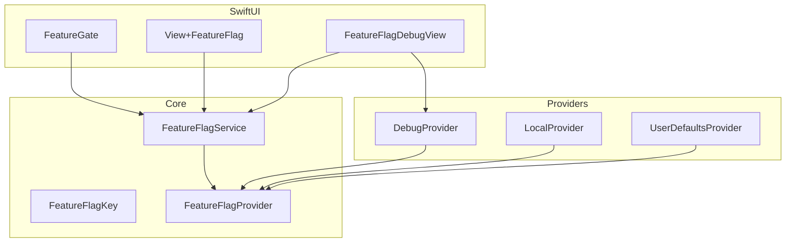
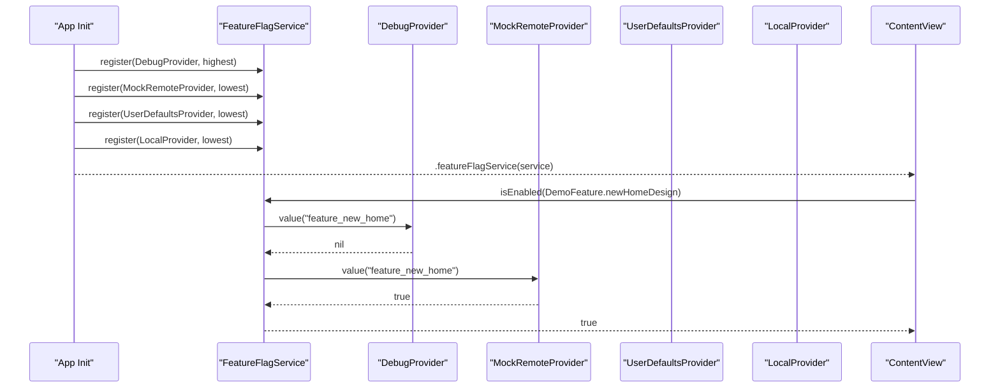
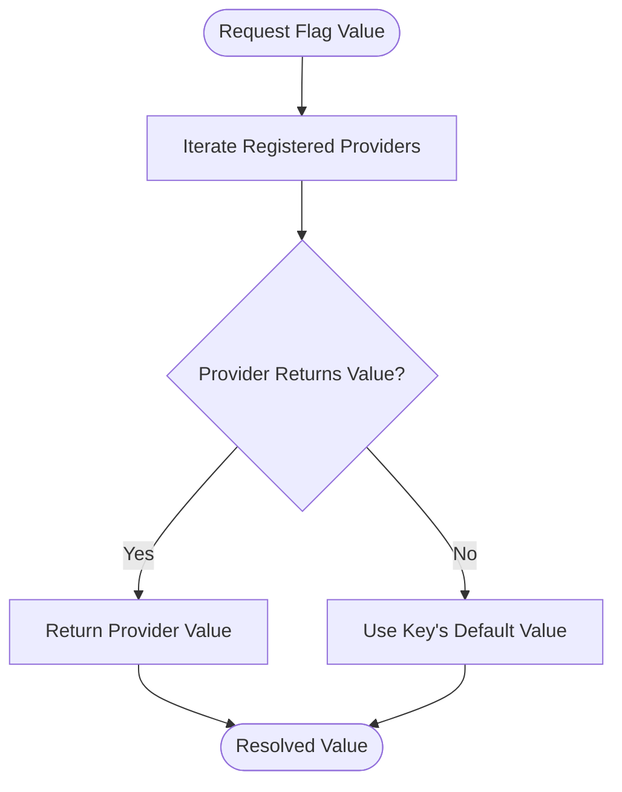
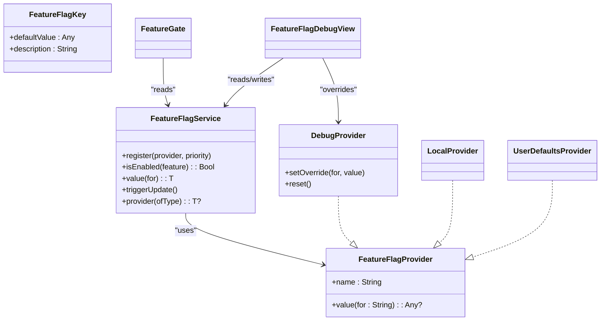

# Getting Started

<cite>
**Referenced Files in This Document**
- [README.md](file://README.md)
- [Package.swift](file://Package.swift)
- [TGFeatureFlagDemoApp.swift](file://Example/TGFeatureFlagDemo/TGFeatureFlagDemo/TGFeatureFlagDemoApp.swift)
- [ContentView.swift](file://Example/TGFeatureFlagDemo/TGFeatureFlagDemo/ContentView.swift)
- [MockRemoteProvider.swift](file://Example/TGFeatureFlagDemo/TGFeatureFlagDemo/MockRemoteProvider.swift)
- [FeatureFlagService.swift](file://Sources/TGFeatureFlag/Core/FeatureFlagService.swift)
- [FeatureFlagKey.swift](file://Sources/TGFeatureFlag/Core/FeatureFlagKey.swift)
- [FeatureFlagProvider.swift](file://Sources/TGFeatureFlag/Core/FeatureFlagProvider.swift)
- [DebugProvider.swift](file://Sources/TGFeatureFlag/Providers/DebugProvider.swift)
- [LocalProvider.swift](file://Sources/TGFeatureFlag/Providers/LocalProvider.swift)
- [UserDefaultsProvider.swift](file://Sources/TGFeatureFlag/Providers/UserDefaultsProvider.swift)
- [FeatureGate.swift](file://Sources/TGFeatureFlag/SwiftUI/FeatureGate.swift)
- [View+FeatureFlag.swift](file://Sources/TGFeatureFlag/SwiftUI/View+FeatureFlag.swift)
- [FeatureFlagDebugView.swift](file://Sources/TGFeatureFlag/SwiftUI/FeatureFlagDebugView.swift)
</cite>

## Table of Contents
1. [Introduction](#introduction)
2. [Project Structure](#project-structure)
3. [Core Components](#core-components)
4. [Architecture Overview](#architecture-overview)
5. [Detailed Component Analysis](#detailed-component-analysis)
6. [Dependency Analysis](#dependency-analysis)
7. [Performance Considerations](#performance-considerations)
8. [Troubleshooting Guide](#troubleshooting-guide)
9. [Conclusion](#conclusion)
10. [Appendices](#appendices)

## Introduction
Feature flags (also called feature toggles) let you decouple feature releases from code deployments. With TGFeatureFlag, you can:
- Safely roll out features to subsets of users or environments
- A/B test UI variants and backend flows
- Dynamically configure app behavior at runtime
- Keep your codebase clean by gating new functionality behind typed, centralized keys

Benefits include safer releases, faster iteration, reduced risk, and the ability to respond quickly to issues without redeploying.

This guide helps you get productive quickly with Swift Package Manager installation, basic setup, flag definition, service initialization, and usage in SwiftUI views. It also includes practical examples from the demo app showing how to define flags, register providers, and use the FeatureGate component.

[No sources needed since this section provides general guidance]

## Project Structure
At a high level, TGFeatureFlag is organized into three layers:
- Core: protocols and central service for resolving values
- Providers: concrete sources of flag values (debug, local, user defaults)
- SwiftUI: components that integrate with SwiftUI’s environment and observation system

**Diagram sources**
- [FeatureFlagService.swift:1-91](file://Sources/TGFeatureFlag/Core/FeatureFlagService.swift#L1-L91)
- [FeatureFlagKey.swift:1-37](file://Sources/TGFeatureFlag/Core/FeatureFlagKey.swift#L1-L37)
- [FeatureFlagProvider.swift:1-18](file://Sources/TGFeatureFlag/Core/FeatureFlagProvider.swift#L1-L18)
- [DebugProvider.swift:1-38](file://Sources/TGFeatureFlag/Providers/DebugProvider.swift#L1-L38)
- [LocalProvider.swift:1-28](file://Sources/TGFeatureFlag/Providers/LocalProvider.swift#L1-L28)
- [UserDefaultsProvider.swift:1-26](file://Sources/TGFeatureFlag/Providers/UserDefaultsProvider.swift#L1-L26)
- [FeatureGate.swift:1-49](file://Sources/TGFeatureFlag/SwiftUI/FeatureGate.swift#L1-L49)
- [View+FeatureFlag.swift:1-10](file://Sources/TGFeatureFlag/SwiftUI/View+FeatureFlag.swift#L1-L10)
- [FeatureFlagDebugView.swift:1-133](file://Sources/TGFeatureFlag/SwiftUI/FeatureFlagDebugView.swift#L1-L133)

**Section sources**
- [Package.swift:1-31](file://Package.swift#L1-L31)

## Core Components
- FeatureFlagKey: Defines each flag’s identity and default value. Implement on an enum conforming to RawRepresentable and Sendable.
- FeatureFlagProvider: Abstract source of flag values. Multiple providers can be chained.
- FeatureFlagService: Central manager that resolves values by iterating through registered providers in priority order, falling back to the key’s default value. Built with Observation to update SwiftUI automatically.

Key behaviors:
- Provider chain resolution: first provider returning a non-nil value wins; otherwise, the key’s defaultValue is used.
- Type-safe accessors: isEnabled for Bool, value(for:) for typed values (Bool, String, Int, Double).
- Environment integration: inject once at the app root and consume via @Environment in views.

**Section sources**
- [FeatureFlagKey.swift:1-37](file://Sources/TGFeatureFlag/Core/FeatureFlagKey.swift#L1-L37)
- [FeatureFlagProvider.swift:1-18](file://Sources/TGFeatureFlag/Core/FeatureFlagProvider.swift#L1-L18)
- [FeatureFlagService.swift:1-91](file://Sources/TGFeatureFlag/Core/FeatureFlagService.swift#L1-L91)

## Architecture Overview
The framework uses a simple but powerful architecture:
- Define flags as enums implementing FeatureFlagKey
- Register one or more providers with FeatureFlagService
- Use FeatureGate or direct service calls in SwiftUI views
- Optionally use the debug view to override flags at runtime

**Diagram sources**
- [TGFeatureFlagDemoApp.swift:35-77](file://Example/TGFeatureFlagDemo/TGFeatureFlagDemo/TGFeatureFlagDemoApp.swift#L35-L77)
- [MockRemoteProvider.swift:1-54](file://Example/TGFeatureFlagDemo/TGFeatureFlagDemo/MockRemoteProvider.swift#L1-L54)
- [FeatureFlagService.swift:40-79](file://Sources/TGFeatureFlag/Core/FeatureFlagService.swift#L40-L79)
- [ContentView.swift:36-113](file://Example/TGFeatureFlagDemo/TGFeatureFlagDemo/ContentView.swift#L36-L113)

## Detailed Component Analysis

### Installation with Swift Package Manager
- Add TGFeatureFlag as a dependency in your Package.swift using the repository URL and version constraint.
- Ensure your target depends on TGFeatureFlag.
- Minimum supported platforms are iOS 17 and macOS 14.

Practical steps:
- Open your Xcode project and add the package dependency.
- Select the TGFeatureFlag product for your app target.
- Build to verify integration.

For exact syntax and platform constraints, see the package manifest and README.

**Section sources**
- [Package.swift:1-31](file://Package.swift#L1-L31)
- [README.md:16-26](file://README.md#L16-L26)

### Step-by-Step Quick Start

1) Define your feature flags
- Create an enum conforming to FeatureFlagKey with raw string identifiers.
- Provide a defaultValue for each case. The demo shows both boolean flags and configuration strings.

See:
- Demo enum definition and defaults
- Description customization for debug UI

**Section sources**
- [TGFeatureFlagDemoApp.swift:4-33](file://Example/TGFeatureFlagDemo/TGFeatureFlagDemo/TGFeatureFlagDemoApp.swift#L4-L33)
- [FeatureFlagKey.swift:1-37](file://Sources/TGFeatureFlag/Core/FeatureFlagKey.swift#L1-L37)

2) Initialize and register providers
- Create a FeatureFlagService instance early in app lifecycle.
- Register providers in desired precedence order:
  - DebugProvider (highest priority) for runtime overrides
  - MockRemoteProvider (simulates remote config)
  - UserDefaultsProvider (persistent settings)
  - LocalProvider (fallback defaults)
- Inject the service into SwiftUI environment using the provided extension.

See:
- Service registration and environment injection
- Environment helper extension

**Section sources**
- [TGFeatureFlagDemoApp.swift:35-77](file://Example/TGFeatureFlagDemo/TGFeatureFlagDemo/TGFeatureFlagDemoApp.swift#L35-L77)
- [View+FeatureFlag.swift:1-10](file://Sources/TGFeatureFlag/SwiftUI/View+FeatureFlag.swift#L1-L10)

3) Use flags in SwiftUI views
- Conditional rendering with FeatureGate:
  - Show different views based on a boolean flag
- Direct service access:
  - Check isEnabled for branching logic
  - Retrieve typed values for configuration flags

See:
- FeatureGate usage in HomeView
- isEnabled checks and typed value retrieval

**Section sources**
- [FeatureGate.swift:1-49](file://Sources/TGFeatureFlag/SwiftUI/FeatureGate.swift#L1-L49)
- [ContentView.swift:36-113](file://Example/TGFeatureFlagDemo/TGFeatureFlagDemo/ContentView.swift#L36-L113)

4) Toggle flags at runtime with the debug view
- Include FeatureFlagDebugView in your app (e.g., Settings screen).
- It reads from the registered DebugProvider and updates the service when changed.

See:
- Debug view navigation and reset action

**Section sources**
- [FeatureFlagDebugView.swift:1-133](file://Sources/TGFeatureFlag/SwiftUI/FeatureFlagDebugView.swift#L1-L133)
- [ContentView.swift:255-302](file://Example/TGFeatureFlagDemo/TGFeatureFlagDemo/ContentView.swift#L255-L302)

### Practical Examples from the Demo App

- Flag definitions and descriptions
  - Demonstrates multiple boolean flags and a configuration string
  - Provides human-readable descriptions for the debug UI

- Provider registration order
  - Shows how priority affects resolution: Debug > Remote > UserDefaults > Local
  - Uses .highest for DebugProvider and .lowest for others

- Using FeatureGate to swap UI variants
  - New vs legacy home design controlled by a single flag

- Branching logic and navigation
  - Checkout flow and detailed navigation toggled via flags

- Configuration values
  - Reads API base URL as a typed string

- Simulated remote config fetch
  - Updates flags asynchronously and triggers UI refresh

**Section sources**
- [TGFeatureFlagDemoApp.swift:35-77](file://Example/TGFeatureFlagDemo/TGFeatureFlagDemo/TGFeatureFlagDemoApp.swift#L35-L77)
- [ContentView.swift:36-113](file://Example/TGFeatureFlagDemo/TGFeatureFlagDemo/ContentView.swift#L36-L113)
- [MockRemoteProvider.swift:1-54](file://Example/TGFeatureFlagDemo/TGFeatureFlagDemo/MockRemoteProvider.swift#L1-L54)

### Conceptual Overview
Conceptually, the framework follows a clear pattern:
- Define flags centrally
- Resolve values through a prioritized chain of providers
- Consume flags declaratively in SwiftUI
- Override safely during development and testing

[No sources needed since this diagram shows conceptual workflow, not actual code structure]

## Dependency Analysis
High-level dependencies between modules:
- FeatureFlagService depends on FeatureFlagProvider implementations
- SwiftUI components depend on FeatureFlagService via environment
- DebugProvider integrates with FeatureFlagDebugView for runtime overrides

**Diagram sources**
- [FeatureFlagService.swift:1-91](file://Sources/TGFeatureFlag/Core/FeatureFlagService.swift#L1-L91)
- [FeatureFlagProvider.swift:1-18](file://Sources/TGFeatureFlag/Core/FeatureFlagProvider.swift#L1-L18)
- [DebugProvider.swift:1-38](file://Sources/TGFeatureFlag/Providers/DebugProvider.swift#L1-L38)
- [LocalProvider.swift:1-28](file://Sources/TGFeatureFlag/Providers/LocalProvider.swift#L1-L28)
- [UserDefaultsProvider.swift:1-26](file://Sources/TGFeatureFlag/Providers/UserDefaultsProvider.swift#L1-L26)
- [FeatureGate.swift:1-49](file://Sources/TGFeatureFlag/SwiftUI/FeatureGate.swift#L1-L49)
- [FeatureFlagDebugView.swift:1-133](file://Sources/TGFeatureFlag/SwiftUI/FeatureFlagDebugView.swift#L1-L133)

**Section sources**
- [FeatureFlagService.swift:1-91](file://Sources/TGFeatureFlag/Core/FeatureFlagService.swift#L1-L91)
- [FeatureFlagKey.swift:1-37](file://Sources/TGFeatureFlag/Core/FeatureFlagKey.swift#L1-L37)
- [FeatureFlagProvider.swift:1-18](file://Sources/TGFeatureFlag/Core/FeatureFlagProvider.swift#L1-L18)

## Performance Considerations
- Provider chain lookup is linear in the number of registered providers. Keep the chain concise and ordered by expected hit frequency.
- Avoid heavy work inside providers’ value(for:) methods; cache results if necessary.
- Prefer registering DebugProvider with highest priority only in debug builds to avoid overhead in production.
- Use UserDefaultsProvider judiciously; frequent writes can trigger notifications and UI updates.

[No sources needed since this section provides general guidance]

## Troubleshooting Guide
Common issues and resolutions:
- Type mismatch errors
  - If a flag’s defaultValue type does not match the requested type, the service will raise a fatal error. Ensure defaultValue aligns with the accessor you use (Bool for isEnabled, correct type for value(for:)).
  - See the service’s fallback and error path.

- Flags not updating after changing UserDefaults
  - The service observes UserDefaults changes and triggers updates. Verify the provider is initialized with the intended UserDefaults instance and that keys match your FeatureFlagKey raw values.

- Debug overrides not taking effect
  - Ensure DebugProvider is registered with highest priority and that the debug view is writing to the same provider instance injected into the service.

- Remote config not reflected immediately
  - After fetching remote config, call service.triggerUpdate() to notify observers. The demo demonstrates this pattern.

**Section sources**
- [FeatureFlagService.swift:56-79](file://Sources/TGFeatureFlag/Core/FeatureFlagService.swift#L56-L79)
- [FeatureFlagService.swift:17-30](file://Sources/TGFeatureFlag/Core/FeatureFlagService.swift#L17-L30)
- [FeatureFlagDebugView.swift:21-33](file://Sources/TGFeatureFlag/SwiftUI/FeatureFlagDebugView.swift#L21-L33)
- [ContentView.swift:269-298](file://Example/TGFeatureFlagDemo/TGFeatureFlagDemo/ContentView.swift#L269-L298)

## Conclusion
TGFeatureFlag provides a type-safe, SwiftUI-friendly way to manage feature flags with a flexible provider chain. By defining flags centrally, initializing the service with appropriate providers, and consuming flags declaratively in views, you can ship features safely and iterate quickly. The included demo app illustrates best practices for provider registration, runtime debugging, and dynamic configuration.

[No sources needed since this section summarizes without analyzing specific files]

## Appendices

### Appendix A: Minimal Setup Checklist
- Install via Swift Package Manager
- Define flags as an enum conforming to FeatureFlagKey
- Initialize FeatureFlagService and register providers
- Inject service into SwiftUI environment
- Use FeatureGate or service directly in views
- Add FeatureFlagDebugView for runtime toggling

**Section sources**
- [README.md:16-137](file://README.md#L16-L137)
- [TGFeatureFlagDemoApp.swift:35-77](file://Example/TGFeatureFlagDemo/TGFeatureFlagDemo/TGFeatureFlagDemoApp.swift#L35-L77)
- [FeatureGate.swift:1-49](file://Sources/TGFeatureFlag/SwiftUI/FeatureGate.swift#L1-L49)
- [FeatureFlagDebugView.swift:1-133](file://Sources/TGFeatureFlag/SwiftUI/FeatureFlagDebugView.swift#L1-L133)