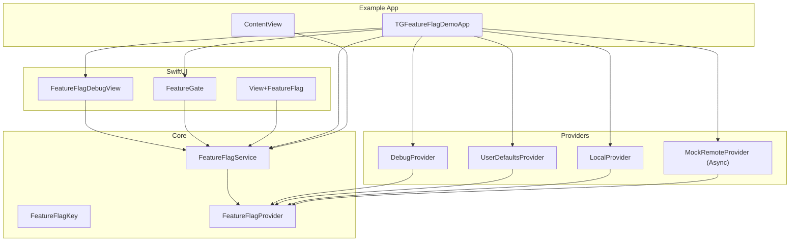
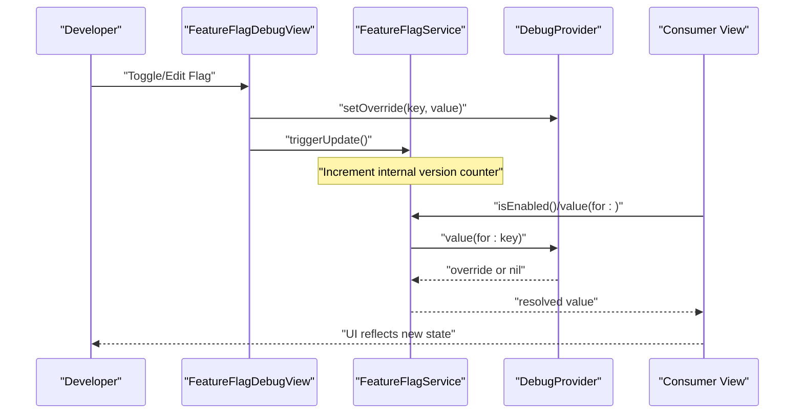
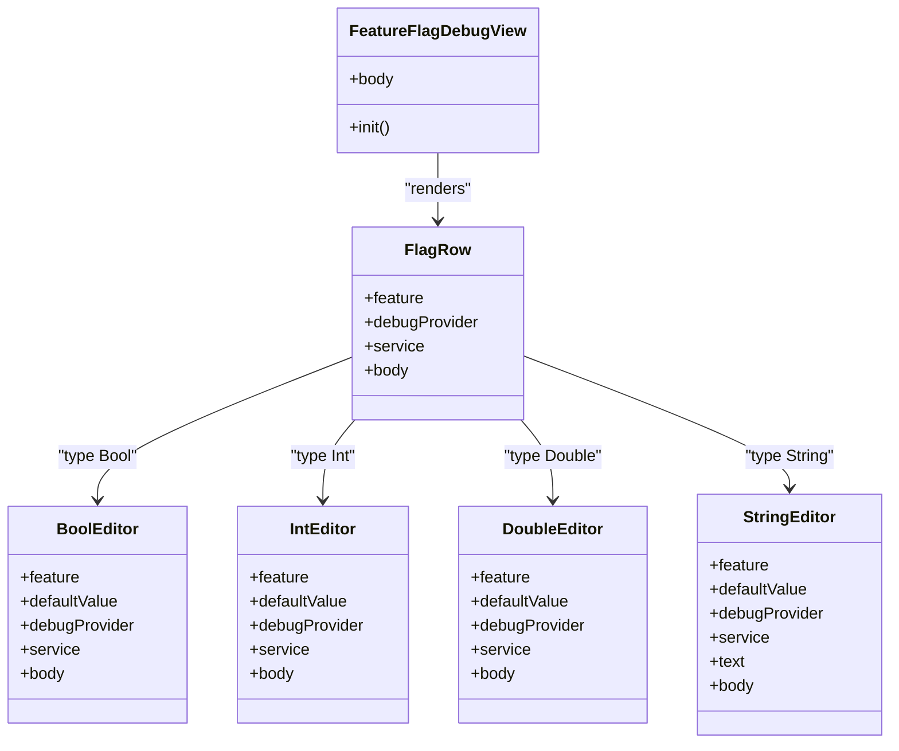
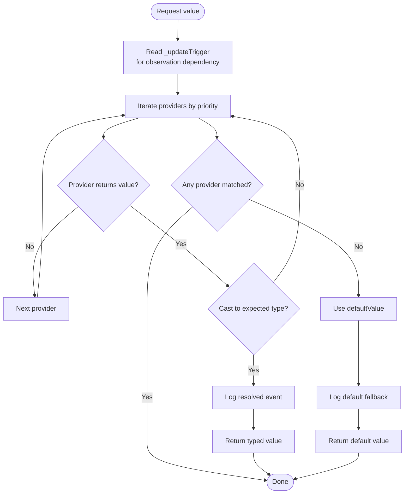
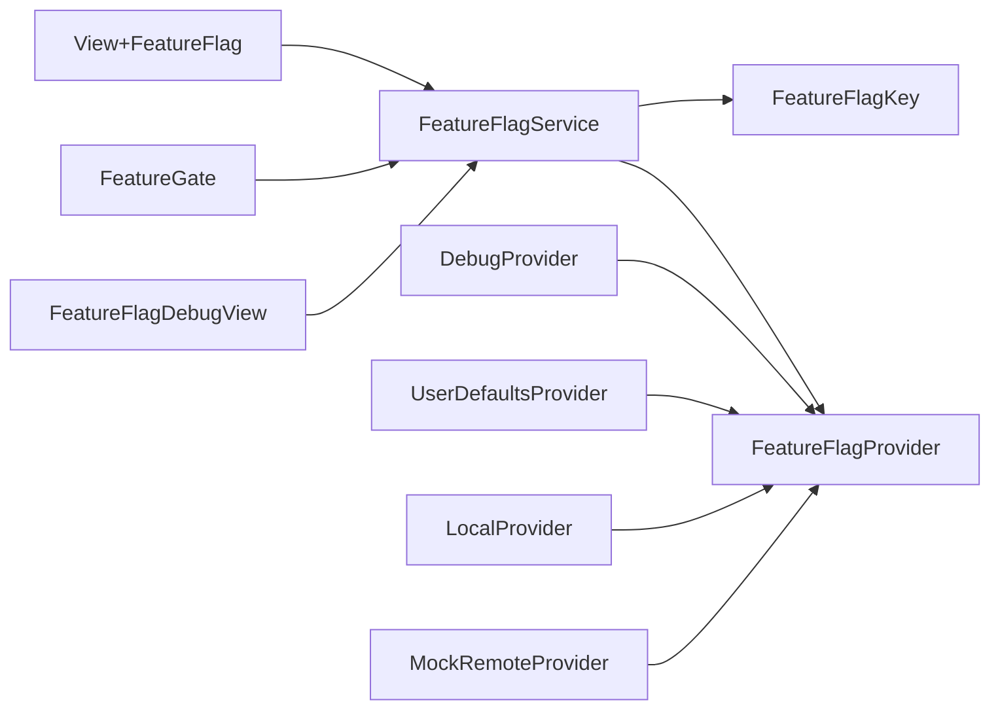

# Debug Interface

<cite>
**Referenced Files in This Document**
- [README.md](file://README.md)
- [Package.swift](file://Package.swift)
- [FeatureFlagDebugView.swift](file://Sources/TGFeatureFlag/SwiftUI/FeatureFlagDebugView.swift)
- [FeatureFlagService.swift](file://Sources/TGFeatureFlag/Core/FeatureFlagService.swift)
- [FeatureFlagKey.swift](file://Sources/TGFeatureFlag/Core/FeatureFlagKey.swift)
- [FeatureFlagProvider.swift](file://Sources/TGFeatureFlag/Core/FeatureFlagProvider.swift)
- [DebugProvider.swift](file://Sources/TGFeatureFlag/Providers/DebugProvider.swift)
- [LocalProvider.swift](file://Sources/TGFeatureFlag/Providers/LocalProvider.swift)
- [UserDefaultsProvider.swift](file://Sources/TGFeatureFlag/Providers/UserDefaultsProvider.swift)
- [FeatureGate.swift](file://Sources/TGFeatureFlag/SwiftUI/FeatureGate.swift)
- [View+FeatureFlag.swift](file://Sources/TGFeatureFlag/SwiftUI/View+FeatureFlag.swift)
- [TGFeatureFlagDemoApp.swift](file://Example/TGFeatureFlagDemo/TGFeatureFlagDemo/TGFeatureFlagDemoApp.swift)
- [ContentView.swift](file://Example/TGFeatureFlagDemo/TGFeatureFlagDemo/ContentView.swift)
- [MockRemoteProvider.swift](file://Example/TGFeatureFlagDemo/TGFeatureFlagDemo/MockRemoteProvider.swift)
- [TGFeatureFlagTests.swift](file://Tests/TGFeatureFlagTests/TGFeatureFlagTests.swift)
</cite>

## Table of Contents
1. Introduction
2. Project Structure
3. Core Components
4. Architecture Overview
5. Detailed Component Analysis
6. Dependency Analysis
7. Performance Considerations
8. Troubleshooting Guide
9. Conclusion
10. Appendices

## Introduction
This document explains how to integrate and use the FeatureFlagDebugView development tool within applications for development builds. It covers:
- Integrating the debug interface into your app’s UI
- Inspecting and modifying feature flag values at runtime
- Conditional compilation strategies for debug-only functionality
- Editor types supported by the debug view (Bool, String, Int, Double)
- How changes propagate through the application
- Secure deployment practices to exclude debug interfaces from production builds
- Debugging workflows and testing strategies using the debug interface

The framework is SwiftUI-ready and leverages Observation-based reactivity so that UI updates automatically when flags change.

## Project Structure
At a high level, the project provides:
- A core service that resolves feature flags across multiple providers with priority ordering
- Providers for different sources (debug overrides, user defaults, local defaults, async remote)
- SwiftUI components for conditional rendering and a debug view for runtime inspection and editing
- An example app demonstrating integration and usage patterns
- Tests validating provider priority, value handling, logging, and async refresh behavior

**Diagram sources**
- [FeatureFlagService.swift:1-195](file://Sources/TGFeatureFlag/Core/FeatureFlagService.swift#L1-L195)
- [FeatureFlagKey.swift:1-37](file://Sources/TGFeatureFlag/Core/FeatureFlagKey.swift#L1-L37)
- [FeatureFlagProvider.swift:1-18](file://Sources/TGFeatureFlag/Core/FeatureFlagProvider.swift#L1-L18)
- [DebugProvider.swift:1-38](file://Sources/TGFeatureFlag/Providers/DebugProvider.swift#L1-L38)
- [UserDefaultsProvider.swift:1-28](file://Sources/TGFeatureFlag/Providers/UserDefaultsProvider.swift#L1-L28)
- [LocalProvider.swift:1-28](file://Sources/TGFeatureFlag/Providers/LocalProvider.swift#L1-L28)
- [MockRemoteProvider.swift:1-50](file://Example/TGFeatureFlagDemo/TGFeatureFlagDemo/MockRemoteProvider.swift#L1-L50)
- [FeatureFlagDebugView.swift:1-214](file://Sources/TGFeatureFlag/SwiftUI/FeatureFlagDebugView.swift#L1-L214)
- [FeatureGate.swift:1-49](file://Sources/TGFeatureFlag/SwiftUI/FeatureGate.swift#L1-L49)
- [View+FeatureFlag.swift:1-10](file://Sources/TGFeatureFlag/SwiftUI/View+FeatureFlag.swift#L1-L10)
- [TGFeatureFlagDemoApp.swift:1-77](file://Example/TGFeatureFlagDemo/TGFeatureFlagDemo/TGFeatureFlagDemoApp.swift#L1-L77)
- [ContentView.swift:1-310](file://Example/TGFeatureFlagDemo/TGFeatureFlagDemo/ContentView.swift#L1-L310)

**Section sources**
- [README.md:1-150](file://README.md#L1-L150)
- [Package.swift:1-31](file://Package.swift#L1-L31)

## Core Components
- FeatureFlagKey: Defines each flag’s identity and default value. Supports Bool, String, Int, Double via an Any-typed default and typed accessors.
- FeatureFlagProvider: Abstract source of flag values. Multiple providers can be chained.
- FeatureFlagService: Central manager that resolves values by iterating registered providers in priority order and falling back to defaults. It is Observable and triggers UI updates on changes.
- DebugProvider: In-memory, thread-safe provider for runtime overrides used during development.
- UserDefaultsProvider: Reads flags from UserDefaults, integrating with Settings or simple persistence.
- LocalProvider: In-memory dictionary provider for initial/local configuration.
- SwiftUI helpers: FeatureGate for conditional rendering and View+FeatureFlag for environment injection.

How it works:
- Register providers with priorities (highest to lowest). The first provider returning a non-nil value wins.
- If no provider returns a value, the key’s defaultValue is used.
- When a provider changes its value (e.g., DebugProvider override), call triggerUpdate() to notify observers.

**Section sources**
- [FeatureFlagKey.swift:1-37](file://Sources/TGFeatureFlag/Core/FeatureFlagKey.swift#L1-L37)
- [FeatureFlagProvider.swift:1-18](file://Sources/TGFeatureFlag/Core/FeatureFlagProvider.swift#L1-L18)
- [FeatureFlagService.swift:1-195](file://Sources/TGFeatureFlag/Core/FeatureFlagService.swift#L1-L195)
- [DebugProvider.swift:1-38](file://Sources/TGFeatureFlag/Providers/DebugProvider.swift#L1-L38)
- [UserDefaultsProvider.swift:1-28](file://Sources/TGFeatureFlag/Providers/UserDefaultsProvider.swift#L1-L28)
- [LocalProvider.swift:1-28](file://Sources/TGFeatureFlag/Providers/LocalProvider.swift#L1-L28)
- [FeatureGate.swift:1-49](file://Sources/TGFeatureFlag/SwiftUI/FeatureGate.swift#L1-L49)
- [View+FeatureFlag.swift:1-10](file://Sources/TGFeatureFlag/SwiftUI/View+FeatureFlag.swift#L1-L10)

## Architecture Overview
The debug interface integrates as follows:
- The app initializes FeatureFlagService and registers providers in precedence order.
- The debug view reads the current resolved value via the service and writes overrides to DebugProvider.
- After writing an override, the view calls triggerUpdate() to force UI recomputation.
- Views observing the service (via @Environment) update automatically.

**Diagram sources**
- [FeatureFlagDebugView.swift:1-214](file://Sources/TGFeatureFlag/SwiftUI/FeatureFlagDebugView.swift#L1-L214)
- [FeatureFlagService.swift:1-195](file://Sources/TGFeatureFlag/Core/FeatureFlagService.swift#L1-L195)
- [DebugProvider.swift:1-38](file://Sources/TGFeatureFlag/Providers/DebugProvider.swift#L1-L38)

## Detailed Component Analysis

### FeatureFlagDebugView and Editors
The debug view lists all defined flags and renders type-specific editors:
- BoolEditor: Toggle switch; shows ON/OFF with color feedback.
- IntEditor: Stepper control; supports reset to default.
- DoubleEditor: Numeric text field with formatted display; supports reset to default.
- StringEditor: Text field; supports reset to default.

Behavior:
- Each editor binds to the current resolved value via the service.
- On change, it sets an override in DebugProvider and triggers an update.
- An indicator icon shows if an override exists for a flag.
- A “Reset All Overrides” button clears all overrides and forces an update.

**Diagram sources**
- [FeatureFlagDebugView.swift:1-214](file://Sources/TGFeatureFlag/SwiftUI/FeatureFlagDebugView.swift#L1-L214)

**Section sources**
- [FeatureFlagDebugView.swift:1-214](file://Sources/TGFeatureFlag/SwiftUI/FeatureFlagDebugView.swift#L1-L214)

### FeatureFlagService Resolution Flow
The service implements a priority chain and fallback mechanism:
- Iterates providers in descending priority order.
- Attempts to cast provider values to the requested type.
- Falls back to the key’s defaultValue if no provider returns a matching value.
- Provides a logger hook to record resolution events.
- Exposes refresh() to asynchronously update AsyncFeatureFlagProvider instances.

**Diagram sources**
- [FeatureFlagService.swift:1-195](file://Sources/TGFeatureFlag/Core/FeatureFlagService.swift#L1-L195)

**Section sources**
- [FeatureFlagService.swift:1-195](file://Sources/TGFeatureFlag/Core/FeatureFlagService.swift#L1-L195)

### Providers
- DebugProvider: Thread-safe in-memory store for runtime overrides. Used exclusively in development/debug builds.
- UserDefaultsProvider: Reads from UserDefaults; integrates with system settings or simple persistence.
- LocalProvider: In-memory dictionary provider for initial/local configuration.
- MockRemoteProvider (example): Implements async refresh to simulate remote config fetching.

Integration pattern:
- Register providers with explicit priorities to define precedence.
- For async providers, call service.refresh() to fetch latest values and trigger updates.

**Section sources**
- [DebugProvider.swift:1-38](file://Sources/TGFeatureFlag/Providers/DebugProvider.swift#L1-L38)
- [UserDefaultsProvider.swift:1-28](file://Sources/TGFeatureFlag/Providers/UserDefaultsProvider.swift#L1-L28)
- [LocalProvider.swift:1-28](file://Sources/TGFeatureFlag/Providers/LocalProvider.swift#L1-L28)
- [MockRemoteProvider.swift:1-50](file://Example/TGFeatureFlagDemo/TGFeatureFlagDemo/MockRemoteProvider.swift#L1-L50)

### SwiftUI Integration Helpers
- FeatureGate: Conditionally renders content based on a boolean flag while observing the service.
- View+FeatureFlag: Convenience extension to inject the service into the environment.

Usage examples are demonstrated in the example app where the debug view is embedded in the navigation hierarchy.

**Section sources**
- [FeatureGate.swift:1-49](file://Sources/TGFeatureFlag/SwiftUI/FeatureGate.swift#L1-L49)
- [View+FeatureFlag.swift:1-10](file://Sources/TGFeatureFlag/SwiftUI/View+FeatureFlag.swift#L1-L10)
- [ContentView.swift:1-310](file://Example/TGFeatureFlagDemo/TGFeatureFlagDemo/ContentView.swift#L1-L310)

## Dependency Analysis
The following diagram highlights direct dependencies among core modules and their relationships.

**Diagram sources**
- [FeatureFlagService.swift:1-195](file://Sources/TGFeatureFlag/Core/FeatureFlagService.swift#L1-L195)
- [FeatureFlagProvider.swift:1-18](file://Sources/TGFeatureFlag/Core/FeatureFlagProvider.swift#L1-L18)
- [FeatureFlagKey.swift:1-37](file://Sources/TGFeatureFlag/Core/FeatureFlagKey.swift#L1-L37)
- [DebugProvider.swift:1-38](file://Sources/TGFeatureFlag/Providers/DebugProvider.swift#L1-L38)
- [UserDefaultsProvider.swift:1-28](file://Sources/TGFeatureFlag/Providers/UserDefaultsProvider.swift#L1-L28)
- [LocalProvider.swift:1-28](file://Sources/TGFeatureFlag/Providers/LocalProvider.swift#L1-L28)
- [MockRemoteProvider.swift:1-50](file://Example/TGFeatureFlagDemo/TGFeatureFlagDemo/MockRemoteProvider.swift#L1-L50)
- [FeatureFlagDebugView.swift:1-214](file://Sources/TGFeatureFlag/SwiftUI/FeatureFlagDebugView.swift#L1-L214)
- [FeatureGate.swift:1-49](file://Sources/TGFeatureFlag/SwiftUI/FeatureGate.swift#L1-L49)
- [View+FeatureFlag.swift:1-10](file://Sources/TGFeatureFlag/SwiftUI/View+FeatureFlag.swift#L1-L10)

**Section sources**
- [Package.swift:1-31](file://Package.swift#L1-L31)

## Performance Considerations
- Provider iteration cost: The service iterates providers per request. Keep the number of providers reasonable and avoid heavy work inside value(for:) calls.
- UI updates: triggerUpdate() increments an internal counter to force recomputation. Avoid excessive calls; batch changes where possible.
- UserDefaults integration: The service observes UserDefaults changes and triggers updates automatically. Be mindful of frequent writes.
- Async refresh: Use refresh() to pull remote values once per session or on demand rather than polling continuously.

[No sources needed since this section provides general guidance]

## Troubleshooting Guide
Common issues and resolutions:
- No DebugProvider found in debug view: Ensure DebugProvider is registered before building the UI. The debug view will show a message if not present.
- Changes do not reflect in UI: Confirm that triggerUpdate() is called after setting overrides. Also verify that views observe the service via environment injection.
- Type mismatch errors: Ensure the defaultValue type matches the requested accessor type. The service enforces type safety and will fail fast if there is a mismatch.
- Priority confusion: Verify registration order and priorities. Highest priority providers resolve first.
- Logging resolution sources: Enable the logger to see which provider resolved each flag and whether defaults were used.

Operational tips:
- Use the “Reset All Overrides” action to clear all debug overrides quickly.
- Use the example app’s Settings screen to simulate remote config refresh and observe behavior.

**Section sources**
- [FeatureFlagDebugView.swift:1-214](file://Sources/TGFeatureFlag/SwiftUI/FeatureFlagDebugView.swift#L1-L214)
- [FeatureFlagService.swift:1-195](file://Sources/TGFeatureFlag/Core/FeatureFlagService.swift#L1-L195)
- [ContentView.swift:1-310](file://Example/TGFeatureFlagDemo/TGFeatureFlagDemo/ContentView.swift#L1-L310)

## Conclusion
The FeatureFlagDebugView provides a powerful, type-safe way to inspect and modify feature flags at runtime during development. By combining a flexible provider chain with SwiftUI reactivity, teams can safely toggle features, test edge cases, and validate behavior without redeploying code. Follow secure deployment practices to ensure debug interfaces are excluded from production builds and leverage tests to validate provider precedence and value handling.

[No sources needed since this section summarizes without analyzing specific files]

## Appendices

### Integration Checklist for Development Builds
- Initialize FeatureFlagService and register providers in desired precedence order.
- Inject the service into the SwiftUI environment at the app root.
- Add FeatureFlagDebugView to a developer menu or settings screen.
- Ensure DebugProvider is registered with highest priority for runtime overrides.
- Use FeatureGate for conditional UI and service.value/isEnabled for logic branching.

**Section sources**
- [TGFeatureFlagDemoApp.swift:1-77](file://Example/TGFeatureFlagDemo/TGFeatureFlagDemo/TGFeatureFlagDemoApp.swift#L1-L77)
- [ContentView.swift:1-310](file://Example/TGFeatureFlagDemo/TGFeatureFlagDemo/ContentView.swift#L1-L310)
- [FeatureGate.swift:1-49](file://Sources/TGFeatureFlag/SwiftUI/FeatureGate.swift#L1-L49)
- [View+FeatureFlag.swift:1-10](file://Sources/TGFeatureFlag/SwiftUI/View+FeatureFlag.swift#L1-L10)

### Conditional Compilation for Debug-Only Functionality
Guidelines:
- Wrap debug-only UI (like the debug view) in build configurations that exclude them from production builds.
- Prefer build targets or compile-time flags to conditionally include debug screens and actions.
- Do not rely solely on runtime checks to hide debug features; ensure they are not compiled into release artifacts.

Note: The repository does not include explicit preprocessor directives for debug-only inclusion. Apply your team’s standard approach to exclude debug UI in production builds.

[No sources needed since this section provides general guidance]

### Supported Editor Types and Behaviors
- Bool: Toggle switch with visual ON/OFF state.
- Int: Stepper with increment/decrement and reset to default.
- Double: Numeric text field with formatted display and reset to default.
- String: Free-form text input with reset to default.

All editors write to DebugProvider and then trigger an update to propagate changes throughout the app.

**Section sources**
- [FeatureFlagDebugView.swift:1-214](file://Sources/TGFeatureFlag/SwiftUI/FeatureFlagDebugView.swift#L1-L214)

### Propagation of Changes
- Writing an override updates DebugProvider.
- Calling triggerUpdate() notifies observers.
- SwiftUI views reading the service recompute and reflect the new value.

**Section sources**
- [FeatureFlagDebugView.swift:1-214](file://Sources/TGFeatureFlag/SwiftUI/FeatureFlagDebugView.swift#L1-L214)
- [FeatureFlagService.swift:1-195](file://Sources/TGFeatureFlag/Core/FeatureFlagService.swift#L1-L195)

### Testing Strategies Using the Debug Interface
- Validate provider precedence by registering DebugProvider at highest priority and asserting overrides take effect.
- Assert fallback to defaults when no provider returns a value.
- Use the logger to confirm which provider resolved each flag.
- Test async provider refresh behavior and error handling.

**Section sources**
- [TGFeatureFlagTests.swift:1-370](file://Tests/TGFeatureFlagTests/TGFeatureFlagTests.swift#L1-L370)

### Example App Wiring
- Demonstrates registering DebugProvider, mock remote provider, UserDefaultsProvider, and LocalProvider.
- Shows embedding FeatureFlagDebugView in navigation and using FeatureGate for conditional UI.

**Section sources**
- [TGFeatureFlagDemoApp.swift:1-77](file://Example/TGFeatureFlagDemo/TGFeatureFlagDemo/TGFeatureFlagDemoApp.swift#L1-L77)
- [ContentView.swift:1-310](file://Example/TGFeatureFlagDemo/TGFeatureFlagDemo/ContentView.swift#L1-L310)
- [MockRemoteProvider.swift:1-50](file://Example/TGFeatureFlagDemo/TGFeatureFlagDemo/MockRemoteProvider.swift#L1-L50)