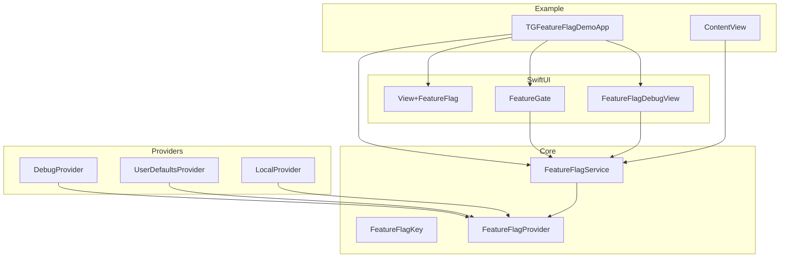
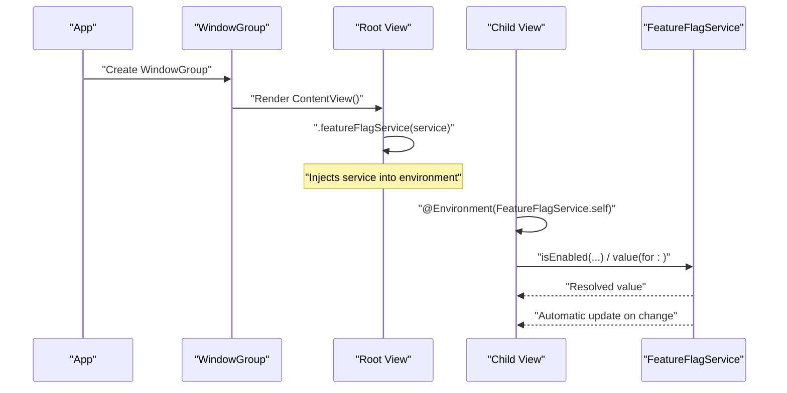
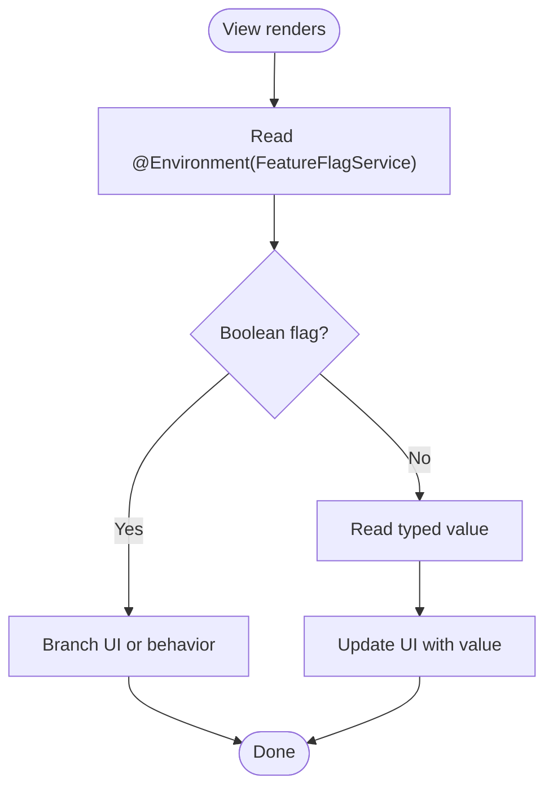
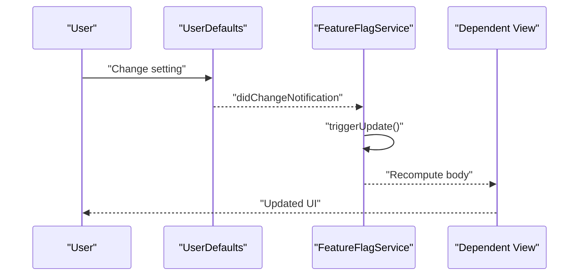
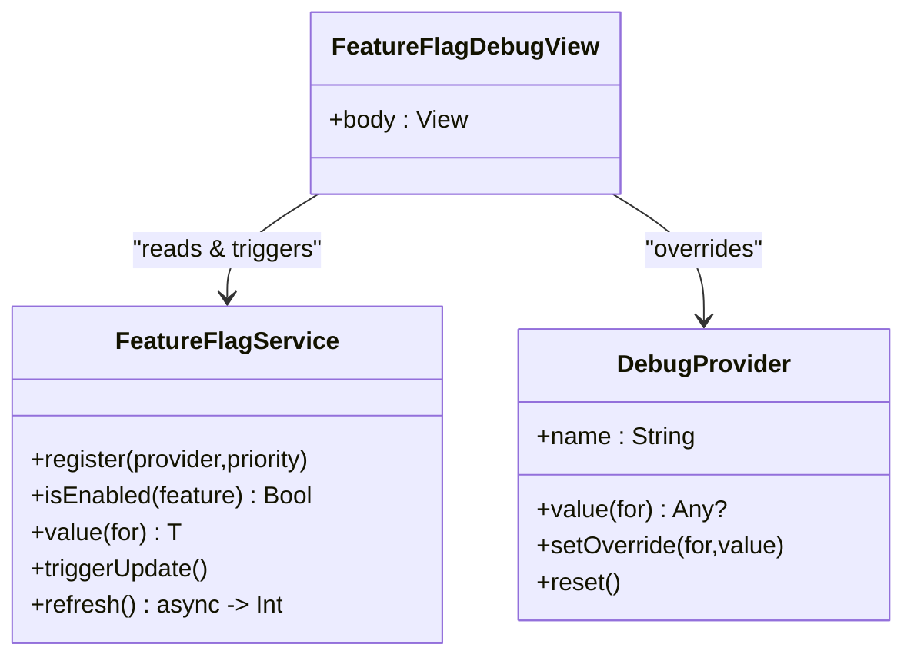
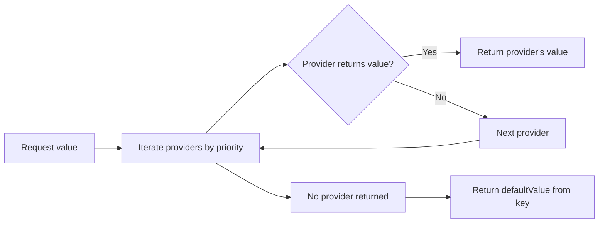
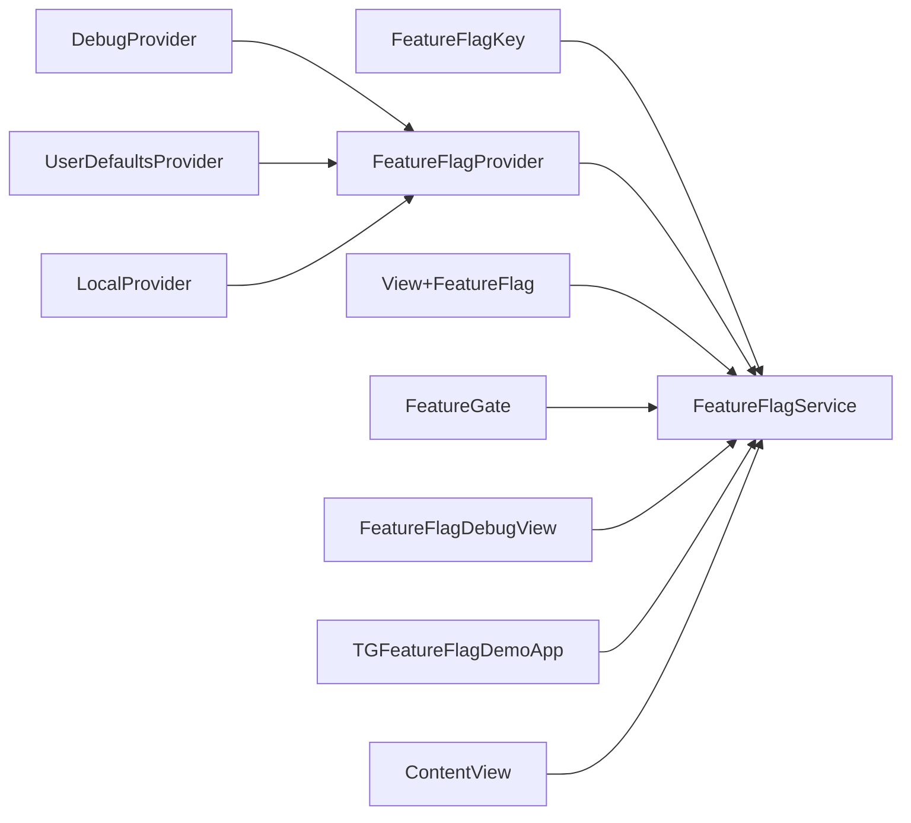

# Environment Injection

<cite>
**Referenced Files in This Document**
- [FeatureFlagService.swift](file://Sources/TGFeatureFlag/Core/FeatureFlagService.swift)
- [FeatureFlagKey.swift](file://Sources/TGFeatureFlag/Core/FeatureFlagKey.swift)
- [FeatureFlagProvider.swift](file://Sources/TGFeatureFlag/Core/FeatureFlagProvider.swift)
- [View+FeatureFlag.swift](file://Sources/TGFeatureFlag/SwiftUI/View+FeatureFlag.swift)
- [FeatureGate.swift](file://Sources/TGFeatureFlag/SwiftUI/FeatureGate.swift)
- [FeatureFlagDebugView.swift](file://Sources/TGFeatureFlag/SwiftUI/FeatureFlagDebugView.swift)
- [DebugProvider.swift](file://Sources/TGFeatureFlag/Providers/DebugProvider.swift)
- [LocalProvider.swift](file://Sources/TGFeatureFlag/Providers/LocalProvider.swift)
- [UserDefaultsProvider.swift](file://Sources/TGFeatureFlag/Providers/UserDefaultsProvider.swift)
- [TGFeatureFlagDemoApp.swift](file://Example/TGFeatureFlagDemo/TGFeatureFlagDemo/TGFeatureFlagDemoApp.swift)
- [ContentView.swift](file://Example/TGFeatureFlagDemo/TGFeatureFlagDemo/ContentView.swift)
</cite>

## Table of Contents
1. [Introduction](#introduction)
2. [Project Structure](#project-structure)
3. [Core Components](#core-components)
4. [Architecture Overview](#architecture-overview)
5. [Detailed Component Analysis](#detailed-component-analysis)
6. [Dependency Analysis](#dependency-analysis)
7. [Performance Considerations](#performance-considerations)
8. [Troubleshooting Guide](#troubleshooting-guide)
9. [Conclusion](#conclusion)

## Introduction
This document explains how to inject FeatureFlagService into SwiftUI’s environment, access feature flags throughout the view hierarchy using View extensions and environment values, and set up injection at different levels of your app structure. It also covers best practices for dependency injection, how the Observation framework enables automatic UI updates, thread safety considerations, and performance implications of environment access patterns.

## Project Structure
The project is organized by capability:
- Core: protocols and the central service that orchestrates provider resolution and observation.
- Providers: concrete sources of flag values (debug overrides, UserDefaults, local defaults).
- SwiftUI: environment helpers, a conditional container view, and a debug UI.
- Example: an app demonstrating setup and usage across multiple views.

**Diagram sources**
- [FeatureFlagService.swift:25-101](file://Sources/TGFeatureFlag/Core/FeatureFlagService.swift#L25-L101)
- [FeatureFlagKey.swift:1-37](file://Sources/TGFeatureFlag/Core/FeatureFlagKey.swift#L1-L37)
- [FeatureFlagProvider.swift:1-18](file://Sources/TGFeatureFlag/Core/FeatureFlagProvider.swift#L1-L18)
- [DebugProvider.swift:1-38](file://Sources/TGFeatureFlag/Providers/DebugProvider.swift#L1-L38)
- [UserDefaultsProvider.swift:1-28](file://Sources/TGFeatureFlag/Providers/UserDefaultsProvider.swift#L1-L28)
- [LocalProvider.swift:1-28](file://Sources/TGFeatureFlag/Providers/LocalProvider.swift#L1-L28)
- [View+FeatureFlag.swift:1-10](file://Sources/TGFeatureFlag/SwiftUI/View+FeatureFlag.swift#L1-L10)
- [FeatureGate.swift:1-49](file://Sources/TGFeatureFlag/SwiftUI/FeatureGate.swift#L1-L49)
- [FeatureFlagDebugView.swift:1-36](file://Sources/TGFeatureFlag/SwiftUI/FeatureFlagDebugView.swift#L1-L36)
- [TGFeatureFlagDemoApp.swift:35-77](file://Example/TGFeatureFlagDemo/TGFeatureFlagDemo/TGFeatureFlagDemoApp.swift#L35-L77)
- [ContentView.swift:1-34](file://Example/TGFeatureFlagDemo/TGFeatureFlagDemo/ContentView.swift#L1-L34)

**Section sources**
- [FeatureFlagService.swift:25-101](file://Sources/TGFeatureFlag/Core/FeatureFlagService.swift#L25-L101)
- [View+FeatureFlag.swift:1-10](file://Sources/TGFeatureFlag/SwiftUI/View+FeatureFlag.swift#L1-L10)
- [FeatureGate.swift:1-49](file://Sources/TGFeatureFlag/SwiftUI/FeatureGate.swift#L1-L49)
- [TGFeatureFlagDemoApp.swift:35-77](file://Example/TGFeatureFlagDemo/TGFeatureFlagDemo/TGFeatureFlagDemoApp.swift#L35-L77)
- [ContentView.swift:1-34](file://Example/TGFeatureFlagDemo/TGFeatureFlagDemo/ContentView.swift#L1-L34)

## Core Components
- FeatureFlagKey: Defines each flag’s identity and default value.
- FeatureFlagProvider: Abstracts any source of flag values.
- FeatureFlagService: Central manager that resolves values from providers in priority order, integrates with Observation for reactive UI updates, and exposes convenience methods like isEnabled and typed value retrieval.
- SwiftUI helpers:
  - View extension to inject the service via .environment.
  - FeatureGate view to conditionally render content based on a boolean flag.
  - FeatureFlagDebugView to inspect and override flags at runtime.

Best practices for DI:
- Create a single FeatureFlagService instance at app startup and inject it once at the root.
- Register providers with explicit priorities to control precedence.
- Keep services immutable after registration; mutate state only through provided APIs.

Observation integration:
- The service is marked as observable and runs on the main actor. Reading its properties registers dependencies so SwiftUI automatically refreshes when values change or when triggerUpdate is called.

Thread safety:
- The service itself is @MainActor. Provider implementations must be Sendable and safe for concurrent reads. Some providers use locks or serial queues to ensure safety.

**Section sources**
- [FeatureFlagKey.swift:1-37](file://Sources/TGFeatureFlag/Core/FeatureFlagKey.swift#L1-L37)
- [FeatureFlagProvider.swift:1-18](file://Sources/TGFeatureFlag/Core/FeatureFlagProvider.swift#L1-L18)
- [FeatureFlagService.swift:25-101](file://Sources/TGFeatureFlag/Core/FeatureFlagService.swift#L25-L101)
- [FeatureFlagService.swift:109-161](file://Sources/TGFeatureFlag/Core/FeatureFlagService.swift#L109-L161)
- [View+FeatureFlag.swift:1-10](file://Sources/TGFeatureFlag/SwiftUI/View+FeatureFlag.swift#L1-L10)
- [FeatureGate.swift:1-49](file://Sources/TGFeatureFlag/SwiftUI/FeatureGate.swift#L1-L49)
- [FeatureFlagDebugView.swift:1-36](file://Sources/TGFeatureFlag/SwiftUI/FeatureFlagDebugView.swift#L1-L36)
- [DebugProvider.swift:1-38](file://Sources/TGFeatureFlag/Providers/DebugProvider.swift#L1-L38)
- [UserDefaultsProvider.swift:1-28](file://Sources/TGFeatureFlag/Providers/UserDefaultsProvider.swift#L1-L28)
- [LocalProvider.swift:1-28](file://Sources/TGFeatureFlag/Providers/LocalProvider.swift#L1-L28)

## Architecture Overview
Environment injection flow:
- At app launch, create FeatureFlagService and register providers with desired priorities.
- Inject the service into the SwiftUI environment at the root scene.
- Views read flags via @Environment(FeatureFlagService.self), enabling automatic UI updates when the service changes.

**Diagram sources**
- [TGFeatureFlagDemoApp.swift:70-76](file://Example/TGFeatureFlagDemo/TGFeatureFlagDemo/TGFeatureFlagDemoApp.swift#L70-L76)
- [View+FeatureFlag.swift:3-9](file://Sources/TGFeatureFlag/SwiftUI/View+FeatureFlag.swift#L3-L9)
- [ContentView.swift:4-13](file://Example/TGFeatureFlagDemo/TGFeatureFlagDemo/ContentView.swift#L4-L13)
- [FeatureFlagService.swift:109-161](file://Sources/TGFeatureFlag/Core/FeatureFlagService.swift#L109-L161)

## Detailed Component Analysis

### Environment Injection Patterns
- Root-level injection:
  - Create FeatureFlagService in the app initializer.
  - Register providers with explicit priorities.
  - Use the View extension to inject the service into the environment at the root.
- Mid-level injection:
  - If you need separate instances per module or feature area, inject at a specific NavigationStack or TabView level.
- Deep-level injection:
  - Views can directly access the service via @Environment without passing it down manually.

Examples in the demo:
- App creates and configures the service, then injects it at the WindowGroup level.
- Multiple child views access the service via @Environment.

**Section sources**
- [TGFeatureFlagDemoApp.swift:35-77](file://Example/TGFeatureFlagDemo/TGFeatureFlagDemo/TGFeatureFlagDemoApp.swift#L35-L77)
- [View+FeatureFlag.swift:3-9](file://Sources/TGFeatureFlag/SwiftUI/View+FeatureFlag.swift#L3-L9)
- [ContentView.swift:4-13](file://Example/TGFeatureFlagDemo/TGFeatureFlagDemo/ContentView.swift#L4-L13)

### Accessing Flags in Views
- Boolean checks:
  - Use isEnabled to branch logic or show/hide UI.
- Typed configuration values:
  - Use value(for:) to retrieve String, Int, Double, etc.
- Conditional rendering:
  - Use FeatureGate to declaratively switch between two view builders.

**Diagram sources**
- [ContentView.swift:14-33](file://Example/TGFeatureFlagDemo/TGFeatureFlagDemo/ContentView.swift#L14-L33)
- [FeatureGate.swift:31-37](file://Sources/TGFeatureFlag/SwiftUI/FeatureGate.swift#L31-L37)
- [FeatureFlagService.swift:109-151](file://Sources/TGFeatureFlag/Core/FeatureFlagService.swift#L109-L151)

**Section sources**
- [ContentView.swift:14-33](file://Example/TGFeatureFlagDemo/TGFeatureFlagDemo/ContentView.swift#L14-L33)
- [FeatureGate.swift:1-49](file://Sources/TGFeatureFlag/SwiftUI/FeatureGate.swift#L1-L49)
- [FeatureFlagService.swift:109-151](file://Sources/TGFeatureFlag/Core/FeatureFlagService.swift#L109-L151)

### Observation and Automatic UI Updates
- The service is annotated as observable and runs on the main actor.
- Reading service properties registers them as dependencies. When internal state changes or triggerUpdate is called, dependent views are refreshed.
- External sources (like UserDefaults) notify the service via notifications, which triggers updates.

**Diagram sources**
- [FeatureFlagService.swift:53-68](file://Sources/TGFeatureFlag/Core/FeatureFlagService.swift#L53-L68)
- [FeatureFlagService.swift:158-161](file://Sources/TGFeatureFlag/Core/FeatureFlagService.swift#L158-L161)

**Section sources**
- [FeatureFlagService.swift:25-68](file://Sources/TGFeatureFlag/Core/FeatureFlagService.swift#L25-L68)
- [FeatureFlagService.swift:158-161](file://Sources/TGFeatureFlag/Core/FeatureFlagService.swift#L158-L161)

### Debugging and Runtime Overrides
- FeatureFlagDebugView provides a list of all flags and editors to override values at runtime.
- Overriding values typically goes through DebugProvider, followed by a manual triggerUpdate to refresh the UI.

**Diagram sources**
- [FeatureFlagService.swift:89-101](file://Sources/TGFeatureFlag/Core/FeatureFlagService.swift#L89-L101)
- [FeatureFlagService.swift:158-161](file://Sources/TGFeatureFlag/Core/FeatureFlagService.swift#L158-L161)
- [DebugProvider.swift:14-36](file://Sources/TGFeatureFlag/Providers/DebugProvider.swift#L14-L36)
- [FeatureFlagDebugView.swift:1-36](file://Sources/TGFeatureFlag/SwiftUI/FeatureFlagDebugView.swift#L1-L36)

**Section sources**
- [FeatureFlagDebugView.swift:1-36](file://Sources/TGFeatureFlag/SwiftUI/FeatureFlagDebugView.swift#L1-L36)
- [DebugProvider.swift:14-36](file://Sources/TGFeatureFlag/Providers/DebugProvider.swift#L14-L36)
- [FeatureFlagService.swift:158-161](file://Sources/TGFeatureFlag/Core/FeatureFlagService.swift#L158-L161)

### Provider Resolution Order
- Providers are stored in a priority-sorted list. Higher priority providers resolve first.
- Typical order: Debug > Remote > UserDefaults > Local defaults.

**Diagram sources**
- [FeatureFlagService.swift:89-101](file://Sources/TGFeatureFlag/Core/FeatureFlagService.swift#L89-L101)
- [FeatureFlagService.swift:116-151](file://Sources/TGFeatureFlag/Core/FeatureFlagService.swift#L116-L151)
- [FeatureFlagKey.swift:21-32](file://Sources/TGFeatureFlag/Core/FeatureFlagKey.swift#L21-L32)

**Section sources**
- [FeatureFlagService.swift:89-101](file://Sources/TGFeatureFlag/Core/FeatureFlagService.swift#L89-L101)
- [FeatureFlagService.swift:116-151](file://Sources/TGFeatureFlag/Core/FeatureFlagService.swift#L116-L151)
- [FeatureFlagKey.swift:21-32](file://Sources/TGFeatureFlag/Core/FeatureFlagKey.swift#L21-L32)

## Dependency Analysis
- FeatureFlagService depends on FeatureFlagProvider implementations.
- SwiftUI components depend on FeatureFlagService via environment.
- Example app wires providers and injects the service at the root.

**Diagram sources**
- [FeatureFlagService.swift:25-101](file://Sources/TGFeatureFlag/Core/FeatureFlagService.swift#L25-L101)
- [FeatureFlagProvider.swift:1-18](file://Sources/TGFeatureFlag/Core/FeatureFlagProvider.swift#L1-L18)
- [DebugProvider.swift:1-38](file://Sources/TGFeatureFlag/Providers/DebugProvider.swift#L1-L38)
- [UserDefaultsProvider.swift:1-28](file://Sources/TGFeatureFlag/Providers/UserDefaultsProvider.swift#L1-L28)
- [LocalProvider.swift:1-28](file://Sources/TGFeatureFlag/Providers/LocalProvider.swift#L1-L28)
- [View+FeatureFlag.swift:1-10](file://Sources/TGFeatureFlag/SwiftUI/View+FeatureFlag.swift#L1-L10)
- [FeatureGate.swift:1-49](file://Sources/TGFeatureFlag/SwiftUI/FeatureGate.swift#L1-L49)
- [FeatureFlagDebugView.swift:1-36](file://Sources/TGFeatureFlag/SwiftUI/FeatureFlagDebugView.swift#L1-L36)
- [TGFeatureFlagDemoApp.swift:35-77](file://Example/TGFeatureFlagDemo/TGFeatureFlagDemo/TGFeatureFlagDemoApp.swift#L35-L77)
- [ContentView.swift:1-34](file://Example/TGFeatureFlagDemo/TGFeatureFlagDemo/ContentView.swift#L1-L34)

**Section sources**
- [FeatureFlagService.swift:25-101](file://Sources/TGFeatureFlag/Core/FeatureFlagService.swift#L25-L101)
- [FeatureFlagProvider.swift:1-18](file://Sources/TGFeatureFlag/Core/FeatureFlagProvider.swift#L1-L18)
- [TGFeatureFlagDemoApp.swift:35-77](file://Example/TGFeatureFlagDemo/TGFeatureFlagDemo/TGFeatureFlagDemoApp.swift#L35-L77)

## Performance Considerations
- Minimize heavy work inside views: read flags and compute lightweight derived values.
- Prefer FeatureGate for simple conditional rendering to avoid redundant branches.
- Avoid excessive calls to triggerUpdate; batch changes where possible.
- Be mindful of provider cost: remote or disk-backed providers should cache results and only refresh when necessary.
- Since the service is @MainActor, keep long-running tasks off the main thread and call back to update the service.

[No sources needed since this section provides general guidance]

## Troubleshooting Guide
Common issues and resolutions:
- No UI updates after changing flags:
  - Ensure you call triggerUpdate after mutating provider state.
  - Verify the service is injected at a common ancestor of affected views.
- Flag not taking effect:
  - Confirm provider registration order and priorities.
  - Check that the key string matches exactly what providers expect.
- Type mismatch errors:
  - Ensure the default value type matches the requested type when calling value(for:).
- Thread safety warnings:
  - Implement providers as Sendable and protect shared state with locks or serial queues.
- UserDefaults changes not reflected:
  - Confirm the service observes UserDefaults notifications and that triggerUpdate is invoked when external changes occur.

**Section sources**
- [FeatureFlagService.swift:53-68](file://Sources/TGFeatureFlag/Core/FeatureFlagService.swift#L53-L68)
- [FeatureFlagService.swift:158-161](file://Sources/TGFeatureFlag/Core/FeatureFlagService.swift#L158-L161)
- [FeatureFlagService.swift:116-151](file://Sources/TGFeatureFlag/Core/FeatureFlagService.swift#L116-L151)
- [DebugProvider.swift:14-36](file://Sources/TGFeatureFlag/Providers/DebugProvider.swift#L14-L36)
- [UserDefaultsProvider.swift:1-28](file://Sources/TGFeatureFlag/Providers/UserDefaultsProvider.swift#L1-L28)

## Conclusion
By injecting FeatureFlagService once at the app root and accessing it via @Environment, you gain a clean, type-safe, and reactive way to control features across your SwiftUI hierarchy. Combine priority-based providers with the Observation framework for seamless UI updates, and leverage the built-in debug tools for rapid iteration. Follow the thread safety and performance guidelines to keep your app responsive and robust.