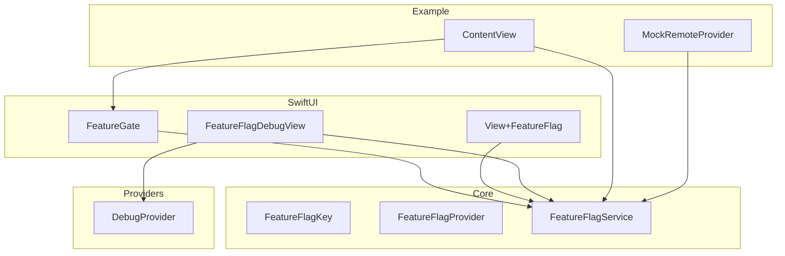
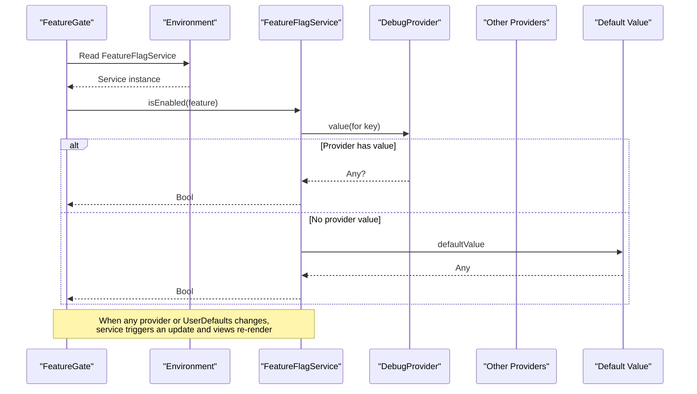
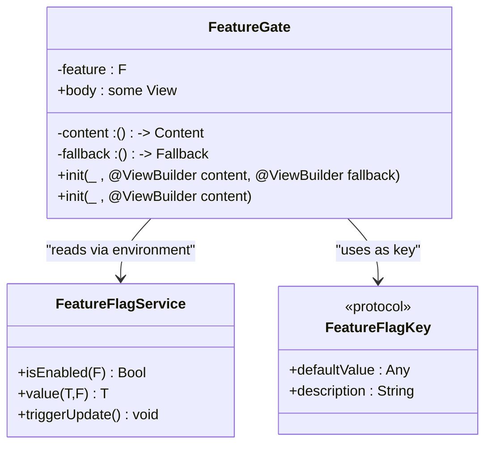
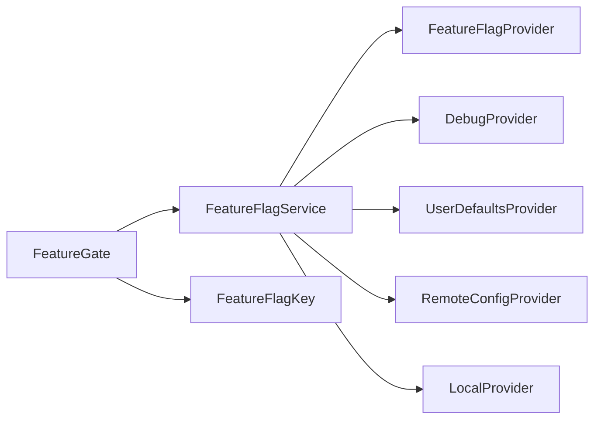

# FeatureGate Component

<cite>
**Referenced Files in This Document**
- [FeatureGate.swift](file://Sources/TGFeatureFlag/SwiftUI/FeatureGate.swift)
- [View+FeatureFlag.swift](file://Sources/TGFeatureFlag/SwiftUI/View+FeatureFlag.swift)
- [FeatureFlagKey.swift](file://Sources/TGFeatureFlag/Core/FeatureFlagKey.swift)
- [FeatureFlagProvider.swift](file://Sources/TGFeatureFlag/Core/FeatureFlagProvider.swift)
- [FeatureFlagService.swift](file://Sources/TGFeatureFlag/Core/FeatureFlagService.swift)
- [DebugProvider.swift](file://Sources/TGFeatureFlag/Providers/DebugProvider.swift)
- [FeatureFlagDebugView.swift](file://Sources/TGFeatureFlag/SwiftUI/FeatureFlagDebugView.swift)
- [ContentView.swift](file://Example/TGFeatureFlagDemo/TGFeatureFlagDemo/ContentView.swift)
- [MockRemoteProvider.swift](file://Example/TGFeatureFlagDemo/TGFeatureFlagDemo/MockRemoteProvider.swift)
</cite>

## Table of Contents
1. [Introduction](#introduction)
2. [Project Structure](#project-structure)
3. [Core Components](#core-components)
4. [Architecture Overview](#architecture-overview)
5. [Detailed Component Analysis](#detailed-component-analysis)
6. [Dependency Analysis](#dependency-analysis)
7. [Performance Considerations](#performance-considerations)
8. [Troubleshooting Guide](#troubleshooting-guide)
9. [Conclusion](#conclusion)
10. [Appendices](#appendices)

## Introduction
This document explains the FeatureGate SwiftUI component for conditional view rendering based on feature flags. It covers both initializers (with and without fallback views), practical usage patterns, type-safe integration with the FeatureFlagKey protocol, automatic reactive updates when flag values change, best practices for organizing conditional UI code, and performance considerations including memory management.

## Project Structure
The FeatureGate component is part of a modular Swift package that provides:
- Core types and service for feature flags
- Providers for different value sources
- SwiftUI integration components
- Example app demonstrating usage

**Diagram sources**
- [FeatureGate.swift:1-49](file://Sources/TGFeatureFlag/SwiftUI/FeatureGate.swift#L1-L49)
- [View+FeatureFlag.swift:1-10](file://Sources/TGFeatureFlag/SwiftUI/View+FeatureFlag.swift#L1-L10)
- [FeatureFlagDebugView.swift:1-214](file://Sources/TGFeatureFlag/SwiftUI/FeatureFlagDebugView.swift#L1-L214)
- [FeatureFlagKey.swift:1-37](file://Sources/TGFeatureFlag/Core/FeatureFlagKey.swift#L1-L37)
- [FeatureFlagProvider.swift:1-18](file://Sources/TGFeatureFlag/Core/FeatureFlagProvider.swift#L1-L18)
- [FeatureFlagService.swift:1-168](file://Sources/TGFeatureFlag/Core/FeatureFlagService.swift#L1-L168)
- [DebugProvider.swift:1-38](file://Sources/TGFeatureFlag/Providers/DebugProvider.swift#L1-L38)
- [ContentView.swift:1-302](file://Example/TGFeatureFlagDemo/TGFeatureFlagDemo/ContentView.swift#L1-L302)
- [MockRemoteProvider.swift:1-54](file://Example/TGFeatureFlagDemo/TGFeatureFlagDemo/MockRemoteProvider.swift#L1-L54)

**Section sources**
- [FeatureGate.swift:1-49](file://Sources/TGFeatureFlag/SwiftUI/FeatureGate.swift#L1-L49)
- [FeatureFlagService.swift:1-168](file://Sources/TGFeatureFlag/Core/FeatureFlagService.swift#L1-L168)
- [FeatureFlagKey.swift:1-37](file://Sources/TGFeatureFlag/Core/FeatureFlagKey.swift#L1-L37)
- [FeatureFlagProvider.swift:1-18](file://Sources/TGFeatureFlag/Core/FeatureFlagProvider.swift#L1-L18)
- [DebugProvider.swift:1-38](file://Sources/TGFeatureFlag/Providers/DebugProvider.swift#L1-L38)
- [FeatureFlagDebugView.swift:1-214](file://Sources/TGFeatureFlag/SwiftUI/FeatureFlagDebugView.swift#L1-L214)
- [ContentView.swift:1-302](file://Example/TGFeatureFlagDemo/TGFeatureFlagDemo/ContentView.swift#L1-L302)
- [MockRemoteProvider.swift:1-54](file://Example/TGFeatureFlagDemo/TGFeatureFlagDemo/MockRemoteProvider.swift#L1-L54)

## Core Components
- FeatureGate: A SwiftUI container view that conditionally renders content based on a boolean feature flag. It observes the FeatureFlagService via environment to reactively update when flag values change.
- FeatureFlagKey: Protocol defining unique identifiers and default values for feature flags.
- FeatureFlagProvider: Protocol abstracting value sources (debug overrides, remote config, local defaults).
- FeatureFlagService: Central manager aggregating providers, resolving values by priority, and exposing typed accessors. It uses Observation to drive reactive UI updates.
- View+FeatureFlag: Convenience extension to inject the service into the SwiftUI environment.
- DebugProvider and FeatureFlagDebugView: Tools for runtime toggling and inspection of flags.

**Section sources**
- [FeatureGate.swift:1-49](file://Sources/TGFeatureFlag/SwiftUI/FeatureGate.swift#L1-L49)
- [FeatureFlagKey.swift:1-37](file://Sources/TGFeatureFlag/Core/FeatureFlagKey.swift#L1-L37)
- [FeatureFlagProvider.swift:1-18](file://Sources/TGFeatureFlag/Core/FeatureFlagProvider.swift#L1-L18)
- [FeatureFlagService.swift:1-168](file://Sources/TGFeatureFlag/Core/FeatureFlagService.swift#L1-L168)
- [View+FeatureFlag.swift:1-10](file://Sources/TGFeatureFlag/SwiftUI/View+FeatureFlag.swift#L1-L10)
- [DebugProvider.swift:1-38](file://Sources/TGFeatureFlag/Providers/DebugProvider.swift#L1-L38)
- [FeatureFlagDebugView.swift:1-214](file://Sources/TGFeatureFlag/SwiftUI/FeatureFlagDebugView.swift#L1-L214)

## Architecture Overview
FeatureGate integrates with the SwiftUI environment to observe changes from FeatureFlagService. The service resolves values through a chain of providers ordered by priority and falls back to default values defined by FeatureFlagKey.

**Diagram sources**
- [FeatureGate.swift:1-49](file://Sources/TGFeatureFlag/SwiftUI/FeatureGate.swift#L1-L49)
- [FeatureFlagService.swift:1-168](file://Sources/TGFeatureFlag/Core/FeatureFlagService.swift#L1-L168)
- [DebugProvider.swift:1-38](file://Sources/TGFeatureFlag/Providers/DebugProvider.swift#L1-L38)
- [FeatureFlagKey.swift:1-37](file://Sources/TGFeatureFlag/Core/FeatureFlagKey.swift#L1-L37)

## Detailed Component Analysis

### FeatureGate: Conditional Rendering View
FeatureGate is a generic SwiftUI view that takes a FeatureFlagKey and two view builders: one for enabled state and one for disabled state. It reads the current value from FeatureFlagService and renders either the content or fallback accordingly.

Initializers:
- With fallback: Accepts a feature key, a content builder for enabled state, and a fallback builder for disabled state.
- Without fallback: A convenience initializer where the fallback defaults to an empty view.

Reactivity:
- Reads the FeatureFlagService from the environment.
- Uses the service’s observation mechanism so that any change to resolved flag values automatically triggers a view update.

Usage patterns:
- Simple boolean gating: Show or hide a view block.
- Complex conditional UI: Nest multiple gates or combine with other logic inside the content/fallback closures.

Best practices:
- Keep content and fallback lightweight; avoid heavy work inside closures.
- Prefer small, focused views behind each gate to improve readability and testability.
- Use descriptive keys and clear default values to reduce ambiguity.

**Section sources**
- [FeatureGate.swift:1-49](file://Sources/TGFeatureFlag/SwiftUI/FeatureGate.swift#L1-L49)
- [FeatureFlagService.swift:1-168](file://Sources/TGFeatureFlag/Core/FeatureFlagService.swift#L1-L168)

#### Class and Relationship Diagram

**Diagram sources**
- [FeatureGate.swift:1-49](file://Sources/TGFeatureFlag/SwiftUI/FeatureGate.swift#L1-L49)
- [FeatureFlagService.swift:1-168](file://Sources/TGFeatureFlag/Core/FeatureFlagService.swift#L1-L168)
- [FeatureFlagKey.swift:1-37](file://Sources/TGFeatureFlag/Core/FeatureFlagKey.swift#L1-L37)

### Type-Safe Integration with FeatureFlagKey
FeatureFlagKey defines:
- A raw string identifier for storage and lookup.
- A default value used when no provider returns a value.
- A human-readable description for debugging.

Type safety:
- FeatureFlagService.value(for:) is generic over the expected type, ensuring compile-time checks for configuration flags.
- For boolean flags, use isEnabled(_:), which internally calls value(for:) with Bool.

Practical guidance:
- Define enums with explicit raw values for stability across builds.
- Provide sensible defaults for all cases to avoid unexpected behavior.

**Section sources**
- [FeatureFlagKey.swift:1-37](file://Sources/TGFeatureFlag/Core/FeatureFlagKey.swift#L1-L37)
- [FeatureFlagService.swift:1-168](file://Sources/TGFeatureFlag/Core/FeatureFlagService.swift#L1-L168)

### Automatic Reactive Updates
FeatureFlagService uses Observation to notify dependent views when its internal state changes. Triggers include:
- Direct overrides via DebugProvider.
- External changes observed through notifications (e.g., UserDefaults).
- Manual triggerUpdate() calls after asynchronous operations.

Flow:
- Views read service properties during body evaluation.
- When service updates, dependent views are re-evaluated.
- FeatureGate re-renders the appropriate branch based on the new value.

**Section sources**
- [FeatureFlagService.swift:1-168](file://Sources/TGFeatureFlag/Core/FeatureFlagService.swift#L1-L168)
- [FeatureFlagDebugView.swift:1-214](file://Sources/TGFeatureFlag/SwiftUI/FeatureFlagDebugView.swift#L1-L214)

### Practical Usage Examples
Below are common patterns demonstrated in the example app:

- Simple boolean gating with FeatureGate:
  - Shows a modern design when enabled, otherwise shows legacy design.
  - See usage path: [ContentView.swift:45-63](file://Example/TGFeatureFlagDemo/TGFeatureFlagDemo/ContentView.swift#L45-L63)

- Conditional navigation and routing:
  - Choose between detailed and simple specification views based on a flag.
  - See usage path: [ContentView.swift:155-172](file://Example/TGFeatureFlagDemo/TGFeatureFlagDemo/ContentView.swift#L155-L172)

- Configuration values (non-boolean):
  - Retrieve a string URL for API base endpoint.
  - See usage path: [ContentView.swift:86-95](file://Example/TGFeatureFlagDemo/TGFeatureFlagDemo/ContentView.swift#L86-L95)

- Runtime toggling via debug view:
  - Toggle flags at runtime and see immediate UI updates.
  - See usage path: [FeatureFlagDebugView.swift:1-214](file://Sources/TGFeatureFlag/SwiftUI/FeatureFlagDebugView.swift#L1-L214)

- Simulated remote config updates:
  - Fetch remote configuration and trigger UI refresh.
  - See usage path: [MockRemoteProvider.swift:24-52](file://Example/TGFeatureFlagDemo/TGFeatureFlagDemo/MockRemoteProvider.swift#L24-L52)

**Section sources**
- [ContentView.swift:1-302](file://Example/TGFeatureFlagDemo/TGFeatureFlagDemo/ContentView.swift#L1-L302)
- [FeatureFlagDebugView.swift:1-214](file://Sources/TGFeatureFlag/SwiftUI/FeatureFlagDebugView.swift#L1-L214)
- [MockRemoteProvider.swift:1-54](file://Example/TGFeatureFlagDemo/TGFeatureFlagDemo/MockRemoteProvider.swift#L1-L54)

### Environment Injection Helper
A convenience extension allows injecting the FeatureFlagService into the SwiftUI environment at the root of your app.

- Extension method: featureFlagService(_:)
- Typical placement: At the app’s root scene or window group.

**Section sources**
- [View+FeatureFlag.swift:1-10](file://Sources/TGFeatureFlag/SwiftUI/View+FeatureFlag.swift#L1-L10)

## Dependency Analysis
FeatureGate depends on FeatureFlagService and FeatureFlagKey. FeatureFlagService aggregates multiple FeatureFlagProvider implementations and supports logging and manual update triggers.

**Diagram sources**
- [FeatureGate.swift:1-49](file://Sources/TGFeatureFlag/SwiftUI/FeatureGate.swift#L1-L49)
- [FeatureFlagService.swift:1-168](file://Sources/TGFeatureFlag/Core/FeatureFlagService.swift#L1-L168)
- [FeatureFlagProvider.swift:1-18](file://Sources/TGFeatureFlag/Core/FeatureFlagProvider.swift#L1-L18)
- [DebugProvider.swift:1-38](file://Sources/TGFeatureFlag/Providers/DebugProvider.swift#L1-L38)

**Section sources**
- [FeatureGate.swift:1-49](file://Sources/TGFeatureFlag/SwiftUI/FeatureGate.swift#L1-L49)
- [FeatureFlagService.swift:1-168](file://Sources/TGFeatureFlag/Core/FeatureFlagService.swift#L1-L168)
- [FeatureFlagProvider.swift:1-18](file://Sources/TGFeatureFlag/Core/FeatureFlagProvider.swift#L1-L18)
- [DebugProvider.swift:1-38](file://Sources/TGFeatureFlag/Providers/DebugProvider.swift#L1-L38)

## Performance Considerations
- Minimize work inside FeatureGate closures:
  - Avoid expensive computations or network calls in content/fallback builders.
  - Precompute values outside the closure and pass them in.
- Prefer small, focused views behind gates to reduce diffing overhead.
- Use the service’s typed accessors efficiently:
  - Cache frequently accessed non-boolean values in view state if needed.
- Leverage Observation-driven updates:
  - Only call triggerUpdate() when necessary (e.g., after remote config fetch).
- Memory management:
  - FeatureGate holds weak references to closures; keep captured data minimal.
  - Avoid capturing large objects in closures passed to FeatureGate.

[No sources needed since this section provides general guidance]

## Troubleshooting Guide
Common issues and resolutions:
- Flag not updating in UI:
  - Ensure FeatureFlagService is injected into the environment.
  - After changing provider values, call triggerUpdate() to force a refresh.
  - See usage path: [FeatureFlagDebugView.swift:23-26](file://Sources/TGFeatureFlag/SwiftUI/FeatureFlagDebugView.swift#L23-L26)
- Type mismatch errors:
  - If requesting a specific type but the default value differs, the service will raise a fatal error. Align default values with expected types.
  - See usage path: [FeatureFlagService.swift:142-151](file://Sources/TGFeatureFlag/Core/FeatureFlagService.swift#L142-L151)
- Remote config not reflected:
  - After fetching remote configuration, ensure you call triggerUpdate() to propagate changes.
  - See usage path: [MockRemoteProvider.swift:24-52](file://Example/TGFeatureFlagDemo/TGFeatureFlagDemo/MockRemoteProvider.swift#L24-L52)
- Debug overrides not applied:
  - Verify DebugProvider is registered with highest priority and that overrides are set correctly.
  - See usage path: [DebugProvider.swift:20-36](file://Sources/TGFeatureFlag/Providers/DebugProvider.swift#L20-L36)

**Section sources**
- [FeatureFlagService.swift:142-151](file://Sources/TGFeatureFlag/Core/FeatureFlagService.swift#L142-L151)
- [FeatureFlagDebugView.swift:23-26](file://Sources/TGFeatureFlag/SwiftUI/FeatureFlagDebugView.swift#L23-L26)
- [MockRemoteProvider.swift:24-52](file://Example/TGFeatureFlagDemo/TGFeatureFlagDemo/MockRemoteProvider.swift#L24-L52)
- [DebugProvider.swift:20-36](file://Sources/TGFeatureFlag/Providers/DebugProvider.swift#L20-L36)

## Conclusion
FeatureGate provides a clean, type-safe way to render conditional UI based on feature flags. Combined with FeatureFlagService’s reactive updates and flexible provider chain, it enables safe rollouts, A/B testing, and dynamic configuration. Follow the best practices outlined here to maintain performance, clarity, and reliability in your SwiftUI apps.

[No sources needed since this section summarizes without analyzing specific files]

## Appendices

### API Reference Summary
- FeatureGate
  - Initializer with fallback: accepts feature key, content builder, fallback builder.
  - Initializer without fallback: convenience form using EmptyView.
  - Behavior: Renders content when flag is true, otherwise fallback.
  - See usage paths:
    - [FeatureGate.swift:21-29](file://Sources/TGFeatureFlag/SwiftUI/FeatureGate.swift#L21-L29)
    - [FeatureGate.swift:40-48](file://Sources/TGFeatureFlag/SwiftUI/FeatureGate.swift#L40-L48)
    - [ContentView.swift:45-63](file://Example/TGFeatureFlagDemo/TGFeatureFlagDemo/ContentView.swift#L45-L63)

- FeatureFlagService
  - isEnabled(_:): Boolean check for a flag.
  - value<T>(for:): Typed retrieval for configuration flags.
  - triggerUpdate(): Forces dependent views to re-render.
  - See usage paths:
    - [FeatureFlagService.swift:109-151](file://Sources/TGFeatureFlag/Core/FeatureFlagService.swift#L109-L151)
    - [FeatureFlagService.swift:158-161](file://Sources/TGFeatureFlag/Core/FeatureFlagService.swift#L158-L161)

- FeatureFlagKey
  - Defines rawValue and defaultValue for each flag.
  - See usage paths:
    - [FeatureFlagKey.swift:21-32](file://Sources/TGFeatureFlag/Core/FeatureFlagKey.swift#L21-L32)

- View+FeatureFlag
  - Injects FeatureFlagService into environment.
  - See usage path:
    - [View+FeatureFlag.swift:6-8](file://Sources/TGFeatureFlag/SwiftUI/View+FeatureFlag.swift#L6-L8)

- DebugProvider and FeatureFlagDebugView
  - Runtime override and inspection tools.
  - See usage paths:
    - [DebugProvider.swift:20-36](file://Sources/TGFeatureFlag/Providers/DebugProvider.swift#L20-L36)
    - [FeatureFlagDebugView.swift:1-214](file://Sources/TGFeatureFlag/SwiftUI/FeatureFlagDebugView.swift#L1-L214)