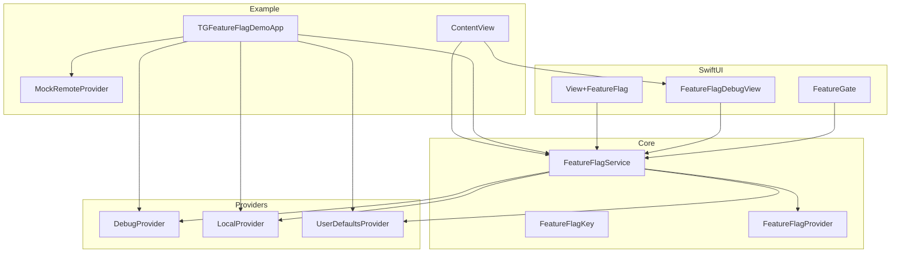
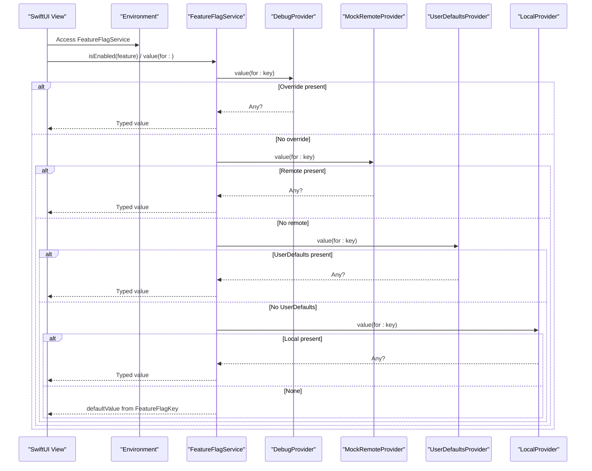
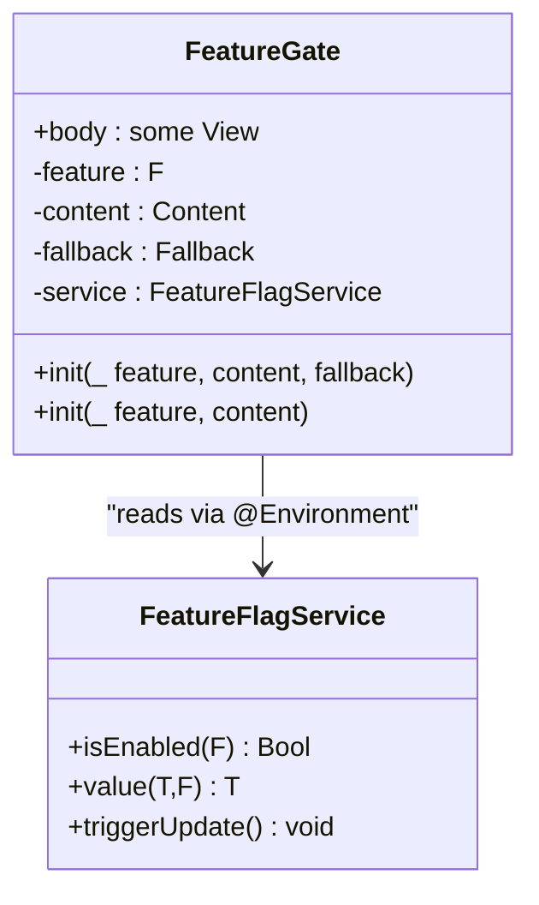
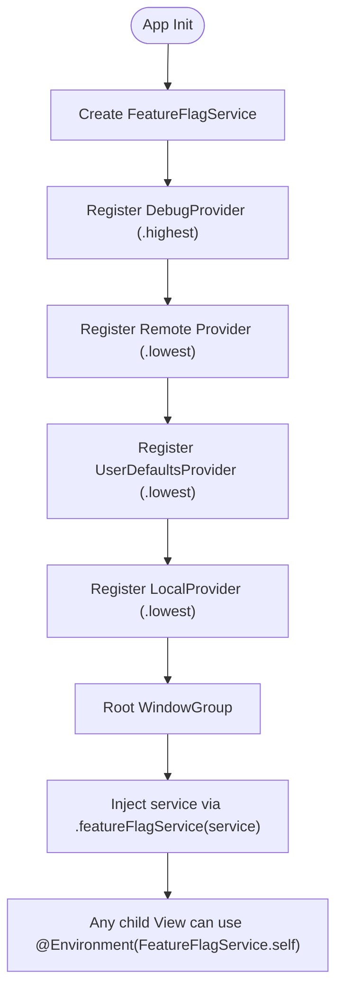
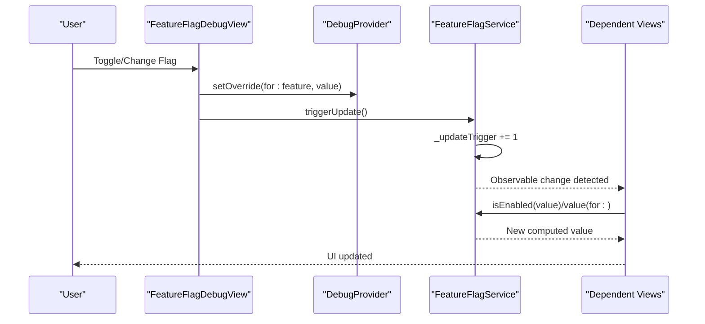
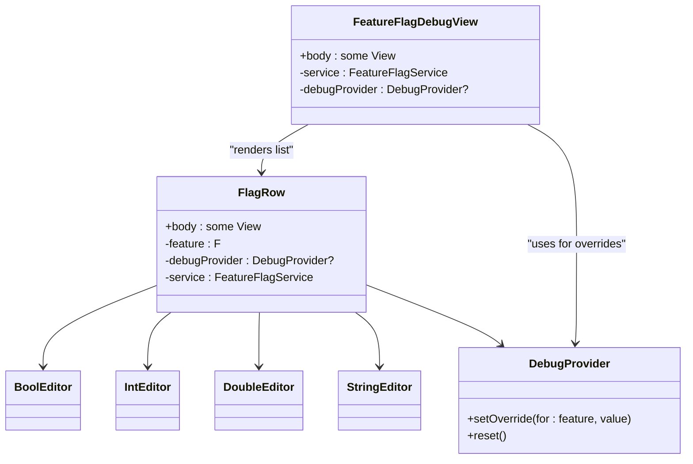
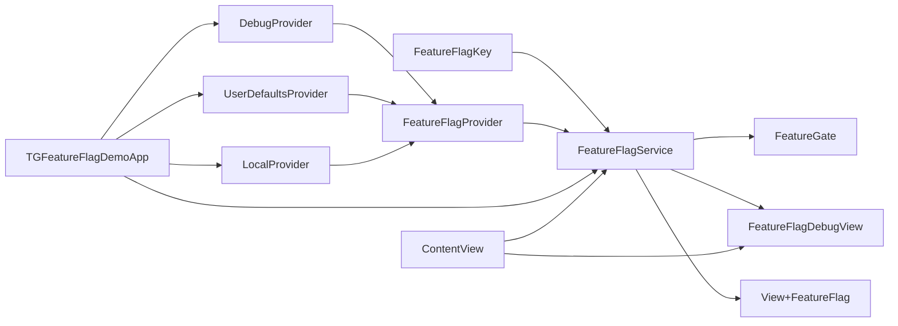

# SwiftUI Integration

<cite>
**Referenced Files in This Document**
- [FeatureGate.swift](file://Sources/TGFeatureFlag/SwiftUI/FeatureGate.swift)
- [FeatureFlagDebugView.swift](file://Sources/TGFeatureFlag/SwiftUI/FeatureFlagDebugView.swift)
- [View+FeatureFlag.swift](file://Sources/TGFeatureFlag/SwiftUI/View+FeatureFlag.swift)
- [FeatureFlagService.swift](file://Sources/TGFeatureFlag/Core/FeatureFlagService.swift)
- [FeatureFlagKey.swift](file://Sources/TGFeatureFlag/Core/FeatureFlagKey.swift)
- [FeatureFlagProvider.swift](file://Sources/TGFeatureFlag/Core/FeatureFlagProvider.swift)
- [DebugProvider.swift](file://Sources/TGFeatureFlag/Providers/DebugProvider.swift)
- [LocalProvider.swift](file://Sources/TGFeatureFlag/Providers/LocalProvider.swift)
- [UserDefaultsProvider.swift](file://Sources/TGFeatureFlag/Providers/UserDefaultsProvider.swift)
- [MockRemoteProvider.swift](file://Example/TGFeatureFlagDemo/TGFeatureFlagDemo/MockRemoteProvider.swift)
- [TGFeatureFlagDemoApp.swift](file://Example/TGFeatureFlagDemo/TGFeatureFlagDemo/TGFeatureFlagDemoApp.swift)
- [ContentView.swift](file://Example/TGFeatureFlagDemo/TGFeatureFlagDemo/ContentView.swift)
</cite>

## Table of Contents
1. [Introduction](#introduction)
2. [Project Structure](#project-structure)
3. [Core Components](#core-components)
4. [Architecture Overview](#architecture-overview)
5. [Detailed Component Analysis](#detailed-component-analysis)
6. [Dependency Analysis](#dependency-analysis)
7. [Performance Considerations](#performance-considerations)
8. [Troubleshooting Guide](#troubleshooting-guide)
9. [Conclusion](#conclusion)
10. [Appendices](#appendices)

## Introduction
This document explains the SwiftUI integration features for feature flags, focusing on:
- Conditional view rendering with FeatureGate
- Environment injection patterns to access flags across the view hierarchy
- Reactive updates using the Observation framework
- Development-time debugging via FeatureFlagDebugView
- Practical usage examples and best practices
- Performance considerations and memory management

The goal is to help you integrate feature flags into SwiftUI applications safely, efficiently, and with a great developer experience.

## Project Structure
At a high level, SwiftUI integration lives under Sources/TGFeatureFlag/SwiftUI and integrates with core services and providers defined under Core and Providers. The Example app demonstrates end-to-end usage.

**Diagram sources**
- [FeatureGate.swift:1-49](file://Sources/TGFeatureFlag/SwiftUI/FeatureGate.swift#L1-L49)
- [FeatureFlagDebugView.swift:1-214](file://Sources/TGFeatureFlag/SwiftUI/FeatureFlagDebugView.swift#L1-L214)
- [View+FeatureFlag.swift:1-10](file://Sources/TGFeatureFlag/SwiftUI/View+FeatureFlag.swift#L1-L10)
- [FeatureFlagService.swift:1-94](file://Sources/TGFeatureFlag/Core/FeatureFlagService.swift#L1-L94)
- [FeatureFlagKey.swift:1-37](file://Sources/TGFeatureFlag/Core/FeatureFlagKey.swift#L1-L37)
- [FeatureFlagProvider.swift:1-18](file://Sources/TGFeatureFlag/Core/FeatureFlagProvider.swift#L1-L18)
- [DebugProvider.swift:1-38](file://Sources/TGFeatureFlag/Providers/DebugProvider.swift#L1-L38)
- [LocalProvider.swift:1-28](file://Sources/TGFeatureFlag/Providers/LocalProvider.swift#L1-L28)
- [UserDefaultsProvider.swift:1-26](file://Sources/TGFeatureFlag/Providers/UserDefaultsProvider.swift#L1-L26)
- [MockRemoteProvider.swift:1-54](file://Example/TGFeatureFlagDemo/TGFeatureFlagDemo/MockRemoteProvider.swift#L1-L54)
- [TGFeatureFlagDemoApp.swift:1-77](file://Example/TGFeatureFlagDemo/TGFeatureFlagDemo/TGFeatureFlagDemoApp.swift#L1-L77)
- [ContentView.swift:1-302](file://Example/TGFeatureFlagDemo/TGFeatureFlagDemo/ContentView.swift#L1-L302)

**Section sources**
- [FeatureGate.swift:1-49](file://Sources/TGFeatureFlag/SwiftUI/FeatureGate.swift#L1-L49)
- [FeatureFlagDebugView.swift:1-214](file://Sources/TGFeatureFlag/SwiftUI/FeatureFlagDebugView.swift#L1-L214)
- [View+FeatureFlag.swift:1-10](file://Sources/TGFeatureFlag/SwiftUI/View+FeatureFlag.swift#L1-L10)
- [FeatureFlagService.swift:1-94](file://Sources/TGFeatureFlag/Core/FeatureFlagService.swift#L1-L94)
- [FeatureFlagKey.swift:1-37](file://Sources/TGFeatureFlag/Core/FeatureFlagKey.swift#L1-L37)
- [FeatureFlagProvider.swift:1-18](file://Sources/TGFeatureFlag/Core/FeatureFlagProvider.swift#L1-L18)
- [DebugProvider.swift:1-38](file://Sources/TGFeatureFlag/Providers/DebugProvider.swift#L1-L38)
- [LocalProvider.swift:1-28](file://Sources/TGFeatureFlag/Providers/LocalProvider.swift#L1-L28)
- [UserDefaultsProvider.swift:1-26](file://Sources/TGFeatureFlag/Providers/UserDefaultsProvider.swift#L1-L26)
- [MockRemoteProvider.swift:1-54](file://Example/TGFeatureFlagDemo/TGFeatureFlagDemo/MockRemoteProvider.swift#L1-L54)
- [TGFeatureFlagDemoApp.swift:1-77](file://Example/TGFeatureFlagDemo/TGFeatureFlagDemo/TGFeatureFlagDemoApp.swift#L1-L77)
- [ContentView.swift:1-302](file://Example/TGFeatureFlagDemo/TGFeatureFlagDemo/ContentView.swift#L1-L302)

## Core Components
- FeatureFlagKey: Defines each flag’s identity, default value, and optional description. It is used to type-check and resolve values at runtime.
- FeatureFlagProvider: Protocol that abstracts where flag values come from (debug overrides, UserDefaults, remote config, local defaults).
- FeatureFlagService: Central manager that aggregates providers by priority, resolves typed values, and exposes reactive updates via Observation.
- SwiftUI Integration:
  - FeatureGate: A View that conditionally renders content based on a boolean flag.
  - FeatureFlagDebugView: A debug UI to inspect and override flags at runtime.
  - View+FeatureFlag: Convenience extension to inject the service into the environment.

**Section sources**
- [FeatureFlagKey.swift:1-37](file://Sources/TGFeatureFlag/Core/FeatureFlagKey.swift#L1-L37)
- [FeatureFlagProvider.swift:1-18](file://Sources/TGFeatureFlag/Core/FeatureFlagProvider.swift#L1-L18)
- [FeatureFlagService.swift:1-94](file://Sources/TGFeatureFlag/Core/FeatureFlagService.swift#L1-L94)
- [FeatureGate.swift:1-49](file://Sources/TGFeatureFlag/SwiftUI/FeatureGate.swift#L1-L49)
- [FeatureFlagDebugView.swift:1-214](file://Sources/TGFeatureFlag/SwiftUI/FeatureFlagDebugView.swift#L1-L214)
- [View+FeatureFlag.swift:1-10](file://Sources/TGFeatureFlag/SwiftUI/View+FeatureFlag.swift#L1-L10)

## Architecture Overview
The system uses a provider chain with explicit priority ordering. When a value is requested, the service iterates through providers in order and returns the first non-nil result; otherwise it falls back to the key’s default value. The service is marked as observable so SwiftUI views automatically re-render when values change.

**Diagram sources**
- [FeatureFlagService.swift:53-82](file://Sources/TGFeatureFlag/Core/FeatureFlagService.swift#L53-L82)
- [DebugProvider.swift:14-18](file://Sources/TGFeatureFlag/Providers/DebugProvider.swift#L14-L18)
- [MockRemoteProvider.swift:15-19](file://Example/TGFeatureFlagDemo/TGFeatureFlagDemo/MockRemoteProvider.swift#L15-L19)
- [UserDefaultsProvider.swift:20-24](file://Sources/TGFeatureFlag/Providers/UserDefaultsProvider.swift#L20-L24)
- [LocalProvider.swift:24-26](file://Sources/TGFeatureFlag/Providers/LocalProvider.swift#L24-L26)
- [FeatureFlagKey.swift:27-32](file://Sources/TGFeatureFlag/Core/FeatureFlagKey.swift#L27-L32)

## Detailed Component Analysis

### FeatureGate: Conditional View Rendering
FeatureGate is a generic SwiftUI View that shows one branch if a flag is enabled and another fallback branch otherwise. It reads the current state from the injected FeatureFlagService and reacts to changes automatically.

Key behaviors:
- Reads an @Environment(FeatureFlagService.self) instance.
- Uses isEnabled(feature) to decide which branch to render.
- Provides a convenience initializer when no fallback is needed.

**Diagram sources**
- [FeatureGate.swift:7-48](file://Sources/TGFeatureFlag/SwiftUI/FeatureGate.swift#L7-L48)
- [FeatureFlagService.swift:53-55](file://Sources/TGFeatureFlag/Core/FeatureFlagService.swift#L53-L55)

Usage example references:
- Conditional UI rendering in the demo home screen.

**Section sources**
- [FeatureGate.swift:1-49](file://Sources/TGFeatureFlag/SwiftUI/FeatureGate.swift#L1-L49)
- [ContentView.swift:44-63](file://Example/TGFeatureFlagDemo/TGFeatureFlagDemo/ContentView.swift#L44-L63)

### Environment Injection Patterns
There are two primary ways to access flags in SwiftUI:
- Inject the service once at the root and read it anywhere with @Environment(FeatureFlagService.self).
- Use the provided View extension to inject the service conveniently.

Recommended pattern:
- Initialize FeatureFlagService in your App’s init.
- Register providers in desired priority order.
- Inject the service into the root window group using the provided extension or .environment.

**Diagram sources**
- [TGFeatureFlagDemoApp.swift:39-76](file://Example/TGFeatureFlagDemo/TGFeatureFlagDemo/TGFeatureFlagDemoApp.swift#L39-L76)
- [View+FeatureFlag.swift:3-9](file://Sources/TGFeatureFlag/SwiftUI/View+FeatureFlag.swift#L3-L9)

**Section sources**
- [View+FeatureFlag.swift:1-10](file://Sources/TGFeatureFlag/SwiftUI/View+FeatureFlag.swift#L1-L10)
- [TGFeatureFlagDemoApp.swift:35-77](file://Example/TGFeatureFlagDemo/TGFeatureFlagDemo/TGFeatureFlagDemoApp.swift#L35-L77)

### Reactive Updates with Observation
FeatureFlagService is annotated to be observable and runs on the main actor. This enables automatic SwiftUI view updates when underlying values change.

How updates propagate:
- Reading a value registers a dependency on an internal update trigger.
- External changes (e.g., UserDefaults notifications, manual triggers) increment the trigger, causing dependent views to recompute.
- Debug interactions call triggerUpdate after applying overrides.

**Diagram sources**
- [FeatureFlagService.swift:84-87](file://Sources/TGFeatureFlag/Core/FeatureFlagService.swift#L84-L87)
- [FeatureFlagService.swift:59-61](file://Sources/TGFeatureFlag/Core/FeatureFlagService.swift#L59-L61)
- [FeatureFlagDebugView.swift:91-96](file://Sources/TGFeatureFlag/SwiftUI/FeatureFlagDebugView.swift#L91-L96)

**Section sources**
- [FeatureFlagService.swift:8-10](file://Sources/TGFeatureFlag/Core/FeatureFlagService.swift#L8-L10)
- [FeatureFlagService.swift:18-29](file://Sources/TGFeatureFlag/Core/FeatureFlagService.swift#L18-L29)
- [FeatureFlagService.swift:59-87](file://Sources/TGFeatureFlag/Core/FeatureFlagService.swift#L59-L87)
- [FeatureFlagDebugView.swift:82-103](file://Sources/TGFeatureFlag/SwiftUI/FeatureFlagDebugView.swift#L82-L103)

### FeatureFlagDebugView: Development-Time Debugging
FeatureFlagDebugView lists all available flags (via CaseIterable), displays their current values, and allows overriding them at runtime. It also provides a “Reset All Overrides” action.

Highlights:
- Reads the current value via the service and writes overrides via DebugProvider.
- Supports multiple types (Bool, String, Int, Double) with appropriate editors.
- Calls triggerUpdate after any change to ensure immediate UI refresh.

**Diagram sources**
- [FeatureFlagDebugView.swift:4-36](file://Sources/TGFeatureFlag/SwiftUI/FeatureFlagDebugView.swift#L4-L36)
- [FeatureFlagDebugView.swift:38-80](file://Sources/TGFeatureFlag/SwiftUI/FeatureFlagDebugView.swift#L38-L80)
- [FeatureFlagDebugView.swift:82-103](file://Sources/TGFeatureFlag/SwiftUI/FeatureFlagDebugView.swift#L82-L103)
- [FeatureFlagDebugView.swift:105-141](file://Sources/TGFeatureFlag/SwiftUI/FeatureFlagDebugView.swift#L105-L141)
- [FeatureFlagDebugView.swift:143-180](file://Sources/TGFeatureFlag/SwiftUI/FeatureFlagDebugView.swift#L143-L180)
- [FeatureFlagDebugView.swift:182-213](file://Sources/TGFeatureFlag/SwiftUI/FeatureFlagDebugView.swift#L182-L213)
- [DebugProvider.swift:20-36](file://Sources/TGFeatureFlag/Providers/DebugProvider.swift#L20-L36)

**Section sources**
- [FeatureFlagDebugView.swift:1-214](file://Sources/TGFeatureFlag/SwiftUI/FeatureFlagDebugView.swift#L1-L214)
- [DebugProvider.swift:1-38](file://Sources/TGFeatureFlag/Providers/DebugProvider.swift#L1-L38)

### Usage Examples Across Scenarios
- Tab visibility controlled by a flag.
- Conditional view rendering with FeatureGate.
- Logic branching inside actions and alerts.
- Configuration values like API base URL.
- Conditional navigation destinations.

References:
- Tab control and conditional routing in the demo app.
- FeatureGate usage for toggling between designs.
- Direct service calls for configuration values and logic branching.

**Section sources**
- [ContentView.swift:14-33](file://Example/TGFeatureFlagDemo/TGFeatureFlagDemo/ContentView.swift#L14-L33)
- [ContentView.swift:44-95](file://Example/TGFeatureFlagDemo/TGFeatureFlagDemo/ContentView.swift#L44-L95)
- [ContentView.swift:116-199](file://Example/TGFeatureFlagDemo/TGFeatureFlagDemo/ContentView.swift#L116-L199)

## Dependency Analysis
The following diagram maps dependencies among core components and providers.

**Diagram sources**
- [FeatureFlagService.swift:1-94](file://Sources/TGFeatureFlag/Core/FeatureFlagService.swift#L1-L94)
- [FeatureFlagKey.swift:1-37](file://Sources/TGFeatureFlag/Core/FeatureFlagKey.swift#L1-L37)
- [FeatureFlagProvider.swift:1-18](file://Sources/TGFeatureFlag/Core/FeatureFlagProvider.swift#L1-L18)
- [DebugProvider.swift:1-38](file://Sources/TGFeatureFlag/Providers/DebugProvider.swift#L1-L38)
- [UserDefaultsProvider.swift:1-26](file://Sources/TGFeatureFlag/Providers/UserDefaultsProvider.swift#L1-L26)
- [LocalProvider.swift:1-28](file://Sources/TGFeatureFlag/Providers/LocalProvider.swift#L1-L28)
- [FeatureGate.swift:1-49](file://Sources/TGFeatureFlag/SwiftUI/FeatureGate.swift#L1-L49)
- [FeatureFlagDebugView.swift:1-214](file://Sources/TGFeatureFlag/SwiftUI/FeatureFlagDebugView.swift#L1-L214)
- [View+FeatureFlag.swift:1-10](file://Sources/TGFeatureFlag/SwiftUI/View+FeatureFlag.swift#L1-L10)
- [TGFeatureFlagDemoApp.swift:1-77](file://Example/TGFeatureFlagDemo/TGFeatureFlagDemo/TGFeatureFlagDemoApp.swift#L1-L77)
- [ContentView.swift:1-302](file://Example/TGFeatureFlagDemo/TGFeatureFlagDemo/ContentView.swift#L1-L302)

**Section sources**
- [FeatureFlagService.swift:1-94](file://Sources/TGFeatureFlag/Core/FeatureFlagService.swift#L1-L94)
- [FeatureFlagKey.swift:1-37](file://Sources/TGFeatureFlag/Core/FeatureFlagKey.swift#L1-L37)
- [FeatureFlagProvider.swift:1-18](file://Sources/TGFeatureFlag/Core/FeatureFlagProvider.swift#L1-L18)
- [DebugProvider.swift:1-38](file://Sources/TGFeatureFlag/Providers/DebugProvider.swift#L1-L38)
- [UserDefaultsProvider.swift:1-26](file://Sources/TGFeatureFlag/Providers/UserDefaultsProvider.swift#L1-L26)
- [LocalProvider.swift:1-28](file://Sources/TGFeatureFlag/Providers/LocalProvider.swift#L1-L28)
- [FeatureGate.swift:1-49](file://Sources/TGFeatureFlag/SwiftUI/FeatureGate.swift#L1-L49)
- [FeatureFlagDebugView.swift:1-214](file://Sources/TGFeatureFlag/SwiftUI/FeatureFlagDebugView.swift#L1-L214)
- [View+FeatureFlag.swift:1-10](file://Sources/TGFeatureFlag/SwiftUI/View+FeatureFlag.swift#L1-L10)
- [TGFeatureFlagDemoApp.swift:1-77](file://Example/TGFeatureFlagDemo/TGFeatureFlagDemo/TGFeatureFlagDemoApp.swift#L1-L77)
- [ContentView.swift:1-302](file://Example/TGFeatureFlagDemo/TGFeatureFlagDemo/ContentView.swift#L1-L302)

## Performance Considerations
- Prefer FeatureGate for simple conditional rendering to avoid redundant checks and keep view bodies concise.
- Avoid heavy computations inside views that depend on flags; compute derived values outside the view body or cache them with State/StateObject as appropriate.
- Keep provider chains short and ordered by expected precedence to minimize lookups.
- Use triggerUpdate judiciously; batch changes when possible to reduce unnecessary recompositions.
- For large lists of flags, consider lazy loading or pagination in the debug view to improve responsiveness.
- Ensure provider implementations are efficient and thread-safe (as implemented in DebugProvider and UserDefaultsProvider).

[No sources needed since this section provides general guidance]

## Troubleshooting Guide
Common issues and resolutions:
- Type mismatch errors: If a flag’s default type does not match the requested type, the service will raise a fatal error. Ensure defaultValue aligns with the intended type or use the correct accessor.
- Flags not updating: After changing values programmatically (e.g., remote fetch), call triggerUpdate to notify observers.
- UserDefaults not triggering updates: The service observes UserDefaults changes; verify that UserDefaults writes occur on the same suite and that notifications are delivered on the main queue.
- Debug overrides not applied: Confirm DebugProvider is registered with highest priority and that the key names match exactly.

**Section sources**
- [FeatureFlagService.swift:78-82](file://Sources/TGFeatureFlag/Core/FeatureFlagService.swift#L78-L82)
- [FeatureFlagService.swift:18-29](file://Sources/TGFeatureFlag/Core/FeatureFlagService.swift#L18-L29)
- [FeatureFlagService.swift:84-87](file://Sources/TGFeatureFlag/Core/FeatureFlagService.swift#L84-L87)
- [DebugProvider.swift:20-36](file://Sources/TGFeatureFlag/Providers/DebugProvider.swift#L20-L36)

## Conclusion
The SwiftUI integration provides a clean, type-safe, and reactive way to manage feature flags:
- Use FeatureGate for declarative conditional rendering.
- Inject FeatureFlagService via environment for flexible access throughout the hierarchy.
- Leverage Observation-driven updates for seamless UI reactions.
- Employ FeatureFlagDebugView for rapid iteration during development.
Follow the recommended setup and best practices to maintain performance and clarity in your application.

[No sources needed since this section summarizes without analyzing specific files]

## Appendices

### Best Practices Checklist
- Define flags as enums conforming to FeatureFlagKey with clear descriptions and sensible defaults.
- Register providers in strict priority order: Debug > Remote > UserDefaults > Local.
- Inject the service once at the app root and reuse via environment.
- Use FeatureGate for boolean toggles; use direct service calls for configuration values and complex logic.
- Always call triggerUpdate after programmatic changes to ensure UI consistency.
- Keep provider implementations lightweight and thread-safe.
- Guard against type mismatches by ensuring defaultValue matches the expected type.

[No sources needed since this section provides general guidance]